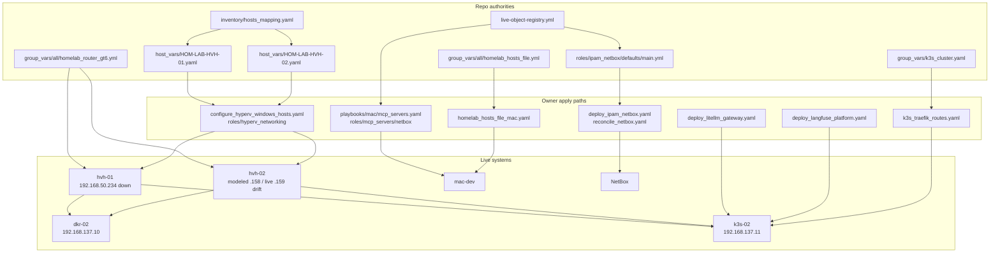
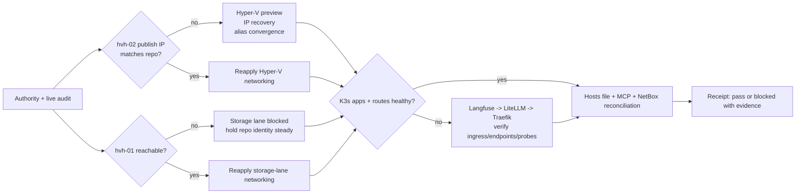
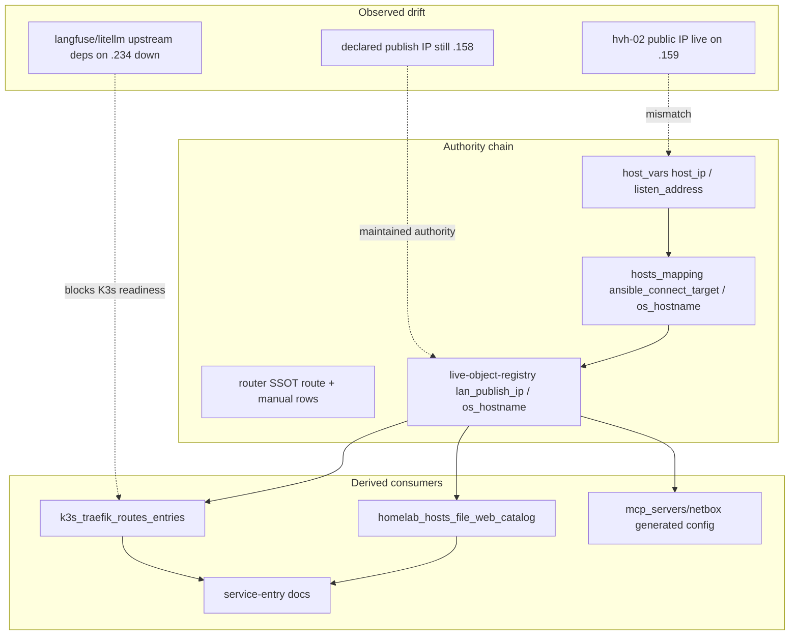

# Homelab LAN Edge Drift And Service Publication Remediation

## Summary

- Keep the modeled steady state of `HOM-LAB-HVH-02 = 192.168.50.158` and `HOM-LAB-HVH-01 = 192.168.50.234` unless a read-only Windows + GT6 audit proves a different intended target.
- Repair repo/live mismatches across Hyper-V, K3s publication, controller consumers, and NetBox naming/service metadata without introducing a new capability packet.
- Preserve the interim `homelab_hosts_file_mac` bridge and the current router-DNS deferral model; final authoritative LAN DNS is out of scope.

## Current Correlation And Multiple-Entry Report

- `HOM-LAB-HVH-02` authority remains split across `inventory/host_vars/HOM-LAB-HVH-02.yaml`, `inventory/hosts_mapping.yaml`, `inventory/group_vars/all/homelab_router_gt6.yml`, and `docs/reference/naming-standards/live-object-registry.yml`.
- Live drift remains real on `hvh-02`: the host-side public edge moved to `192.168.50.159`, while active repo authority, router routes, controller consumers, and portproxy listeners remain modeled on `192.168.50.158`.
- `192.168.50.158` was duplicated across both authority and consumer layers, including `inventory/netbox.yml`, `roles/mcp_servers/netbox/defaults/main.yml`, `roles/k3s_traefik_routes/defaults/main.yml`, `roles/homelab_hosts_file_mac/defaults/main.yml`, `inventory/host_vars/hom-lab-ctl-dkr-02.yaml`, and operator docs.
- `docs/reference/naming-standards/live-object-registry.yml` had stale `hvh-02` naming data (`DESKTOP-VLLM`) while active inventory and live hostname probes returned `HOM-LAB-HVH-02`.
- Storage-lane identity is still repo-consistent on `.234` / `.138.x`; the active problem is live outage, not a discovered renumber.
- K3s publication drift is real and compounded by upstream dependency failure:
  - only `litellm-gateway-ingress` existed live before route reapply
  - `langfuse-web` and `litellm-lan` services existed
  - NodePort probes failed
  - Traefik returned `404`
  - pod logs first showed both apps failing on storage-lane dependencies at `192.168.50.234`, then later narrowed further to K3s-node image-pull / egress failure after storage ports recovered
- Additional repo mismatch found during implementation: `inventory/hosts_mapping.yaml` still had stale `HOM-LAB-HVH-01` `ansible_port: 2222` and stale `os_hostname`.

## Capability Packet Boundary

| Field | Value |
|---|---|
| Capability identifier | `homelab-lan-edge-drift-remediation` |
| Owner manifest | No new manifest. Existing owners: `roles/hyperv_networking`, `roles/k3s_traefik_routes`, `roles/k3s_langfuse_platform`, `roles/k3s_litellm_gateway`, `roles/ipam_netbox`, `roles/mcp_servers/netbox` |
| Owned files | Existing inventory, docs, role defaults/tasks, playbooks, and generated config blocks only |
| Integration anchors | `inventory/host_vars/hom-lab-ctl-hvh-{01,02}.yaml`, `inventory/hosts_mapping.yaml`, `inventory/group_vars/all/homelab_hosts_file.yml`, `inventory/group_vars/all/homelab_router_gt6.yml`, `inventory/group_vars/k3s_cluster.yaml`, `docs/reference/naming-standards/live-object-registry.yml`, `playbooks/configure_hyperv_windows_hosts.yaml`, `playbooks/deploy_langfuse_platform.yaml`, `playbooks/deploy_litellm_gateway.yaml`, `playbooks/k3s_traefik_routes.yaml`, `playbooks/homelab_hosts_file_mac.yaml`, `playbooks/mac/mcp_servers.yaml`, `playbooks/deploy_ipam_netbox.yaml`, `playbooks/reconcile_netbox.yaml` |
| Update behavior | Read-only authority/live audit first, then owner-playbook convergence on Hyper-V/K3s/controller/NetBox surfaces, then verification receipts |
| Removal behavior | Revert repo authority edits, rerender generated MCP/hosts outputs through owner roles, and reapply prior Hyper-V/K3s state through the same playbooks |

## Interfaces

- Keep these interfaces authoritative:
  - `hyperv_config.guest_published_tcp_ports`
  - `guest_outbound_nat_enabled`
  - `k3s_traefik_routes_entries`
  - `homelab_hosts_file_web_catalog`
  - `inventory/netbox.yml`
  - `inventory/netbox_tunnel.yml`
- Hardened owner behavior in this slice:
  - `roles/hyperv_networking` now exposes a live preview receipt and blocks portproxy convergence until every declared `listen_address` exists on the Windows host.
  - `roles/hyperv_networking` now attempts the existing management-IP recovery path and then a host-IP alias convergence step before failing.
  - `roles/k3s_traefik_routes` now verifies live Ingress existence, backend Services, Endpoints/EndpointSlices, and a host-header HTTP probe instead of checking only Services.
  - Generated MCP config remains owned by `roles/mcp_servers/netbox`; local rerender is allowed, hand-editing managed blocks is not.

## Implementation Changes

### Slice A — authority audit and duplicate cleanup

- Normalize stale `hvh-02` naming in `live-object-registry.yml`.
- Remove hard-coded `.158` fallbacks from reusable role defaults where inventory already owns the value.
- Normalize stale `hvh-01` surface entries in `inventory/hosts_mapping.yaml`.
- Reduce duplicated consumer literals where the consuming file can safely derive from inventory authority.

### Slice B — `hvh-02` LAN-edge convergence

- Add a live Hyper-V preview receipt to `playbooks/configure_hyperv_windows_hosts.yaml` via `roles/hyperv_networking/tasks/preview.yml`.
- Add a reusable live publish-surface probe to `roles/hyperv_networking/tasks/published_port_surface_probe.yml`.
- Add portproxy preconditions and recovery steps in `roles/hyperv_networking/tasks/routed_private_subnet.yml`:
  - preview current listeners and portproxy rows
  - detect missing declared `listen_address` values
  - run the existing management-IP recovery sequence
  - attempt a public-interface host-IP alias convergence step
  - fail explicitly if the declared `listen_address` is still absent

### Slice C — `hvh-01` storage-lane recovery

- Treat `.234` / `.138.x` as a live-state restoration problem first.
- Keep repo authority unchanged until live evidence proves a different steady state.
- Execution evidence in this slice now shows `.234` SSH and published storage ports recovered from `mac-dev`, while direct `192.168.138.x` guest reachability remains blocked from `mac-dev`.

### Slice D — K3s Langfuse/LiteLLM publication repair

- Keep route registry authority in `inventory/group_vars/k3s_cluster.yaml`.
- Extend `roles/k3s_traefik_routes` verification so route ownership fails with explicit evidence when live ingress/backend/publication state does not match the registry.
- Preserve app deploy order: Langfuse → LiteLLM → Traefik routes.
- Treat storage-lane dependency failure (`192.168.50.234`) as a hard blocker for Langfuse/LiteLLM readiness, not as an ingress-only issue.

### Slice E — controller/NetBox consumer reconciliation

- Keep `inventory/netbox_tunnel.yml` as the explicit fallback path.
- Rerender local NetBox MCP owner surfaces through `playbooks/mac/mcp_servers.yaml --tags netbox`.
- Re-run local `/etc/hosts` owner through `playbooks/homelab_hosts_file_mac.yaml`.
- Keep `inventory/netbox.yml` aligned to the canonical `.158` publish edge unless a later authoritative branch adopts `.159`.

## Mandatory NetBox Slice

### Declared

- `docs/reference/naming-standards/live-object-registry.yml` now matches active `hvh-02` naming.
- Controller-local consumer defaults now derive from owner variables rather than hard-coded `.158` fallbacks where that duplication was unnecessary.

### Applied

- Local NetBox MCP owner rerender executed through `playbooks/mac/mcp_servers.yaml --tags netbox`.
- Full `deploy_ipam_netbox.yaml` / `reconcile_netbox.yaml` live apply did not run because the publication slice is still incomplete: `mac-dev` cannot yet verify the guest-direct lanes or the `.158` published services, and the K3s application layer remains unhealthy.

### Verified

- `bin/netbox-authority-gate.sh --static-only` passed.
- `scripts/validate_netbox_repo_consistency.sh` still fails on pre-existing `nsrv-*` storage-lane naming debt outside this specific remediation.
- Live NetBox service-object verification remains blocked until the `.158` publication edge and direct guest-route verify gates pass from `mac-dev`.

## Apply / Verify / Undo / Change Class

| | |
|---|---|
| **Apply** | `playbooks/configure_hyperv_windows_hosts.yaml`, `playbooks/k3s_traefik_routes.yaml`, `playbooks/homelab_hosts_file_mac.yaml`, `playbooks/mac/mcp_servers.yaml --tags netbox`, local NetBox gates |
| **Verify** | Hyper-V preview receipts, `ping` / `nc` / `curl` probes from `mac-dev`, K3s `kubectl` objects and pod logs, static NetBox governance gates |
| **Undo** | Revert repo authority edits, rerender generated config via owner playbooks, and reapply the same Hyper-V/K3s owners after live host recovery |
| **Change class** | Mixed idempotent config + live-state recovery with host/network side effects |

## Test Plan

- Hyper-V preview must show selected public/private interfaces, live IPv4s, current listeners, current portproxy rows, and desired `guest_published_tcp_ports`.
- `hvh-02` repair is not considered complete until `192.168.50.158` exists live on the Windows host and the published ports answer from `mac-dev`.
- `hvh-01` repair is not considered complete until `.234` and the `192.168.138.x` guest surfaces answer again.
- K3s publication is not considered complete until:
  - both ingress objects exist live
  - backend endpoints or endpoint slices are populated
  - host-header probes succeed
  - Langfuse/LiteLLM stop crash-looping against storage-lane dependencies
- NetBox completion is not considered complete until repo consistency, static gate, and live service-object verification all pass.

## Assumptions And Defaults

- Default target state remains `hvh-02 = 192.168.50.158` and `hvh-01 = 192.168.50.234`.
- `192.168.50.159` remains treated as live drift, not source-of-truth.
- Archive docs, skill examples, and historical facts can inform the audit but do not outrank active inventory, active naming docs, or owner-role defaults.
- The storage-lane slice remains in scope even if live recovery is blocked; the plan does not redefine completion around only the GPU lane.

## Architecture/Structure Diagram

## Capability Routing Diagram

## Naming/Modeling Diagram

## Plan verification receipt

**Slice:** initial execution
**Verified at:** 2026-07-09
**Verifier:** agent run

### Obligation inventory

| ID | Source | Obligation | In slice scope? | Status | Evidence |
|---|---|---|---|---|---|
| O-01 | Slice A | Clean active authority/consumer drift in repo surfaces for this remediation | yes | pass | Repo edits in `roles/hyperv_networking`, `roles/k3s_traefik_routes`, `roles/mcp_servers/netbox`, `roles/homelab_hosts_file_mac`, `inventory/hosts_mapping.yaml`, `live-object-registry.yml`, `playbooks/troubleshoot/netbox_api_seed_localhost.yml` |
| O-02 | Slice B / Verify | Add Hyper-V preview receipt showing live interface IPs, selected listen IP, and current portproxy rows | yes | pass | `configure_hyperv_windows_hosts.yaml --tags hyperv_windows_host_preview -e ansible_host=192.168.137.1 -e debug_remote_output=true` showed `live_public_interface_ipv4: [192.168.50.159]`, `missing_listen_addresses: [192.168.50.158]`, and six current portproxy rows |
| O-03 | Slice B / Apply | Restore `hvh-02` publish edge to declared `.158` and reapply Hyper-V networking | yes | pass | Hyper-V preview and full apply completed through the documented IPv6 fallback. Final preview/apply showed `live_public_interface_ipv4: [192.168.50.158, 169.254.152.163]`, `live_private_interface_ipv4: [192.168.137.1]`, `missing_listen_addresses: []`, and full play recap `ok=45 changed=0 unreachable=0 failed=0` |
| O-04 | Slice C / Verify | Recover `hvh-01` reachability on `.234` before storage-lane convergence | yes | pass | `ssh` to `192.168.50.234` succeeded, `configure_hyperv_windows_hosts.yaml` completed with `ok=45 changed=2 unreachable=0 failed=0`, and `nc` from `mac-dev` succeeded on `5432`, `6379`, `8123`, `9000`, and `9001` |
| O-05 | Slice D / Research+Verify | Prove actual Langfuse/LiteLLM failure mode before changing route ownership | yes | pass | Failure mode was narrowed in two stages: first K3s pod logs showed `Can't reach database server at 192.168.50.234:5432`; after storage recovery, live pod state shifted to `ImagePullBackOff` / `ErrImagePull`, with LiteLLM events reporting failed DNS/registry resolution for `docker.litellm.ai` |
| O-06 | Slice D / Apply | Reconcile Langfuse → LiteLLM → Traefik publication | yes | blocked | Existing playbooks could not be executed against the proxied K3s host because Ansible repeatedly failed with `A worker was found in a dead state`. Live verification over SSH still shows only `litellm-gateway-ingress`, NodePorts `30000` / `30400` closed, Traefik host-header probes returning `404`, and app pods in `ImagePullBackOff` / `ErrImagePull` |
| O-07 | Slice E / Apply | Re-render controller-local hosts and NetBox MCP consumers through owner playbooks | yes | pass | `playbooks/homelab_hosts_file_mac.yaml` passed on `mac-dev`; `playbooks/mac/mcp_servers.yaml --tags netbox` passed on `mac-dev` |
| O-08 | NetBox Declared | Repo packet, naming registry, and consumer defaults agree on `hvh-02` naming/publish intent | yes | pass | `live-object-registry.yml` `hvh-02 os_hostname` fixed; reusable defaults no longer hard-code `.158` fallback |
| O-09 | NetBox Applied | Run live NetBox seed/reconcile surfaces after authoritative service/path change when possible | yes | blocked | Local MCP owner rerender completed, but full NetBox seed/reconcile remains blocked until the remaining service-publication verify gates pass and live service metadata can be trusted |
| O-10 | NetBox Verified | Run repo consistency + static gate + live object verification | yes | blocked | `bin/netbox-authority-gate.sh --static-only` passed; `scripts/validate_netbox_repo_consistency.sh` failed on pre-existing `nsrv-*` naming debt; live NetBox service-object verification remains blocked by the incomplete `.158` / guest-route publication state |
| O-11 | Verify contract | Published endpoints on `.158` and guest-direct GPU lane survive after `hvh-02` repair | yes | blocked | After both Hyper-V owner applies, guest VMs are reachable through their Hyper-V hosts via SSH proxy, but `mac-dev` still cannot reach `192.168.137.x` or `192.168.138.x` directly and all `.158` published service ports remain closed from `mac-dev` |

### Summary

- In-scope obligations: 11
- Pass: 7
- Blocked: 4
- Fail: 0
- Pending: 0
- Deferred: 0

### Completion gate

- [ ] Every in-scope obligation is `pass` or `n/a` with reason
- [ ] Change-contract Verify is fully demonstrated for this slice
- [ ] `depends_on_plans` satisfied or failure documented with evidence
- [x] No in-scope obligation skipped because it was not duplicated in a checklist
- [x] No unresolved on-deck user decision remains outside the plan body
- [x] Missing role/playbook/resource blockers were preceded by research, owner-role edits, and safe preview gates
- [ ] Dependency order is represented in fully executable Ansible entrypoints for every blocked live slice
- [x] Exact resource selections in this packet are backed by repo authority and live probes rather than brainstorming-only values

## Diagram gate receipt

- [x] Architecture/Structure: repo paths, external resources, data/control flow, naming scheme, variable SSOT sources, tag/playbook wiring
- [x] Capability Routing: included
- [x] Naming/Modeling: included
- [x] Diagram Inventory lists every required section above, not only diagrams actually drawn

## Diagram Inventory

- Included:
  - `Architecture/Structure Diagram`
  - `Capability Routing Diagram`
  - `Naming/Modeling Diagram`
  - `Plan verification receipt`
  - `Diagram gate receipt`
- Other available diagram types:
  - Windows interface/IP/route recovery timeline for `hvh-02`
  - Storage-lane dependency chain for `langfuse` / `litellm`
  - NetBox Declared / Applied / Verified artifact flow
