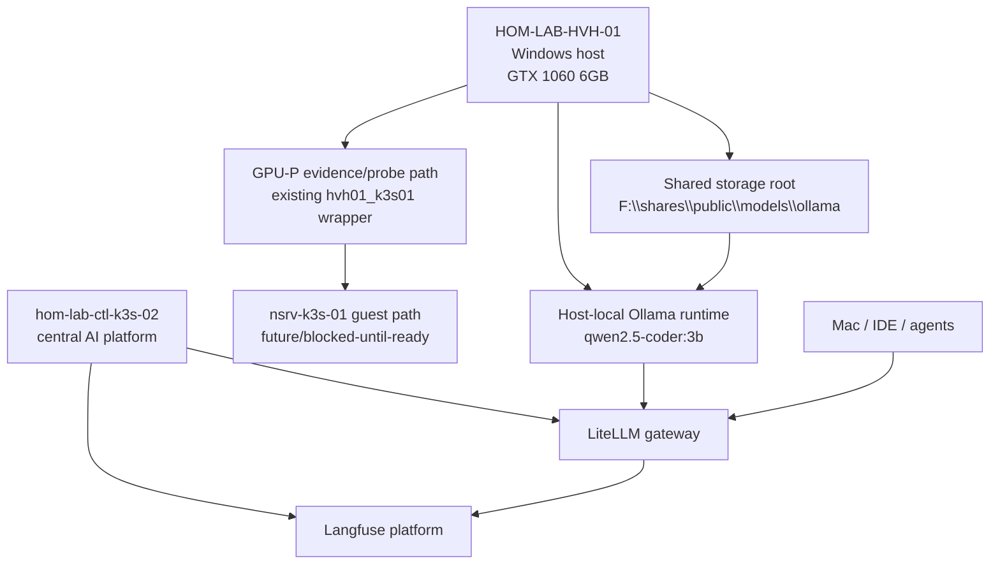
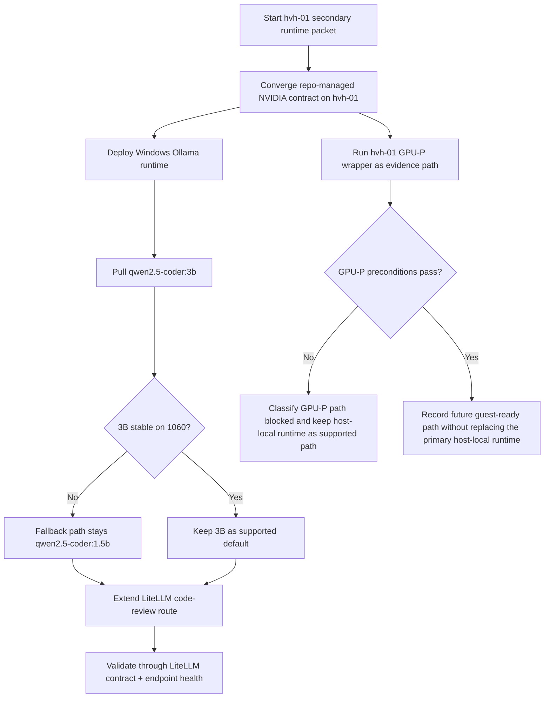
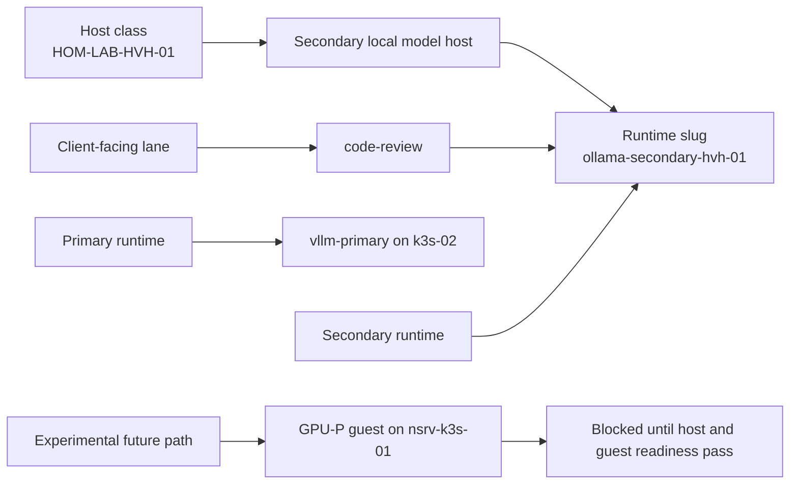

# HVH-01 Secondary Runtime + GPU-P Extension Packet

## Summary

Commission `HOM-LAB-HVH-01` as the first real secondary local-model host through a host-local Windows Ollama runtime, while keeping the shared LiteLLM and Langfuse control plane centralized on `hom-lab-ctl-k3s-02`.

This packet governs two related but intentionally unequal paths:

1. The supported path is host-local Windows Ollama on `HOM-LAB-HVH-01`, with `qwen2.5-coder:3b` as the first `code-review` backend and `qwen2.5-coder:1.5b` as the explicit fallback.
2. The future-path probe is the existing hvh-01 GPU-P pipeline toward the `k3s-01` guest. That path remains evidence-first and may end in `blocked` without preventing the primary host-local runtime from being considered implemented.

Current live truth captured for this packet:

- `HOM-LAB-HVH-01` is a Windows Hyper-V host with `NVIDIA GeForce GTX 1060 6GB`.
- `guest_gpu_capability.state` is currently `blocked`.
- Current probe evidence on `2026-07-09` shows `IovSupport=False`, no partitionable GPU result, and `nvidia-smi` reporting NVML not found.
- The live Hyper-V VM name for the future guest path is `nsrv-k3s-01`, while the inventory host remains `hom-lab-ctl-k3s-01`.
- The `k3s-01` guest auth path is not yet proven, so the guest slice is not a supported runtime delivery path in this packet.

## Capability Packet Boundary

| Field | Value |
|-------|-------|
| Capability identifier | `hvh01_secondary_runtime_and_gpup_extension` |
| Owner manifest | None; this packet spans existing AI runtime, gateway, and Hyper-V GPU-P surfaces |
| Owned files | New Windows Ollama runtime role and role README, new hvh-01 deployment playbook, corrected hvh-01 GPU-P wrapper, LiteLLM lane updates, endpoint/validation/catalog/host-metadata updates, this governed packet |
| Integration anchors | `inventory/host_vars/HOM-LAB-HVH-01.yaml`, `inventory/group_vars/model_catalog/manifest.yml`, `roles/k3s_litellm_gateway`, `roles/common/endpoint_verify`, `playbooks/deploy_hvh01_secondary_model_runtime.yaml`, `playbooks/validate_ai_inference_stack_contracts.yaml`, `playbooks/hyperv_ubuntu_gpu_p_runtime_artifact_pipeline_hvh01_k3s01.yaml` |
| Update behavior | Re-runnable host-local runtime convergence; re-runnable GPU-P evidence/probe path with explicit blocked outcome allowed |
| Removal behavior | Remove the managed hvh-01 Ollama runtime, lane mapping, endpoint checks, and packet-owned metadata; leave central LiteLLM/Langfuse and the general GPU-P framework intact |

## Apply / Verify / Undo / Change Class

| Field | Value |
|---|---|
| Apply | Run `playbooks/deploy_hvh01_secondary_model_runtime.yaml` to converge the Windows NVIDIA contract, deploy the host-local Ollama runtime, and extend central LiteLLM for `code-review` |
| Verify | Confirm host-local Ollama health, model presence, central LiteLLM route contract, model catalog alignment, and receipt of the hvh-01 GPU-P blocked-or-ready evidence |
| Undo | Set `windows_ollama_runtime_state: absent`, rerun the hvh-01 deployment playbook or role directly, and remove packet-owned lane/runtime metadata if the secondary host should be retired |
| Change class | New secondary runtime capability plus bounded GPU-P framework extension |

## Public Interfaces / Types

- New governed packet:
  - `docs/plans/2026-07-09--hvh01-secondary-runtime-and-gpup-incomplete/README.md`
- New deployment surface:
  - `playbooks/deploy_hvh01_secondary_model_runtime.yaml`
- New Windows runtime role:
  - `roles/windows_ollama_runtime`
- New Windows runtime role documentation:
  - `roles/windows_ollama_runtime/README.md`
- Corrected GPU-P wrapper:
  - `playbooks/hyperv_ubuntu_gpu_p_runtime_artifact_pipeline_hvh01_k3s01.yaml`
- New/updated hvh-01 host contract fields:
  - `windows_ollama_runtime_state`
  - `windows_ollama_runtime_bind_host`
  - `windows_ollama_runtime_port`
  - `windows_ollama_runtime_models_path`
  - `windows_ollama_runtime_default_model`
  - `windows_ollama_runtime_model_aliases`
- First supported secondary lane mapping:
  - `code-review` -> `ollama-secondary-hvh-01`

## Key Changes

### 1. Shared control plane stays central

- LiteLLM remains central on `hom-lab-ctl-k3s-02`.
- Langfuse remains central on `hom-lab-ctl-k3s-02`.
- No second gateway or second Langfuse stack is created on `HOM-LAB-HVH-01`.
- The `HOM-LAB-HVH-01` path gets its own dedicated deploy playbook first and is not folded into `deploy_ai_inference_stack.yaml` in this slice.

### 2. Host-local Windows Ollama becomes the supported hvh-01 runtime path

- Add `roles/windows_ollama_runtime` as the repo-owned lifecycle role for a Windows-host-local secondary runtime.
- Consume the repo-managed NVIDIA driver contract from `llm_compute_windows`.
- Install the official standalone Ollama Windows runtime zip into a machine-owned install root.
- Set machine-scoped `OLLAMA_MODELS` and `OLLAMA_HOST`.
- Use a boot-triggered scheduled task to keep `ollama serve` running.
- Open only the managed API port through Windows Firewall.
- Default model:
  - `qwen2.5-coder:3b`
- Explicit fallback:
  - `qwen2.5-coder:1.5b`

### 3. Central LiteLLM now owns `code-review`

- `code-review` is enabled in the lane contract instead of remaining blocked.
- The route uses the Ollama provider path with the `HOM-LAB-HVH-01` runtime API base.
- Route metadata now records:
  - `model_lane=code-review`
  - `backend_runtime=ollama-secondary-hvh-01`
  - `routing_policy=local-secondary-review`
- Clients still point only at central LiteLLM.

### 4. GPU-P on hvh-01 stays evidence-first

- The `HOM-LAB-HVH-01` wrapper now targets the real live Hyper-V guest VM name:
  - `nsrv-k3s-01`
- The guest inventory host remains:
  - `hom-lab-ctl-k3s-01`
- This packet does not treat GPU-P guest readiness as a required precondition for the supported runtime path.
- Current blocked conditions remain explicit:
  - `IovSupport=False`
  - no partitionable GPU
  - guest auth not yet proven

### 5. Storage and catalog stay shared

- The durable model storage root remains on the existing `HOM-LAB-HVH-01` share surface.
- Add an Ollama storage path under:
  - `F:\shares\public\models\ollama`
- The model catalog now records `code-review` as the selected secondary runtime lane with:
  - runtime `ollama`
  - selected model `qwen2.5-coder:3b`
  - fallback `qwen2.5-coder:1.5b`

### 6. Validation surfaces are extended

- `validate_ai_inference_stack_contracts.yaml` now requires:
  - enabled `code-review`
  - `code-review` in the local-only fallback route list
  - route metadata alignment for the hvh-01 Ollama backend
- `roles/common/endpoint_verify` now includes the `HOM-LAB-HVH-01` secondary Ollama endpoint and treats it as required when `windows_ollama_runtime_state: present`.

### 7. Current implementation state in repo

- The repo-native implementation surfaces now exist:
  - `roles/windows_ollama_runtime`
  - `playbooks/deploy_hvh01_secondary_model_runtime.yaml`
  - the corrected `HOM-LAB-HVH-01` GPU-P wrapper
  - central LiteLLM `code-review` route wiring
- The packet is no longer only a design target. It is now an implementation packet with live deployment still pending.
- Syntax-level verification has already passed for the new hvh-01 deployment playbook, the central inference-stack contract validation playbook, and the hvh-01 GPU-P wrapper when checked against the static inventory file.
- Remaining unproven work is runtime convergence on the real hosts, not packet structure.

## Architecture/Structure Diagram

## Capability Routing Diagram

## Naming/Modeling Diagram

## Test Plan

- Verify `HOM-LAB-HVH-01` host metadata records:
  - `gpu: gtx-1060-6gb`
  - blocked guest GPU capability
  - the new secondary runtime contract fields
- Verify `roles/windows_ollama_runtime` can:
  - install the standalone runtime
  - set `OLLAMA_MODELS`
  - start `ollama serve`
  - pull `qwen2.5-coder:3b`
- Verify the central LiteLLM route list includes `code-review`.
- Verify the local-only fallback list also includes `code-review`.
- Verify `code-review` route metadata points at `ollama-secondary-hvh-01`.
- Verify the `HOM-LAB-HVH-01` secondary Ollama endpoint is healthy.
- Verify the `HOM-LAB-HVH-01` GPU-P wrapper points at `nsrv-k3s-01`.
- Verify the packet may end with GPU-P `blocked` while still considering host-local Ollama implemented.
- Verify the new hvh-01 deployment playbook keeps importing:
  - `llm_compute_windows_hvh01.yaml`
  - `deploy_litellm_gateway.yaml`
  - `validate_ai_inference_stack_contracts.yaml`

## Assumptions And Defaults

- The first supported secondary lane is `code-review`.
- `qwen2.5-coder:3b` is the default first model.
- `qwen2.5-coder:1.5b` is the explicit fallback.
- The supported hvh-01 path in this packet is host-local Windows Ollama, not a Linux guest runtime.
- `hom-lab-ctl-dkr-01` remains out of scope as an active serving target in this slice.
- `hom-lab-ctl-k3s-01` remains only the future GPU-P guest target, and current name/auth drift is still a blocker for supported guest runtime delivery.
- LiteLLM and Langfuse remain centralized on the existing `k3s-02` platform.

## Plan Verification Receipt

Current verification state:

- Packet reviewed against the current repo implementation surfaces.
- Syntax check passed for:
  - `playbooks/deploy_hvh01_secondary_model_runtime.yaml`
  - `playbooks/validate_ai_inference_stack_contracts.yaml`
  - `playbooks/hyperv_ubuntu_gpu_p_runtime_artifact_pipeline_hvh01_k3s01.yaml`
- YAML structure checked for the new `windows_ollama_runtime` role files.
- First live apply attempt on `2026-07-09` reached the repo-managed NVIDIA driver stage and triggered a host reboot on `HOM-LAB-HVH-01`.
- That run failed in `llm_compute_windows` during handler `Reboot after NVIDIA Studio Driver install` with:
  - `Timed out waiting for last boot time check (timeout=600.0)`
- Immediate post-failure host reachability checks showed:
  - `192.168.50.234`: host down
  - `192.168.50.233`: host down
- Repo-side mitigation applied after that run:
  - `llm_compute_windows_reboot_timeout` raised to `1200` in `inventory/host_vars/HOM-LAB-HVH-01.yaml`
- Live deployment and runtime receipt are still pending after host recovery:
  - Windows Ollama install/start on `HOM-LAB-HVH-01`
  - central LiteLLM routing to the `HOM-LAB-HVH-01` Ollama backend
  - endpoint health through the real network path
  - GPU-P `HOM-LAB-HVH-01` evidence slice rerun after the host is reachable again

## Sources Checked

- `inventory/host_vars/HOM-LAB-HVH-01.yaml`
- `inventory/group_vars/model_catalog/manifest.yml`
- `roles/k3s_litellm_gateway/defaults/main.yml`
- `playbooks/hyperv_ubuntu_gpu_p_runtime_artifact_pipeline_hvh01_k3s01.yaml`
- `docs/reference/naming-standards/live-object-registry.yml`
- Official Ollama docs:
  - https://docs.ollama.com/windows
  - https://docs.ollama.com/api/openai-compatibility
- Official LiteLLM docs:
  - https://docs.litellm.ai/docs/providers/ollama

## Diagram Inventory

- **Architecture/Structure Diagram**: included
- **Capability Routing Diagram**: included
- **Naming/Modeling Diagram**: included
- **Sequence Diagram**: not included; the routing diagram covers the ordered packet flow clearly enough for this slice
- **State Diagram**: not included; the supported-vs-blocked split is captured by the routing and test sections

## Naming Note

- Host/project naming in this packet uses `HOM-LAB-HVH-01` and `HOM-LAB-HVH-02` where those hosts are referenced directly.
- Literal repo paths remain lowercase where the repo stores them that way, including `inventory/host_vars/HOM-LAB-HVH-01.yaml`.
