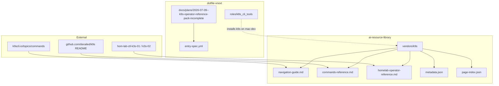

# K9s Operator Reference Pack

## Summary

Govern a lean K9s operator reference under `ai-resource-library/vendors/k9s` with
navigation, colon-command, and homelab-specific context for K3s clusters on
`hom-lab-ctl-k3s-01` and `hom-lab-ctl-k3s-02`.

## Capability Packet Boundary

| Field | Value |
|-------|-------|
| Capability identifier | `k9s_operator_reference_pack` |
| Owner manifest | This packet + `entry-spec.yml` |
| Owned files | `docs/plans/2026-07-09--k9s-operator-reference-pack-incomplete/**`; `ai-resource-library/vendors/k9s/**` |
| Integration anchors | `roles/k8s_cli_tools` (macOS install), homelab K3s roles and namespaces |
| Update behavior | Edit pack markdown directly; re-run validator |
| Removal behavior | Delete vendor subtree and vendors README row |

## Apply / Verify / Undo / Change class

- **Apply:** write pack files under `ai-resource-library/vendors/k9s`
- **Verify:** `ruby .cursor/skills/ai-library-entry/references/validate_entry_spec.rb docs/plans/2026-07-09--k9s-operator-reference-pack-incomplete/entry-spec.yml`
- **Undo:** delete `vendors/k9s` subtree
- **Class:** idempotent doc refresh; no host mutation

## Architecture/Structure Diagram

## Checklist

- [x] Create `entry-spec.yml`
- [x] Write `vendors/k9s` pack files
- [x] Update `vendors/README.md`
- [x] Validator pass token recorded after verification

`AI_LIBRARY_ENTRY_VALIDATION_OK`

## Diagram gate receipt

- [x] Architecture/Structure: repo paths, external docs, homelab cluster anchors
- [x] Capability Routing: N/A — static operator reference, no runtime branching
- [x] Naming/Modeling: N/A — no NetBox or inventory naming changes
- [x] Diagram Inventory lists required sections

## Diagram Inventory

### Diagrams Included

- **Architecture/Structure Diagram**: plan packet, library targets, external doc sources, homelab integration

### Additional Diagrams Available On Request

- **Homelab namespace map**: K3s app namespaces to owning Ansible roles
- **K9s navigation flow**: colon-command decision tree for common operator tasks
