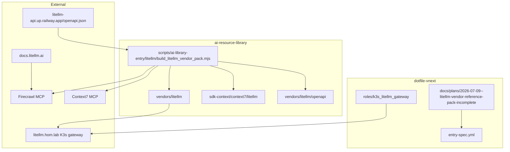
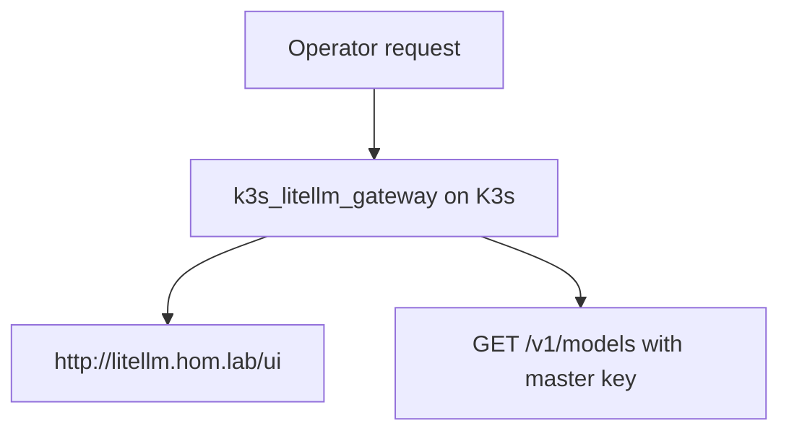
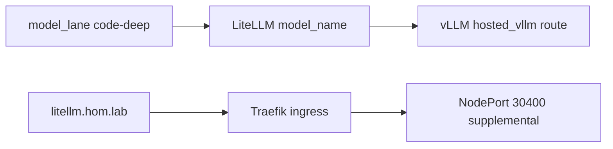

# LiteLLM Vendor Reference Pack

## Summary

Govern a new LiteLLM vendor entry under `ai-resource-library/vendors/litellm`. Production
homelab gateway traffic remains on `k3s_litellm_gateway` at `http://litellm.hom.lab/v1`.

This slice captures:

- LiteLLM proxy quick start, admin UI, routing, model access, CLI, supported endpoints, and embedding endpoint/provider coverage
- authentication, caching, memory, skills gateway, and AI-tool integration tutorials
- provider catalog coverage including `providers/`, `providers/openai`, `providers/openai_compatible`
- focused extraction of the `OpenAI Chat Completion Models` tables from the OpenAI provider page
- proxy operator pages for user keys, model management, model discovery, AI Hub, simple proxy, and Docker quick start
- config overview + linked full-settings reference sections from `proxy/configs` and `proxy/config_settings`
- focused captures for Docker quick-start `/chat/completions`, model-configuration, and proxy-specific params reference slices
- Terraform Registry namespace capture for `BerriAI` and its published LiteLLM provider/module surface
- Terraform source captures for the LiteLLM AWS module tree, Terraform provider tree, and provider `model` / `key` resource docs
- deployment captures for LiteLLM cloud deploy, microservices Helm, and componentized deployment blog guidance
- production-ops capture for the LiteLLM `proxy/prod` page
- integrations overview plus summary captures for nested integration pages
- OpenAPI/Swagger export from `https://litellm-api.up.railway.app/openapi.json`
- live homelab API-reference route note for `http://litellm.hom.lab/ui/api-reference/` backed by the local `openapi.json` probe
- Context7 notes for `/websites/litellm_ai` and `/berriai/litellm`

No standalone Mac or dev-host `litellm[proxy]` pipx role — gateway is K3s-only in this repo.

## Capability Packet Boundary

| Field | Value |
|-------|-------|
| Capability identifier | `litellm_vendor_reference_pack` |
| Owner manifest | This packet + `entry-spec.yml` |
| Owned files | `docs/plans/2026-07-09--litellm-vendor-reference-pack-incomplete/**`; `ai-resource-library/vendors/litellm/**`; `ai-resource-library/sdk-context/context7/litellm/**`; `ai-resource-library/scripts/ai-library-entry/litellm/**` |
| Integration anchors | Firecrawl via repo MCP client, Context7 `/websites/litellm_ai`, homelab `k3s_litellm_gateway` defaults |
| Update behavior | Re-run `build_litellm_vendor_pack.mjs` to refresh docs, swagger, indexes, and metadata |
| Removal behavior | Delete vendor subtree and sdk-context notes; remove vendors README row |

## Apply / Verify / Undo / Change class

- **Apply:** run build script for library pack
- **Verify:** `ruby validate_entry_spec.rb entry-spec.yml`; pack files exist; homelab gateway curls documented against `k3s_litellm_gateway` routes
- **Undo:** delete generated vendor pack if retiring slice
- **Class:** bootstrap/semi-manual for first swagger fetch; vendor pack is refreshable content

## Architecture/Structure Diagram

## Capability Routing Diagram

## Naming/Modeling Diagram

## Checklist

- [x] Governed packet + `entry-spec.yml`
- [x] Vendor pack build script and outputs
- [x] Swagger/OpenAPI index materialized
- [x] Provider + proxy extension pages captured
- [x] Embedding endpoint/provider reference capture added
- [x] Focused OpenAI chat-completion-model tables artifact captured
- [x] Config overview + see-all/full-settings captures added
- [x] Terraform provider/module + deployment extension captures added
- [x] LiteLLM production-ops page capture added
- [x] Entry-spec validator pass
- [x] Homelab operator curl/UI reference in vendor pack

## On Deck — user decisions to integrate

- **2026-07-09:** Reject standalone `litellm_proxy` Mac/dev pipx role. K3s gateway only.
- **2026-07-10:** Prefer `litellm` CLI examples over Docker or other example types when LiteLLM docs present multiple options.
- **2026-07-10:** Follow the `proxy/configs` “see all” links and the Docker quick-start/settings reference links into durable library captures.
- **2026-07-10:** Extend the pack with the LiteLLM Terraform module/provider sources plus cloud deploy, microservices Helm, and componentized deployment references.
- **2026-07-10:** Add the LiteLLM `docs/proxy/prod` page into the same governed vendor pack.
- **2026-07-10:** Add the LiteLLM `docs/embedding/supported_embedding` page when referenced from proxy/config docs.

## Diagram gate receipt

- [x] Architecture/Structure
- [x] Capability Routing
- [x] Naming/Modeling
- [x] Diagram Inventory lists required sections

## Diagram Inventory

### Diagrams Included

- Architecture/Structure Diagram
- Capability Routing Diagram
- Naming/Modeling Diagram

### Additional Diagrams Available On Request

- Model lane routing sequence
- OpenAPI tag map visualization
