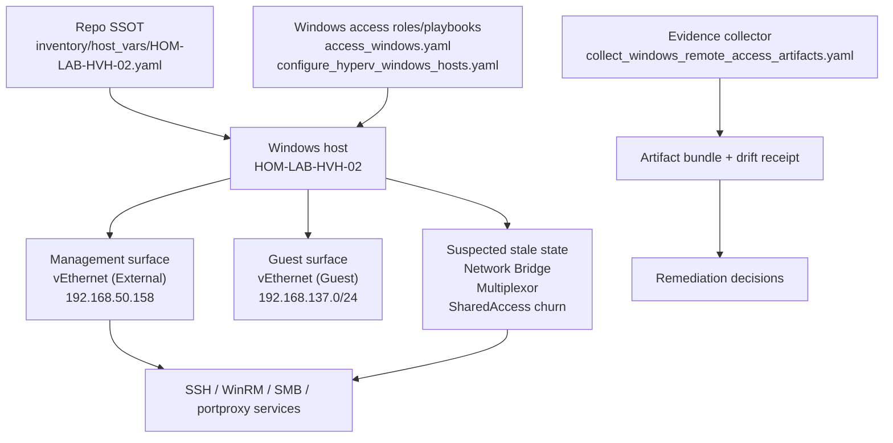
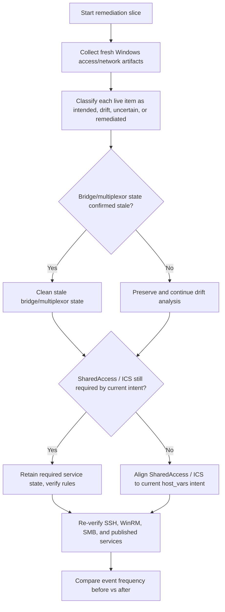
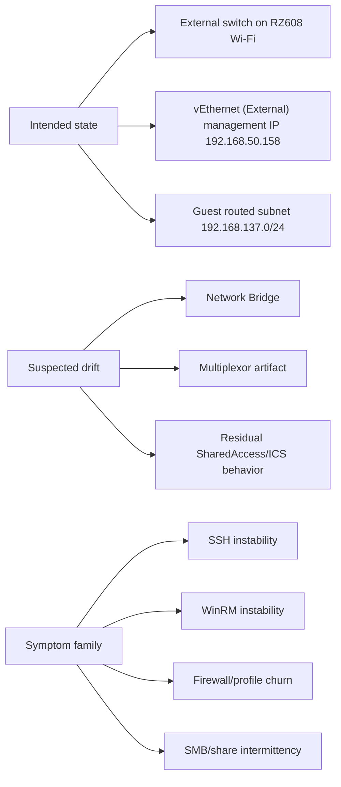

# Windows Host Connection Instability And Drift Remediation Packet

## Summary

This packet captures the current findings for `HOM-LAB-HVH-02` and defines the next repo-native remediation slice for the recurring connection instability affecting SSH, WinRM, SMB/share access, and Windows-published guest services on `192.168.50.158`.

Clean answer from the investigation:

- the host management IP living on a Wi-Fi-backed Hyper-V external switch is **current intended Ansible state**
- the active `Network Bridge` / multiplexor state, live `SharedAccess` behavior, repeated profile flips, and repeated firewall rule-store rebuilds are the **most likely drift or stale-residual problem family**

This plan does not assume SSH is the root cause. It treats SSH failures as one symptom of a broader Windows networking/control-plane churn pattern.

## Capability Packet Boundary

| Field | Value |
|-------|-------|
| Capability identifier | `windows_host_connection_instability_and_drift_remediation` |
| Owner manifest | None; this is a governed troubleshooting and remediation packet, not a new manifest-backed long-lived capability |
| Owned files | This packet README plus any follow-on troubleshooting or remediation artifacts created for Windows host connectivity, drift capture, and recovery |
| Integration anchors | `inventory/host_vars/HOM-LAB-HVH-02.yaml`, `playbooks/access_windows.yaml`, `playbooks/configure_hyperv_windows_hosts.yaml`, `playbooks/troubleshoot/collect_windows_remote_access_artifacts.yaml`, `roles/hyperv_networking`, `roles/access_identity_windows`, and Windows event-log evidence on `HOM-LAB-HVH-02` |
| Update behavior | Re-runnable evidence collection, drift classification, cleanup/remediation, and post-remediation verification for the Windows host networking/control surface |
| Removal behavior | Remove only troubleshooting-specific artifacts or temporary remediation helpers added by this slice; do not remove the intended Hyper-V external switch or the Windows access surface itself |

## Apply / Verify / Undo / Change Class

| Field | Value |
|---|---|
| Apply | Collect fresh Windows networking/access artifacts, classify intended state vs drift, remove stale bridge/multiplexor state if confirmed, align `SharedAccess`/ICS behavior to repo intent, and re-verify all remote-access surfaces |
| Verify | Confirm network-profile stability, firewall rule-store stability, SSH/WinRM/SMB availability, and continued service publication through `192.168.50.158` |
| Undo | Reverse only any new cleanup/remediation changes that prove harmful; preserve evidence artifacts and restore the prior managed access/networking roles if needed |
| Change class | Live Windows host remediation with evidence-backed drift cleanup |

## Public Interfaces / Types

- Primary affected host:
  - `HOM-LAB-HVH-02`
- Primary connection surface:
  - SSH to `192.168.50.158`
- Existing troubleshooting collector:
  - `playbooks/troubleshoot/collect_windows_remote_access_artifacts.yaml`
- Existing Windows access playbook:
  - `playbooks/access_windows.yaml`
- Existing Hyper-V networking playbook:
  - `playbooks/configure_hyperv_windows_hosts.yaml`
- Existing Hyper-V networking SSOT:
  - `inventory/host_vars/HOM-LAB-HVH-02.yaml`

## Findings

### 1. Intended topology is not the drift

The repo explicitly declares that `HOM-LAB-HVH-02` should:

- run an External Hyper-V switch named `External`
- bind that switch to the Wi-Fi adapter `RZ608 Wi-Fi 6E 80MHz`
- keep `allow_management_os: true`
- publish guest services back out through `192.168.50.158`

That lives in:

- `inventory/host_vars/HOM-LAB-HVH-02.yaml`

So the statement:

- "the host management IP is on a Wi-Fi-backed Hyper-V external switch"

is **current intended repo state**, not by itself configuration drift.

### 2. The repeated instability pattern is host networking/control-plane churn

Across the last 8-day evidence window, the host shows repeated:

- network-profile transitions
- firewall rule-store rebuilds
- remote-access rule duplication
- Wi-Fi reconnect activity
- Wi-Fi Direct / hosted-network churn

Most important frequencies found:

| Date | NetworkProfile `4004` count | Firewall reset `2059` count | Firewall profile-change `2010` count |
|---|---:|---:|---:|
| 2026-07-02 | 9 | 1 | 3 |
| 2026-07-04 | 10 | 1 | 3 |
| 2026-07-05 | 18 | 2 | 6 |
| 2026-07-07 | 36 | 0 | 6 |
| 2026-07-08 | 69 | 2 | 6 |

Observed sequence:

1. `vEthernet (External)` and the guest-side interface first land as `Public` / `Unidentified`
2. Windows logs `All rules have been deleted from the Windows Defender Firewall configuration`
3. duplicate remote-access rules are added back:
   - `sshd-Server-In-TCP`
   - `sshd`
   - `WinRM-HTTP-In-TCP`
   - `WinRM-HTTPS`
4. the external management interface later settles to `Private`

This is a broader host control-plane instability pattern, not an SSH-only failure pattern.

### 3. Wi-Fi and Wi-Fi Direct activity are part of the story

Main `RZ608 Wi-Fi 6E 80MHz` reconnect sessions from WLAN events:

| Date | Approximate reconnect sessions |
|---|---:|
| 2026-07-02 | 1 |
| 2026-07-04 | 1 |
| 2026-07-05 | 2 |
| 2026-07-08 | 2 |

Wi-Fi Direct / hosted-network activity on `2026-07-07` showed three start/connect/stop/disconnect cycles for `Microsoft Wi-Fi Direct Virtual Adapter #2`.

That matters because the same period also shows dynamic `SharedAccess` / ICS firewall rule additions.

### 4. The strongest likely drift family is stale bridge/multiplexor + residual ICS behavior

Current live state still includes:

- active `Network Bridge`
- `Microsoft Network Adapter Multiplexor Driver`
- `SharedAccess` service present and running
- dynamic ICS-related firewall rules appearing in the logs

That does not match the current intended routed-private-subnet direction for `HOM-LAB-HVH-02`, which explicitly says:

- `internal_ics_sharing_enabled: false`
- `guest_outbound_nat_enabled: false`

This makes the drift family much more likely to be:

- stale bridge/multiplexor networking state
- residual or unintended `SharedAccess` / ICS behavior
- profile/firewall churn induced or amplified by those leftovers

### 5. OpenSSH is a symptom surface, not the strongest root-cause candidate

OpenSSH-specific findings were comparatively light:

- `sshd: Received signal 8; terminating.` appeared only 3 times in the same 8-day window
- current live probes show accepted publickey logins and normal disconnects

So SSH remains affected by the host churn, but it is not the highest-frequency recurring fault surface.

## Clean Answer

The clean answer to the question you asked is:

- **Yes**, the Wi-Fi-backed Hyper-V external switch management setup is your current intended Ansible-managed design.
- **No**, that part by itself is not config drift.
- **Yes**, there are likely drift or stale-residual items around it:
  - active `Network Bridge`
  - multiplexor artifacts
  - unexpected `SharedAccess` / ICS behavior relative to current host_vars intent
  - repeated firewall rule-store rebuilds and profile churn

## Config Drift Items Tool

Use the existing collector as the baseline drift-evidence tool for this slice:

- `playbooks/troubleshoot/collect_windows_remote_access_artifacts.yaml`

This plan classifies drift items into three buckets:

| Drift item | Current classification | Why it matters |
|---|---|---|
| Wi-Fi-backed External switch on `RZ608` | intended state | do not remove it by calling it drift |
| `Network Bridge` / multiplexor state | suspected drift | older repo evidence already flagged it as stale/conflicting |
| `SharedAccess` running with dynamic ICS firewall rules | suspected drift or stale residual | current host_vars say sharing/NAT should be off |
| duplicate SSH/WinRM firewall rules after rule-store reset | symptomatic drift residue | shows repeated rebuilds of remote-access exposure |
| repeated `Public -> Private` profile flips on management surface | symptomatic drift residue | destabilizes all inbound control surfaces |

Required improvement in this slice:

- extend the current collector output into a durable drift-classification receipt so future runs can say:
  - intended
  - drift
  - uncertain
  - remediated

## Recommendations

### 1. Treat Windows networking state as the primary incident surface

Do not keep centering only:

- SSH port 22
- `sshd`
- WinRM listeners

The stronger recurring failure family is the Windows host networking/control plane that those services ride on.

### 2. Investigate and likely remove stale `Network Bridge` / multiplexor state

This is the highest-value next remediation candidate because:

- it is present live now
- older repo evidence already called it suspicious
- it is not part of the current intended host design

### 3. Audit `SharedAccess` / ICS against current host intent

Because current host_vars say sharing/NAT should be off, this slice should prove whether:

- `SharedAccess` is truly required for any remaining supported workflow on this host
- or it is now legacy behavior still mutating firewall/network state

### 4. Reconcile firewall exposure to survive profile churn

Remote-access exposure should be checked against the actual profile transitions observed in the logs so the host does not become unavailable during repeated `Public` / `Private` churn windows.

### 5. Preserve evidence-first execution

Use the existing troubleshooting collector before and after any cleanup so the slice can prove:

- what was drift
- what changed
- whether stability improved

## Implementation Slices

### Slice A — Evidence Refresh And Drift Receipt

- run the Windows remote-access collector
- add a drift-classification receipt for:
  - bridge/multiplexor state
  - `SharedAccess`
  - firewall duplicate rules
  - network-profile churn

### Slice B — Bridge / Multiplexor Cleanup

- confirm whether the active `Network Bridge` is outside desired state
- remove or disable only the stale bridge/multiplexor artifact path
- verify that intended Hyper-V switch state remains intact

### Slice C — `SharedAccess` / ICS Alignment

- prove whether `SharedAccess` is still needed
- if not, align it to current repo intent
- verify that guest routing/publication paths still work

### Slice D — Post-Cleanup Stability Verification

- re-check:
  - SSH
  - WinRM
  - SMB/share path
  - service publication through `192.168.50.158`
- compare event frequency before and after remediation

## Architecture/Structure Diagram

## Capability Routing Diagram

## Naming/Modeling Diagram

## Test Plan

- Verify the plan distinguishes intended topology from drift instead of labeling the Wi-Fi-backed external switch itself as drift.
- Verify the frequency data is preserved in the packet for:
  - `NetworkProfile 4004`
  - firewall reset `2059`
  - firewall profile-change `2010`
  - main Wi-Fi reconnect sessions
  - Wi-Fi Direct churn
- Verify the packet identifies `Network Bridge` / multiplexor state as a first-class remediation candidate.
- Verify the packet treats `SharedAccess` / ICS behavior as something to reconcile against host_vars rather than assume correct.
- Verify the packet routes future work through the existing Windows troubleshooting collector before cleanup.
- Verify the packet includes the clean answer explicitly.

## Assumptions And Defaults

- `HOM-LAB-HVH-02` remains a Windows Hyper-V host whose management plane intentionally lives on `vEthernet (External)` over the `RZ608` Wi-Fi uplink.
- The current issue is broader than SSH and should be solved at the Windows networking/control-plane layer.
- Older repo findings about stale bridge/multiplexor state remain relevant because the same artifact family is still present live.
- This packet is a remediation plan, not yet the cleanup implementation itself.

## Plan verification receipt

Planning-only packet created.

Current evidence obligations captured:

- intended-vs-drift split: pass
- recurring event frequencies: pass
- clean answer preserved: pass
- remediation recommendations captured: pass
- implementation not yet executed: pending

## Diagram Inventory

- **Architecture/Structure Diagram**: included
- **Capability Routing Diagram**: included
- **Naming/Modeling Diagram**: included
- **Sequence Diagram**: not included; the routing diagram captures the remediation flow for this slice
- **State Diagram**: not included; intended vs drift vs symptom classification is sufficiently covered by the naming/modeling diagram
