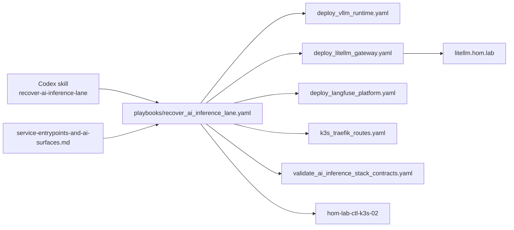
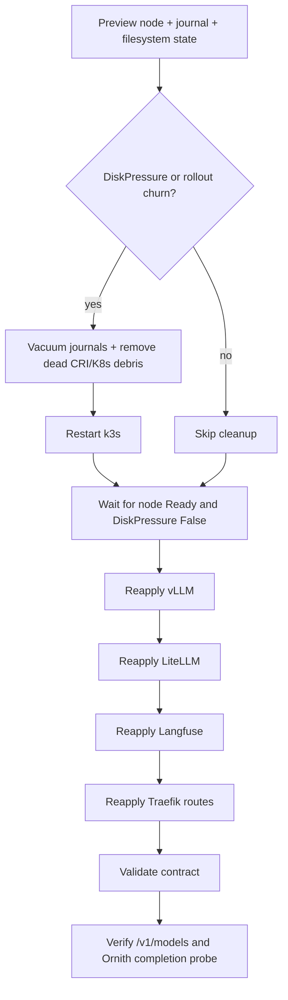
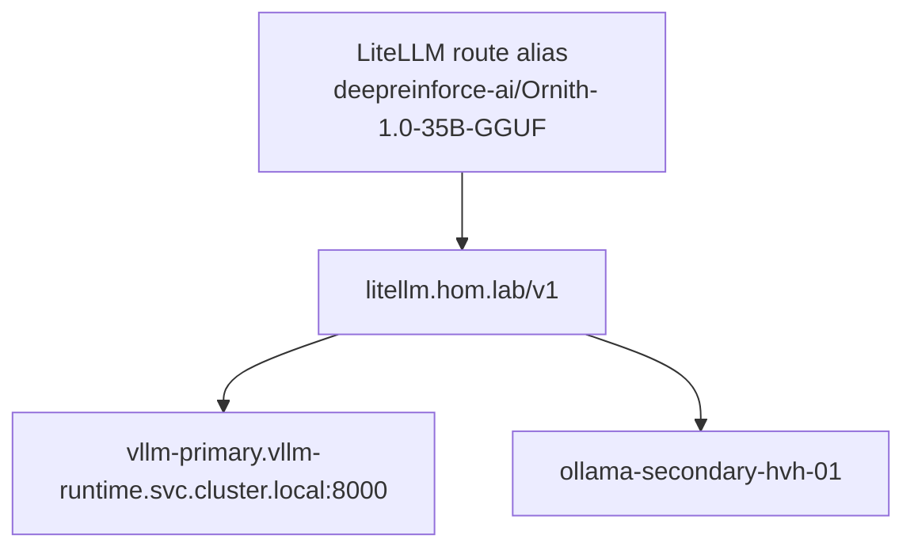

# AI Inference Lane Recovery Capability

## Summary

Add a repo-owned recovery entrypoint for the shared AI lane on
`hom-lab-ctl-k3s-02` so repeated LiteLLM / vLLM / Langfuse startup failures,
disk-pressure churn, and route-not-live incidents do not require rediscovering
the same ad hoc sequence.

## Capability Packet Boundary

| Field | Value |
|-------|-------|
| Capability identifier | `ai-inference-lane-recovery` |
| Owner manifest | `docs/plans/2026-07-10--ai-inference-lane-recovery/README.md` |
| Owned files | `playbooks/recover_ai_inference_lane.yaml`, `docs/plans/2026-07-10--ai-inference-lane-recovery/README.md`, `docs/reference/service-entrypoints-and-ai-surfaces.md`, `~/.codex/skills/recover-ai-inference-lane/SKILL.md`, `~/.codex/skills/recover-ai-inference-lane/agents/openai.yaml` |
| Integration anchors | `playbooks/deploy_vllm_runtime.yaml`, `playbooks/deploy_litellm_gateway.yaml`, `playbooks/deploy_langfuse_platform.yaml`, `playbooks/k3s_traefik_routes.yaml`, `playbooks/validate_ai_agent_client_profiles.yaml`, `playbooks/validate_ai_inference_stack_contracts.yaml` |
| Update behavior | Preview node state, clean recovery-only debris when disk-pressure or rollout churn appears, re-converge owner playbooks, then verify published LiteLLM routes and a real Ornith completion probe |
| Removal behavior | Delete the recovery playbook and skill files, remove the deploy-doc entry, and continue using the narrower owner playbooks directly |

## Apply / Verify / Undo / Change class

| | |
|---|---|
| **Apply** | `bin/codex-env ansible-playbook playbooks/recover_ai_inference_lane.yaml -i inventory/inventory.yaml` |
| **Verify** | Node `Ready=True` and `DiskPressure=False`; `vllm-primary`, `litellm`, and `langfuse` converge; `http://litellm.hom.lab/v1/models` exposes `deepreinforce-ai/Ornith-1.0-35B-GGUF`; completion probe returns `READY` |
| **Undo** | Restore prior repo truth, rerun owner playbooks directly, and remove the recovery capability files if the surface is retired |
| **Change class** | Mixed live recovery, orchestrated re-converge, and operator workflow capture |

## Architecture/Structure Diagram

## Capability Routing Diagram

## Naming/Modeling Diagram

## Assumptions And Defaults

- The live recovery target is the single-node GPU lane on `hom-lab-ctl-k3s-02`.
- Cleanup focuses on repeatable low-risk churn: journals, failed pod objects,
  and dead CRI objects.
- The recovery probe uses the published LiteLLM gateway, not direct in-cluster
  calls, as the final done check.

## Plan verification receipt

| Obligation | Status | Evidence |
|---|---|---|
| Add repo-owned recovery entrypoint | pass | `playbooks/recover_ai_inference_lane.yaml` |
| Capture capability packet boundary | pass | this plan packet |
| Expose recovery entrypoint in operator docs | pass | `docs/reference/service-entrypoints-and-ai-surfaces.md` |
| Add local Codex skill wrapper | pass | `~/.codex/skills/recover-ai-inference-lane/` |
| Validate entrypoint syntax | pass | `bin/codex-env ansible-playbook playbooks/recover_ai_inference_lane.yaml -i inventory/inventory.yaml --syntax-check` |
| Exercise recovery flow live | pass | `bin/codex-env ansible-playbook playbooks/recover_ai_inference_lane.yaml -i inventory/inventory.yaml` completed with published LiteLLM model verification and a successful Ornith completion probe returning `READY` |

## Diagram Inventory

- Included:
  - `Architecture/Structure Diagram`
  - `Capability Routing Diagram`
  - `Naming/Modeling Diagram`
- Other available diagram types:
  - K3s node pressure / recovery lifecycle detail
  - LiteLLM to vLLM service dependency detail
  - Published verification request flow
