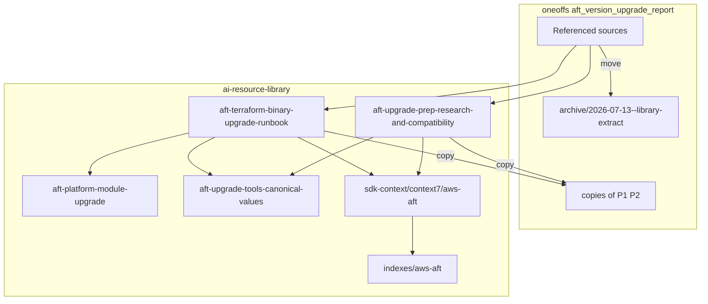
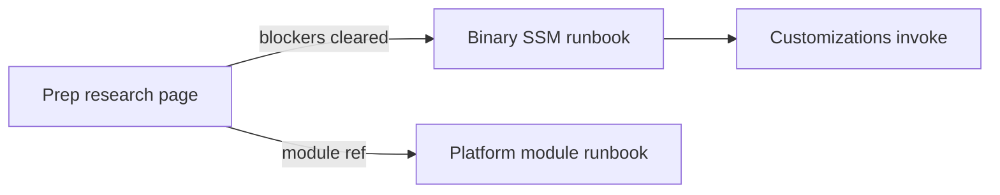

# AFT Terraform Upgrade Prep Pages

## Summary

Promote Terraform-binary upgrade execution and pre-change research methodology from `oneoffs/issue/aft_version_upgrade_report` into two operational library pages, refresh aws-aft Context7/indexes, and lightly archive referenced oneoffs sources plus copies of produced pages.

## Capability Packet Boundary

- **Capability:** `aft-terraform-upgrade-prep-pages`
- **Owned files:**
  - `ai-resource-library/vendors/aws/control_tower_operational/aft-terraform-binary-upgrade-runbook.md`
  - `ai-resource-library/vendors/aws/control_tower_operational/aft-upgrade-prep-research-and-compatibility.md`
  - wip stubs, operational/combined/indexes/context7 updates
  - `oneoffs/.../archive/2026-07-13--library-extract/` + oneoffs copies of produced pages
  - this packet + `entry-spec.yml`
- **Integration anchors:** `page-index.json`, `indexes/aws-aft/`, `sdk-context/context7/aws-aft/`
- **Update behavior:** edit library SSOT pages in place; refresh oneoffs copies when needed
- **Removal behavior:** remove index/crosswalk rows in the same change

## Apply / Verify / Undo / Change class

- **Apply:** write two library pages; stub wip pages; retarget indexes; refresh Context7 links; archive referenced oneoffs sources; copy produced pages
- **Verify:** Came-from + binary≠module cross-links; indexes list new pages; oneoffs archive + copies present
- **Undo:** git revert
- **Change class:** idempotent documentation + library indexing (repo-only)

## Architecture/Structure Diagram

## Capability Routing Diagram

## Naming/Modeling Diagram

N/A — no NetBox/inventory naming changes; page filenames follow existing `aft-*-*.md` operational pack pattern.

## Diagram gate receipt

- [x] Architecture/Structure: repo paths, oneoffs archive, library SSOT, indexes
- [x] Capability Routing: prep → binary vs module
- [x] Naming/Modeling: N/A — docs-only filenames, no NetBox/schema change
- [x] Diagram Inventory lists required sections

## Diagram Inventory

### Diagrams Included
- **Architecture/Structure Diagram**
- **Capability Routing Diagram**
- **Naming/Modeling:** N/A with reason above

### Additional Diagrams Available On Request
- Deployment Flow: sandbox → SSM put → pipeline smoke
- Integration Sequence: validation phases static → schema → runtime

## On Deck — user decisions to integrate

- oneoffs: archive referenced sources only; copy produced pages; no broad cleanup — **integrated**
