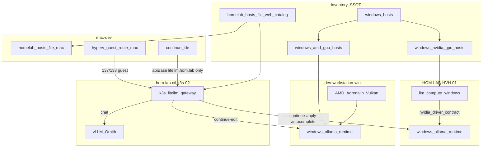
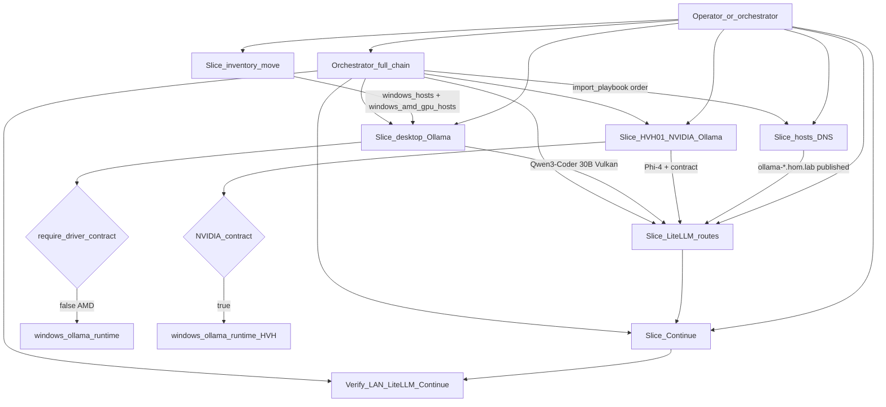
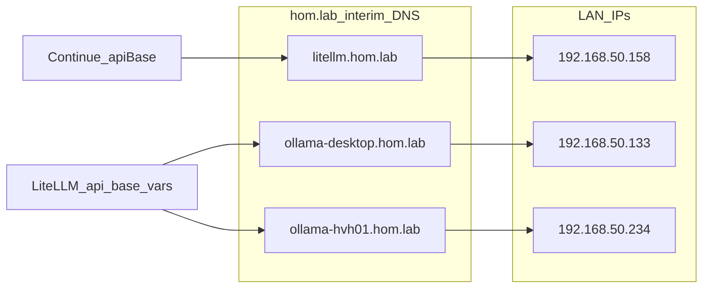

# Desktop Continue model lanes (AMD + Mac DNS + standard Windows inventory)

## Thesis

Commission Ollama on **`dev-workstation-win`** (AMD RX 9060 XT) for Continue **edit**, and Phi-4 Mini on **HVH-01** for **apply**, routed through existing LiteLLM. Continue on mac-dev stays gateway-only (`http://litellm.hom.lab`).

**Inventory policy (user-locked):** move the desktop **out of** `windows_hosts_offline` into the **standard Windows pattern**: member of `windows_hosts` plus a new capability group **`windows_amd_gpu_hosts`** (mirror of `windows_nvidia_gpu_hosts`, never fed to NVIDIA driver playbooks).

Mac gets `*.hom.lab` hosts-file names for Ollama backends. Acceleration on the desktop is **Vulkan + Adrenalin**, not a ROCm/amd-smi role.

---

## Clarifications integrated from review (locked)

### What “diagnostics” meant vs research

| Source | What it said | Role in decision |
| --- | --- | --- |
| Repo diagnostics | [`docs/diagnostics/amd-gpu-windows-desktop--diagnostics.md`](docs/diagnostics/amd-gpu-windows-desktop--diagnostics.md) § SDK decision: **amd-smi / ROCm → Skip** on Windows consumer RX 9060 XT | Homelab evidence for **telemetry/tools** on this gaming desktop (HWiNFO primary; written during FPS stall work — not an Ollama commission doc) |
| Vendor research | Context7 `/ollama/ollama` + Ollama `docs/gpu.mdx` / `docs/windows.mdx`; Firecrawl `https://docs.ollama.com/gpu` | **Inference path**: RX 9060 XT on Linux ROCm list; Windows ROCm table is Radeon PRO-heavy; broader Windows AMD via **Vulkan** |

Both agree: do **not** build a Windows ROCm/amd-smi Ansible path for this box. Diagnostics = repo file; Vulkan choice = diagnostics + Ollama research aligned.

### Non-goal glossary (still out of scope)

| Phrase | Meaning |
| --- | --- |
| ROCm / amd-smi install | Do not add a role that installs AMD ROCm stack or amd-smi on this desktop |
| 480B local serve | Do not pull/run Qwen3-Coder 480B locally (~hundreds of GB class); edit stays ~30B that fits 16 GB |
| Continue → raw IPs | Do not set Continue `apiBase` to `http://192.168.50.133:11434` or HVH `:11434`; always `http://litellm.hom.lab` |
| NVIDIA Studio Driver on desktop | Do not run `llm_compute_windows` against AMD |

**Removed non-goal:** “do not fold into `windows_hosts`” — **reversed by user**. Desktop **does** join `windows_hosts` + `windows_amd_gpu_hosts`. Still **never** join `windows_nvidia_gpu_hosts`.

### Vulkan + Adrenalin vs ROCm / amd-smi (why Vulkan wins here)

| | Vulkan + Adrenalin (chosen) | ROCm / amd-smi on Windows |
| --- | --- | --- |
| Fit for RX 9060 XT on Windows | Expected Ollama path for consumer AMD | Windows ROCm matrix is PRO-centric; consumer card not a first-class target |
| Install surface | Display driver stack already on a gaming PC | Extra HIP/ROCm runtime; fragile on consumer Windows |
| Ollama behavior | Uses Vulkan when ROCm not present | ROCm preferred *if* present — but getting it working here is the hard part |
| Ops / Ansible | Reuse `windows_ollama_runtime`; skip NVIDIA contract | Would need new unsupported capability |
| Telemetry | HWiNFO / existing diagnostics | amd-smi skipped in repo diagnostics for this host |
| Risk | Must verify runner is Vulkan not CPU | High: wrong stack, wasted automation, still may fall back |

**Verify:** `OLLAMA_DEBUG=1` → library **Vulkan** (fail if `cpu_*`).

### Desktop Ollama playbook reuse

Thin playbook **`playbooks/deploy_dev_workstation_ollama_runtime.yaml`** (hosts: `windows_amd_gpu_hosts`) **reuses** [`roles/windows_ollama_runtime`](roles/windows_ollama_runtime/) — same role as HVH-01 for bind, firewall, boot task, model pull. It does **not** invent parallel install logic outside the role. It does **not** call `llm_compute_windows`. LiteLLM / hosts / Continue stay separate playbooks (and the orchestrator below).

### Install method (durable inventory — not a one-off skip)

`windows_ollama_runtime_install_method` is a **first-class role switch** (`chocolatey` | `setup_exe`), not an ad-hoc “skip Chocolatey this once”:

| Host | `install_method` | Why |
| --- | --- | --- |
| HVH-01 (default) | `chocolatey` | `win_chocolatey` works; keep default |
| `dev-workstation-win` | `setup_exe` | Evidence: `win_chocolatey` hangs over SSH (`.chocolateyPending`, no `ollama.exe`). Same upstream `OllamaSetup.exe` + silent args, via role `tasks/install_setup_exe.yml` + `files/install_setup_exe.ps1` |

- Role **branches** on inventory: Chocolatey task runs only when `install_method == chocolatey`; setup_exe path runs only when `install_method == setup_exe` and `ollama.exe` is missing.
- Desktop host_vars set `windows_ollama_runtime_install_method: setup_exe` — **commissioned desired state**, re-applied by the same thin playbook.
- **PROHIBITED:** `playbooks/troubleshoot/_tmp_*` or other one-off install playbooks that bypass the role.

### Execution corrections (user-locked, 2026-07-24)

1. **Playbook/role first** — Chocolatey install was always `deploy_dev_workstation_ollama_runtime.yaml` → `chocolatey.chocolatey.win_chocolatey` in the role. Never hand-run `choco install` on SSH as the install path.
2. **Acceptable carve-out** — Ad-hoc Ansible (`win_shell` / `win_powershell`) to **stop hung `choco` / clear `.chocolateyPending`** is OK recovery; it is not a substitute for install.
3. **Observable terminals** — Run slice playbooks with live `-vv` in a Cursor terminal the operator can watch; do not bury sole progress in `/tmp` redirects.
4. **Interactive SSH when quoting fails** — Prefer `ssh` + `powershell -File` on a **role-staged** script (`install_setup_exe.ps1`) over misquoted remote one-liners. Still converges via the role on the next playbook apply.
5. **Temp recovery playbooks are a plan failure** — deleted `_tmp_silent_ollama_desktop.yaml`; install logic lives only in `windows_ollama_runtime`.

---

## Inventory: standard Windows pattern (user-locked)

Today: `dev-workstation-win` ∈ [`windows_hosts_offline`](inventory/inventory.yaml) only.

**Target:**

1. Remove from `windows_hosts_offline`.
2. Add to `windows_hosts` (routine Windows desired-state set, same pattern as HVH-01/02).
3. Add group **`windows_amd_gpu_hosts`** with `dev-workstation-win` (parallel to `windows_nvidia_gpu_hosts`).
4. Keep **out of** `windows_nvidia_gpu_hosts` and out of `llm_compute_windows` default host pattern.
5. Update [`inventory/group_vars/dev_workstation.yaml`](inventory/group_vars/dev_workstation.yaml): leave `node_purpose: interactive_desktop` but set `automation_management_model` to reflect commissioned Windows membership (no longer `opt_in_special_projects`-only for inventory placement).
6. Ensure `windows_os_hosts` children still compose correctly (`windows_hosts` + offline + deferred).
7. Desktop Ollama playbook `hosts:` → `windows_amd_gpu_hosts` (capability intersection), not a one-off hostname-only forever pattern.

**Implication accepted by user:** routine `windows_hosts` applies can include this machine (sleep/offline may fail runs — same class of issue as any online Windows host; treat as commissioned).

---

## Architecture/Structure Diagram

**Repo surfaces:** [`inventory/inventory.yaml`](inventory/inventory.yaml), host_vars desktop/HVH/k3s-02/mac-dev, [`roles/windows_ollama_runtime`](roles/windows_ollama_runtime/), [`roles/llm_compute_windows`](roles/llm_compute_windows/), [`roles/k3s_litellm_gateway`](roles/k3s_litellm_gateway/), [`roles/continue_ide`](roles/continue_ide/), [`roles/homelab_hosts_file_mac`](roles/homelab_hosts_file_mac/), playbooks listed in Implementation + Orchestrator.

---

## Capability Routing Diagram

**First build:** run slices one at a time (preview → apply → verify). **Mature / drift repair:** run orchestrator once to converge the whole chain.

---

## Naming/Modeling Diagram

Catalog SSOT: [`inventory/group_vars/all/homelab_hosts_file.yml`](inventory/group_vars/all/homelab_hosts_file.yml). Continue never uses raw desktop/HVH IPs as `apiBase`.

---

## Mac client setup (hosts + routes)

- Existing: `homelab_hosts_file_mac_enabled: true`; guest routes for `192.168.137.0/24` and `192.168.138.0/24`.
- Desktop on `192.168.50.133` — no new Mac static route for desktop.
- Add catalog rows `ollama-desktop` / `ollama-hvh01` with `mac_hosts_enabled` + `linux_hosts_enabled`.
- Apply: `homelab_hosts_file_mac.yaml`, `homelab_hosts_file_linux.yaml`, confirm `hyperv_guest_route_mac.yaml`.

---

## Locked model placement

| Surface | Continue role | Model |
| --- | --- | --- |
| Desktop AMD 16 GB | edit | Qwen3-Coder 30B (pin Ollama tag at implement) |
| HVH-01 1060 6 GB | autocomplete | `qwen2.5-coder:1.5b` (existing) |
| HVH-01 1060 6 GB | apply | Phi-4 Mini (pin tag at implement) |
| 5090 / Ornith | chat | unchanged |
| 480B | — | deferred / not deployed |

---

## Implementation slices (playbook-first; not all at once)

1. **Inventory** — `windows_hosts` + `windows_amd_gpu_hosts`; leave offline; update group_vars.
2. **Catalog + Mac/Linux hosts** — Ollama DNS rows; apply hosts playbooks; confirm guest routes.
3. **HVH-01** — NVIDIA via `llm_compute_windows_hvh01.yaml` if needed; Phi-4 in models; `deploy_hvh01_secondary_model_runtime.yaml`.
4. **Desktop Ollama** — host_vars (`require_driver_contract: false`, `D:\ai\models\ollama`); thin playbook → `windows_ollama_runtime` only; Vulkan verify; pull Qwen3-Coder 30B.
5. **LiteLLM** — extend `build_helm_values.yml` + k3s-02 host_vars for `continue-edit` / `continue-apply` → `http://ollama-*.hom.lab:11434/v1`; `deploy_litellm_gateway.yaml`.
6. **Continue** — mac-dev models split; `deploy_continue_ide.yaml`.
7. **Orchestrator** — add thin umbrella (below); use for later drift repair, not as the only first-touch path.

### Orchestrator playbook (mature pattern)

Add e.g. [`playbooks/deploy_continue_model_lanes.yaml`](playbooks/deploy_continue_model_lanes.yaml) that **only** `import_playbook`s in dependency order:

1. `homelab_hosts_file.yaml` (or mac + linux)
2. `hyperv_guest_route_mac.yaml` (idempotent confirm)
3. `deploy_hvh01_secondary_model_runtime.yaml` (NVIDIA + HVH Ollama + gateway refresh already inside)
4. `deploy_dev_workstation_ollama_runtime.yaml`
5. `deploy_litellm_gateway.yaml` (if not already covered / for desktop route vars)
6. `deploy_continue_ide.yaml`

Purpose: one entrypoint to **reconverge drifted config** after first-slice commission. First build still prefers tagged/limited single-slice runs with preview.

---

## Capability Packet Boundary

| Field | Value |
|-------|-------|
| Capability identifier | `continue-model-lanes-desktop-hvh01` |
| Owner manifest | This plan packet (promote to `docs/plans/YYYY-MM-DD--continue-model-lanes-desktop-hvh01/` on accept); inventory SSOT under `inventory/` |
| Owned files | New: `playbooks/deploy_dev_workstation_ollama_runtime.yaml`, `playbooks/deploy_continue_model_lanes.yaml`; inventory edits: `inventory/inventory.yaml` (`windows_amd_gpu_hosts`, move desktop into `windows_hosts`), `inventory/host_vars/dev-workstation-win.yaml`, `inventory/host_vars/hom-lab-hvh-01.yaml` (Phi-4 model row), `inventory/host_vars/hom-lab-ctl-k3s-02.yaml` (continue-edit/apply api_bases), `inventory/host_vars/mac-dev.yaml` (`continue_ide_models`), `inventory/group_vars/all/homelab_hosts_file.yml` (ollama DNS rows), `inventory/group_vars/dev_workstation.yaml` (automation model); role touch: `roles/k3s_litellm_gateway/` (opt-in route build for continue-edit/apply Ollama api_bases), `roles/windows_ollama_runtime/README.md` (AMD `require_driver_contract: false` note) |
| Integration anchors | `windows_ollama_runtime` (desktop + HVH); `llm_compute_windows` (HVH only); `k3s_litellm_gateway` model_list rows; `continue_ide` on mac-dev; `homelab_hosts_file_*` catalog → mac/linux hosts; `hyperv_guest_route_mac`; group `windows_amd_gpu_hosts` as Ollama desktop target |
| Update behavior | Change host_vars / catalog / LiteLLM api_base vars → re-run owning slice playbook (or orchestrator). Bump Ollama package/model pins in inventory, then re-apply `windows_ollama_runtime`. Do not hand-edit Continue/LiteLLM on disk. |
| Removal behavior | Set owning `*_state: absent` (or remove commissioned rows) and re-apply owning playbooks; reverse inventory group membership for desktop if fully decommissioning; remove `ollama-*` catalog rows and continue-edit/apply api_bases; revert `continue_ide_models`. Delete owned new playbooks only if capability is retired from the repo. |

### Lifecycle contract — `present` \| `absent` (required)

Ansible for this packet must stay state-based. Prefer a single control point per capability; playbooks must **not** wrapper-filter to install-only.

| Capability | Lifecycle variable | `present` | `absent` |
| --- | --- | --- | --- |
| Desktop / HVH Ollama runtime | `windows_ollama_runtime_state` | Install/pin package, env, firewall, boot task, pull `models_present` | Stop task, remove firewall/env/contract per role `absent` path; optional model purge only if role flag set |
| Continue client config | `continue_ide_state` | Render `~/.continue/config.yaml` from inventory models | Remove or stop managing managed config per role absent path |
| Mac hosts publication | `homelab_hosts_file_mac_enabled` (+ catalog row flags) | Write `ollama-*.hom.lab` entries | Disable flag / remove catalog rows → re-apply so entries leave `/etc/hosts` |
| Mac guest routes | `hyperv_guest_route_mac_state` | Ensure routes | `absent` removes managed routes |
| LiteLLM gateway routes | Commissioned by non-empty `k3s_litellm_gateway_*_api_base` vars on k3s-02 + gateway role | Append continue-edit/apply model_list rows | Clear api_base vars (empty) + re-apply gateway so aliases drop |
| HVH NVIDIA driver contract | `llm_compute_windows` package/contract (existing) | Pin Studio Driver + contract file | Out of scope to fully uninstall GPU driver on undo of *this* packet; do not tear down HVH GPU for Continue-lane undo alone |
| Inventory membership | Group lists in `inventory.yaml` | Desktop in `windows_hosts` + `windows_amd_gpu_hosts` | Move back to `windows_hosts_offline` and drop `windows_amd_gpu_hosts` membership when decommissioning |

**Build rules:**

1. New thin playbooks must preserve `present|absent` — invoke roles without forcing `state: present` only.
2. Desktop host_vars ship `windows_ollama_runtime_state: present` for commission; documented undo is flip to `absent` + re-run desktop Ollama playbook.
3. Model list edits (Phi-4 add/remove) are inventory desired-state; re-apply Ollama role to converge.
4. Do **not** use one-off SSH/`choco install` as the install path. Install only via role (`chocolatey` or `setup_exe`).
5. **Allowed:** ad-hoc Ansible to kill hung Chocolatey / clear `.chocolateyPending`; interactive SSH `-File` on role-staged scripts when quoting breaks.
6. Desktop uses inventory `windows_ollama_runtime_install_method: setup_exe` (durable). HVH keeps default `chocolatey`. Not a temporary skip of an unimplemented step.

---

## Apply / Verify / Undo / Change class

- **Apply:** inventory move + host_vars `*_state: present` (and enabled flags) + slice playbooks; orchestrator for full reconverge later.
- **Verify:** inventory graph shows desktop in `windows_hosts` ∩ `windows_amd_gpu_hosts` not nvidia/offline; hosts resolve; guest routes; Ollama LAN; Vulkan not CPU; LiteLLM aliases; Continue only via `litellm.hom.lab`; spot-check that setting a capability to `absent` and re-applying removes that surface (at least desktop Ollama + Continue in verify receipt).
- **Undo:** set owning `*_state: absent` / clear api_bases / remove catalog rows / revert Continue models / reverse inventory membership as needed; re-apply owning playbooks (not ad-hoc deletes). Full HVH NVIDIA driver uninstall is not part of this packet’s undo.
- **Change class:** Idempotent config + large first desktop pull; HVH NVIDIA may reboot; inventory targeting change (first-time target verification required before mutate).

---

## Non-goals

- NVIDIA Studio Driver / `windows_nvidia_gpu_hosts` for the AMD desktop
- ROCm / amd-smi Ansible install on Windows for RX 9060 XT
- 480B local serve
- Continue `apiBase` pointing at raw desktop/HVH IPs
- Running the full orchestrator as the **only** first-touch path (slices first; orchestrator for mature drift repair)

---

## Diagram gate receipt

- [x] Architecture/Structure: repo paths, external resources, data/control flow, naming, variable SSOT, playbook wiring
- [x] Capability Routing: included (slice vs orchestrator; AMD skip vs NVIDIA contract)
- [x] Naming/Modeling: included (`ollama-*.hom.lab`, Continue vs LiteLLM backends)
- [x] Diagram Inventory lists required sections below

---

## Diagram Inventory

### Diagrams included

- **Architecture/Structure Diagram**: inventory groups, roles, LiteLLM, Continue, Mac hosts/routes
- **Capability Routing Diagram**: slice order, orchestrator chain, AMD vs NVIDIA driver gates
- **Naming/Modeling Diagram**: `*.hom.lab` → LAN IPs; Continue vs LiteLLM api_base ownership

### Additional diagrams available on request

- **State Transition Diagram**: `windows_hosts_offline` → `windows_hosts` + `windows_amd_gpu_hosts`
- **Sequence Diagram**: Continue edit request through LiteLLM to desktop Ollama
- **Network Diagram**: Mac Wi-Fi → `.50` LAN vs guest `.137/.138` routes

---

## On Deck — skills to consider later (eval only; not in this build)

Simple candidates from this thread — park for future skill-library eval; do **not** scaffold during this execute:

| Working name | Trigger / when | One-line job |
| --- | --- | --- |
| `homelab-ansible-first-entry` | **Done 2026-07-24** — wide install/mutate entry door | `print_entry_doors.py` → intake skills; module-before-script |
| `windows-amd-ollama-commission` | AMD Windows host needs LAN Ollama behind LiteLLM | host_vars + `windows_amd_gpu_hosts` + `windows_ollama_runtime` with `require_driver_contract: false` + Vulkan verify |
| `continue-litellm-lane-split` | Continue edit/apply/chat/autocomplete need distinct LiteLLM aliases | inventory models + gateway api_base rows + `deploy_continue_ide` |
| `homelab-ollama-dns-catalog` | New Ollama backend needs `*.hom.lab` interim DNS | add `homelab_hosts_file_web_catalog` rows + mac/linux hosts apply |
| `ollama-library-preflight` | Before Windows/Linux Ollama mutate | consult HRL `ollama` pack + Context7 `/websites/ollama` + pin tags from library/docs |
| `createplan-diagram-gate` | Before Cursor `CreatePlan` / Plan card | enforce Architecture + conditionals + receipt + Diagram Inventory (closes `~/.cursor/plans` escape hatch) |
| `continue-model-lanes-orchestrator` | Drift repair across Continue stack | run `deploy_continue_model_lanes.yaml` import chain with preview-first |
| `windows-upstream-exe-installer` | Windows pinned Setup.exe when Chocolatey wrong/hung | `win_get_url` + `win_package` in owning role; replace custom `.ps1` patterns |

Eval later: promote at most 1–2 if reuse repeats; prefer wrapping existing playbooks over new scripts. **Immediate follow-through:** refactor `windows_ollama_runtime` `setup_exe` off `install_setup_exe.ps1` onto `win_get_url` + `win_package` using the entry skill + windows intake.
