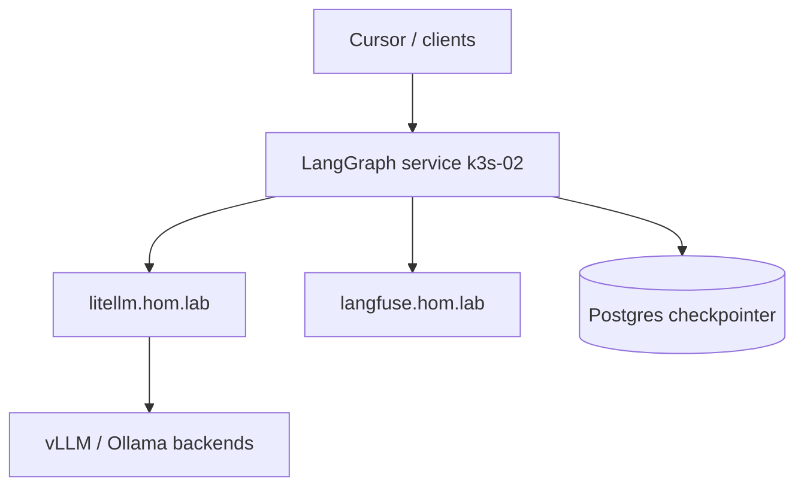

# LangGraph K3s runtime (incomplete-wip)

## Summary

Stand up a **self-hosted LangGraph** service on `hom-lab-ctl-k3s-02` next to
LiteLLM + Langfuse. Models via `http://litellm.hom.lab/v1`; traces via Langfuse.

## Capability Packet Boundary

- In: Ansible role/playbook for LangGraph API Deployment+Service(+Ingress),
  Postgres checkpointer wiring, LiteLLM/Langfuse env, smoke invoke
- Out: LangSmith Cloud; CrewAI; replacing LiteLLM

## Apply / Verify / Undo / Change class

- **Apply:** `ansible-playbook` deploy play targeting k3s-02 (`present`)
- **Verify:** pod Ready; `POST` invoke or health; Langfuse trace optional
- **Undo:** same play with `*_state: absent`
- **Change class:** idempotent config (once image/app exists)

## Architecture/Structure Diagram

## Diagram Inventory

- Included: Architecture/Structure Diagram
- Other available: Naming/Modeling Diagram (when NetBox service object added)

## Assumptions / defaults

- Host: `hom-lab-ctl-k3s-02`
- No LangSmith Cloud requirement
- App image / graph package **not yet built** — blocks live apply

## Placement options (operator choice)

| Option | Where | Fit for this lab | Notes |
| --- | --- | --- | --- |
| **A — Recommended steady-state** | K3s on `hom-lab-ctl-k3s-02` (Ansible role `k3s_langgraph_runtime`) | Best | Same AI plane as LiteLLM + Langfuse; Ingress e.g. `langgraph.hom.lab`; Postgres checkpointer |
| **B — Dev loop** | `langgraph dev` on mac-dev (or temp pod) | Good for graph authoring | Local `langgraph.json` + Studio; not the long-lived product surface |
| **C — Docker Compose** | Compose on `hom-lab-ctl-dkr-01` / fuzlang stacks | Possible but secondary | Splits agent runtime away from LiteLLM/Langfuse K3s plane; use only if you want Compose-first ops |
| **Not recommended** | `dev-workstation-win` | Poor | Desktop is Ollama/Continue lane, not agent API host |

**Recommendation:** Option A for product runtime; Option B for day-to-day graph development. Compose (C) is a fallback, not the default for this stack.

## Open decisions (block live apply)

1. Checkpoint store: shared Postgres vs dedicated
2. Container image / repo for first graph
3. Ingress hostname (e.g. `langgraph.hom.lab`)
4. HITL UX surface

## Checklist

- [ ] Context7 dashboard submit for `dotfile-vnext` + HRL + `langgraph-101` (API add HTTP 500)
- [ ] Build or choose first graph image
- [ ] Scaffold `roles/k3s_langgraph_runtime` + playbook
- [ ] Preview targeting k3s-02
- [ ] Mutating apply + smoke
- [ ] Update HRL validation stub `playbooks/validation/langgraph-stack-contract.md`

## Blocker (current)

Product runtime **cannot** be applied live until a graph image and checkpoint
decision exist. Library + Context7.json + Cursor HRL skill are ready; Context7
add-library UI requires **Sign in** (buttons disabled when anonymous).
