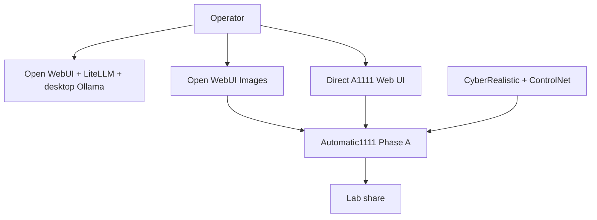
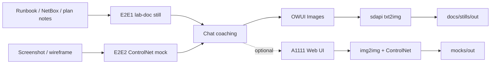
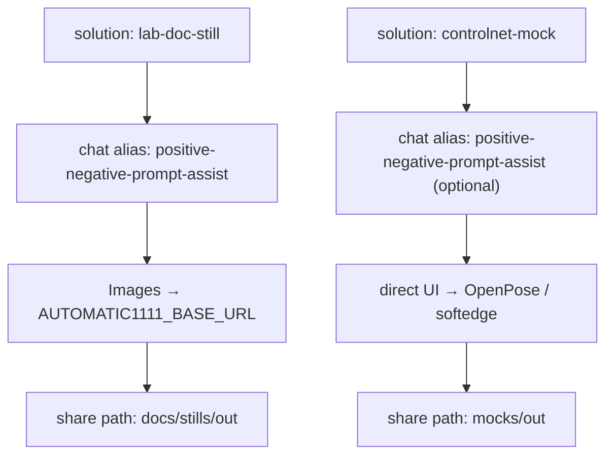

# Automatic1111 lab setup diagrams

## Summary

Doc-only packet that owns **Automatic1111** architecture diagrams for this lab.

**Revision:** prior prior studio still setups and legacy brainstorm
framing are **removed**. This packet now documents:

1. Shared Phase A host / Open WebUI Images / direct UI architecture
2. **Two end-to-end solutions** that fit upcoming homelab / docs work

Companion ComfyUI packet (Phase B stills; different E2E pair):
[`../2026-08-06--comfyui-lab-setup-diagrams-implemented/`](../2026-08-06--comfyui-lab-setup-diagrams-implemented/).

Model-route companion (official Ollama library aliases):
[`../2026-08-06--open-webui-litellm-model-route-diagrams-implemented/`](../2026-08-06--open-webui-litellm-model-route-diagrams-implemented/).

**Operator how-to:** [suggested_uses.md](suggested_uses.md) — how to use
Open WebUI Images, A1111 UI, lab-doc still, and ControlNet mock surfaces.

**Operator how-to:** [suggested_uses.md](suggested_uses.md) — how to use Phase A
host surfaces, lab-doc still, and ControlNet mock E2E paths.

## Capability Packet Boundary

| Field | Value |
| --- | --- |
| Capability identifier | `automatic1111-lab-setup-diagrams` |
| Owner manifest | This plan folder `README.md` + `diagrams/README.md` |
| Owned files | `docs/plans/2026-08-06--automatic1111-lab-setup-diagrams-implemented/**` |
| Integration anchors | [`docs/reference/local-ai-chat-and-image-stack.md`](../../reference/local-ai-chat-and-image-stack.md) |
| Update behavior | Re-render Mingrammer scripts via `create-diagrams` docker helper |
| Removal behavior | Delete this plan folder; update reference stack doc links |

## Scope (in)

- Automatic1111 host / Open WebUI Images / direct UI architecture
- Two documented E2E solutions (lab-doc still; ControlNet mock)
- Shared lab surfaces those solutions reuse (Open WebUI, LiteLLM, Ollama, share)

## Scope (out)

- No inventory / playbook / runtime mutations (doc-only)
- No non-documentation image or video product pipelines
- ComfyUI pack ownership (sibling plan)
- Live prompt library / ControlNet graph JSON capture (future execute slice)

---

## E2E Solution 1 — Open WebUI Images lab-doc still

**Why this fits:** runbooks, NetBox notes, and plan packets often need a quick
Documentation still (topology vignette, badge, simple scene). Phase A on the GTX 1060 is
the lowest-friction path: chat writes the brief; Open WebUI Images hits A1111
`sdapi`.

| Stage | What happens |
| --- | --- |
| Input | Runbook / NetBox / plan notes |
| Coach | Open WebUI → LiteLLM → desktop Ollama (`positive-negative-prompt-assist`) turns notes into a still brief |
| Generate | Open WebUI **Images** → Automatic1111 `txt2img` (CyberRealistic on HVH-01) |
| Output | PNG on lab share → embed in plan / issue / runbook |

**Explicit non-goals:** ControlNet deep knobs (see E2E 2), video, non-documentation still product pipelines, pixels through LiteLLM.

Pack: [diagrams/automatic1111-e2e-lab-doc-still.svg](diagrams/automatic1111-e2e-lab-doc-still.svg)

---

## E2E Solution 2 — ControlNet reference-locked UI / topology mock

**Why this fits:** design reviews and capacity notes need layout-locked mocks
from a screenshot or wireframe. A1111’s direct Web UI + OpenPose / softedge on
the 1060 is the practical ControlNet path (knobs not fully exposed in WebUI
Images).

| Stage | What happens |
| --- | --- |
| Input | UI screenshot, wireframe, or topology sketch |
| Coach (optional) | Open WebUI → LiteLLM → desktop Ollama polishes the prompt |
| Generate | Direct A1111 Web UI — `img2img` + ControlNet (OpenPose / softedge) |
| Output | Mock still on lab share → design review / capacity note |

**Explicit non-goals:** non-documentation still product pipelines, I2V, ComfyUI Phase B graphs.

Pack: [diagrams/automatic1111-e2e-controlnet-mock.svg](diagrams/automatic1111-e2e-controlnet-mock.svg)

---

## Shared lab pieces (what each represents)

| Piece | Generic meaning for these solutions |
| --- | --- |
| Automatic1111 (Phase A) | Still pixel backend on HVH-01 (GTX 1060) |
| CyberRealistic (+ ControlNet packs) | Local checkpoints used by both E2E paths |
| Open WebUI | Chat surface + Images button for E2E 1 |
| LiteLLM | Chat gateway only (coaching, not pixels) |
| Desktop Ollama | Preferred coaching backend (`positive-negative-prompt-assist` / general aliases) |
| Lab share | Landing zone for docs stills and mocks |
| Direct A1111 Web UI | ControlNet / denoise path for E2E 2 |
| ComfyUI (sibling) | Phase B advanced stills — not this packet’s runtime |

## Apply / Verify / Undo / Change class

| | |
| --- | --- |
| **Apply** | Author/render pack SVGs under `diagrams/`; keep inventories current |
| **Verify** | Every in-scope stem has `.py` + `.svg`; Diagram Inventory lists `pack-svg` |
| **Undo** | Delete this plan folder (no runtime change) |
| **Change class** | Doc-only plan packet |

## Checklist

- [x] Plan packet owns Automatic1111 diagrams (`scope: doc-only`)
- [x] `diagrams/automatic1111-lab-architecture.*` retained
- [x] `diagrams/automatic1111-e2e-lab-doc-still.*`
- [x] `diagrams/automatic1111-e2e-controlnet-mock.*`
- [x] Prior studio / resources-dependencies stems removed
- [x] Legacy brainstorm links removed from this packet
- [x] Architecture / Capability Routing / Naming sections present
- [x] `diagrams/README.md` index updated

## Architecture/Structure Diagram

Shared host surface: [diagrams/automatic1111-lab-architecture.svg](diagrams/automatic1111-lab-architecture.svg)

## Capability Routing Diagram

## Naming/Modeling Diagram

## Diagram Inventory

| Diagram | Medium | Path |
| --- | --- | --- |
| Lab host architecture | pack-svg | [diagrams/automatic1111-lab-architecture.svg](diagrams/automatic1111-lab-architecture.svg) |
| E2E 1 lab-doc still | pack-svg | [diagrams/automatic1111-e2e-lab-doc-still.svg](diagrams/automatic1111-e2e-lab-doc-still.svg) |
| E2E 2 ControlNet mock | pack-svg | [diagrams/automatic1111-e2e-controlnet-mock.svg](diagrams/automatic1111-e2e-controlnet-mock.svg) |
| Architecture sketch | mermaid-fence | this README |
| Capability routing | mermaid-fence | this README |
| Naming / modeling | mermaid-fence | this README |

**Removed (superseded):** `automatic1111-studio-setup`, `automatic1111-resources-dependencies`
(prior prior studio framing). Legacy brainstorm packs are **not** a source for
this packet.

## Diagram gate receipt

| Gate | Status |
| --- | --- |
| Architecture/Structure present | pass — pack SVG + Mermaid |
| Capability Routing present | pass — Mermaid (two E2E routes) |
| Naming/Modeling present | pass — Mermaid (solution → alias → path → share) |
| Diagram Inventory final | pass |
| Medium declared | pack-svg + mermaid-fence |

## Assumptions / defaults

- Lab facts match `docs/reference/local-ai-chat-and-image-stack.md`.
- A1111 remains the Open WebUI Images backend for Phase A stills.
- Pixels do not route through LiteLLM.
- Both solutions are **still-only** documentation paths; non-documentation still product paths are
  out of this packet.
- Chat alias / share path names above are naming targets for a future execute
  slice; this packet documents the E2E shape only.

## Plan verification receipt

**Slice:** doc-only v2 (replace studio setups with two E2E solutions)  
**Verified at:** 2026-08-06  
**Verifier:** agent run

### Obligation inventory

| ID | Source | Obligation | In slice scope? | Status | Evidence |
| --- | --- | --- | --- | --- | --- |
| O-01 | Checklist | Own Automatic1111 diagrams (`scope: doc-only`) | yes | pass | Frontmatter `scope: doc-only` |
| O-02 | Checklist | Retain lab architecture pack | yes | pass | `diagrams/automatic1111-lab-architecture.{py,svg,png}` |
| O-03 | Checklist | E2E lab-doc still pack | yes | pass | `diagrams/automatic1111-e2e-lab-doc-still.*` |
| O-04 | Checklist | E2E ControlNet mock pack | yes | pass | `diagrams/automatic1111-e2e-controlnet-mock.*` |
| O-05 | Checklist | Prior studio / resources stems removed | yes | pass | No `automatic1111-studio-setup` / `automatic1111-resources-dependencies` files |
| O-06 | Checklist | Legacy brainstorm links removed from packet | yes | pass | No legacy brainstorm sources; Scope (out) excludes non-documentation still product paths |
| O-07 | Checklist | Architecture / Routing / Naming present | yes | pass | Sections in this README |
| O-08 | Checklist | `diagrams/README.md` index | yes | pass | Lists three current stems |
| O-09 | Apply | Author/render pack SVGs | yes | pass | Docker render for two new stems |
| O-10 | Verify | Every stem has `.py` + `.svg` | yes | pass | Stem verify after render |
| O-11 | Class | Doc-only / no runtime mutation | yes | pass | `scope: doc-only` |
| O-12 | Diagram gate | Gate receipt pass | yes | pass | `## Diagram gate receipt` |
| O-13 | Prose | No non-documentation still product path in packet | yes | pass | Scope (out) + solution non-goals |
| O-14 | Follow-on | Live prompt library / Ansible execute | no | deferred | Future execute slice |

### Summary

- In-scope obligations: 13 — pass: 13, fail: 0, blocked: 0, pending: 0
- Deferred: 1

### Completion gate

- [x] Every **in-scope** obligation is `pass` or `n/a`
- [x] Diagram gate receipt present and passing
- [x] No unresolved On Deck rows

## Sources checked

- `docs/reference/local-ai-chat-and-image-stack.md`
- `docs/plans/2026-08-06--comfyui-lab-setup-diagrams-implemented/README.md` (E2E revision pattern)
- `docs/plans/2026-08-06--open-webui-litellm-model-route-diagrams-implemented/README.md` (official alias matrix)
- `docs/codex_framework/architecture-diagram-routing.md`
- Prior packet stems replaced in this revision
