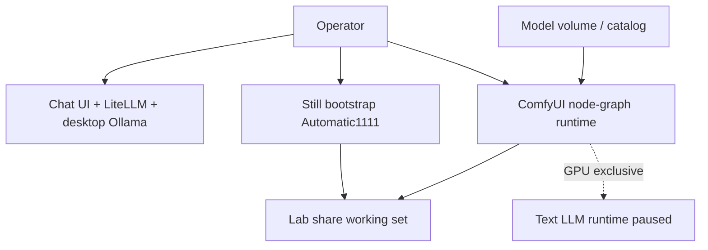
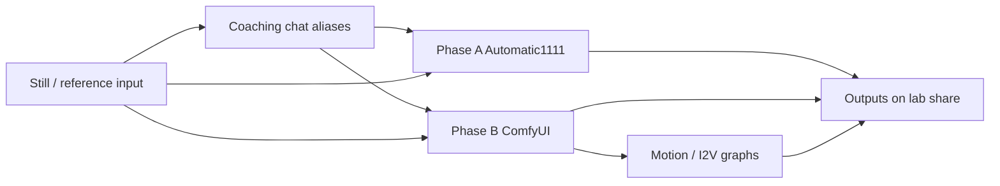

# ComfyUI lab setup diagrams

## Summary

Doc-only packet that owns **ComfyUI** architecture diagrams for this lab.
Split from the combined brainstorm folder
`docs/brainstorming_designs/comfyui_automatic1111`. Companion Automatic1111
packet:
[`../2026-08-06--automatic1111-lab-setup-diagrams-implemented/`](../2026-08-06--automatic1111-lab-setup-diagrams-implemented/).

Creative-studio brainstorm source (pipelines, assets, hosts):
[`docs/brainstorming_designs/date_tbd--glam-draft1/`](../../brainstorming_designs/date_tbd--glam-draft1/).
This plan describes those pieces by **what they represent**, not by content theme.

## Capability Packet Boundary

| Field | Value |
| --- | --- |
| Capability identifier | `comfyui-lab-setup-diagrams` |
| Owner manifest | This plan folder `README.md` + `diagrams/README.md` |
| Owned files | `docs/plans/2026-08-06--comfyui-lab-setup-diagrams-implemented/**` |
| Integration anchors | Links from brainstorm README; optional later link from `docs/reference/local-ai-chat-and-image-stack.md` |
| Update behavior | Re-render Mingrammer scripts via `create-diagrams` docker helper |
| Removal behavior | Delete this plan folder; restore brainstorm pointers if needed |

## Scope (in)

- ComfyUI host / publish / GPU time-share architecture
- Studio-wide surfaces where ComfyUI is the advanced still + motion runtime
- Generic meanings of studio resource kinds that feed ComfyUI

## Scope (out)

- No inventory / playbook / runtime mutations (doc-only)
- Automatic1111 pack ownership (sibling plan)
- Content-specific prompt wording

## What each studio piece represents (generic)

| Piece (brainstorm) | Generic meaning |
| --- | --- |
| Studio profile (`config.yaml`) | Shared map of hosts, pipelines, and alias → asset paths |
| Coaching prompts | Chat system instructions that coach prompt writing |
| Style presets | Reusable positive prompt templates for a pipeline |
| Negative presets | Shared “avoid this” cue lists |
| Smoke examples | Paste-ready prompts for a first successful run |
| Workflow graphs | Saved ComfyUI node recipes (still compose, still → video) |
| Adapter slots | Future LoRA / adapter catalog entries (not downloaded yet) |
| Lab share | Deployed working set: inputs, outputs, copied presets |
| Still pipeline | Portrait / reference → polished still |
| Motion pipeline | Still → short clip (image-to-video) |
| Scene pipeline | Advanced still + I2V graphs on the high-VRAM runtime |
| Chat gateway (LiteLLM) | Prompt coaching only — does not emit pixels today |
| Chat UI (Open WebUI) | Operator chat + Images entry |
| Desktop chat runtime | Ollama backends used for coaching |
| Model catalog / PVC | Weights inventory and the volume ComfyUI mounts |
| Phase B flip | Mutual exclusion: ComfyUI present ⇒ text LLM runtime absent on same GPU |

## Apply / Verify / Undo / Change class

| | |
| --- | --- |
| **Apply** | Author/render pack SVGs under `diagrams/`; keep inventories current |
| **Verify** | Every stem has `.py` + `.svg`; Diagram Inventory lists `pack-svg` |
| **Undo** | Delete this plan folder (no runtime change) |
| **Change class** | Doc-only / brainstorm plan packet |

## Checklist

- [x] Plan packet created (`scope: doc-only`)
- [x] Promoted `comfyui-lab-architecture.*`
- [x] `diagrams/comfyui-studio-setup.*`
- [x] `diagrams/comfyui-resources-dependencies.*`
- [x] Architecture / Capability Routing / Naming sections present
- [x] `diagrams/README.md` index
- [x] Brainstorm folder redirects here

## Architecture/Structure Diagram

Primary pack: [diagrams/comfyui-studio-setup.svg](diagrams/comfyui-studio-setup.svg)



## Capability Routing Diagram



## Naming/Modeling Diagram

```mermaid
flowchart TB
  profile[Studio profile]
  alias[Chat alias name]
  coachAsset[Coaching asset path]
  presetDir[Preset directory]
  graph[Workflow graph path]
  url[Runtime URL]

  profile --> alias
  alias --> coachAsset
  profile --> presetDir
  profile --> graph
  profile --> url
```

## Diagram Inventory

| Diagram | Medium | Path |
| --- | --- | --- |
| Lab host architecture | pack-svg | [diagrams/comfyui-lab-architecture.svg](diagrams/comfyui-lab-architecture.svg) |
| Studio setup (roles) | pack-svg | [diagrams/comfyui-studio-setup.svg](diagrams/comfyui-studio-setup.svg) |
| Resources / dependencies | pack-svg | [diagrams/comfyui-resources-dependencies.svg](diagrams/comfyui-resources-dependencies.svg) |
| Architecture sketch | mermaid-fence | this README |
| Capability routing | mermaid-fence | this README |
| Naming / modeling | mermaid-fence | this README |

## Diagram gate receipt

| Gate | Status |
| --- | --- |
| Architecture/Structure present | pass — pack SVG + Mermaid |
| Capability Routing present | pass — Mermaid |
| Naming/Modeling present | pass — Mermaid (alias / asset / URL map) |
| Diagram Inventory final | pass |
| Medium declared | pack-svg + mermaid-fence |

## Assumptions / defaults

- Lab facts match `docs/reference/local-ai-chat-and-image-stack.md` and the
  Phase B flip doc.
- Creative-studio brainstorm remains the seed for asset trees; this packet only
  documents structure.
- Exact high-VRAM checkpoint IDs stay `pending_research` until selected elsewhere.

## Plan verification receipt

**Slice:** doc-only v1  
**Verified at:** 2026-08-06  
**Verifier:** agent run

### Obligation inventory

| ID | Source | Obligation | In slice scope? | Status | Evidence |
| --- | --- | --- | --- | --- | --- |
| O-01 | Checklist | Plan packet created (`scope: doc-only`) | yes | pass | This README frontmatter `scope: doc-only` |
| O-02 | Checklist | Promote `comfyui-lab-architecture.*` | yes | pass | `diagrams/comfyui-lab-architecture.{py,svg,png}` present |
| O-03 | Checklist | Studio setup pack SVG | yes | pass | `diagrams/comfyui-studio-setup.{py,svg,png}` present |
| O-04 | Checklist | Resources/dependencies pack SVG | yes | pass | `diagrams/comfyui-resources-dependencies.{py,svg,png}` present |
| O-05 | Checklist | Architecture / Capability Routing / Naming sections | yes | pass | Sections present in this README |
| O-06 | Checklist | `diagrams/README.md` index | yes | pass | File lists three stems |
| O-07 | Checklist | Brainstorm folder redirects here | yes | pass | `docs/brainstorming_designs/comfyui_automatic1111/README.md` |
| O-08 | Apply | Author/render pack SVGs under `diagrams/` | yes | pass | Docker render receipt for new stems; promoted lab stem copied |
| O-09 | Verify | Every stem has `.py` + `.svg`; inventory lists `pack-svg` | yes | pass | Shell verify `ALL_VERIFY_PASS` for three stems; Diagram Inventory |
| O-10 | Undo | Documented as delete plan folder | yes | pass | Change-class table Undo row |
| O-11 | Class | Doc-only / no runtime mutation | yes | pass | `scope: doc-only`; `netbox_scope: false` |
| O-12 | Diagram gate | Architecture + Routing + Naming + Inventory | yes | pass | `## Diagram gate receipt` all pass |
| O-13 | Frontmatter | `depends_on_plans` / `unblocks` empty | yes | pass | `[]` / `[]` |
| O-14 | Capability boundary | Owner / owned files / removal documented | yes | pass | `## Capability Packet Boundary` |
| O-15 | Follow-on | Optional link from local-ai-chat stack doc | no | deferred | Optional integration anchor; not required for slice |

### Summary

- In-scope obligations: 14 — pass: 14, fail: 0, blocked: 0, pending: 0
- Deferred (explicit out-of-slice): 1

### Completion gate (all required for `lifecycle: implemented`)

- [x] Every **in-scope** obligation is `pass` or `n/a` with reason
- [x] Diagram gate receipt present and passing
- [x] No unresolved On Deck rows (none open)

## Sources checked

- `docs/brainstorming_designs/comfyui_automatic1111/`
- `docs/brainstorming_designs/date_tbd--glam-draft1/design.md`
- `docs/brainstorming_designs/date_tbd--glam-draft1/assets/config.yaml`
- `docs/plans/2026-08-06--open-webui-litellm-model-route-diagrams-implemented/README.md` (packet shape)
- `docs/codex_framework/architecture-diagram-routing.md`
- `docs/reference/local-ai-chat-and-image-stack.md`
