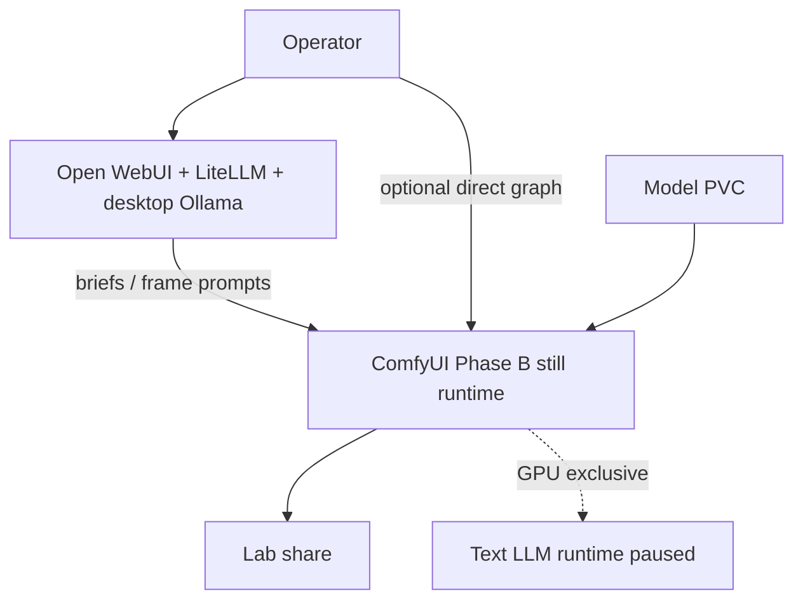
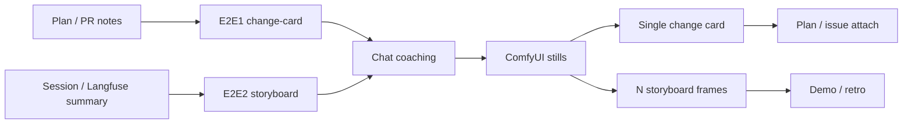
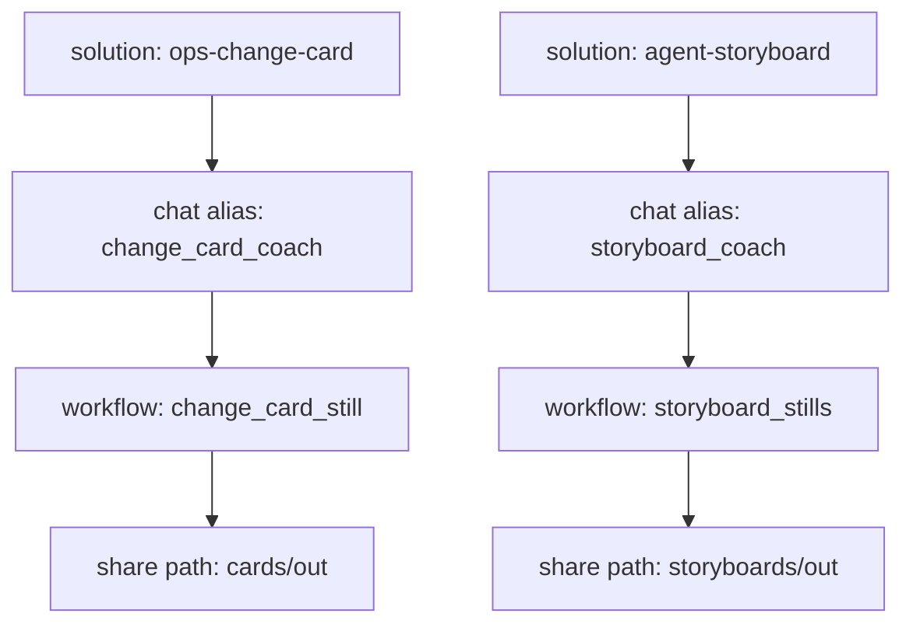

# ComfyUI lab setup diagrams

## Summary

Doc-only packet that owns **ComfyUI** architecture diagrams for this lab.

**Revision:** the prior prior studio still/video setups are
**removed**. This packet now documents:

1. Shared Phase B host / GPU architecture
2. **Two end-to-end solutions** that fit upcoming homelab / agent work

Companion Automatic1111 packet (Phase A; lab-doc still + ControlNet mock E2E):
[`../2026-08-06--automatic1111-lab-setup-diagrams-implemented/`](../2026-08-06--automatic1111-lab-setup-diagrams-implemented/).

**Operator how-to:** [suggested_uses.md](suggested_uses.md) — how to use the
lab architecture, ops change-card, and agent storyboard surfaces.

**Operator how-to:** [suggested_uses.md](suggested_uses.md) — how to use Phase B
host surfaces, ops change-card, and agent storyboard E2E paths.

## Capability Packet Boundary

| Field | Value |
| --- | --- |
| Capability identifier | `comfyui-lab-setup-diagrams` |
| Owner manifest | This plan folder `README.md` + `diagrams/README.md` |
| Owned files | `docs/plans/2026-08-06--comfyui-lab-setup-diagrams-implemented/**` |
| Integration anchors | [`docs/reference/local-ai-chat-and-image-stack.md`](../../reference/local-ai-chat-and-image-stack.md) |
| Update behavior | Re-render Mingrammer scripts via `create-diagrams` docker helper |
| Removal behavior | Delete this plan folder; update reference stack doc links |

## Scope (in)

- ComfyUI host / publish / GPU time-share architecture
- Two documented E2E solutions (ops change-card; agent storyboard)
- Shared lab surfaces those solutions reuse (Open WebUI, LiteLLM, Ollama, share, PVC)

## Scope (out)

- No inventory / playbook / runtime mutations (doc-only)
- No non-documentation image or motion-video product pipelines in this packet
- No I2V / motion-video product path in this packet
- Automatic1111 pack ownership (sibling plan)
- Live ComfyUI graph JSON capture (future execute slice)

---

## E2E Solution 1 — Ops change-card illustrator

**Why this fits:** plan packets, GitHub issues, and Ansible change write-ups often
need a single visual “what changed” card. ComfyUI produces that still; chat only
writes the brief.

| Stage | What happens |
| --- | --- |
| Input | Plan / PR / runbook notes (Apply / Verify / Undo sketch) |
| Coach | Open WebUI → LiteLLM → desktop Ollama turns notes into a change-card brief |
| Generate | ComfyUI runs a **single-still** node graph (topology vignette / before→after card) |
| Output | PNG on lab share → attach to plan packet or GitHub issue |

**Explicit non-goals:** video, non-documentation still product pipelines, pixel chat through LiteLLM.

Pack: [diagrams/comfyui-e2e-ops-change-card.svg](diagrams/comfyui-e2e-ops-change-card.svg)

---

## E2E Solution 2 — Agent-run storyboard stills

**Why this fits:** multi-agent Cursor/Codex sessions (planner → researcher →
executor) and optional Langfuse traces need a short visual timeline for demos and
retros — as **still frames**, not a generated movie.

| Stage | What happens |
| --- | --- |
| Input | Session summary or optional Langfuse role timeline |
| Coach | Open WebUI → LiteLLM → desktop Ollama emits **N frame prompts** |
| Generate | ComfyUI runs a **storyboard still** graph (one frame per role/step) |
| Output | Frame set on lab share → embed in demo / retro write-up |

**Explicit non-goals:** I2V, continuous video, non-documentation still product workflows.

Pack: [diagrams/comfyui-e2e-agent-storyboard.svg](diagrams/comfyui-e2e-agent-storyboard.svg)

---

## Shared lab pieces (what each represents)

| Piece | Generic meaning for these solutions |
| --- | --- |
| ComfyUI (Phase B) | Node-graph still renderer on the high-VRAM GPU host |
| Model PVC / catalog | Checkpoints the graphs load |
| Open WebUI | Operator chat surface for briefs / frame lists |
| LiteLLM | Chat gateway only (coaching, not pixels) |
| Desktop Ollama | Preferred coaching backend (keeps 5090 free when Phase B is off) |
| Lab share | Landing zone for change cards and storyboard frames |
| Phase B flip | ComfyUI present ⇒ text LLM runtime absent on the same GPU |
| Langfuse (optional) | Trace source for storyboard timelines when available |

## Apply / Verify / Undo / Change class

| | |
| --- | --- |
| **Apply** | Author/render pack SVGs under `diagrams/`; keep inventories current |
| **Verify** | Every in-scope stem has `.py` + `.svg`; Diagram Inventory lists `pack-svg` |
| **Undo** | Delete this plan folder (no runtime change) |
| **Change class** | Doc-only plan packet |

## Checklist

- [x] Plan packet owns ComfyUI diagrams (`scope: doc-only`)
- [x] `diagrams/comfyui-lab-architecture.*` retained
- [x] `diagrams/comfyui-e2e-ops-change-card.*`
- [x] `diagrams/comfyui-e2e-agent-storyboard.*`
- [x] Prior studio / image-video resource stems removed
- [x] Architecture / Capability Routing / Naming sections present
- [x] `diagrams/README.md` index updated

## Architecture/Structure Diagram

Shared host surface: [diagrams/comfyui-lab-architecture.svg](diagrams/comfyui-lab-architecture.svg)

## Capability Routing Diagram

## Naming/Modeling Diagram

## Diagram Inventory

| Diagram | Medium | Path |
| --- | --- | --- |
| Lab host architecture | pack-svg | [diagrams/comfyui-lab-architecture.svg](diagrams/comfyui-lab-architecture.svg) |
| E2E 1 ops change-card | pack-svg | [diagrams/comfyui-e2e-ops-change-card.svg](diagrams/comfyui-e2e-ops-change-card.svg) |
| E2E 2 agent storyboard | pack-svg | [diagrams/comfyui-e2e-agent-storyboard.svg](diagrams/comfyui-e2e-agent-storyboard.svg) |
| Architecture sketch | mermaid-fence | this README |
| Capability routing | mermaid-fence | this README |
| Naming / modeling | mermaid-fence | this README |

**Removed (superseded):** `comfyui-studio-setup`, `comfyui-resources-dependencies`
(prior studio image/video framing).

## Diagram gate receipt

| Gate | Status |
| --- | --- |
| Architecture/Structure present | pass — pack SVG + Mermaid |
| Capability Routing present | pass — Mermaid (two E2E routes) |
| Naming/Modeling present | pass — Mermaid (solution → alias → graph → share) |
| Diagram Inventory final | pass |
| Medium declared | pack-svg + mermaid-fence |

## Assumptions / defaults

- Lab facts match `docs/reference/local-ai-chat-and-image-stack.md` and the
  Phase B flip doc.
- Both solutions are **still-only**; video/I2V is out of this packet.
- Chat aliases / workflow graph IDs above are naming targets for a future execute
  slice; this packet documents the E2E shape only.
- Checkpoint IDs stay `pending_research` until selected for these graphs.

## Plan verification receipt

**Slice:** doc-only v2 (replace studio setups with two E2E solutions)  
**Verified at:** 2026-08-06  
**Verifier:** agent run

### Obligation inventory

| ID | Source | Obligation | In slice scope? | Status | Evidence |
| --- | --- | --- | --- | --- | --- |
| O-01 | Checklist | Own ComfyUI diagrams (`scope: doc-only`) | yes | pass | Frontmatter `scope: doc-only` |
| O-02 | Checklist | Retain lab architecture pack | yes | pass | `diagrams/comfyui-lab-architecture.{py,svg,png}` |
| O-03 | Checklist | E2E ops change-card pack | yes | pass | `diagrams/comfyui-e2e-ops-change-card.*` |
| O-04 | Checklist | E2E agent storyboard pack | yes | pass | `diagrams/comfyui-e2e-agent-storyboard.*` |
| O-05 | Checklist | Prior studio / image-video stems removed | yes | pass | No `comfyui-studio-setup` / `comfyui-resources-dependencies` files |
| O-06 | Checklist | Architecture / Routing / Naming present | yes | pass | Sections in this README |
| O-07 | Checklist | `diagrams/README.md` index | yes | pass | Lists three current stems |
| O-08 | Apply | Author/render pack SVGs | yes | pass | Docker render for two new stems |
| O-09 | Verify | Every stem has `.py` + `.svg` | yes | pass | Stem verify after render |
| O-10 | Class | Doc-only / no runtime mutation | yes | pass | `scope: doc-only` |
| O-11 | Diagram gate | Gate receipt pass | yes | pass | `## Diagram gate receipt` |
| O-12 | Prose | No non-documentation still / motion-video product path | yes | pass | Scope (out) + solution non-goals |
| O-13 | Follow-on | Live graph JSON / Ansible execute | no | deferred | Future execute slice |

### Summary

- In-scope obligations: 12 — pass: 12, fail: 0, blocked: 0, pending: 0
- Deferred: 1

### Completion gate

- [x] Every **in-scope** obligation is `pass` or `n/a`
- [x] Diagram gate receipt present and passing
- [x] No unresolved On Deck rows

## Sources checked

- `docs/reference/local-ai-chat-and-image-stack.md`
- `docs/reference/k3s-02-gpu-timeshare-phase-b.md` (Phase B mutual exclusion)
- `docs/codex_framework/architecture-diagram-routing.md`
- Prior packet stems replaced in this revision
