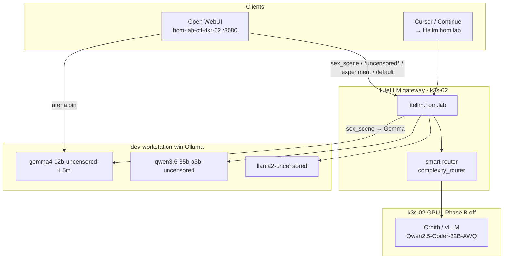
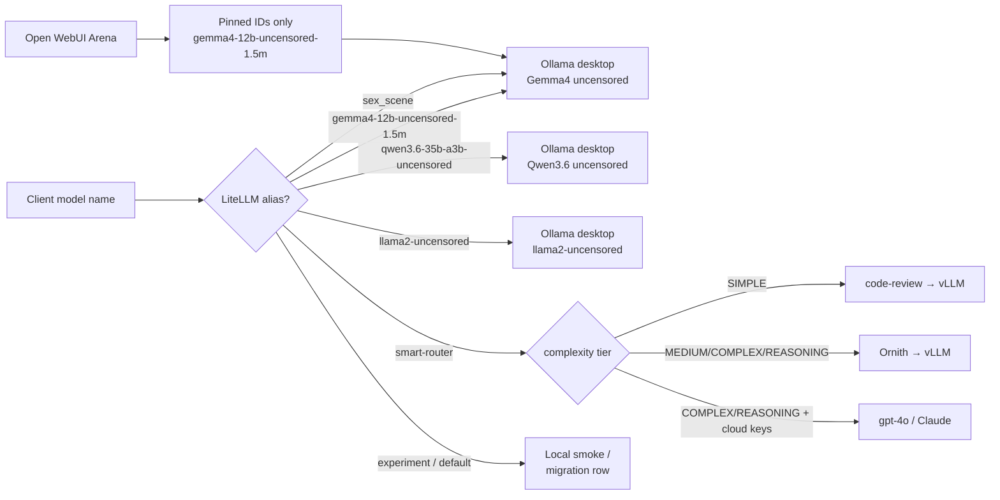
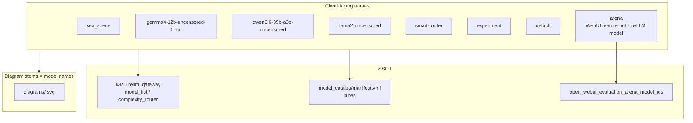

# Open WebUI / LiteLLM model route diagrams (ad-hoc)

## Summary

Doc-only packet that **documents how selected Open WebUI / LiteLLM model names
route** in this lab. Deliverable is one **create-diagrams** pack (`.py` + SVG +
PNG + DOT) per model, **filename stem = model name**, under `diagrams/`.

Triggered by operator screenshots of Open WebUI tags **`oi experiment`** and
**`oi default`**, plus explicit ask for: `sex_scene`, `arena`,
`llama2_uncensored` / every `*uncensored*` alias, and `smart-router`.

## Capability Packet Boundary

| Field | Value |
| --- | --- |
| Capability identifier | `open-webui-litellm-model-route-diagrams` |
| Owner manifest | This plan folder `README.md` + `diagrams/README.md` |
| Owned files | `docs/plans/2026-08-06--open-webui-litellm-model-route-diagrams-implemented/**` |
| Integration anchors | Links from `docs/reference/local-ai-chat-and-image-stack.md` (optional follow-up); does **not** change LiteLLM Helm values |
| Update behavior | Re-render Mingrammer scripts via `create-diagrams` docker helper; update alias table if inventory routes change |
| Removal behavior | Delete this plan folder; remove any optional links added to reference docs |

## Scope (in)

| Model / tag | Kind | Backend (lab SSOT) |
| --- | --- | --- |
| `sex_scene` | LiteLLM alias | Desktop Ollama `gemma4-12b-uncensored-1.5m` @ `ollama-desktop.hom.lab` |
| `arena` | Open WebUI evaluation arena | Pinned combatant: `gemma4-12b-uncensored-1.5m` (`hom-lab-ctl-dkr-02`) |
| `llama2-uncensored` | LiteLLM alias | Desktop Ollama `llama2-uncensored` |
| `gemma4-12b-uncensored-1.5m` | LiteLLM alias | Desktop Ollama Gemma4 uncensored |
| `qwen3.6-35b-a3b-uncensored` | LiteLLM alias | Desktop Ollama Qwen3.6 uncensored |
| `smart-router` | LiteLLM complexity auto-router | Tier → `code-review` / Ornith / optional cloud escalate |
| `experiment` | LiteLLM + OI tag | Smoke alias (shares primary local path per gateway README) |
| `default` | LiteLLM + OI tag | Migration / fallback alias row |

## Scope (out)

- No inventory / Helm / playbook mutations (doc-only).
- No ComfyUI / A1111 pixel paths (sibling diagram plans).
- No NetBox objects.

## Alias → surface matrix (evidence)

| Client-facing name | Open WebUI | LiteLLM | Upstream |
| --- | --- | --- | --- |
| `sex_scene` | Chat model pick | `model_name: sex_scene` | Ollama desktop Gemma4 uncensored |
| `gemma4-12b-uncensored-1.5m` | Chat (+ Arena pin) | same name | Ollama desktop |
| `qwen3.6-35b-a3b-uncensored` | Chat | same name | Ollama desktop |
| `llama2-uncensored` | Chat | same name | Ollama desktop |
| `arena` | Evaluations arena synthetic | N/A (WebUI feature) | Uses pinned model IDs |
| `smart-router` | Optional chat pick | `complexity_router` | Tiers → vLLM Ornith / code-review |
| `experiment` | OI tag / model list | alias `experiment` | Local smoke (see gateway README) |
| `default` | OI tag / model list | alias `default` | Migration fallback row |

Sources: `roles/k3s_litellm_gateway/defaults/main.yml`,
`tasks/build_helm_values.yml`, `inventory/host_vars/hom-lab-ctl-k3s-02.yaml`,
`inventory/host_vars/hom-lab-ctl-dkr-02.yaml`,
`inventory/group_vars/model_catalog/manifest.yml`.

## Apply / Verify / Undo / Change class

| | |
| --- | --- |
| **Apply** | Author/render pack SVGs under `diagrams/`; keep plan README inventory current |
| **Verify** | Every in-scope stem has `.py` + `.svg`; Diagram Inventory lists medium `pack-svg` |
| **Undo** | Delete this plan folder (no runtime change) |
| **Change class** | Doc-only / brainstorm plan packet |

## Checklist

- [x] Plan packet created (`scope: doc-only`)
- [x] Architecture / Capability Routing / Naming sections present
- [x] `diagrams/sex_scene.*`
- [x] `diagrams/arena.*`
- [x] `diagrams/llama2-uncensored.*`
- [x] `diagrams/gemma4-12b-uncensored-1.5m.*`
- [x] `diagrams/qwen3.6-35b-a3b-uncensored.*`
- [x] `diagrams/smart-router.*`
- [x] `diagrams/experiment.*`
- [x] `diagrams/default.*`
- [x] `diagrams/README.md` index

## Architecture/Structure Diagram

Repo / Ansible anchors (not mutated by this plan):

- `roles/k3s_litellm_gateway/`
- `playbooks/deploy_litellm_gateway.yaml`
- `roles/open_webui/` + `inventory/host_vars/hom-lab-ctl-dkr-02.yaml`
- `inventory/host_vars/hom-lab-ctl-k3s-02.yaml` (API bases for uncensored + sex_scene)
- `inventory/host_vars/dev-workstation-win.yaml` (Ollama model list)

## Capability Routing Diagram

## Naming/Modeling Diagram

**Naming rule for this packet:** filesystem stem equals the LiteLLM / OI model
string (hyphens preserved; `smart-router`, not `smart_router`). Arena uses stem
`arena` even though it is a WebUI feature, not a gateway model id.

## Diagram Inventory

| Diagram | Medium | Status |
| --- | --- | --- |
| Architecture/Structure (above) | `mermaid-fence` | in plan |
| Capability Routing (above) | `mermaid-fence` | in plan |
| Naming/Modeling (above) | `mermaid-fence` | in plan |
| `diagrams/sex_scene` | `pack-svg` | done |
| `diagrams/arena` | `pack-svg` | done |
| `diagrams/llama2-uncensored` | `pack-svg` | done |
| `diagrams/gemma4-12b-uncensored-1.5m` | `pack-svg` | done |
| `diagrams/qwen3.6-35b-a3b-uncensored` | `pack-svg` | done |
| `diagrams/smart-router` | `pack-svg` | done |
| `diagrams/experiment` | `pack-svg` | done |
| `diagrams/default` | `pack-svg` | done |

Optional later (not required for this slice): draw.io via `create-diagrams-drawio`;
combined “all uncensored lanes” overview pack-svg.

## Diagram gate receipt

| Gate | Result |
| --- | --- |
| Architecture/Structure present | pass (Mermaid) |
| Capability Routing present | pass (Mermaid; multi-path routing) |
| Naming/Modeling present | pass (Mermaid; alias SSOT) |
| Diagram Inventory final | pass (this section) |
| Medium recorded | `mermaid-fence` for plan gates; `pack-svg` for per-model deliverables |

## Assumptions / defaults

- Steady-state GPU: Phase B **off** (Ornith present) unless a diagram explicitly
  notes coaching-only desktop Ollama independence from GPU time-share.
- `sex_scene` coaching system text lives on studio share / glam assets; diagram
  shows chat route only (no pixel path).
- Screenshots `oi experiment` / `oi default` are Open WebUI model-list tags for
  LiteLLM aliases of the same names.

## On Deck — user decisions to integrate

| ID | User decision / direction | Target integration | Status |
| --- | --- | --- | --- |
| D1 | Diagram each of sex_scene, arena, llama2_uncensored, all *uncensored*, smart-router | Checklist + diagrams/ | integrated |
| D2 | Attached OI tags experiment + default | Include stems `experiment`, `default` | integrated |
| D3 | Ad-hoc plan under `docs/plans/` | This packet | integrated |

## Other Available Diagram Types

| Type | Include? |
| --- | --- |
| Sequence (Open WebUI → LiteLLM → Ollama) | Optional follow-up |
| Sequence (smart-router tier decision) | Covered lightly in smart-router pack-svg |
| NetBox / DNS | N/A (`netbox_scope: false`) |
| ComfyUI / A1111 | Out of scope — see sibling plans `2026-08-06--comfyui-lab-setup-diagrams-implemented` and `2026-08-06--automatic1111-lab-setup-diagrams-implemented` |

## Plan verification receipt

**Slice:** doc-only v1  
**Verified at:** 2026-08-06  
**Verifier:** agent run

### Obligation inventory

| ID | Source | Obligation | In slice scope? | Status | Evidence |
| --- | --- | --- | --- | --- | --- |
| O-01 | Checklist | Plan packet created (`scope: doc-only`) | yes | pass | Frontmatter `scope: doc-only` |
| O-02 | Checklist | Architecture / Capability Routing / Naming present | yes | pass | Mermaid sections in this README |
| O-03 | Checklist | `diagrams/sex_scene.*` | yes | pass | `.py` + `.svg` + `.png` present |
| O-04 | Checklist | `diagrams/arena.*` | yes | pass | `.py` + `.svg` + `.png` present |
| O-05 | Checklist | `diagrams/llama2-uncensored.*` | yes | pass | `.py` + `.svg` + `.png` present |
| O-06 | Checklist | `diagrams/gemma4-12b-uncensored-1.5m.*` | yes | pass | `.py` + `.svg` + `.png` present |
| O-07 | Checklist | `diagrams/qwen3.6-35b-a3b-uncensored.*` | yes | pass | `.py` + `.svg` + `.png` present |
| O-08 | Checklist | `diagrams/smart-router.*` | yes | pass | `.py` + `.svg` + `.png` present |
| O-09 | Checklist | `diagrams/experiment.*` | yes | pass | `.py` + `.svg` + `.png` present |
| O-10 | Checklist | `diagrams/default.*` | yes | pass | `.py` + `.svg` + `.png` present |
| O-11 | Checklist | `diagrams/README.md` index | yes | pass | Index lists all eight stems |
| O-12 | Apply | Author/render pack SVGs under `diagrams/` | yes | pass | Eight pack stems on disk |
| O-13 | Verify | Every in-scope stem has `.py` + `.svg`; inventory `pack-svg` | yes | pass | Shell verify `ALL_VERIFY_PASS`; Diagram Inventory |
| O-14 | Undo | Documented as delete plan folder | yes | pass | Change-class table Undo row |
| O-15 | Class | Doc-only / no Helm or runtime mutation | yes | pass | Scope (out) + `scope: doc-only` |
| O-16 | Diagram gate | Architecture + Routing + Naming + Inventory | yes | pass | `## Diagram gate receipt` all pass |
| O-17 | On Deck D1–D3 | User diagram asks integrated | yes | pass | On Deck table status `integrated` |
| O-18 | Alias matrix | Document alias → surface matrix from SSOT | yes | pass | `## Alias → surface matrix` + inventory sources |
| O-19 | Follow-on | Optional link from local-ai-chat stack doc | no | deferred | Optional integration anchor |
| O-20 | Follow-on | draw.io / combined uncensored overview | no | deferred | Explicitly optional in Diagram Inventory |

### Summary

- In-scope obligations: 18 — pass: 18, fail: 0, blocked: 0, pending: 0
- Deferred (explicit out-of-slice): 2

### Completion gate (all required for `lifecycle: implemented`)

- [x] Every **in-scope** obligation is `pass` or `n/a` with reason
- [x] Diagram gate receipt present and passing
- [x] No unresolved On Deck rows

