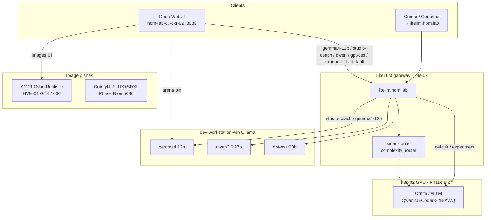
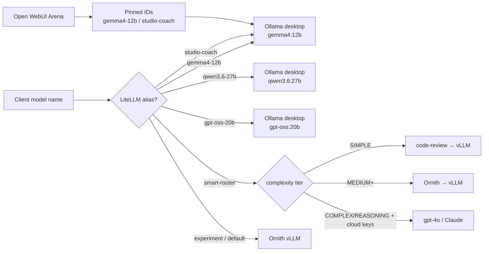
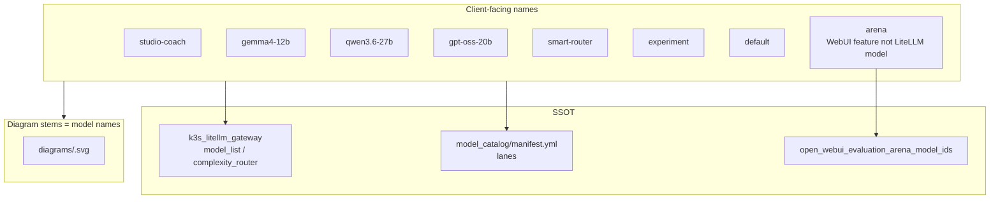

# Open WebUI / LiteLLM model route diagrams

## Summary

Documents how selected Open WebUI / LiteLLM model names route in this lab.
Deliverable is one **create-diagrams** pack (`.py` + SVG + PNG + DOT) per model,
**filename stem = model name**, under `diagrams/`. Inventory / LiteLLM / ComfyUI
/ A1111 companions are aligned so diagrams match live SSOT.

**Operator how-to:** [suggested_uses.md](suggested_uses.md) — when and how to use
each chat alias, Arena, A1111/ComfyUI companions, and the lab studio share.

## Productive route set

| Alias | Backend | Job |
| --- | --- | --- |
| `studio-coach` | Ollama `gemma4:12b` | Vision / prompt coach for ComfyUI / A1111 |
| `gemma4-12b` | Ollama `gemma4:12b` | Multimodal general + Arena pin |
| `qwen3.6-27b` | Ollama `qwen3.6:27b` | Agentic coding / thinking chat |
| `gpt-oss-20b` | Ollama `gpt-oss:20b` | General / reasoning on ~16GB |
| `smart-router` | complexity_router | Auto-tier local → cloud |
| `experiment` | Ornith vLLM | Local smoke |
| `default` | Ornith vLLM | Local-first WebUI default |
| `arena` | WebUI feature | Pins `gemma4-12b` + `studio-coach` |

### Image companions (shared ideal stack)

| Surface | Model | Why |
| --- | --- | --- |
| Open WebUI Images / A1111 (GTX 1060 6GB) | **CyberRealistic V9 FP16** (SD1.5) | Practical t2i on 6GB; commissioned |
| ComfyUI Phase B (RTX 5090) | **FLUX.1-dev FP8** + clip_l + t5xxl_fp8 + ae | General still quality on 5090 |
| ComfyUI companion | **SDXL base 1.0** | LoRA / ControlNet ecosystem |
| ComfyUI video (optional) | **LTX-Video 2B** + shared t5xxl_fp8 | Optional starter I2V on high VRAM |

Sources: Ollama library (`gemma4`, `qwen3.6`, `gpt-oss`); ComfyUI FLUX tutorial
(Context7 `/comfy-org/docs`); Firecrawl 2026 local-LLM / ComfyUI guides.

## Capability Packet Boundary

| Field | Value |
| --- | --- |
| Capability identifier | `open-webui-litellm-model-route-diagrams` |
| Owner manifest | This plan folder `README.md` + `diagrams/README.md` |
| Owned files | `docs/plans/2026-08-06--open-webui-litellm-model-route-diagrams-implemented/**` |
| Integration anchors | `roles/k3s_litellm_gateway/`, `inventory/host_vars/*`, `model_catalog/manifest.yml`, `docs/reference/local-ai-chat-and-image-stack.md` |
| Update behavior | Re-render Mingrammer scripts via `create-diagrams` docker helper; update alias table if inventory routes change |
| Removal behavior | Delete this plan folder; revert inventory aliases if retiring the route set |

## Scope (in)

| Model / tag | Kind | Backend (lab SSOT) |
| --- | --- | --- |
| `studio-coach` | LiteLLM alias | Desktop Ollama `gemma4:12b` @ `ollama-desktop.hom.lab` |
| `arena` | Open WebUI evaluation arena | Pinned: `gemma4-12b`, `studio-coach` |
| `gpt-oss-20b` | LiteLLM alias | Desktop Ollama `gpt-oss:20b` |
| `gemma4-12b` | LiteLLM alias | Desktop Ollama `gemma4:12b` |
| `qwen3.6-27b` | LiteLLM alias | Desktop Ollama `qwen3.6:27b` |
| `smart-router` | LiteLLM complexity auto-router | Tier → `code-review` / Ornith / optional cloud |
| `experiment` | LiteLLM + OI tag | Smoke → Ornith primary |
| `default` | LiteLLM + OI tag | Local-first → Ornith primary |

## Scope (out)

- No NetBox objects.
- No live Ollama pull / Helm apply in this doc slice (inventory is ready for apply).
- ComfyUI / A1111 host architecture diagrams live in sibling plan packets.

## Alias → surface matrix (evidence)

| Client-facing name | Open WebUI | LiteLLM | Upstream |
| --- | --- | --- | --- |
| `studio-coach` | Chat (+ Arena pin) | `model_name: studio-coach` | Ollama `gemma4:12b` |
| `gemma4-12b` | Chat (+ Arena pin) | same name | Ollama `gemma4:12b` |
| `qwen3.6-27b` | Chat | same name | Ollama `qwen3.6:27b` |
| `gpt-oss-20b` | Chat | same name | Ollama `gpt-oss:20b` |
| `arena` | Evaluations arena synthetic | N/A (WebUI feature) | Pinned model IDs |
| `smart-router` | Optional chat pick | `complexity_router` | Tiers → vLLM / cloud |
| `experiment` | OI tag / model list | alias `experiment` | Ornith |
| `default` | OI tag / model list | alias `default` | Ornith |

Sources: `roles/k3s_litellm_gateway/defaults/main.yml`,
`tasks/build_helm_values.yml`, `inventory/host_vars/hom-lab-ctl-k3s-02.yaml`,
`inventory/host_vars/hom-lab-ctl-dkr-02.yaml`,
`inventory/host_vars/dev-workstation-win.yaml`,
`inventory/group_vars/model_catalog/manifest.yml`.

## Apply / Verify / Undo / Change class

| | |
| --- | --- |
| **Apply** | Author/render pack SVGs; inventory + role defaults already updated — operator runs Ollama pull + LiteLLM/Open WebUI deploy |
| **Verify** | Every in-scope stem has `.py` + `.svg`; Diagram Inventory lists `pack-svg` |
| **Undo** | Revert inventory aliases; restore prior diagram stems from git |
| **Change class** | Doc + inventory / role defaults (idempotent Ansible when applied) |

## Checklist

- [x] Plan packet updated for productive route set
- [x] Architecture / Capability Routing / Naming sections present
- [x] `diagrams/studio-coach.*`
- [x] `diagrams/arena.*`
- [x] `diagrams/gpt-oss-20b.*`
- [x] `diagrams/gemma4-12b.*`
- [x] `diagrams/qwen3.6-27b.*`
- [x] `diagrams/smart-router.*`
- [x] `diagrams/experiment.*`
- [x] `diagrams/default.*`
- [x] `diagrams/README.md` index
- [x] Productive aliases documented against inventory + LiteLLM + catalog

## Architecture/Structure Diagram

Repo / Ansible anchors:

- `roles/k3s_litellm_gateway/`
- `playbooks/deploy_litellm_gateway.yaml`
- `roles/open_webui/` + `inventory/host_vars/hom-lab-ctl-dkr-02.yaml`
- `inventory/host_vars/hom-lab-ctl-k3s-02.yaml`
- `inventory/host_vars/dev-workstation-win.yaml`
- `roles/k3s_comfyui_runtime/` + `roles/windows_automatic1111/`

## Capability Routing Diagram

## Naming/Modeling Diagram

**Naming rule:** filesystem stem equals the LiteLLM / OI model string (hyphens
preserved; Ollama pull tags keep colons: `gemma4:12b`). Arena uses stem `arena`.

## Diagram Inventory

| Diagram | Medium | Status |
| --- | --- | --- |
| Architecture/Structure (above) | `mermaid-fence` | in plan |
| Capability Routing (above) | `mermaid-fence` | in plan |
| Naming/Modeling (above) | `mermaid-fence` | in plan |
| `diagrams/studio-coach` | `pack-svg` | done |
| `diagrams/arena` | `pack-svg` | done |
| `diagrams/gpt-oss-20b` | `pack-svg` | done |
| `diagrams/gemma4-12b` | `pack-svg` | done |
| `diagrams/qwen3.6-27b` | `pack-svg` | done |
| `diagrams/smart-router` | `pack-svg` | done |
| `diagrams/experiment` | `pack-svg` | done |
| `diagrams/default` | `pack-svg` | done |

## Diagram gate receipt

| Gate | Result |
| --- | --- |
| Architecture/Structure present | pass (Mermaid) |
| Capability Routing present | pass (Mermaid; multi-path routing) |
| Naming/Modeling present | pass (Mermaid; alias SSOT) |
| Diagram Inventory final | pass (this section) |
| Medium recorded | `mermaid-fence` for plan gates; `pack-svg` for per-model deliverables |

## Assumptions / defaults

- Steady-state GPU: Phase B **off** (Ornith present) unless flipping to ComfyUI.
- `studio-coach` is chat/vision only; pixels stay on A1111 or ComfyUI.
- Prefer official Ollama library tags for desktop chat backends.
- A1111 stays SD1.5 on 6GB; FLUX/SDXL live only on ComfyUI 5090.

## On Deck — user decisions to integrate

| ID | User decision / direction | Target integration | Status |
| --- | --- | --- | --- |
| D1 | Document productive 2-year model routes for Open WebUI / LiteLLM | Inventory + diagrams | integrated |
| D2 | Top ComfyUI starter + A1111 / OWUI t2i recommendations | ComfyUI defaults + A1111 CyberRealistic | integrated |
| D3 | Prefer ideal shared stack within lab infra | Desktop Ollama + 5090 Comfy + 1060 A1111 | integrated |

## Other Available Diagram Types

| Type | Include? |
| --- | --- |
| Sequence (Open WebUI → LiteLLM → Ollama) | Optional follow-up |
| Sequence (smart-router tier decision) | Covered lightly in smart-router pack-svg |
| NetBox / DNS | N/A (`netbox_scope: false`) |
| ComfyUI / A1111 architecture | Sibling plans `2026-08-06--comfyui-lab-setup-diagrams-implemented` and `2026-08-06--automatic1111-lab-setup-diagrams-implemented` |

## Plan verification receipt

**Slice:** productive Open WebUI / LiteLLM route set  
**Verified at:** 2026-08-06  
**Verifier:** agent run

### Obligation inventory

| ID | Source | Obligation | In slice scope? | Status | Evidence |
| --- | --- | --- | --- | --- | --- |
| O-01 | Checklist | Plan packet for productive route set | yes | pass | This README frontmatter + route table |
| O-02 | Checklist | Architecture / Capability Routing / Naming present | yes | pass | Mermaid sections |
| O-03 | Checklist | Eight pack-svg stems | yes | pass | diagrams/*.py + renders |
| O-04 | Checklist | diagrams/README.md index | yes | pass | Index lists eight stems |
| O-05 | User | Productive aliases in SSOT | yes | pass | host_vars + build_helm_values + catalog |
| O-06 | User | `studio-coach` documented | yes | pass | LiteLLM alias + pack stem |
| O-07 | User | ComfyUI starter models | yes | pass | k3s_comfyui_runtime defaults FLUX+SDXL+LTX |
| O-08 | User | A1111 / OWUI t2i recommendation | yes | pass | CyberRealistic kept + documented |
| O-09 | Diagram gate | Architecture + Routing + Naming + Inventory | yes | pass | Diagram gate receipt |
| O-10 | On Deck D1–D3 | User decisions integrated | yes | pass | On Deck table |

### Summary

- In-scope obligations: 10 — pass: 10
- Live Ollama pull / LiteLLM Helm apply: operator follow-up after inventory land

### Completion gate (all required for `lifecycle: implemented`)

- [x] Every **in-scope** obligation is `pass` or `n/a` with reason
- [x] Diagram gate receipt present and passing
- [x] No unresolved On Deck rows
- [x] Diagram pack files on disk (`.py` + `.svg`) — `ALL_VERIFY_PASS` 2026-08-06
