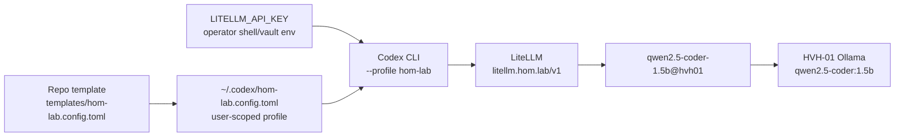
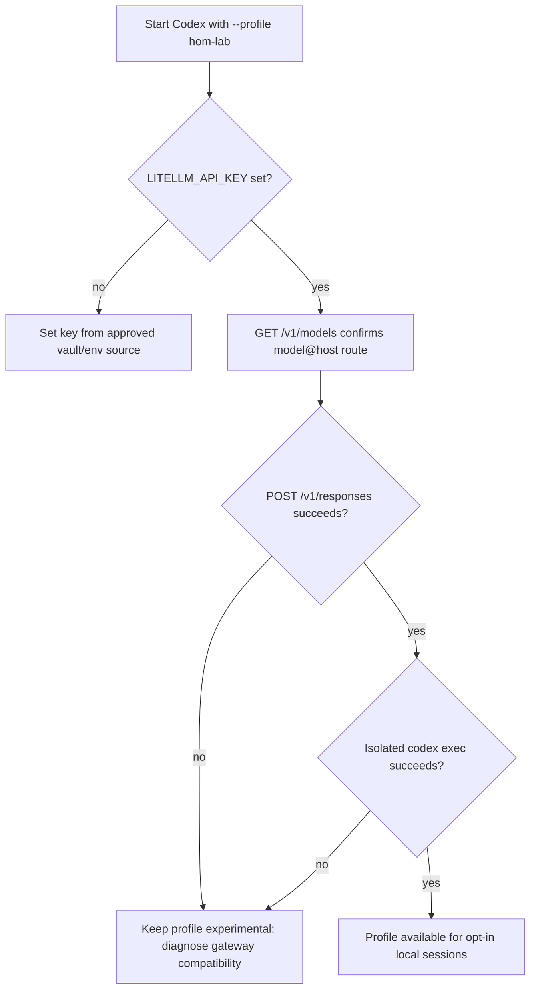
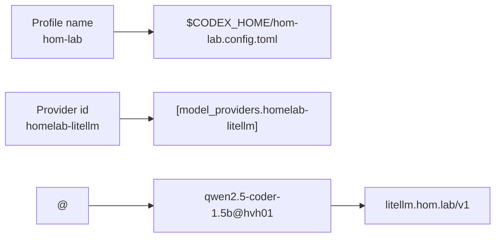

# Homelab local AI clients - Codex CLI

## Summary

Provide an opt-in, user-scoped Codex **custom model-provider profile** for the
homelab LiteLLM gateway. The profile is a template for
`~/.codex/hom-lab.config.toml`; it selects a published `model@host` route and
gets the gateway key from `LITELLM_API_KEY`. It does not replace the operator's
normal OpenAI-backed Codex configuration.

**Concurrent-work note:** Codex owns this packet and its `templates/` subtree;
do not let Cursor rewrite or delete those files while the sibling Cursor plan is
in progress.

**Current execution update (Codex-owned):** the bootstrap tables below are
superseded by the live [execution receipt](codex-execution-receipt.md),
[model research matrix](codex-model-research-matrix.md), and
[limitations and follow-up](limitations-and-follow-up.md). The limitations
record is the canonical place for incomplete, blocked, and deferred work; this
plan deliberately does not duplicate that operational detail. Codex has one
current large response/reasoning lane and no dependency on Cursor or other
IDE-client configuration.

## Research findings and terminology corrections

- A Codex profile is a separate `$CODEX_HOME/<name>.config.toml` overlay,
  selected with `codex --profile <name>` or `codex exec --profile <name>`.
  The legacy `[profiles.<name>]` table is not the current profile format.
- LiteLLM is a **custom model provider**, not an OSS provider. `--oss` and
  `oss_provider` are for Codex's built-in Ollama or LM Studio integration.
- Provider selection and provider definitions belong in user config or a
  user-scoped profile. Codex intentionally ignores these settings in a
  repository `.codex/config.toml`.
- The only supported custom-provider protocol is `responses`. This plan must
  prove the gateway's `/v1/responses` compatibility before treating the Codex
  profile as usable.
- The active LiteLLM naming contract is `<model-slug>@<host-slug>` only. The
  selected local smoke-test route is `qwen2.5-coder-1.5b@hvh01`; friendly
  suffixes such as `~code-fast` are retired and are not valid template values.

## Scope and dependency boundary

| Slice | Status | Owner |
| --- | --- | --- |
| Codex profile template and isolated CLI test | In scope | Codex |
| LiteLLM gateway and model-route publication | Existing dependency; read-only probe only | AI inference owners |
| Continue and OpenCode configuration | Out of scope; sibling plan | Cursor |
| Direct vLLM/Ollama endpoint configuration | Out of scope; bypasses gateway contract | AI inference owners |

## Capability Packet Boundary

| Field | Value |
| --- | --- |
| Capability identifier | `codex_cli_homelab_profile` |
| Owner manifest | No Ansible owner exists; template is an operator-installed Codex user profile |
| Owned files | This README; `templates/hom-lab.config.toml` |
| Integration anchors | `~/.codex/hom-lab.config.toml`; `LITELLM_API_KEY`; `roles/k3s_litellm_gateway/defaults/main/model_client_ids.yml` |
| Update behavior | Update the template only after the published LiteLLM routes and Codex configuration reference are re-verified |
| Removal behavior | Delete `~/.codex/hom-lab.config.toml`; unset the shell/session `LITELLM_API_KEY`; leave the normal Codex config unchanged |

## Operator installation and switch

1. Obtain the LiteLLM gateway key through the existing vault/env workflow; do
   not put it in the profile file or commit it.
2. Copy [`templates/hom-lab.config.toml`](templates/hom-lab.config.toml) to
   `~/.codex/hom-lab.config.toml`.
3. Export the key in the shell that starts Codex: `export LITELLM_API_KEY=...`.
4. Start a local-model session with:

```bash
codex --profile hom-lab
```

For a non-interactive smoke test:

```bash
codex exec --profile hom-lab --ephemeral 'Reply with exactly: homelab profile reachable'
```

## Model route selection

| Purpose | LiteLLM route | Status | Why |
| --- | --- | --- | --- |
| Codex profile smoke test | `qwen2.5-coder-1.5b@hvh01` | Selected | Only currently selected local coding route in the gateway contract; low-risk gateway proof |
| Larger coding model | `qwen2.5-coder-14b@k3s02-vllm` | Candidate | Published route, but Codex Responses compatibility and runtime suitability require a separate probe |
| Desktop agent model | `ministral-3-8b@desktop` | Candidate | Published route; no Codex-specific Responses evidence yet |

No model is selected for sustained autonomous coding until its `/v1/responses`
probe and Codex profile invocation both pass. This is intentionally stricter
than proving `/v1/chat/completions` compatibility.

## Apply / Verify / Undo

| | Contract |
| --- | --- |
| Apply | Copy the template to `~/.codex/hom-lab.config.toml` and export `LITELLM_API_KEY` in the launching shell |
| Verify | `GET /v1/models`, `POST /v1/responses`, then isolated `codex exec --profile hom-lab --ephemeral` against the selected route |
| Undo | Remove only `~/.codex/hom-lab.config.toml` and unset `LITELLM_API_KEY`; no gateway mutation occurs |
| Change class | Bootstrap/semi-manual user configuration; live tests are read-only model-inference requests |

## Checklist

- [x] Promote Codex handoff into a governed plan packet.
- [x] Verify Codex custom-provider/profile terminology using official OpenAI documentation.
- [x] Add a secret-free `hom-lab` profile template using the active `model@host` route contract.
- [ ] Probe the LiteLLM model catalog, Responses API, and isolated Codex CLI invocation; paste evidence below.
- [ ] Add an HRL implementation guide after the Responses compatibility result is stable.

## Architecture/Structure Diagram



## Capability Routing Diagram



## Naming/Modeling Diagram



## Plan verification receipt

**Slice:** profile template + gateway compatibility test
**Verified at:** 2026-09-01
**Verifier:** Codex agent run

### Obligation inventory

| ID | Source | Obligation | In slice scope? | Status | Evidence |
| --- | --- | --- | --- | --- |
| O-01 | Checklist | Promoted governed plan has all required diagrams and packet boundary. | yes | pass | This README: packet boundary, three Mermaid diagrams, and diagram gate receipt. |
| O-02 | Research findings | Use current custom-provider/profile terminology and avoid OSS terminology. | yes | pass | Official OpenAI configuration docs, 2026-09-01. |
| O-03 | Owned files | Secret-free template selects a current `model@host` route. | yes | pass | `templates/hom-lab.config.toml`; route source in `roles/k3s_litellm_gateway/defaults/main/model_client_ids.yml`. |
| O-04 | Verify contract | Gateway model and Responses probes pass. | yes | pending | Live probe follows template creation. |
| O-05 | Verify contract | Isolated `codex exec --profile hom-lab` passes. | yes | pending | Live probe follows template creation. |
| O-06 | Handoff | HRL guide exists after configuration stability is proven. | yes | pending | Deferred until O-04 and O-05 show a stable compatible path. |
| O-07 | Sibling dependency | Cursor-owned Continue/OpenCode work remains untouched. | no | n/a | No Cursor-owned file is edited by this slice. |

### Summary

- In-scope obligations: 6 - pass: 3, fail: 0, blocked: 0, pending: 3.
- Deferred (explicitly out-of-slice): 1.

### Completion gate

- [ ] Every in-scope obligation is `pass` or `n/a` with evidence.
- [ ] Change-contract Verify is demonstrated with captured output.
- [x] No in-scope obligation was skipped because it was absent from the checklist.
- [x] User decisions are integrated below; no unresolved on-deck item remains.
- [x] Candidate models remain labeled until live evidence supports selection.

## On Deck - user decisions to integrate

| ID | User decision / direction | Target integration | Status |
| --- | --- | --- |
| OD-01 | Use Context7 for Codex local-model research when available; otherwise use the Codex documentation source. | Research findings and source record. | Integrated: Context7 validated vLLM Codex/tool/parser and GPU-memory behavior; sources are recorded in the research matrix. |
| OD-02 | Test against `litellm.hom.lab`. | O-04/O-05 live-probe receipt rows. | Integrated: Responses and Codex CLI tests passed historically; revalidation is pending after the current vLLM rollout recovers. |
| OD-03 | Preserve concurrent Cursor work with concise coordination notes. | Packet and template ownership notes. | Integrated. |
| OD-04 | Keep Codex's three terminal selections independent, not as fallback/model groups, and separate from other IDE-client configuration. | Profiles, execution receipt, and model matrix. | Integrated. |
| OD-05 | Research different, hardware-appropriate model options and give realistic per-terminal work examples. | `codex-model-research-matrix.md`. | Integrated; no new model is selected or downloaded until the required CLI tool-loop proof passes. |
| OD-06 | Investigate the 5090 free-memory observation and resolve the live blocker. | Execution receipt and vLLM recovery verification. | Integrated: low free VRAM is normal vLLM reservation; active blocker was DiskPressure and stale 14B cache cleanup reclaimed 14 GiB. |

## Diagram gate receipt

- [x] Architecture/Structure: repo template, user profile, secret source, CLI, gateway, route, and backend shown.
- [x] Capability Routing: key, catalog, Responses, and Codex test branches shown.
- [x] Naming/Modeling: profile, provider, and `model@host` route naming shown.
- [x] Diagram Inventory lists every required section.

## Diagram Inventory

| Diagram | Medium | Location |
| --- | --- | --- |
| Architecture/Structure | Mermaid fence | This README |
| Capability Routing | Mermaid fence | This README |
| Naming/Modeling | Mermaid fence | This README |
| Sequence or deployment diagram | Not included | No managed host deployment is in this user-profile slice |
