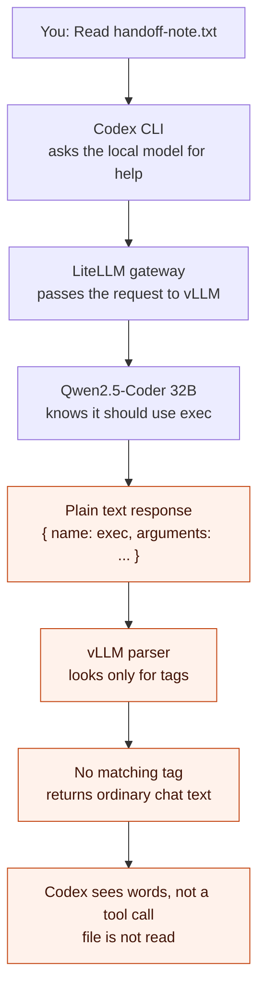
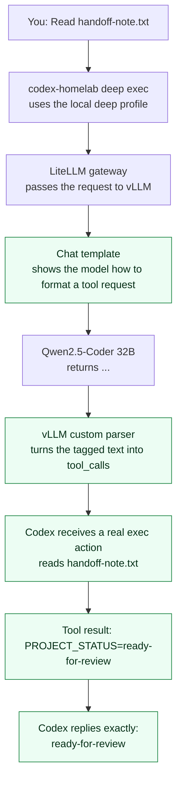

<!-- Concurrent-work note: Codex owns this local-model visual; Cursor should not rewrite it. -->

# Why Codex Could Chat But Not Read A File

This visual explains one narrow problem in plain language: the `deep` local
Codex profile could answer questions, but it could not reliably use its shell
tool. A **tool call** is the structured request that lets an AI ask Codex to
run a real command such as reading a file.

## Before: The Request Looked Like Text, Not An Action

**What this meant:** the model had the right idea, but the serving layer could
not recognize the idea as an executable action. Codex therefore had nothing it
could safely run. The visible raw JSON was a symptom of that broken handoff,
not a command that had actually run.

## After: The Request Becomes A Real Tool Call

**What changed:** the parser and the template are a matched pair. The template
tells the model to use a recognizable envelope; the parser turns that envelope
into a structured tool call; Codex executes the call and sends the real result
back to the model. A local Codex profile must remain loaded during `exec`;
`--ignore-user-config` would suppress the custom provider and silently use the
cloud default instead.

## Proof In One Line

The historic end-to-end fixture created a temporary teammate file containing
`PROJECT_STATUS=ready-for-review`. Its former pass is not current local-model
evidence because the old launcher used `--ignore-user-config`, which selected
the cloud default instead of the named profile.

## Important Boundary

This visual describes the serving-layer repair, but it is not proof of a
current local Codex shell-tool pass. See
[limitations and follow-up](limitations-and-follow-up.md) for the authoritative
remaining-work record.
