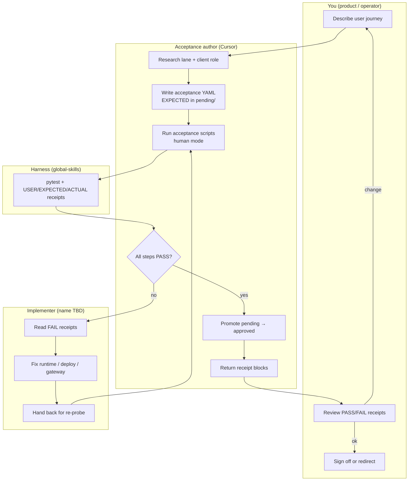

# ATDD developer flow — you · acceptance author · implementer

One-page view of how homelab **model-lane acceptance** work moves between roles.
Pattern: **ATDD** — write EXPECTED behavior first, implement until receipts are green.

**Artifacts:** [`model-lane-acceptance/`](../../../../../model-lane-acceptance/README.md) (specs) · global-skills harness (pytest + receipts)

> **Implementer** is a working role name (often Codex today). A more precise label is **TBD** and may change (*runtime engineer*, *deploy agent*, *stack implementer*).

## Flow



## Roles (one line each)

| Role | Does |
| --- | --- |
| **You** | States journeys in user terms; accepts or redirects from receipts |
| **Acceptance author** | Maps journeys → YAML criteria; runs probes; promotes when green |
| **Implementer** | Changes stack from FAIL evidence (Ansible, vLLM, LiteLLM, profiles) |
| **Harness** | Agnostic pytest — prints every PASS and FAIL receipt |

## Eight-step loop (typical journey)

| # | Who | Output |
| --- | --- | --- |
| 1 | You | Journey intent |
| 2 | Acceptance author | `client-map.yml`, `lane-decisions.md` |
| 3 | Acceptance author | `gateway/pending/` or `codex/pending/` YAML |
| 4 | Acceptance author | Human receipts (all steps) |
| 5 | Implementer | Stack fix from EXPECTED vs ACTUAL |
| 6 | Acceptance author | Re-run until PASS |
| 7 | Acceptance author | `manifest.yml` / `profiles-approved.yml` |
| 8 | You | Stable sign-off |

## Handoff rules

- **To implementer:** FAIL receipt blocks + manifest path — not “tests failed.”
- **To you:** Every PASS/FAIL block first; summary last.
- **Never** promote `pending/` while tool or `final-answer` steps still FAIL.
- **Never** weaken EXPECTED to force green — fix model, runtime, or manifest.

## Run commands

```bash
./model-lane-acceptance/scripts/run-gateway-acceptance.sh -v -s
./model-lane-acceptance/scripts/run-codex-acceptance.sh pending/tool-loop.yml -v -s
```
