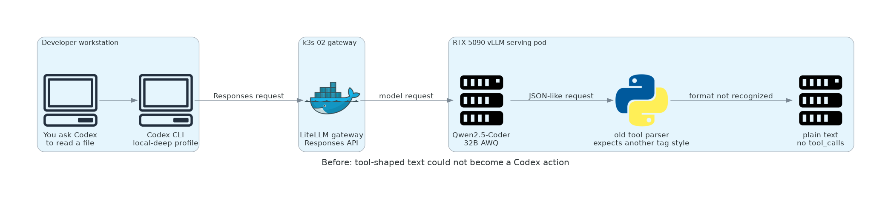
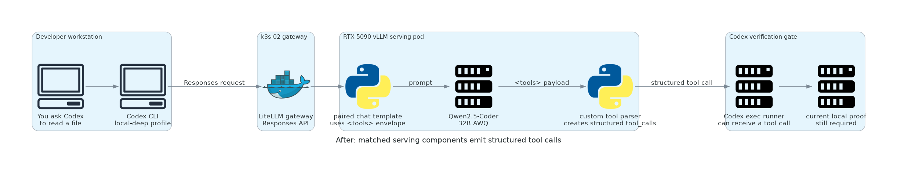

<!-- Concurrent-work note: Codex owns this infrastructure explanation and its generated diagrams; Cursor should preserve them. -->

# Serving Layer Before And After

This is the infrastructure version of the earlier plain-language visual. The
**serving layer** is the software between Codex and the loaded model: LiteLLM
receives Codex's request, and vLLM formats the prompt, runs the model, and
interprets a model-requested tool call.

## Before: The Model Spoke, But The Serving Layer Did Not Understand



Codex could reach the local model through LiteLLM. The model even attempted to
describe an `exec` request, but the old vLLM parser expected a different tool
format. It therefore returned ordinary chat text. Codex only executes a
structured `tool_calls` response, so it safely stopped instead of running the
unrecognized text as a command.

## After: Two Matched Components Make A Tool Loop Possible



The repair changed the **vLLM serving configuration**, not the model weights
and not LiteLLM. The role now mounts a paired chat template and custom parser
into the vLLM pod. The template teaches the model to emit a `<tools>` envelope;
the parser recognizes that envelope and publishes a structured `tool_calls`
response. Codex is then able to receive a structured tool call. A current
local CLI run must still prove that it executes the command, receives the real
result, and bases its final answer on that result.

## What Stayed The Same

- Codex still uses its `local-deep` profile and calls LiteLLM's Responses API.
- LiteLLM remains the gateway; it was not replaced or bypassed.
- `Qwen2.5-Coder 32B AWQ` remains the model in the illustrated deep lane.
- The local shell remains under Codex's normal approval and sandbox controls.

## What Changed In Source

- The vLLM role creates a ConfigMap containing both the custom parser and the
  matching template: [present.yml](../../../roles/k3s_vllm_runtime/tasks/present.yml).
- The role starts vLLM with both `--tool-parser-plugin` and `--chat-template`:
  [present.yml](../../../roles/k3s_vllm_runtime/tasks/present.yml).
- The parser recognizes `<tools>...</tools>` JSON payloads:
  [qwen2_5_coder_tool_parser.py](../../../roles/k3s_vllm_runtime/files/qwen2_5_coder_tool_parser.py).
- The launcher keeps the selected profile loaded during `codex exec`; using
  `--ignore-user-config` would suppress the custom local provider:
  [codex_homelab.sh](scripts/codex_homelab.sh).

## Evidence Boundary

The paired vLLM template and parser passed direct gateway tool-call validation.
This diagram does **not** claim a current local Codex file-read pass: the older
launcher used `--ignore-user-config`, which selected the cloud default during
the historic fixture. The current local-shell-tool boundary is recorded in
[limitations and follow-up](limitations-and-follow-up.md).

## Re-render

```bash
/Users/joshc/.codex/skills/create-diagrams/scripts/render_with_docker.sh \
  docs/plans/2026-09-01--homelab-local-ai-clients-codex/serving_layer_before_after.py \
  docs/plans/2026-09-01--homelab-local-ai-clients-codex
```
