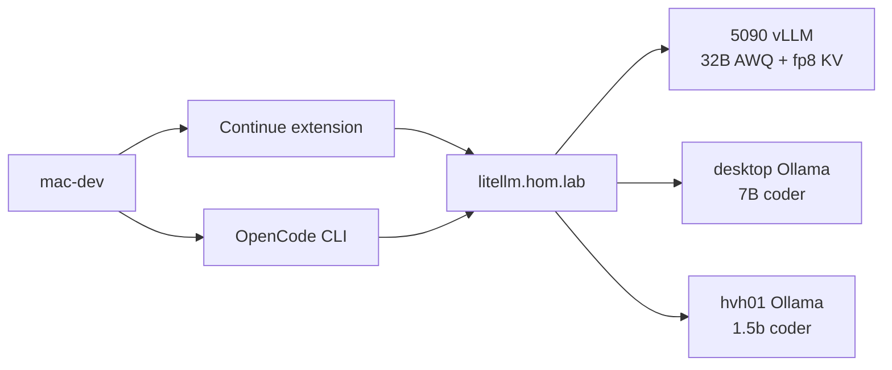

# Homelab local AI clients — Continue + OpenCode (Cursor)

## Summary

Configure **Continue** (`~/.continue/config.yaml`) and **OpenCode**
(`~/.config/opencode/opencode.jsonc`) on `mac-dev` to use homelab LiteLLM routes
(`model@host` only). **5090 primary lane restored to 32B AWQ** with vLLM memory
tuning that preserves full 32k context.

**Sibling (Codex):** [Codex CLI homelab profile](../2026-09-01--homelab-local-ai-clients-codex/README.md)

## Capability Packet Boundary

| Field | Value |
| --- | --- |
| Capability | `continue_ide` + `opencode_cli` |
| Owner roles | `roles/continue_ide`, `roles/opencode_cli` |
| Playbooks | `deploy_continue_ide.yaml`, `deploy_opencode_cli.yaml`, `validate_homelab_local_clients_probes.yaml` |
| Integration | `deploy_development_nodes.yaml` tags `continue_ide`, `opencode_cli` |

## Model lanes (Continue + OpenCode) — 2026-09-02

| Role | `model@host` | GPU | Continue roles | OpenCode |
| --- | --- | --- | --- | --- |
| Quality chat | `qwen2.5-coder-32b@k3s02-vllm` | 5090 vLLM 32B AWQ + fp8 KV | chat | **not listed** (tool_calls broken) |
| Edit / apply / agent | `qwen2.5-coder-7b@desktop` | RX 9060 XT Ollama | edit, apply | **default** + agent probe |
| Fast / autocomplete | `qwen2.5-coder-1.5b@hvh01` | GTX 1060 Ollama | autocomplete | small tasks |

Context limits: `contextLength` / `limit.context` **32768**; output **4096**.

## 5090 model research (Context7 + live probes)

### Why 14B was wrong

| Misconception | Evidence |
| --- | --- |
| "14B only uses half the GPU" | **Wrong for VRAM.** 14B AWQ @ 32k already used **29096 / 32607 MiB (~89%)** — KV cache for 32k context dominates, not parameter count alone. |
| "32B cannot fit" | Prior failure was **K3s disk-pressure evictions** and **apiserver 503 during cluster restart**, not confirmed GPU OOM. |

### Why 32B AWQ fits at full 32k (without trimming context)

| Component | vLLM knob | Value | Source |
| --- | --- | --- | --- |
| Weight memory | AWQ 4-bit | ~19.75 GiB consumed | vLLM startup log 2026-09-02 |
| KV cache | `--kv-cache-dtype fp8` | ~8.09 GiB in use | Halves KV bytes vs bf16 **without lowering `--max-model-len`** |
| KV budget | `--gpu-memory-utilization` | `0.92` | vLLM profiles weights+activations, allocates remainder to KV pool |
| Concurrency cap | `--max-num-seqs` | `4` | Limits peak KV without context trim |
| Context ceiling | `--max-model-len` | `32768` | Unchanged |

**Selected weights:** `Qwen/Qwen2.5-Coder-32B-Instruct-AWQ` (catalog `code-review` lane; role default).

**GPU-P slice:** Pod and host both report **32607 MiB total** — full 5090 exposed, not a fractional slice mismatch.

**Live utilization after load:** **30011 / 32607 MiB (~92%)** with 32B @ 32k.

HRL note: `homelab-reference-library/notes/investigations/2026-09-02--5090-vllm-32b-awq-memory-sizing.md`

### Rejected / deferred

| Item | Status |
| --- | --- |
| `qwen2.5-coder-14b@k3s02-vllm` | **Rejected** — undersized for primary 5090 lane |
| `Qwen3-Coder-*` on vLLM | `pending_research` — native tool parser not validated |
| OpenCode on 32B vLLM | **Blocked** — Qwen2.5 tool format in `content`, not `tool_calls` |

## Architecture



## Verification receipt (2026-09-02)

### Infrastructure stability (post-correction wait)

Two consecutive stable checks @ 90s interval before resume:

| Check | Disk pressure | GPU total | GPU used | vLLM | LiteLLM |
| --- | --- | --- | --- | --- | --- |
| T+0 | Cleared | 32607 MiB | 20270 MiB | Running | Running |
| T+90s | Cleared | 32607 MiB | 20270 MiB | Running | 1/1 |

After 32B full load: **30011 / 32607 MiB** used.

### Gateway smoke (32B chat)

```text
POST /v1/chat/completions  model=qwen2.5-coder-32b@k3s02-vllm
→ HTTP 200  reply="OK"
```

### Extension-faithful CLI probes — **12/12 pass**

`playbooks/validate_homelab_local_clients_probes.yaml`:

| Probe | Simulates | Result |
| --- | --- | --- |
| `continue_gateway_get_apibase` | Continue `GET {apiBase}` | pass |
| `continue_chat_simulation` | Chat Q&A on **32B** | pass |
| `continue_edit_simulation` | Edit template (7B desktop) | pass |
| `continue_apply_simulation` | Apply template | pass |
| `continue_autocomplete_fim` | FIM `/v1/completions` | pass |
| `continue_edit_stream` | Streaming edit | pass |
| `continue_context_budget` | ~4841 prompt tokens @ 32k window | pass |
| `continue_config_deployed` | config.yaml shape 8/8 | pass |
| `opencode_run_*` 7B + 1.5B | `opencode run` agent | pass |
| `opencode_32b_chat_only_lane` | 32B agent skipped (known limitation) | pass |

## Incomplete / out of scope (honest gaps)

**Beta gate:** Do not promote past `maturity: beta` until **Kilo evaluation** completes
(32B vLLM agent/tool_calls, `kilo.jsonc`, `validate_kilo_litellm_probes.yaml`,
operator reload + interactive agent smoke).

- [ ] **Kilo Code on 5090 vLLM** — evaluate before stable promotion (primary blocker)
- [ ] **Codex CLI homelab profile** — sibling plan `2026-09-01--homelab-local-ai-clients-codex`
- [ ] **Qwen3-Coder on 5090** — on-deck; not researched or probed
- [ ] **K3s disk-pressure resilience** — ephemeral-storage evictions interrupted vLLM during infra correction; monitor `/` usage on k3s-02
- [ ] **LiteLLM Helm lock** — concurrent upgrade required manual wait during correction window
- [ ] **Duplicate host_vars keys** on `hom-lab-ctl-k3s-02.yaml` (`kilo_fast_chat_*`) — cleanup warning, non-blocking

## Checklist

- [x] Promote brainstorm → this plan packet
- [x] Context7 research (Continue, OpenCode, **vLLM memory sizing**)
- [x] Replace 14B with researched **32B AWQ + fp8 KV** on 5090
- [x] Update `continue_ide` + `opencode_cli` roles + inventory
- [x] Validation playbook + live probes (12/12)
- [x] HRL investigation note for 5090 sizing
- [ ] Operator: reload Continue in Cursor after config deploy

## Apply / Verify / Undo

| | |
| --- | --- |
| **Apply** | `ansible-playbook playbooks/deploy_vllm_runtime.yaml playbooks/deploy_litellm_gateway.yaml --limit hom-lab-ctl-k3s-02` then `deploy_continue_ide.yaml deploy_opencode_cli.yaml --limit mac-dev` |
| **Verify** | `ansible-playbook playbooks/validate_homelab_local_clients_probes.yaml` |
| **Undo** | Revert host_vars 32B block; redeploy vLLM + gateway; or `-e continue_ide_state=absent` |
| **Change class** | Idempotent config; vLLM model swap is rolling Recreate |

## Diagram Inventory

| Diagram | Medium | Location |
| --- | --- | --- |
| Architecture / routing | Mermaid | this README |
| Naming / model lanes | table | this README |
| Memory budget | table | this README + HRL note |

## On Deck — user decisions to integrate

- [x] OpenCode (opencode.ai) confirmed — not OpenClaw
- [x] Plan suffix `cursor-kilo` / `codex` approved
- [x] **Reject 14B as 5090 primary** — replaced with 32B AWQ + fp8 KV (2026-09-02)
- [ ] 5090 v2 coder model (Qwen3-Coder) — future slice after research matrix

## Sources checked

- Context7 `/websites/vllm_ai_en_stable` — gpu-memory-utilization, kv-cache-dtype fp8, memory profiling
- `docs/brainstorming_designs/draft_vllm_considerations.md`
- Live `nvidia-smi` + vLLM startup logs on `hom-lab-ctl-k3s-02` (2026-09-02)
- `inventory/group_vars/model_catalog/manifest.yml` (code-review → 32B AWQ)
- `scripts/validate_continue_extension_cli_probes.py` probe output
