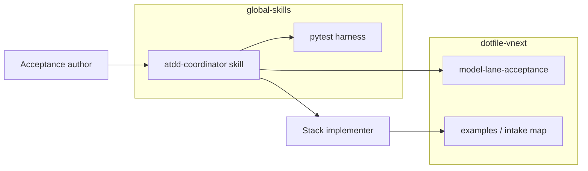

# Homelab model-lane ATDD coordination

## Summary

Bootstrap a **two-role ATDD workflow** for qualifying homelab model lanes after a
**stack implementer** campaign (deploy clients, wire models, publish routes):

| Role | Responsibility |
| --- | --- |
| **Acceptance author** | Write EXPECTED criteria, run probes, receipts, promote when green |
| **Stack implementer** | Deploy/runtime/gateway/client config from FAIL evidence — **agent varies by campaign** |

**This plan packet is prep complete.** Execute from **[execution-plan.md](execution-plan.md)** —
the durable runbook if this thread is lost. Execution creates the global skill
`homelab-model-lane-atdd-coordinator` (handoffs, stack-implementer templates, coordinator workflow).

**Stack implementer is not fixed to Codex.** The sibling [Codex CLI plan](../2026-09-01--homelab-local-ai-clients-codex/README.md)
is the **current in-progress example**. Future campaigns may target other CLIs, IDE
extensions, or Ansible-only deploys; models and client groups change.

## Capability Packet Boundary

| Field | Value |
| --- | --- |
| Capability identifier | `homelab_model_lane_atdd_coordination` |
| Owner manifest | Global skill (to be created) + `model-lane-acceptance/` |
| Owned files | This plan packet; global-skills coordinator skill (execute phase) |
| Integration anchors | `model-lane-acceptance/`; `homelab-litellm-model-lane-pytest` |
| Update behavior | Extend coordinator skill references; do not fork pytest harness |
| Removal behavior | Remove skill; retain acceptance YAML as project truth |

## Apply / Verify / Undo / Change class

| | |
| --- | --- |
| **Apply** | Create `homelab-model-lane-atdd-coordinator` in global-skills |
| **Verify** | Dry-run coordinator against [example client-model map](examples/stack-implementer-intake-client-model-map.example.md) |
| **Undo** | Remove skill from catalog |
| **Change class** | Bootstrap process + skill scaffolding |

## Architecture

[diagrams/atdd-developer-flow.md](diagrams/atdd-developer-flow.md)

## Entry paths

| Situation | Start |
| --- | --- |
| **Cold conversation** | Skill `homelab-model-lane-atdd-coordinator` + path to stack-implementer intake map |
| **Mid-plan interrupt** | Coordinator skill mid-plan mode + [stack implementer intake request](references/stack-implementer-intake-request.md) |

## Stack implementer intake (before acceptance author)

Stack implementer produces a **client/model map** (configuration truth, not approval).
See [example](examples/stack-implementer-intake-client-model-map.example.md) and
[request template](references/stack-implementer-intake-request.md).

## Example in-progress stack implementer plan

[`2026-09-01--homelab-local-ai-clients-codex`](../2026-09-01--homelab-local-ai-clients-codex/README.md)

## Checklist — execute

**Authoritative steps:** [execution-plan.md](execution-plan.md) (Phase 1–3, obligation IDs O-01–O-07).

### Phase 1 — Global skill (`global-skills`)

- [ ] Create `skills/validation/homelab-model-lane-atdd-coordinator/SKILL.md`
- [ ] Add `references/coordinator-checklist.md` (8-step loop)
- [ ] Add `references/stack-implementer-handoff-template.md` (inbox/outbox markdown templates)
- [ ] Add `references/stack-implementer-instructions.md` (static role contract)
- [ ] Copy/adapt [stack-implementer-intake-request.md](references/stack-implementer-intake-request.md) into skill references
- [ ] Add `agents/openai.yaml` — human receipts; inbox on FAIL
- [ ] Register in `skills/catalog.yaml`
- [ ] Link from `homelab-local-ai-client-validation-pack`

### Phase 2 — Verify

- [ ] Skill loads diagram + `model-lane-acceptance/` paths via `PROJECT_ROOT`
- [ ] Diff example map → `client-map.yml` documented in skill
- [ ] Metadata validation passes
- [ ] No live multi-agent run required for plan sign-off

## Deferred

Multi-day / multi-group result layout — see [references/acceptance-artifacts-layout.md](references/acceptance-artifacts-layout.md).

## Diagram Inventory

| Diagram | Medium | Path |
| --- | --- | --- |
| ATDD developer flow | Mermaid | [diagrams/atdd-developer-flow.md](diagrams/atdd-developer-flow.md) |
| Plan structure | Mermaid | this README |

## References

- **[Execution plan (runbook)](execution-plan.md)**
- [Acceptance artifacts layout](references/acceptance-artifacts-layout.md)
- [Stack implementer intake request](references/stack-implementer-intake-request.md)
- [Stack implementer instructions](references/stack-implementer-instructions.md)
- [Stack implementer handoff template](references/stack-implementer-handoff-template.md)
- [Example client-model map](examples/stack-implementer-intake-client-model-map.example.md)
- [model-lane-acceptance/](../../../model-lane-acceptance/README.md)
- HRL: `homelab-reference-library/implementation-guides/pytest/user-journey-receipt-tests.md`
