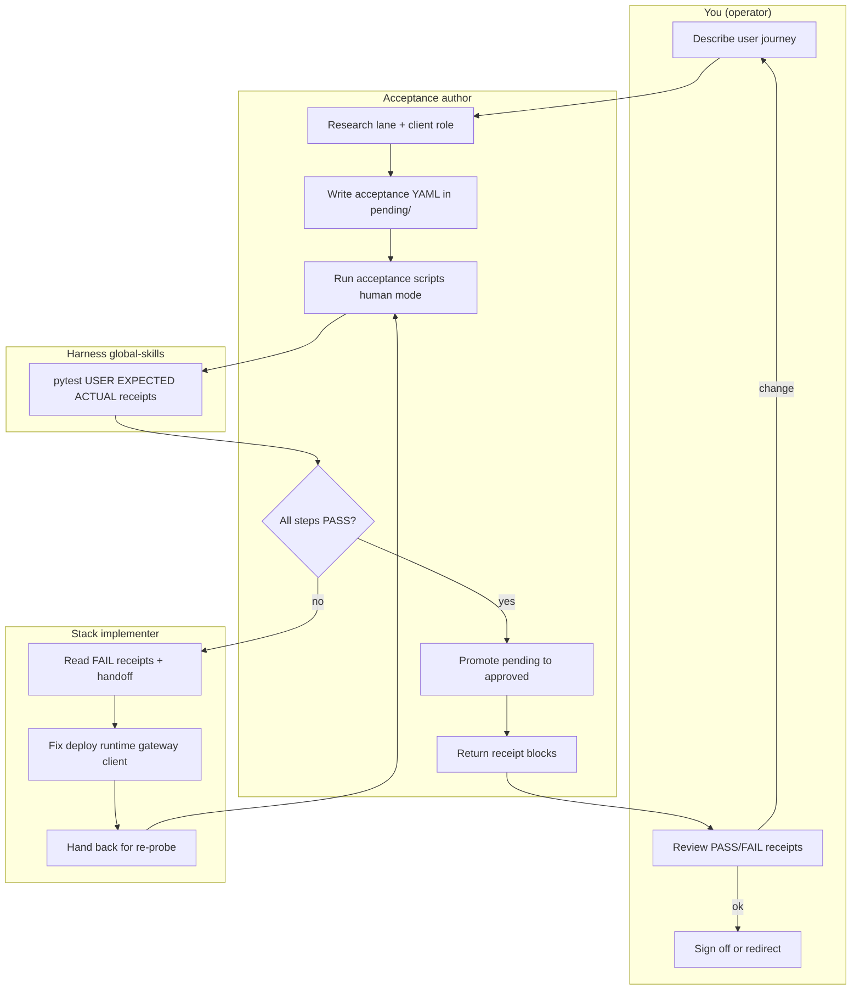

# ATDD developer flow — you · acceptance author · stack implementer

One-page view of homelab **model-lane acceptance** coordination.
Pattern: **ATDD** — EXPECTED first, implement until receipts are green.

**Artifacts:** [`model-lane-acceptance/`](../../../../model-lane-acceptance/README.md) · global-skills pytest harness

> **Stack implementer** is a **role**, not a fixed agent. Codex CLI is one current
> example. Clients (Continue, Kilo, OpenCode, terminal CLIs) and model cohorts
> **change per campaign**.

## Flow



## Eight-step loop

| # | Who | Output |
| --- | --- | --- |
| 1 | You | Journey intent |
| 2 | Acceptance author | `client-map.yml`, lane decisions |
| 3 | Acceptance author | pending acceptance YAML |
| 4 | Acceptance author | Human receipts |
| 5 | Stack implementer | Stack fix from EXPECTED vs ACTUAL |
| 6 | Acceptance author | Re-run until PASS |
| 7 | Acceptance author | Approved manifests |
| 8 | You | Sign-off |

## Handoff rules

- To stack implementer: FAIL receipt blocks + manifest path ([template](../references/stack-implementer-handoff-template.md))
- To you: every PASS/FAIL block before any summary
- Never promote pending while steps still FAIL
- Never weaken EXPECTED to force green

## Run

```bash
./model-lane-acceptance/scripts/run-gateway-acceptance.sh -v -s
./model-lane-acceptance/scripts/run-codex-acceptance.sh pending/tool-loop.yml -v -s
```
