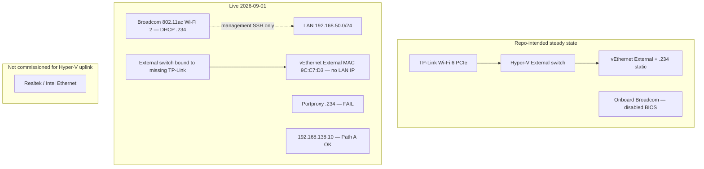

# HVH-01 network uplink — current state and adapter history (draft)

## Summary

Capture **what adapter HVH-01 used when things were working**, what the repo
**intends** today, and what is **live right now** (2026-09-01 probes from
`mac-dev`). This packet is a **state receipt** — not an execution plan. It
informs BIOS/TP-Link recovery, static-IP work, and Path A vs Path B storage
decisions without requiring repo changes to proceed.

**Headline:** Repo-intended steady state is **Wi‑Fi only** (TP-Link PCIe for
Hyper-V External @ `.234`, onboard disabled). **Ethernet was never the modeled
Hyper-V uplink.** Live state diverged: **TP-Link is not operational**, **onboard
Broadcom carries `.234`**, External switch binding is **stale**, and **Path B
portproxy on `.234` is down** while **Path A guest direct (`192.168.138.10`)
still works**.

**2026-09-01 update:** [findings.md](findings.md) § *Update note* and § *Physical
host — storage and memory* now record **only probed/inventory facts** for the
storage-lane role. Do not assert HVH-01 has more RAM or storage than HVH-02.
System RAM total is **not yet in repo evidence**. Host is **offline now** — later
probes blocked until it is back.

Detailed evidence: [findings.md](findings.md).

## Capability Packet Boundary

| Field | Value |
| --- | --- |
| Capability identifier | `hvh01_network_uplink_state_receipt` |
| Owner manifest | None — documentation packet only |
| Owned files | This folder (`README.md`, `findings.md`) |
| Integration anchors | `inventory/host_vars/hom-lab-hvh-01.yaml`, `inventory/hosts_mapping.yaml`, `inventory/group_vars/all/homelab_router_gt6.yml`, `roles/hyperv_networking`, Flint/static-IP brainstorm packet |
| Update behavior | Refresh `findings.md` after each live probe or hardware change |
| Removal behavior | Archive folder when superseded by an implemented remediation plan |

## Prior state — when things were running (repo evidence)

| Era | Uplink | LAN IP | Evidence |
| --- | --- | --- | --- |
| Legacy hostname | Onboard Wi‑Fi (`AI-NET-SERVER`) | `192.168.50.233` | MAC `9C:C7:D3:10:68:5A`; GT6 stale row; `hosts_mapping` `ip_address_original` |
| Commissioned storage lane | **TP-Link Wi‑Fi 6 PCIe** on Hyper-V External | `192.168.50.234` | `hyperv_config.adapter_interface_description`; Jun 2026 preview showed TP-Link; router row `B8:86:87:F7:C8:6F` |
| Parallel radio (undesired) | Onboard ASUS/Broadcom Wi‑Fi | `.233` or DHCP drift | Dual-Wi‑Fi comments in `hom-lab-hvh-01.yaml`; static-IP plan Phase 0 = disable onboard in BIOS |
| **Not in repo model** | Wired Ethernet as Hyper-V External uplink | — | No `hyperv_config` Ethernet selector on HVH-01; board has Realtek/Intel ports but they were not the commissioned path |

**When the stack was healthy (Jul 2026 remediation slice):**

- SSH and published storage ports on **`.234`** recovered after
  `configure_hyperv_windows_hosts` reapply
  (`docs/plans/2026-07-09--homelab-lan-edge-drift-remediation-incomplete/findings.md`).
- Hyper-V External was modeled on **TP-Link**, not Broadcom-only and not Ethernet.
- **Aug 2026 incident:** Postgres **Path A** (`192.168.138.10:5432`) worked;
  **Path B** (`.234` portproxy) failed — documented in
  `ansible-repo-actions-now.md` § Paths and decisions.

## Current live state (2026-09-01)

**Later same day:** HVH-01 reported **offline** (SSH/ping timeout from controller).
Rows below are from the **earlier** probe pass; refresh when the host is back.

| Check | Result |
| --- | --- |
| SSH `HOM-LAB-HVH-01` @ `.234` | OK (earlier probe; **offline now**) |
| Ping `.234` / guests `138.10`, `137.11` | OK |
| Physical NIC up | **One:** `Wi-Fi 2` → `Broadcom 802.11ac`, MAC `B8-86-87-F7-C8-6F`, DHCP `.234` |
| TP-Link PCIe | PnP **Unknown**; **no** `Get-NetAdapter` entry |
| Hyper-V External binding | **Stale:** `TP-Link Wi-Fi 6 PCIe Adapter` (adapter missing) |
| `vEthernet (External)` | Up; MAC `9C-C7-D3-10-68-5A` (legacy onboard OUI); **no** LAN IPv4 on vNIC |
| Path B `.234` portproxy (5432, 6379, 8123, 9000–9001) | **FAIL** from `mac-dev` |
| Path A `192.168.138.10:5432` | **OK** |
| Guests SSH (`dkr-01`, `dkr-02`, `k3s-02`) | OK |

**Interpretation:** Management reachability uses **onboard Broadcom at the correct
inventory IP (`.234`)**, but Hyper-V is still configured as if **TP-Link** were
the bridge. Portproxy listeners are not accepting on `.234` (likely `iphlpsvc` /
stale binding — same family as Aug incident). **You can work without repo fixes**
for SSH, guest VMs, Path A DB, and HVH-02 ops services; **you cannot rely on
Path B `.234` publish** or a healthy External-switch guest bridge until hardware
+ Hyper-V binding are reconciled.

## Work without project changes (operator)

| Need | Works now? | Use |
| --- | --- | --- |
| SSH / Ansible to HVH-01 | Yes | `HOM-LAB-HVH-01` @ `.234` |
| Storage Postgres/Redis/MinIO via publish IP | No | **`192.168.138.10`** direct (Path A) where supported |
| HVH-02 NetBox, Semaphore, Loki, Open WebUI | Yes | `192.168.50.158` |
| LiteLLM / Langfuse / ComfyUI on HVH-02 | Degraded | TCP open; HTTP unhealthy (separate from HVH-01 uplink) |

## Open remediation (out of scope for this draft)

1. Restore or replace **TP-Link PCIe**; confirm in BIOS/onboard disable per static-IP plan.
2. Rebind or recreate Hyper-V **External** switch on the real uplink NIC.
3. Re-converge portproxy via `configure_hyperv_windows_hosts` after binding is stable.
4. Adopt **Path A** in `langfuse_platform_external_services.yml` for k3s consumers (brainstorm backlog).

## Apply / Verify / Undo / Change class

| | |
| --- | --- |
| **Apply** | None — read-only state packet |
| **Verify** | Re-run probes in [findings.md](findings.md) § Live probe receipt |
| **Undo** | Delete or archive this folder if superseded |
| **Change class** | Documentation only |

## Architecture / structure diagram

## Diagram inventory

| Diagram | Medium | Shows |
| --- | --- | --- |
| Architecture / structure | Mermaid above | Intended vs live uplink, Path A vs Path B |

## Checklist (state refresh)

- [ ] After BIOS/TP-Link work: update `findings.md` live probe section
- [ ] When static-IP plan executes: link execution receipt here
- [ ] When portproxy recovers: record Path B probe pass in findings
- [ ] Promote to remediation plan if hardware + Ansible converge is approved

## On Deck — user decisions to integrate

(none captured in this draft)
