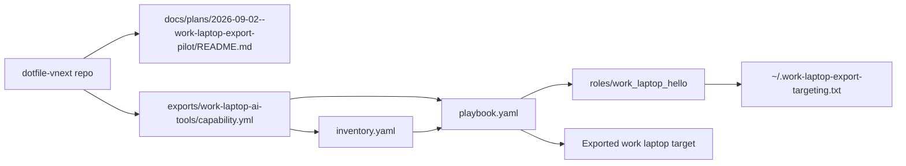
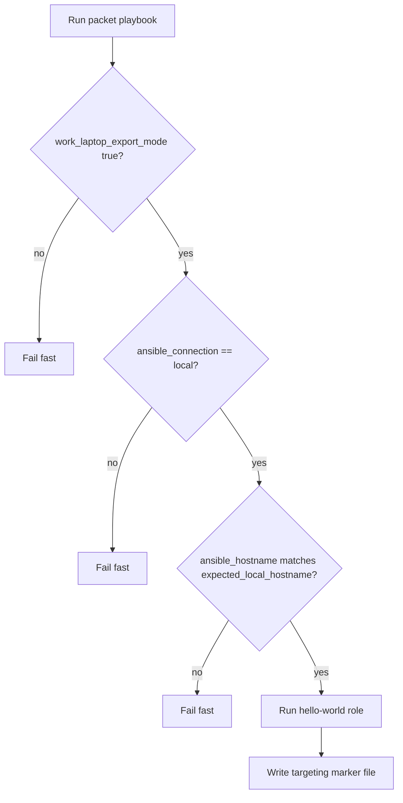
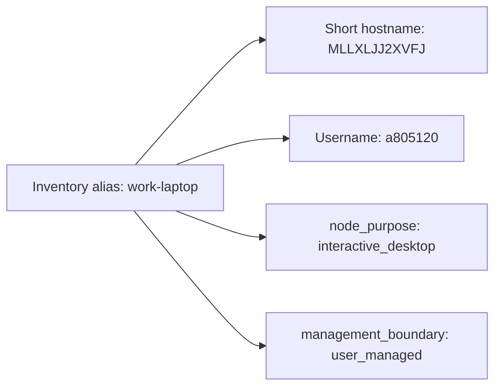

# Work laptop export packet pilot

## Summary

Create a fully isolated, export-only Ansible packet for a work MacBook that is
not part of the repo's normal managed-host lanes. The current slice prepares
the real target packet: guarded playbook, target-local inventory for
`MLLXLJJ2XVFJ`, and a harmless hello-world apply that should run only on the
exported work laptop.

## Capability Packet Boundary

| Field | Value |
| --- | --- |
| Capability identifier | `work_laptop_ai_tools_export_packet` |
| Owner manifest | `exports/work-laptop-ai-tools/capability.yml` |
| Owned files | `exports/work-laptop-ai-tools/**` files listed in the manifest |
| Integration anchors | This plan packet only |
| Update behavior | Keep export-only isolation; add shared roles after the pilot passes |
| Removal behavior | Delete the export packet files and this plan packet |

## Architecture/Structure Diagram

## Capability Routing Diagram

## Naming/Modeling Diagram

## Checklist

- [x] Keep the work-laptop packet out of broad repo playbooks and inventory lanes
- [x] Add export-only target inventory file
- [x] Add a guarded local-run playbook
- [x] Add a harmless hello-world role
- [ ] Add shared tooling roles after the target packet is proven
- [x] Add a dedicated export skill once the packet boundary is stable

## Apply / Verify / Undo

| | Contract |
| --- | --- |
| Apply | `ansible-playbook playbook.yaml -i inventory.yaml` from the exported packet on `MLLXLJJ2XVFJ` |
| Verify | `--list-hosts`, `--list-tasks`, then verify `~/.work-laptop-export-targeting.txt` on the work laptop |
| Undo | Remove `~/.work-laptop-export-targeting.txt`; delete the packet files if retiring the pilot |
| Change class | Idempotent config / bootstrap-style pilot |

## Plan verification receipt

**Slice:** export-only packet target-preparation path
**Verified at:** 2026-09-02
**Verifier:** Codex agent run

### Obligation inventory

| ID | Source | Obligation | In slice scope? | Status | Evidence |
| --- | --- | --- | --- | --- | --- |
| O-01 | Summary | Packet stays out of broad repo playbooks/inventory lanes. | yes | pass | Packet lives under `exports/work-laptop-ai-tools/`; no main inventory edits. |
| O-02 | Checklist | Target inventory exists for the exported work laptop. | yes | pass | `inventory.yaml` now targets `work-laptop` with `ansible_user=a805120` and `expected_local_hostname=MLLXLJJ2XVFJ`. |
| O-03 | Checklist | Playbook fails closed unless explicit local-run conditions match. | yes | pass | `playbook.yaml` assertions for export mode, local connection, and hostname. |
| O-04 | Checklist | Hello-world apply path is prepared for the exported work laptop. | yes | pass | Packet role remains harmless; canonical apply contract is now `ansible-playbook playbook.yaml -i inventory.yaml` on `MLLXLJJ2XVFJ`; prior local smoke and extracted round-trip runs remain historical proof of packet shape only. |
| O-05 | Future scope | Shared tooling roles remain deferred until smoke proof exists. | yes | pass | No shared tooling roles added in this pilot slice. |
| O-06 | Future scope | Export skill exists for zipping the slice. | yes | pass | `work-laptop-export-pack` added under `skills/implementation/`; project skill metadata and catalog validation both passed; runtime bridge now exposes `work-laptop-export-pack`; archive built at `exports/work-laptop-ai-tools/dist/work-laptop-ai-tools.zip`; extracted round-trip apply succeeded from `/Users/joshc/develop/work-laptop-export-roundtrip/20260902-102237/work-laptop-ai-tools`; marker file proved `playbook_dir=/Users/joshc/develop/work-laptop-export-roundtrip/20260902-102237/work-laptop-ai-tools`. |

### Summary

- In-scope obligations: 6
- Pass: 6
- Pending: 0

### Completion gate

- [x] Change-contract Verify demonstrated with captured output.
- [x] Packet boundary and diagram sections are present.
- [x] No broad repo inventory integration was introduced.

## On Deck — user decisions to integrate

| ID | User decision / direction | Target integration | Status |
| --- | --- | --- | --- |
| OD-01 | Treat the work laptop as an export-only, thin-client packet. | Packet boundary and playbook guards. | Integrated |
| OD-02 | Use the short real hostname `MLLXLJJ2XVFJ` when the packet is exported. | `inventory.yaml` and plan naming diagram. | Integrated |
| OD-03 | Smoke-test locally first with a harmless hello-world run on the current Mac. | `inventory-smoke.yaml`, hello role, and receipt O-04. | Integrated |
| OD-04 | Package the packet as a zip, extract it outside the repo, and verify the extracted copy runs. | `work-laptop-export-pack` skill and receipt O-06. | Integrated |
| OD-05 | Stop using the current Mac as the active execution target and prepare the packet for the real work laptop instead. | `inventory.yaml`, README apply contract, and receipt O-02/O-04. | Integrated |

## Diagram Inventory

| Diagram | Medium | Location |
| --- | --- | --- |
| Architecture/Structure | Mermaid fence | This README |
| Capability Routing | Mermaid fence | This README |
| Naming/Modeling | Mermaid fence | This README |
| Sequence diagram | N/A | Not needed for this single-host local smoke pilot |
