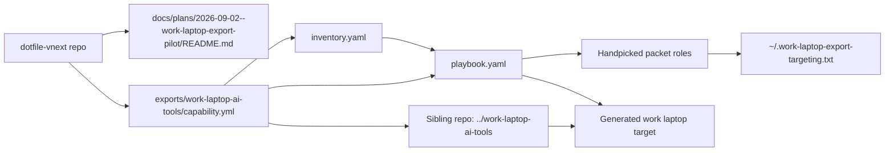
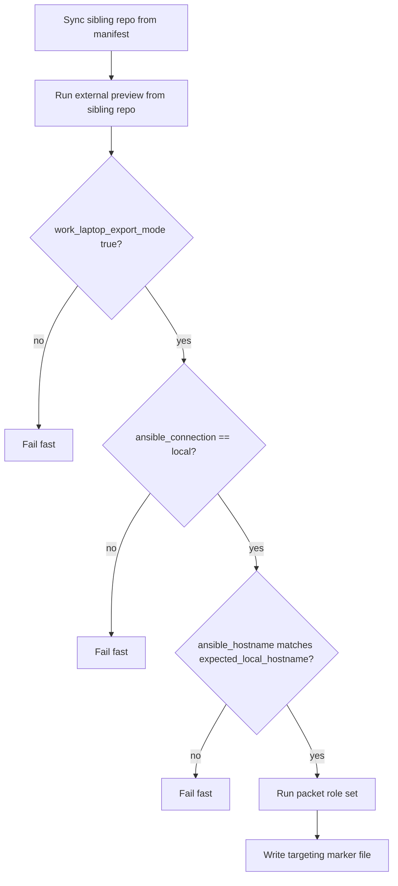
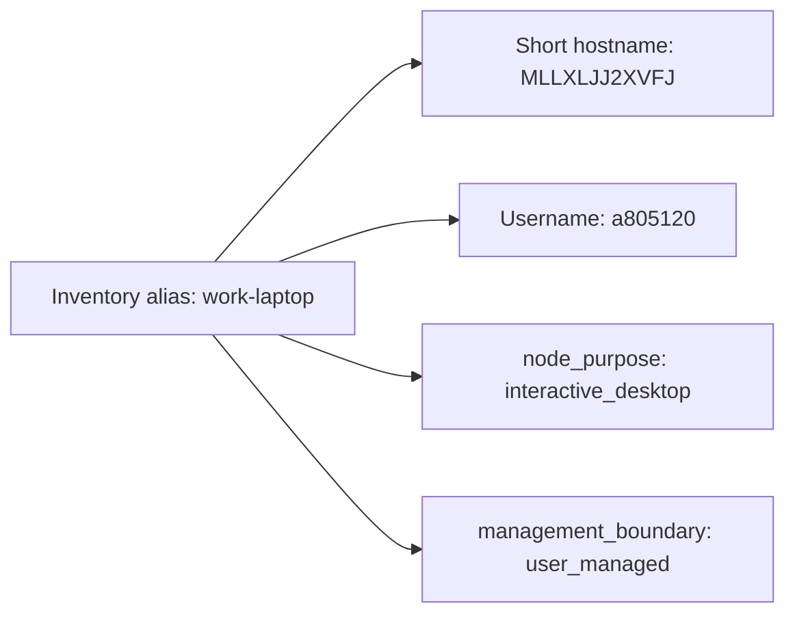

# Work laptop build-target packet pilot

## Summary

Create a fully isolated, export-only Ansible packet for a work MacBook that is
not part of the repo's normal managed-host lanes. The current slice prepares
the real target packet and the generated sibling build-target repo:
guarded playbook, target-local inventory for `MLLXLJJ2XVFJ`, the handpicked AI
tool roles, and a manifest-driven sync path into `../work-laptop-ai-tools`.

## Capability Packet Boundary

| Field | Value |
| --- | --- |
| Capability identifier | `work_laptop_ai_tools_export_packet` |
| Owner manifest | `exports/work-laptop-ai-tools/capability.yml` |
| Owned files | `exports/work-laptop-ai-tools/**` files listed in the manifest |
| Integration anchors | This plan packet only |
| Update behavior | Keep export-only isolation; sync the sibling repo from the manifest; archive work is explicit opt-in and secondary |
| Removal behavior | Delete the export packet files, this plan packet, and discard the generated sibling repo if retired |

## Architecture/Structure Diagram

## Capability Routing Diagram

## Naming/Modeling Diagram

## Checklist

- [x] Keep the work-laptop packet out of broad repo playbooks and inventory lanes
- [x] Add export-only target inventory file
- [x] Add a guarded local-run playbook
- [x] Add the handpicked Codex, VS Code, Continue, Zed, Terraform CLI, Terraform MCP, AWS MCP, AWS IaC MCP, and hosts-file roles
- [x] Add a dedicated build-target skill and sibling-repo sync path once the packet boundary is stable
- [x] Keep remote autocomplete-style editor lanes disabled by default and document the local-only exception path

## Apply / Verify / Undo

| | Contract |
| --- | --- |
| Apply | `ansible-playbook playbook.yaml -i inventory.yaml` from the generated sibling repo on `MLLXLJJ2XVFJ` |
| Verify | Sync the sibling repo, run external bootstrap `--help` and `--dry-run --bootstrap-only`, then `--syntax-check`, `--list-hosts`, `--list-tasks`, and optional tag-scoped apply |
| Undo | Remove `~/.work-laptop-export-targeting.txt`; delete the packet files and discard the sibling repo if retiring the pilot |
| Change class | Idempotent config / bootstrap-style pilot |

## Plan verification receipt

**Slice:** export-only packet target-preparation path
**Verified at:** 2026-09-02
**Verifier:** Codex agent run

### Obligation inventory

| ID | Source | Obligation | In slice scope? | Status | Evidence |
| --- | --- | --- | --- | --- | --- |
| O-01 | Summary | Packet stays out of broad repo playbooks/inventory lanes. | yes | pass | Packet lives under `exports/work-laptop-ai-tools/`; no main inventory edits. |
| O-02 | Checklist | Target inventory exists for the exported work laptop. | yes | pass | `inventory.yaml` now targets `work-laptop` with `ansible_user=a805120` and `expected_local_hostname=MLLXLJJ2XVFJ`. |
| O-03 | Checklist | Playbook fails closed unless explicit local-run conditions match. | yes | pass | `playbook.yaml` assertions for export mode, local connection, and hostname. |
| O-04 | Checklist | The real tool set is wired into the isolated packet without broad repo targeting. | yes | pass | `playbook.yaml` now includes only the handpicked roles for hosts file, Codex CLI/config/profiles, VS Code, Continue, Zed, Terraform CLI, Terraform MCP, AWS MCP, and AWS IaC MCP. |
| O-05 | Checklist | The sibling repo is the primary generated build target. | yes | pass | `export-manifest.yml` now declares `repo_sync.github_repo=doesitscript/work-laptop-ai-tools` and default target `../work-laptop-ai-tools`; `gh repo create doesitscript/work-laptop-ai-tools --private --clone` succeeded and `sync_sibling_repo.py` copied 166 managed files into `/Users/joshc/develop/work-laptop-ai-tools`. |
| O-06 | Checklist | The build-target skill keeps sibling-repo sync as the default path and reserves zip proof for explicit opt-in use. | yes | pass | `work-laptop-export-pack` now treats sibling-repo sync plus external preview as the default workflow; `roundtrip_smoke.py` requires `--archive-path` for archive-mode validation instead of falling back to the zip implicitly; the default prompt and packet README both say not to rebuild or validate the archive branch unless explicitly requested. |
| O-07 | Checklist | Remote autocomplete-style editor lanes stay disabled by default for this packet and are documented as local-only future work. | yes | pass | `roles/continue_ide` now gates autocomplete rendering behind `continue_ide_autocomplete_enabled=false`; `roles/zed_ide` now gates `edit_predictions` behind `zed_ide_edit_predictions_enabled=false`; the packet host vars and packet README both document the permanent remote-autocomplete warning and local-only future path. |

### Summary

- In-scope obligations: 7
- Pass: 7
- Pending: 0

### Completion gate

- [x] Change-contract Verify demonstrated with captured output.
- [x] Packet boundary and diagram sections are present.
- [x] No broad repo inventory integration was introduced.

## On Deck — user decisions to integrate

| ID | User decision / direction | Target integration | Status |
| --- | --- | --- | --- |
| OD-01 | Treat the work laptop as an export-only, thin-client packet. | Packet boundary and playbook guards. | Integrated |
| OD-02 | Use the short real hostname `MLLXLJJ2XVFJ` when the packet is exported. | `inventory.yaml` and plan naming diagram. | Integrated |
| OD-03 | Smoke-test locally first with a harmless hello-world run on the current Mac. | `inventory-smoke.yaml`, hello role, and receipt O-04. | Integrated |
| OD-04 | Package the packet as a zip, extract it outside the repo, and verify the extracted copy runs. | Explicit opt-in branch of `work-laptop-export-pack` and receipt O-06. | Integrated |
| OD-05 | Stop using the current Mac as the active execution target and prepare the packet for the real work laptop instead. | `inventory.yaml`, README apply contract, and receipt O-02/O-04. | Integrated |
| OD-06 | Pivot from zip-first delivery to a generated sibling repo that stays replaceable and out of broad inventory lanes. | `export-manifest.yml`, packet README, sibling repo sync script, workspace files, and receipt O-05/O-06. | Integrated |
| OD-07 | Keep remote autocomplete and remote edit-prediction lanes disabled by default; only consider a local-only small model on the Mac later. | Continue/Zed role defaults, packet host vars, packet README, and receipt O-07. | Integrated |

## Diagram Inventory

| Diagram | Medium | Location |
| --- | --- | --- |
| Architecture/Structure | Mermaid fence | This README |
| Capability Routing | Mermaid fence | This README |
| Naming/Modeling | Mermaid fence | This README |
| Sequence diagram | N/A | Not needed for this single-host local smoke pilot |
