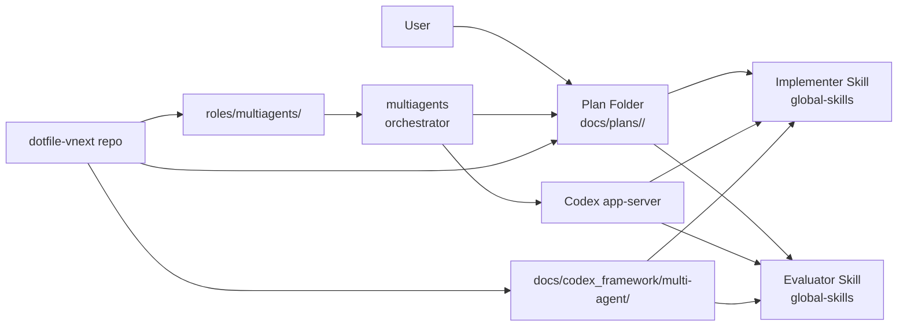
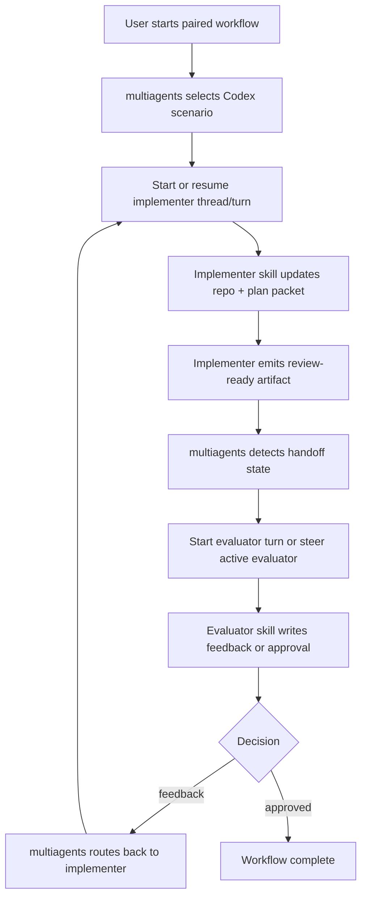
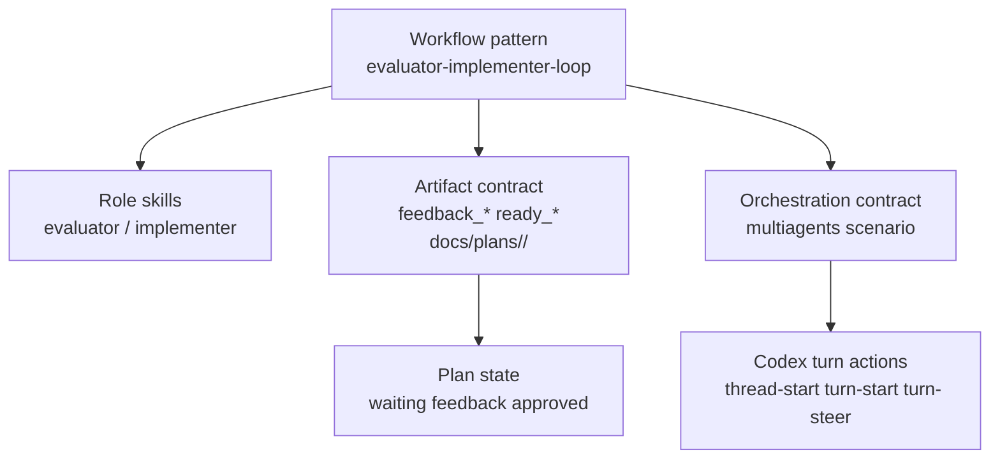

# Codex Multi-Agent Orchestration Integration Plan

## Summary

This plan adapts the earlier brainstorm into a repo-valid implementation packet
for `dotfile-vnext`. The target outcome is a **Codex-first paired-agent
workflow** where the existing evaluator and implementer skills keep their role
logic, `multiagents` becomes the orchestration and handoff-advancement layer,
and the plan folder artifacts remain the durable audit trail rather than the
primary orchestration mechanism.

**How to view this work:** see
[`discussion/orchestration-agnostic-framing.md`](./discussion/orchestration-agnostic-framing.md)
— role skills are the cooperation source of truth; orchestration (`multiagents`
today) is swappable enablement, not the definition of the roles.

## Problem statement

The current evaluator/implementer workflow proved the role split can raise
quality, but it also exposed a hard architectural gap: the roles know how to
produce feedback, approvals, and durable artifacts, yet the repo does not have
a completed control plane that reliably advances the next Codex role after a
handoff. That left the user acting as the real orchestrator.

The existing file-based coordination approach should be preserved only where it
adds durable evidence and handoff clarity. It should not remain the main
orchestration strategy.

The repo already has a scaffolded `multiagents` installation path on macOS, but
that capability stops at package install and filesystem layout. It does not yet
configure Codex app-server integration, workflow scenarios, task-state mapping,
or the repo-side documentation and contracts needed to run the paired-agent loop
through `multiagents`.

This plan turns that gap into a concrete implementation slice for this project.

## Research inputs added for this revision

This revision is informed by:

- official OpenAI Learn documentation for Codex app-server:
  `https://learn.chatgpt.com/docs/app-server`
- Context7 library `/openai/codex`
- HRL reference added from that research:
  [codex-app-server-protocol-and-setup.md](/Users/joshc/develop/homelab-reference-library/vendor/mcp/context7-style/codex-app-server-protocol-and-setup.md)

## Scope

### In scope

- Define the Codex-first orchestration model for evaluator/implementer work.
- Integrate existing paired-agent skills with `multiagents` as the external
  control plane.
- Define the repo-owned scenario/config/doc surfaces required for that
  integration.
- Update repo multi-agent framework docs so they describe the new external
  orchestration model clearly and unambiguously.
- Preserve plan-folder artifacts as the durable handoff and audit surface.

### Out of scope

- Broad multi-provider rollout for Cursor, Claude, or Gemini in this slice.
- Rewriting evaluator or implementer role judgment into `multiagents`.
- Depending on ad hoc local shell polling as the primary orchestration
  mechanism.
- Host-wide Ansible expansion beyond the repo surfaces needed to support the
  Codex-first integration path.

## Current state

| Area | Current state | Gap |
| --- | --- | --- |
| Paired-agent skills | Evaluator and implementer skills exist in `global-skills` and are already simplified around external orchestration | Need repo-local integration contract that tells implementers how to wire them into `multiagents` |
| Repo framework docs | `docs/codex_framework/multi-agent/` exists with workflow registry and packages | Still contains stale folder-watch and local-monitor assumptions |
| Tooling install | `roles/multiagents/` installs Bun + `multiagents` scaffold on macOS | No `multiagents setup`, broker/session wiring, or Codex scenario contract |
| Durable artifacts | Plan folders and evaluator/implementer file contracts already exist | Need explicit mapping from those artifacts to `multiagents` task states and Codex turn actions |
| Orchestration | User manually re-enters agents when new work appears | Need `multiagents` to own handoff advancement, agent-to-agent messaging, and new turn creation |

## Design goals

1. Keep the evaluator and implementer skills as the source of truth for role
   behavior and quality gates.
2. Use `multiagents` only for orchestration, routing, handoff advancement, and session
   continuity.
3. Keep the filesystem plan packet as the durable source of evidence, handoff,
   and audit, not as the scheduler.
4. Make Codex the first supported agent runtime, using official app-server turn
   controls rather than custom polling tricks.
5. Leave a clean path for later expansion to other agent clients without
   contaminating the first-pass Codex integration.

## Phase breakdown

This work should be executed in three phases.

### Phase 1 — Skill contract plus minimal app-server-backed validation

Goal:

- stabilize the evaluator/implementer skill contract
- align repo workflow docs with that contract
- stand up the smallest viable Codex app-server plus `multiagents` slice needed
  to run the staged ping-pong validation

Primary success target:

- smoke, stability, and acceptance ping-pong stages pass with evaluator-owned
  termination and output-backed evidence

Primary plan artifact:

- [skill-upgrade-first-pass.md](/Users/joshc/develop/dotfile-vnext/docs/plans/2026-09-03--multi-agent-orchestration-plan/skill-upgrade-first-pass.md)

### Phase 2 — Broader `multiagents` scenario and repo-managed configuration

Goal:

- move from the minimal validation harness to the repo-owned steady-state
  scenario/config layout
- render and document the managed files under the `multiagents` root
- define the operator start/resume/release flow as a durable repo contract

Primary success target:

- repo-managed scenario/config exists, is documented, and can drive the paired
  workflow without relying on user scheduling between handoffs

### Phase 3 — Operator surface, hardening, and follow-on clients

Goal:

- refine the single-entry operator experience
- harden visibility, receipts, and lifecycle controls
- decide whether follow-on operator surfaces such as Cursor-operated Codex
  orchestration are worth implementing after Codex-first proof

Primary success target:

- the workflow is easy to start, inspect, verify, and stop with minimal
  operator friction and clear proof surfaces

## Capability Packet Boundary

| Field | Value |
| --- | --- |
| Capability identifier | `codex-multiagent-orchestration` |
| Owner manifest | `roles/multiagents/`, `docs/codex_framework/multi-agent/`, `docs/plans/2026-09-03--multi-agent-orchestration-plan/`, and the paired-agent skill integration references that point at this repo workflow |
| Owned files | `roles/multiagents/**`, `inventory/group_vars/all/multiagents_tooling.yml`, repo-owned `multiagents` scenario/config docs, `docs/codex_framework/multi-agent/**` workflow contracts, and this plan packet |
| Integration anchors | Codex app-server turn APIs, `multiagents` scenario/task-state config, paired-agent plan folders under `docs/plans/`, and the evaluator/implementer skill contracts in `global-skills` |
| Update behavior | Update orchestration docs/config and workflow contracts together; preserve one durable artifact contract for plan-folder handoffs while allowing scenario/config internals to evolve |
| Removal behavior | Remove repo-owned `multiagents` scenario/config and documentation surfaces, reverse the Codex integration anchors, and restore the paired-agent workflow to manual orchestration without deleting unrelated framework docs |

## Apply / Verify / Undo / Change class

| | |
| --- | --- |
| **Apply** | Implement the repo-owned `multiagents` scenario/config/docs surfaces, then apply the existing `multiagents` role path on the target Mac as needed |
| **Verify** | Prove the Codex-first workflow can move implementer → evaluator → implementer via `multiagents`-driven turn starts or steer actions while preserving the plan-folder artifact contract |
| **Undo** | Remove the repo-owned `multiagents` integration surfaces and fall back to user-driven paired-agent handoff without disturbing the base `multiagents` package install unless explicitly requested |
| **Change class** | New orchestration capability integration with documentation, workflow-contract, and runtime-config changes |

## Target architecture

The first supported runtime is:

- one Codex implementer agent
- one Codex evaluator agent
- one repo plan folder as shared durable state
- `multiagents` as the orchestrator
- Codex app-server threads and turns as the execution transport

`multiagents` must be treated as the transport and control plane, not as the
source of evaluator quality rules.

## Coordination model

The required behavior is not "some specific wake-up trick." The required
behavior is:

1. the active role knows when it has reached a handoff boundary
2. that role records the boundary durably in the plan folder
3. `multiagents` advances the next role through Codex thread/turn controls
4. the next role knows whether it is expected to review, correct, approve, or
   release
5. the workflow terminates only when the evaluator has approved and the
   orchestrator has released the participants

That is the contract this plan implements.

## Proposed `multiagents` feature usage

The first pass should use these upstream `multiagents` capabilities:

| Feature | Use in this project | Why it is in scope |
| --- | --- | --- |
| Persistent sessions | Keep one durable session per plan execution | Prevent loss of handoff context across turns and restarts |
| CodexDriver / `codex app-server` | Drive Codex threads and turns for both roles | This is the official Codex execution boundary |
| Task states | Map repo handoff states into `working`, `done_pending_review`, `addressing_feedback`, `approved`, `released` | Gives the loop a consistent lifecycle |
| Review tools | Use `signal_done`, `submit_feedback`, and `approve` for the role-to-role loop | Matches the evaluator/implementer workflow directly |
| Team status / summaries | Use `set_summary` and `check_team_status` for operator visibility | Makes the current loop state visible without inventing a parallel status system |
| Shared knowledge | Store session-scoped decisions, blockers, and conventions | Reduces context drift between implementer and evaluator |
| File coordination | Use ownership zones and `acquire_file` only for genuinely shared files | Prevents conflicts without overcomplicating simple passes |
| Session control | Support pause/resume/release as the end-of-loop control surface | Defines a clean completion boundary |
| Dashboard | Use TUI or web dashboard for visibility, not as a source of truth | Helpful operations surface, but not the audit trail |

## Handoff contract

| Stage | Implementer action | Evaluator action | `multiagents` responsibility | Durable artifact expectation |
| --- | --- | --- | --- | --- |
| Bootstrap | Read plan, set working summary, begin scoped edits | None yet | Start or resume implementer thread/turn | Existing plan packet is the starting authority |
| Ready for review | Finish scoped change set, update accounting/receipt as required, mark that review is needed | None yet | Move implementer to `done_pending_review` after `signal_done`; route evaluator next | Implementer-owned review-ready artifact exists in the plan folder |
| Review | Wait for feedback or approval | Read packet, evaluate, write findings or approval | Start evaluator turn or steer evaluator if active | Evaluator writes feedback or approval artifact |
| Feedback return | Read evaluator findings, apply corrections, signal done again | None while implementer is correcting | Move implementer to `addressing_feedback`, then back to `done_pending_review` after resubmission | Updated implementer artifacts plus preserved evaluator feedback history |
| Approval | Stop modifying unless new scope is introduced | Approve when evidence is sufficient | Mark evaluator/plan state approved and release agents when complete | Approval artifact plus final receipt evidence |

## Skill upgrade dependency

The paired-agent skills need their own first-pass upgrade before the broader
scenario/config work is considered stable. That slice is defined in:

- [skill-upgrade-first-pass.md](/Users/joshc/develop/dotfile-vnext/docs/plans/2026-09-03--multi-agent-orchestration-plan/skill-upgrade-first-pass.md)

This umbrella plan assumes that:

- the implementer and evaluator skills become explicitly
  external-orchestrator-friendly
- artifact ownership is stabilized in the shared artifact-contract skill
- repo workflow docs are updated to mirror those skill contracts

## Architecture/Structure Diagram



## Capability Routing Diagram



## Naming/Modeling Diagram



## Sequence Diagram

```mermaid
sequenceDiagram
    autonumber
    actor User
    participant Plan as Plan Folder
    participant MA as multiagents
    participant Broker as multiagents Broker
    participant Codex as Codex app-server
    participant Impl as Implementer Skill
    participant Eval as Evaluator Skill

    User->>Plan: Create or choose scoped plan packet
    User->>MA: Start Codex paired-agent scenario
    MA->>Broker: Initialize or resume workflow session
    Broker-->>MA: Session handle + task state
    MA->>Codex: thread/start (implementer) if absent
    Codex-->>MA: Implementer thread id
    MA->>Codex: turn/start (implementer bootstrap)
    Codex->>Impl: Run implementer skill against plan_dir
    Impl->>Plan: Read plan packet and current artifacts
    Impl->>Broker: set_summary(working)
    Impl->>Broker: store_knowledge(blockers/decisions) as needed
    Impl->>Plan: Write repo changes + implementer review-ready artifact
    Impl->>Broker: signal_done(done_pending_review)
    Broker-->>MA: Implementer done; evaluator required

    alt Evaluator thread missing
        MA->>Codex: thread/start (evaluator)
        Codex-->>MA: Evaluator thread id
    else Evaluator thread exists
        MA->>Codex: reuse evaluator thread
    end

    alt Evaluator idle
        MA->>Codex: turn/start (evaluator review)
    else Evaluator active and steerable
        MA->>Codex: turn/steer (review-ready handoff)
    end

    Codex->>Eval: Run evaluator skill against same plan_dir
    Eval->>Plan: Read plan packet + latest implementer artifacts
    Eval->>Broker: set_summary(reviewing)

    alt Corrections required
        Eval->>Plan: Write feedback artifact
        Eval->>Broker: submit_feedback(actionable=true)
        Broker-->>MA: Feedback issued; implementer required
        alt Implementer idle
            MA->>Codex: turn/start (implementer corrections)
        else Implementer active and steerable
            MA->>Codex: turn/steer (implementer corrections)
        end
        Codex->>Impl: Resume implementer skill
        Impl->>Plan: Read evaluator feedback
        Impl->>Broker: set_summary(addressing_feedback)
        Impl->>Plan: Apply corrections + refresh review-ready artifacts
        Impl->>Broker: signal_done(done_pending_review)
        Broker-->>MA: Ready for evaluator re-review
        MA->>Codex: turn/start or turn/steer (evaluator re-review)
        Codex->>Eval: Resume evaluator skill
        Eval->>Plan: Re-read corrected artifacts
    else Approval path
        Eval->>Plan: Write approval/signoff artifact
        Eval->>Broker: approve
    end

    Eval->>Broker: set_summary(approved)
    Broker-->>MA: Review loop complete
    MA->>Broker: release session participants
    Broker-->>MA: Released
    MA-->>User: Workflow complete; durable evidence remains in plan folder
```

## Roles and responsibilities

| Surface | Responsibility | Must not own |
| --- | --- | --- |
| Evaluator skill | Review quality, evidence, and completion gates | Wake logic, session spawning, transport retries |
| Implementer skill | Apply repo changes, update packet artifacts, answer feedback | Self-signoff, orchestration policy |
| `multiagents` | Agent routing, persistent sessions, turn starts, turn steering, review workflow transport | Repo quality standards, evaluator judgment |
| Codex app-server | Thread and turn control for Codex execution | Workflow semantics beyond the turn protocol |
| Plan folder | Durable handoff, audit history, evidence, role-owned artifacts | Acting as the wake mechanism by itself |

## Feature slice to implement

### F1. Codex-first `multiagents` scenario contract

- Define the repo-owned scenario/config shape for a paired evaluator/implementer
  workflow.
- Use Codex as the only supported runtime in the first slice.
- Record how a scenario targets the evaluator and implementer skill entrypoints.
- Define the exact generated host layout for the first-pass scenario pack under
  `~/.config/dotfile-vnext/multiagents/scenarios/`.

### F1a. Minimal Codex app-server validation setup

- Use the official app-server startup and protocol flow from OpenAI docs:
  `initialize`, `initialized`, `thread/start`, `turn/start`, and `turn/steer`
  as needed.
- Treat this as a narrow phase-1 setup slice, not the full final scenario pack.
- Capture exactly which app-server action advances each validation handoff.

### F2. Plan-artifact to orchestration-state mapping

- Define which plan-folder artifact transitions cause `multiagents` to route to
  the evaluator or implementer.
- Preserve the existing durable artifact semantics:
  - implementer requests review
  - evaluator returns feedback or approval
  - plan folder remains the audit trail
- Make the role boundary explicit enough that the orchestrator can advance the
  correct next turn without guesswork.

### F3. Codex turn-control integration

- Use official Codex app-server actions as the runtime boundary.
- Prefer:
  - new thread start when a role session does not exist
  - turn start when the target role is idle
  - turn steer when the target role is already active and steerable
- Document the fallback behavior when a turn is not steerable.
- Document the approval/interrupt boundary so the integration does not alter an
  unrelated in-flight turn by accident.

### F4. Repo framework cleanup

- Update `docs/codex_framework/multi-agent/` registry and workflow package docs
  so they match the external orchestration model.
- Remove or explicitly deprecate references that imply a role must self-manage
  the orchestration loop.

### F5. Operator entrypoint and usage contract

- Define the single simplest operator start path for this workflow.
- Document what the user starts, what `multiagents` owns afterward, and where
  the durable state lives.
- Keep the operator surface small enough that later skills or wrappers can
  automate it further without changing the role contracts.

## Repo work map

The implementation agent should treat the following files and surfaces as the
primary work map for this slice:

| File or surface | Required work |
| --- | --- |
| `inventory/group_vars/all/multiagents_tooling.yml` | Keep the `multiagents` and Bun version contract authoritative; only change if a version bump is required for the integration |
| `roles/multiagents/defaults/main.yml` | Add any repo-owned paths or variables needed for Codex-first scenario/config rendering under the managed layout |
| `roles/multiagents/tasks/mac.yml` | Extend the role from install-only scaffold to rendering the Codex-first orchestration files and any safe setup steps selected by this plan |
| `roles/multiagents/templates/layout-readme.md.j2` | Describe the new scenario/config layout and what parts are generated versus operator-managed |
| `roles/multiagents/templates/multiagents-ai-usage.md.j2` | Document the operator start, status, resume, and shutdown flow for the Codex paired-agent workflow |
| `docs/codex_framework/multi-agent/README.md` | Reframe the capability index around external orchestration rather than local role-managed looping |
| `docs/codex_framework/multi-agent/agent-workflow-registry/patterns/evaluator-implementer-loop.md` | Rewrite the workflow contract to use `multiagents` task states and role handoff semantics |
| `docs/codex_framework/multi-agent/workflow-packages/evaluator-implementer-loop/README.md` | Update the workflow package to explain the new Codex-first orchestration flow |
| `docs/codex_framework/multi-agent/workflow-packages/evaluator-implementer-loop/implementer-role-documentation.md` | Align implementer instructions with `signal_done`, summaries, knowledge sharing, and plan-folder artifacts |
| `docs/codex_framework/multi-agent/workflow-packages/evaluator-implementer-loop/evaluator-role-documentation.md` | Align evaluator instructions with `submit_feedback`, `approve`, and final release expectations |
| `docs/plans/2026-09-03--multi-agent-orchestration-plan/README.md` | Keep this packet updated with final implementation decisions and verification evidence |

Skill-specific upgrade scope is broken out separately in:

- [skill-upgrade-first-pass.md](/Users/joshc/develop/dotfile-vnext/docs/plans/2026-09-03--multi-agent-orchestration-plan/skill-upgrade-first-pass.md)

## Proposed managed file layout

Unless upstream `multiagents` requires a materially different shape, the first
implementation pass should standardize a repo-owned layout like this under the
existing managed root:

```text
~/.config/dotfile-vnext/multiagents/
├── README.md
├── scenarios/
│   └── codex-paired-evaluator-implementer/
│       ├── README.md
│       ├── session-contract.md
│       ├── role-map.yaml
│       ├── task-state-map.yaml
│       └── operator-start.md
└── data/
```

The point of this structure is not the exact filenames by themselves. The point
is that the integration becomes repo-owned, inspectable, and reproducible
instead of living only in ambient CLI state.

## Configuration ownership model

The implementation agent should preserve a strict ownership split so the final
integration is understandable and maintainable.

| Surface | Owner | Purpose | Notes |
| --- | --- | --- | --- |
| `inventory/group_vars/all/multiagents_tooling.yml` | `dotfile-vnext` repo | Version contract for Bun and `multiagents` CLI | Shared pin source; do not scatter version picks |
| `roles/multiagents/defaults/main.yml` | `dotfile-vnext` repo | Declares managed layout paths and renderable config knobs | This is where repo-managed path defaults belong |
| `roles/multiagents/tasks/mac.yml` | `dotfile-vnext` repo | Renders and manages the host-side integration surfaces | Extends the current install-only scaffold |
| `roles/multiagents/templates/layout-readme.md.j2` | `dotfile-vnext` repo | Documents the managed host layout | Must explain generated vs operator-managed surfaces |
| `roles/multiagents/templates/multiagents-ai-usage.md.j2` | `dotfile-vnext` repo | Operator-facing usage contract | Must describe start, resume, status, and release flow |
| `~/.config/dotfile-vnext/multiagents/` | Host-rendered from repo | Canonical managed runtime root on the target Mac | Repo-owned content, host-rendered location |
| `~/.config/dotfile-vnext/multiagents/scenarios/codex-paired-evaluator-implementer/` | Host-rendered from repo | Scenario pack for this first-pass workflow | Exact filenames may evolve, but responsibility should stay repo-owned |
| `multiagents` broker/session state | `multiagents` runtime | Live orchestration state, peer registration, routing, locks, knowledge, messages | Runtime data, not the durable audit authority |
| `multiagents setup` outputs | Tool/runtime-owned, then normalized by repo if needed | Upstream bootstrap convenience | Do not let opaque tool-owned output silently become the long-term source of truth |
| `multiagents install-mcp` integration | Shared boundary between repo policy and tool execution | Registers MCP integration for supported clients | The plan must document what is repo-standardized versus what remains local setup |
| Codex app-server connection/session details | Codex runtime | Execution transport for threads and turns | Govern behavior through documented calls, not by inventing a parallel protocol |
| `docs/codex_framework/multi-agent/**` | `dotfile-vnext` repo | Human-readable workflow contract and role documentation | Must match the implemented orchestration model |
| `docs/plans/<slug>/` artifacts | Working plan packet plus role outputs | Durable evidence, feedback, approval, receipts | These remain the audit and handoff record |

## Required configuration surfaces

The implementation agent should ensure the following configuration classes are
defined, even if the exact filenames change during implementation:

| Config class | Belongs to | Must define |
| --- | --- | --- |
| Version contract | Repo inventory | Supported `multiagents` and Bun versions |
| Managed layout contract | Repo role defaults | Host paths for root, data, scenarios, and usage docs |
| Scenario contract | Repo-managed scenario pack | Role identities, startup instructions, session expectations, and plan-folder targeting |
| Role mapping | Repo-managed scenario pack | Which participant is implementer, which is evaluator, and which skill contract each follows |
| Task-state mapping | Repo-managed scenario pack | How review-ready, feedback, correction, approval, and release states are represented |
| Operator usage contract | Repo-managed usage docs | How to start, inspect, resume, and end the paired workflow |
| Codex transport policy | Repo docs plus scenario contract | When to use `thread/start`, `turn/start`, `turn/steer`, and any allowed interrupt/recovery path |
| Audit artifact contract | Plan packet plus workflow docs | What the roles must write so completion and review remain inspectable |

## Configuration principles

- Repo-owned configuration should describe the desired steady state.
- Host-rendered files should be generated from repo-owned templates or defaults.
- Runtime broker/session state should be treated as ephemeral operational state,
  not the main durable record.
- Upstream bootstrap commands like `multiagents setup` are allowed, but their
  outputs should be absorbed into a repo-owned contract if they become
  important to the steady-state workflow.
- If a configuration detail cannot yet be pinned to an exact path, the plan
  must still name the owning layer and required responsibility so the
  implementation agent does not guess blindly.

## Concrete coordination policy

The implementation should encode this policy:

1. User starts one paired-agent session for one plan folder.
2. `multiagents` creates or resumes the session and assigns:
   - implementer role
   - evaluator role
3. Implementer works until it reaches a review boundary, then:
   - writes the review-ready artifact in the plan folder
   - updates summary
   - calls `signal_done`
4. `multiagents` transitions the implementer slot to
   `done_pending_review` and routes the evaluator.
5. Evaluator reviews and either:
   - calls `submit_feedback(actionable=true)` and writes evaluator feedback, or
   - calls `approve` and writes approval/signoff artifacts
6. If feedback was issued, `multiagents` routes the implementer back into
   `addressing_feedback`.
7. If approval was issued, `multiagents` marks the review loop complete and
   releases the participants.

This is the coordination mechanism the plan should drive toward.

## Implementation checklist

- [ ] `PH-1` Complete phase 1: skill contract upgrade plus minimal app-server
      backed validation harness.
- [ ] `PH-2` Complete phase 2: broader repo-managed `multiagents`
      scenario/config integration.
- [ ] `PH-3` Complete phase 3: operator surface hardening and any approved
      follow-on runtime/operator expansions.
- [ ] `MA-1` Create a repo-owned Codex scenario/config contract for the
      evaluator/implementer workflow under the `multiagents` managed layout.
- [ ] `MA-1a` Complete the first-pass skill upgrade described in
      `skill-upgrade-first-pass.md` before finalizing the broader orchestration
      contract.
- [ ] `MA-1b` Satisfy the staged ping-pong validation target from
      `skill-upgrade-first-pass.md` using the smallest viable `multiagents`
      orchestration slice: smoke first, then 10-handoff stability, then
      20-handoff acceptance with evaluator-owned termination.
- [ ] `MA-2` Document how the scenario launches or addresses the evaluator and
      implementer skills without duplicating their role logic.
- [ ] `MA-3` Define the authoritative artifact-state mapping between plan-folder
      files and `multiagents` routing actions.
- [ ] `MA-4` Document the Codex app-server action policy: when to use
      `thread/start`, `turn/start`, `turn/steer`, and any allowed interrupt or
      recovery path.
- [ ] `MA-4a` Document how `signal_done`, `submit_feedback`, `approve`,
      `set_summary`, and `store_knowledge` are expected to be used by the two
      roles.
- [ ] `MA-5` Update `docs/codex_framework/multi-agent/README.md` and the
      evaluator/implementer workflow pattern so repo docs stop prescribing the
      old role-managed looping model.
- [ ] `MA-6` Add a repo-local usage guide that explains the Codex-first workflow,
      startup expectations, and evidence surfaces.
- [ ] `MA-7` Define verification steps that prove the orchestrator can advance
      the paired workflow without user re-entry between every handoff.
- [ ] `MA-8` Record first-pass limitations and explicit future work for
      non-Codex clients rather than silently over-generalizing the design.
- [ ] `MA-9` Define the repo-owned managed file layout for the first-pass
      scenario/config pack under `multiagents_root_dir`.
- [ ] `MA-10` Record the operator start/resume/release flow in the managed usage
      note and workflow docs.

## Verification strategy

Implementation should not claim success until it can demonstrate all of the
following:

| ID | Obligation | Evidence expectation |
| --- | --- | --- |
| `V-1` | The scenario/config exists in repo-owned form | File-path and contract evidence |
| `V-2` | The evaluator and implementer skills remain role-specific and are not re-implemented inside `multiagents` | Diff and documentation evidence |
| `V-3` | A plan-folder handoff can cause the next Codex role to receive work through `multiagents` without user manually restarting both agents each time | Runtime proof or a tightly scoped dry-run harness with visible routing evidence |
| `V-4` | Repo framework docs clearly describe the new role-handoff model and no longer require the roles to self-manage orchestration | Updated docs and deprecation language |
| `V-5` | The user-facing entrypoint is documented simply enough to repeat on the next plan | Operator guide evidence |
| `V-6` | The repo-owned managed file layout for this integration is rendered and documented | File-path evidence under the managed `multiagents` root |
| `V-7` | The end-to-end sequence from bootstrap through approval is documented with concrete role, broker, and Codex turn touch points | Sequence diagram and matching docs evidence |
| `V-8` | The pre-broader-configuration role contract has passed the staged ping-pong targets through a minimal `multiagents` orchestration slice: smoke, stability, and 20-handoff acceptance with evaluator-owned termination | Validation notes or harness evidence tied back to `skill-upgrade-first-pass.md` |

## Output-proof requirement

Implementation must present output-backed proof for each claimed validation or
verification success. Narrative-only statements such as "worked as expected" or
"the loop passed" are not sufficient.

Acceptable proof includes:

- captured command output
- concrete artifact names and contents
- broker or orchestrator log lines
- turn or thread identifiers with corresponding event evidence
- validation receipts that enumerate the observed outputs

Unacceptable proof includes:

- summary assertions with no attached output
- paraphrased success claims with no artifact references
- "all checks passed" language without showing what was checked and what was
  observed

If an implementing agent cannot show the output, it must report the relevant
item as unverified or failed instead of passed.

## Failure conditions

The implementation is not acceptable if it does any of the following:

- pushes evaluator quality logic down into `multiagents`
- depends on local shell polling as the required orchestration path
- leaves both the old and new orchestration models documented as if both are
  first-class
- claims Codex handoff advancement without identifying which app-server action
  actually causes the next turn
- generalizes to other clients by guesswork instead of explicitly scoping them
  as later work

## Future expansion after this slice

Later slices may add:

- Cursor-specific runtime packaging
- Claude or Gemini scenario variants
- richer dashboards or notifications
- broader workflow families beyond evaluator/implementer

Those should extend this contract, not rewrite the role boundaries.

## Diagram gate receipt

| Requirement | Status | Notes |
| --- | --- | --- |
| Architecture/Structure Diagram | pass | Mermaid diagram included |
| Capability Routing Diagram | pass | Mermaid diagram included |
| Naming/Modeling Diagram | pass | Mermaid diagram included |
| Sequence Diagram | pass | Mermaid sequence diagram included |
| Diagram inventory / medium disclosure | pass | Included below |

## On Deck — user decisions to integrate

| ID | User decision / direction | Target integration | Status |
| --- | --- | --- | --- |
| `OD-1` | Adapt the ChatGPT brainstorm into a real `dotfile-vnext` plan | This packet replaces the draft framing with repo-owned scope and checklist | integrated |
| `OD-2` | Codex is the first target use case | Scope, feature slice, and verification explicitly constrain the first pass to Codex | integrated |
| `OD-3` | Another agent will implement; this packet must be actionable | Checklist, role table, failure conditions, and verification obligations are written for a future implementer | integrated |
| `OD-4` | Do not focus this packet on Ansible implementation detail | Scope and apply contract reference repo/runtime surfaces without turning this into an Ansible-only plan | integrated |

## Diagram Inventory

| Diagram | Medium | Status |
| --- | --- | --- |
| Architecture/Structure Diagram | `mermaid-fence` | included |
| Capability Routing Diagram | `mermaid-fence` | included |
| Naming/Modeling Diagram | `mermaid-fence` | included |
| Sequence Diagram | `mermaid-fence` | included |

Supplemental developer-oriented UML sequence artifact:
[UML-sequence-diagram.md](/Users/joshc/develop/dotfile-vnext/docs/plans/2026-09-03--multi-agent-orchestration-plan/UML-sequence-diagram.md)

Supplemental conceptual coordination artifact:
[conceptual-sequence-diagram-inbox-outbox.md](/Users/joshc/develop/dotfile-vnext/docs/plans/2026-09-03--multi-agent-orchestration-plan/conceptual-sequence-diagram-inbox-outbox.md)

Supplemental first-pass operator prompt:
[first-pass-operator-prompt.md](/Users/joshc/develop/dotfile-vnext/docs/plans/2026-09-03--multi-agent-orchestration-plan/first-pass-operator-prompt.md)

## Sources checked

- `roles/multiagents/README.md`
- `inventory/group_vars/all/multiagents_tooling.yml`
- `docs/codex_framework/multi-agent/README.md`
- `docs/codex_framework/multi-agent/agent-workflow-registry/patterns/evaluator-implementer-loop.md`
- `docs/plans/README.md`
- `.cursor/rules/framework-plan-governance.mdc`
- `docs/plans/2026-09-03--multi-agent-orchestration-plan/ChatGPT-guidance-multiagents-github-reference.md`
- `https://github.com/zetbrush/multiagents`
- OpenAI Codex app-server documentation for `thread/start`, `turn/start`,
  `turn/steer`, and related turn control
