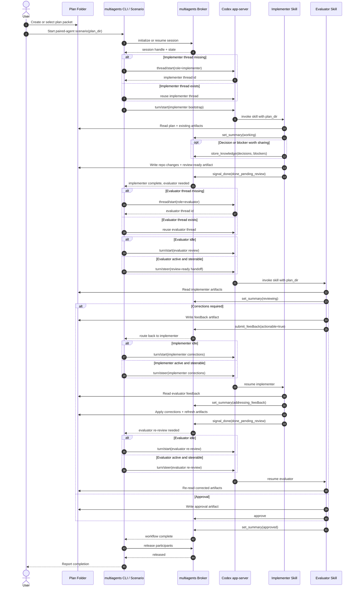

# UML Sequence Diagram - Codex Multi-Agent Orchestration

## Purpose

This document shows the intended end-to-end runtime sequence for the
Codex-first paired-agent workflow in `dotfile-vnext`. It is narrower than the
main plan packet: this file focuses on execution flow, orchestration touch
points, role boundaries, and the concrete `multiagents` and Codex features that
the implementation should use.

The main idea is simple:

- the implementer and evaluator skills remain the role brains
- the plan folder remains the durable evidence and handoff record
- `multiagents` becomes the orchestration layer
- Codex app-server threads and turns become the execution transport

## UML Sequence Diagram

This repo's Markdown surfaces render Mermaid reliably. The diagram below is a
UML-style sequence diagram expressed in Mermaid sequence syntax so it renders in
place instead of falling back to raw source text.

## Explanation

The sequence starts with the user selecting a single plan folder and launching
one paired-agent scenario. That is the only place where the user should need to
think about startup. After that point, `multiagents` owns the coordination
logic. It initializes or resumes a session, ensures there is a Codex execution
surface for each role, and decides whether the next action is a new `turn/start`
or a `turn/steer` into an already-active role thread.

The implementer and evaluator skills do not disappear in this model. They still
own the substantive work. The implementer reads the plan, edits the repo, and
writes the review-ready artifacts. The evaluator reads those artifacts, checks
the actual work, and either writes actionable feedback or issues approval. That
division of responsibility is the main quality control feature and should not be
moved into the orchestrator.

The plan folder still matters, but for a narrower reason than before. It is not
the scheduler. It is the durable audit trail. If someone later needs to inspect
what happened, the plan packet should still show when work was ready for review,
what feedback was issued, what corrections were made, and when approval
occurred. `multiagents` can use those artifacts as inputs, but the important
change is that orchestration responsibility moves to the broker/session layer
instead of being inferred only from file polling.

The critical runtime features being exercised are visible directly in the
diagram: `thread/start`, `turn/start`, `turn/steer`, `set_summary`,
`store_knowledge`, `signal_done`, `submit_feedback`, `approve`, and final
participant release. Those are the touch points the implementation should wire
cleanly into the repo-owned scenario and workflow documentation. If the final
implementation cannot explain which one of those calls advances each handoff, it
is not done.

The prior version used a `plantuml` code fence. That is valid source syntax in
the abstract, but it is not the diagram format this repo's Markdown surfaces
reliably render. This version keeps the same sequence semantics while using the
renderer-compatible syntax the repo already uses broadly.

## Key design assertions

- Two role skills still exist and remain independently useful.
- A manual two-terminal bootstrap may still be supported, but it is not the
  preferred steady-state operator flow.
- The preferred operator flow is one paired session start per plan folder.
- File-based artifacts remain mandatory for durable evidence, not for primary
  scheduling.
- Completion requires evaluator approval plus orchestrator release of the
  session participants.
