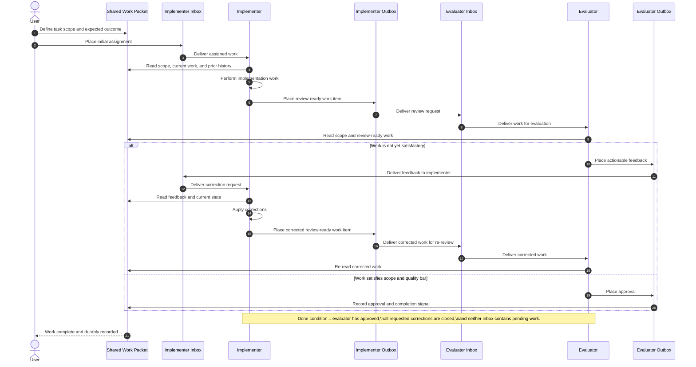

# Conceptual Sequence Diagram - Inbox Outbox Coordination

## Purpose

This is a conceptual coordination diagram. It intentionally uses tool-agnostic
language so the core paired-agent workflow is understandable even if the
underlying transport, orchestration engine, or client runtime changes later.

The model is:

- each role has an inbox
- each role can place work into its outbox
- the other role receives that work in its inbox
- the loop continues until approval is issued and no further action is pending

## Conceptual Sequence Diagram

## Explanation

This diagram strips away product-specific details and shows only the enduring
workflow contract. The implementer does not decide completion alone. Its job is
to perform the assigned work and place a review-ready result into its outbox.
That output becomes the evaluator's next inbox item.

The evaluator then decides whether the work is satisfactory. If it is not, the
evaluator places actionable feedback into its outbox, and that becomes a new
inbox item for the implementer. The implementer responds to that feedback and
returns a revised review-ready result. This continues until the evaluator no
longer has open objections.

The important completion rule is intentionally simple and transport-agnostic:
work is done only when approval has been placed and there is no remaining
pending item in either agent's inbox. In other words, "done" requires both a
positive decision and an empty-action state. That rule should remain true even
if the project later changes its orchestration engine, messaging layer, or AI
client.

## Done condition

The workflow is complete only when all of the following are true:

- the evaluator has issued approval
- the implementer has no unresolved feedback remaining
- the evaluator has no pending review item remaining
- the shared work packet contains the final approved state

## Mapping note

This document is conceptual on purpose. It does not prescribe whether inboxes
and outboxes are implemented with files, broker messages, task states, queue
objects, or a different transport. It defines the coordination semantics that
the implementation must preserve.
