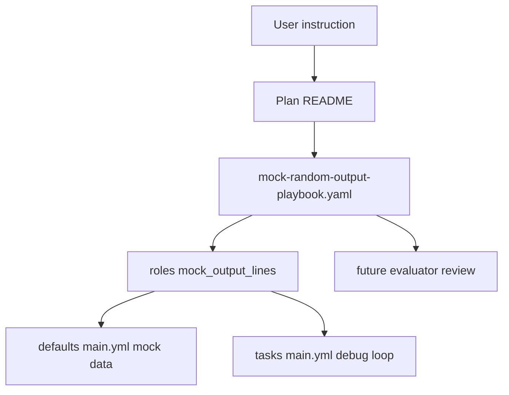
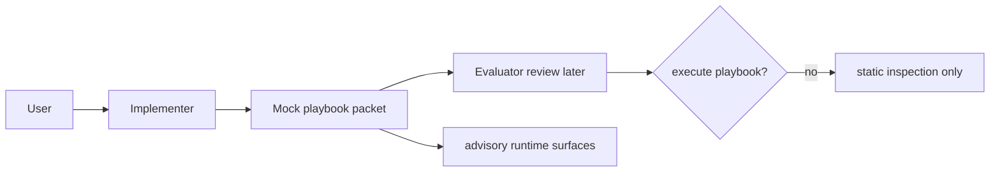
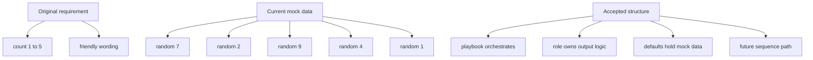

# Paired Agent Mock Playbook Verification - implemented

## Summary

This plan packet is a bounded mock setup for paired implementer/evaluator
workflow verification. The playbook remains harmless and intentionally not
executed in this repo workflow, but the packet is now structured as a small
maintainable Ansible kit rather than a one-off shell-task pile.

## User constraints

- Do not execute this playbook.
- Keep it as a product-like packet similar to the work-laptop situation.
- Preserve the original requirement in comments: output `1` through `5` using
  Ansible.
- For this mock version, intentionally output five random numbers in the range
  `1` through `10` instead of a clean `1` through `5` sequence.
- Leave notes about future cleanup so it can later return to ordered `1` to `5`
  output with more friendly wording.

## Accepted design for this packet

- Keep the packet non-executed during this scenario.
- Model the output behavior through a reusable role.
- Use module-first Ansible structure instead of repeated shell tasks.
- Preserve the current mock content as data, not as the architectural pattern.
- Keep the original requirement visible so the packet can later restore ordered
  `1` through `5` output cleanly.

## Capability Packet Boundary

| Field | Value |
| --- | --- |
| Capability identifier | `paired-agent-mock-playbook-verification` |
| Owner manifest | `docs/plans/2026-09-03--paired-agent-mock-playbook-implemented/README.md` |
| Owned files | `README.md`, `mock-random-output-playbook.yaml`, `roles/mock_output_lines/**`, `coordination/implementation-accounting.md`, `runtime/**` |
| Integration anchors | `docs/plans/README.md` plan-packet contract only |
| Update behavior | Implementer may adjust the mock packet contents for evaluator review without executing the playbook |
| Removal behavior | Delete this plan folder if the mock verification slice is discarded |

## Paired-Agent Runtime Surfaces

- `runtime/IMPLEMENTER-RUNTIME-STATUS.txt` is an implementer-owned advisory status
  surface.
- `runtime/implementer-monitor.sh` and `runtime/implementer-heartbeat.log` are
  implementer-owned polling helpers and logs.
- `runtime/IMPLEMENTER-RUNTIME-CONTRACT.md` defines how evaluators should treat
  runtime files as advisory "last observed" evidence rather than authoritative
  proof of a currently running process.
- `runtime/prove-implementer-closeout.sh` and
  `runtime/IMPLEMENTER-CLOSEOUT-PROOF.txt` cover packet-local proof that the
  fixed resolver converges to approved closeout correctly.
- These runtime files are non-governing and must not outrank evaluator
  `feedback_*`, `waiting_*`, or `ready_*` artifacts or the review-relevant
  plan packet files.

## Checklist

- [x] Create a mock playbook in this packet and keep the title containing `mock`
- [x] Keep the playbook harmless and non-executed in this workflow
- [x] Preserve the original `1` through `5` requirement in a top comment
- [x] Represent the current mock behavior through reusable role data
- [x] Use Ansible built-ins instead of repeated `shell` echo tasks
- [x] Add implementer accounting for packet-owned surfaces
- [x] Record future-fix notes for ordered output and friendlier wording
- [x] Keep the packet non-executed by implementer and evaluator

## Apply / Verify / Undo

### Apply

Do not run this playbook in this plan slice. The user explicitly directed that
neither implementer nor evaluator should execute it.

### Verify

- Static file inspection only
- Confirm the packet contains:
  - `mock-random-output-playbook.yaml`
  - `roles/mock_output_lines/tasks/main.yml`
  - `roles/mock_output_lines/defaults/main.yml`
  - `coordination/implementation-accounting.md`
  - this `README.md`
- Confirm the playbook:
  - uses a reusable role rather than inline repeated tasks
  - includes the original `1` to `5` requirement comment
  - preserves five mock random outputs through role input data
- Confirm the role:
  - uses `ansible.builtin.debug` with `loop`
  - contains a documented path to restore ordered `1` through `5` output
- Confirm runtime files are documented as advisory, non-governing surfaces

### Undo

- Delete `docs/plans/2026-09-03--paired-agent-mock-playbook-implemented/`

## Plan verification receipt

| ID | Obligation | Evidence |
| --- | --- | --- |
| O-01 | Packet created in `docs/plans/` | This folder |
| O-02 | Mock playbook exists | `mock-random-output-playbook.yaml` |
| O-03 | Original requirement preserved in comment | top comment in `mock-random-output-playbook.yaml` |
| O-04 | Five mock random outputs remain represented | `roles/mock_output_lines/defaults/main.yml` |
| O-05 | Reusable role owns output behavior | `roles/mock_output_lines/tasks/main.yml` |
| O-06 | Implementation accounting exists | `coordination/implementation-accounting.md` |
| O-07 | Runtime files are advisory and non-governing | this README plus `runtime/IMPLEMENTER-RUNTIME-CONTRACT.md` |
| O-08 | No execution occurred | this README `Apply` section |

## Architecture/Structure Diagram

## Capability Routing Diagram

## Naming/Modeling Diagram

## On Deck — user decisions to integrate

| ID | User decision / direction | Target integration | Status |
| --- | --- | --- | --- |
| OD-01 | Eventually restore ordered `1` through `5` output | Future revision of `roles/mock_output_lines/tasks/main.yml` and defaults | parked |
| OD-02 | Eventually improve wording so output is friendlier than raw numbers | Future revision of `roles/mock_output_lines/defaults/main.yml` | parked |

## Diagram Inventory

| Diagram | Medium | Status |
| --- | --- | --- |
| Architecture/Structure Diagram | `mermaid-fence` | included |
| Capability Routing Diagram | `mermaid-fence` | included |
| Naming/Modeling Diagram | `mermaid-fence` | included |

Other Available Diagram Types: N/A for this mock packet unless the evaluator
wants a paired-agent state diagram later.
