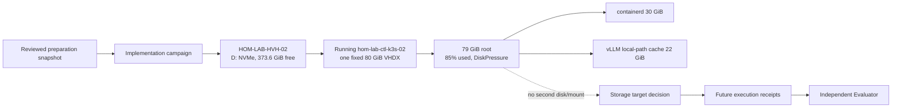
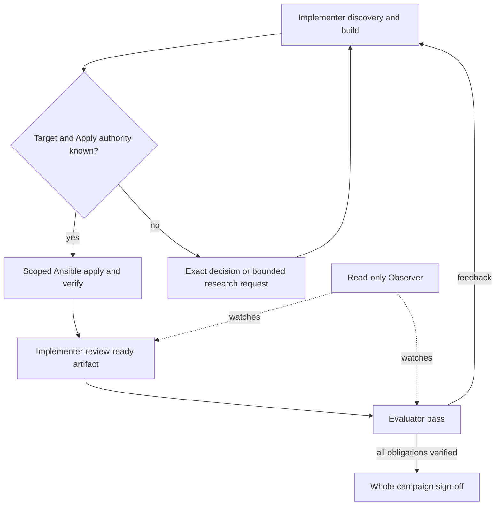
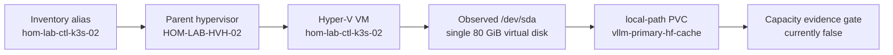

# Storage implementation campaign — beta

Implement the storage/cache work that initiated this research, using the mature
Implementer/Evaluator loop. This is an actionable **discovery → Ansible build →
authorized apply → independent verification** campaign, not another preparation
smoke test. Infrastructure changes have not been implemented or applied by this
packet. Missing roles/playbooks are Implementer deliverables, not prerequisites
the user must write.

## Start here

Copy/paste: [concise plan launch directory](../launch-directory.md).

Prefer its **one parent chat** prompt: the parent runs both roles through
multiagents and reports progress here. Separate role chats and the Observer
are optional fallback entrypoints, not prerequisites.

Use the three [launch prompts](../multi-agent-design/agent-prompts/implementation-beta-prompts.md).
Both working agents use **this directory** as `plan_dir`. The Observer is optional.
The [iteration priorities](../multi-agent-design/iteration_beta_pass.md) bound
the adapter-authoring iteration; they do not narrow this campaign to discovery.

Read the [integration contract](../multi-agent-design/orchestration/implementation-beta-contract.md),
[refined technical handoff](../multi-agent-design/orchestration/05-refined-technical-handoff--storage-layout.md),
and [reviewed upstream plan](upstream/handoff/current-phase-implementation-plan.md).
Historical research→campaign transforms (examples):
[orchestration/examples/storage-layout-research-transforms/](../multi-agent-design/orchestration/examples/storage-layout-research-transforms/).
`upstream/` contains byte-preserved preparation artifacts. Original absolute
paths in those files are provenance, not required runtime locations. Resolve
them through [the manifest](upstream-manifest.json); do not rewrite frozen files.
The release, not the plan's frozen `awaiting_plan_review` status, records that
preparation review passed. That review is **not implementation sign-off**.

Plan-owned `execution-records/` and historical `receipts/` /
`review_ready_*` back-and-forth are **not** the working campaign surface.
Those early loops are ignored under
`multi-agent-design/orchestration/temp/historical-campaign-back-and-forth/`
(gitignored). Fresh chunk artifacts belong in the private `run_dir` unless you
explicitly ask to retain plan-owned records (`retain_execution_records: true`).
Do not treat archived receipts as research hard-gates or as the current queue.

From the project root, check the handoff without launching agents or hosts:

```bash
bun docs/plans/2026-09-10--hrl-research-consolidation/multi-agent-design/runtime/check-implementation-handoff.ts docs/plans/2026-09-10--hrl-research-consolidation/implementation-campaign
```

## Ordered execution and full-scope acceptance

| ID | Work and owning surfaces | Evidence needed to close |
| --- | --- | --- |
| S1 | Fresh target/owner discovery using `playbooks/report_storage.yaml`, inventory, Hyper-V attachments, guest devices/mounts, K3s/containerd/kubelet units/config, imagefs, PVC/StorageClass, vLLM cache/image and scheduler/monitoring | Exact alias → host/VM → disk/mount/PVC map; baseline capacity/usage/workload health; relevant systemd dependencies; timestamped read-only receipt |
| S2 | Containerd/image reclamation: find the proven runtime owner, then implement safe normal GC/config or justified targeted cleanup | Actual need and effective config; preservation of NVIDIA/CNI/registry settings; before/after imagefs/storage; no new DiskPressure or workload regression; no blanket scheduled prune |
| S3 | HF/vLLM cache/PVC: extend `k3s_vllm_runtime`, `deploy_vllm_runtime.yaml`, inventory, and `k3s_comfyui_runtime` only where live ownership is proven | Selected cache/storage design, real backing capacity (not merely PVC request), binding/mount checks, pod readiness, vLLM `/health` and `/v1/models`, integrity and rollback evidence |
| S4 | Additional storage/offload: inspect `hyperv_ubuntu_vm` and `hyperv_move_vm_storage.yaml`; extend a proven owner or create a bounded role/playbook for the selected VHDX/mount/cache migration | Exact approved physical target, VM/disk attachment, capacity, backup and migration sequence; Ansible lifecycle; mount ordering/data integrity; verified new storage actually used by intended workload |
| S5 | Retention/monitoring: discover scheduler, Prometheus/alerting owner and policy, then implement scoped jobs/rules | Operator-selected retention/cadence/thresholds, correct metric names, tested job/alert behavior and safe disable/undo; an on-demand storage report alone is not monitoring |
| S6 | Research and documentation closeout: resolve relevant Ansible gaps; review K3s/systemd/Prometheus/Windows material; consolidate final design and HRL findings | Intent-to-module matrix, role contracts/tags/collections/quality gates; current diagrams/Apply/Verify/Undo/receipts; verify HRL review/commit disposition from current Git truth; do not bundle unrelated HRL work |

The original new-storage outcome remains explicit in S4. Do not substitute
cleanup-only success for it. A technical no-change recommendation needs evidence
and user acceptance when it changes the requested outcome. An unavailable target
or unchosen policy stays open/blocked; it is not a silent deferral or sign-off.

Current source check also found `roles/k3s_storage_prep/`: it is documented as
**before K3s install** and its tasks delete existing `/var/lib/rancher` and
`/var/lib/kubelet` destinations before symlinking. Do not run it as a migration
shortcut on an installed node. Establish a data-preserving S4 owner/sequence;
this is a task-specific safety constraint, not a request to refactor that role
globally. `hyperv_move_k3s_vm_storage.yaml` is a compatibility wrapper for the
shared VM-storage move, not proof of a second data disk capability.

The sibling [K3s-02 storage upgrade plan](../../2026-09-10--k3s-02-storage-upgrade/README.md)
still labels disk expansion pending. Its illustrative device names, capacities,
manual migration commands and alert thresholds are design context, not accepted
live values. Reconcile its intended additional-disk outcome during S1/S4.

### First Implementer pass

1. Validate upstream hashes, read current source and record existing dirty work.
2. Resolve aliases from inventory/config without printing secrets. For a verified
   guest alias, preview `bin/codex-env ansible-playbook playbooks/report_storage.yaml
   --limit <exact-alias> --list-hosts`, then run the same bounded report after
   inspecting its tasks. The playbook defaults to `all`: never omit `--limit`.
3. Capture the rest of S1 with existing read-only owner tools. Use current facts,
   not historical free-space figures or a guessed USB/VHDX identity.
4. Resolve module and role contracts with `.cursor/skills/ansible-knowledge-gate/SKILL.md`.
   Consult HRL source paths in the upstream brief for the specific decision; do
   not commission a whole-project best-practice audit.
5. Turn supported slices into owning Ansible changes now. Keep unknown physical
   targets/policies explicitly gated; do not insert executable guessed defaults.
   Publish a bounded design/decision request only for facts the user must select.
6. Validate the edited owners and leave an exact receipt/outbox for the Evaluator.
   Continue executable in-scope work in later passes; a discovery receipt alone
   does not complete S2–S6.

## Apply / Verify / Undo and authority

The launch prompt authorizes repository implementation and relevant read-only
discovery. The frozen release grants no live Apply authority. Before each live
mutation, record the applicable user authorization and exact verified target,
selected values, baseline, change class, and preview (see historical example
`orchestration/examples/storage-layout-research-transforms/decisions-and-authorization.md`).
Reuse existing specific permission;
do not ask for a magic phrase or repeat an already answered decision. If authority
or destructive target selection is genuinely absent, request the smallest missing
decision and continue independent safe work. Evaluator approval never substitutes
for user permission to mutate infrastructure.

Apply through owning Ansible roles/playbooks and a verified inventory limit. Use
syntax/list-hosts/list-tasks/list-tags and project-required focused validation;
check mode is only evidence for tasks that actually support it. Record command,
exit code, time, targets, relevant output, idempotence or justified exception,
before/after state and workload health in the private `run_dir` (not a campaign
`receipts/` working folder).

Undo means restore captured config/deployment values and use the selected
data-safe migration reversal. Never imply deleted models/images are recoverable
without a retained source/backup. On failure stop the affected mutation, preserve
evidence, and execute only the authorized safe rollback. No unrelated cleanup.

## Capability Packet Boundary

- Source of truth: `dotfile-vnext` roles, playbooks, inventory and these plan docs.
- Designed deliverables: Ansible capability changes, consolidated plan/diagrams,
  research closure and this project-owned integration skill pack.
- Routine outputs: reports, test logs and deployment receipts; not new products.
- External design dependencies: mature global paired skills and runtime operator;
  HRL is knowledge provenance, not permission or current-state proof.
- Owned campaign outputs: accounting, decisions, receipts, requests/responses,
  Implementer outbox and Evaluator verdicts under this directory.
- Protected inputs: `upstream/` and its manifest. A replacement preparation run
  requires explicit re-intake and independent review, not in-place editing.
- Completion: all S1–S6 obligations closed with implementation evidence or an
  explicit user-approved scope change, plus fresh Evaluator whole-campaign sign-off.

## Architecture/Structure Diagram



## Capability Routing Diagram



## Naming/Modeling Diagram



## Current readiness

Ready to launch implementation **work** using the provided prompts. Not yet
ready for a single unattended storage deployment command: current physical
targets, policy decisions and owner changes still need S1–S6. The automated
preparation controller is not the implementation scheduler. The new parent
implementation runner handles this later-stage loop; separate ordinary worker
chats still require explicit re-entry. Automatic preparation-to-implementation
activation of all future roles remains outside this iteration.

## Plan verification receipt

**Slice:** current implementation campaign  
**Verified at:** 2026-09-11T13:27:58Z
**Verifier:** Implementer run
`hrl-storage-implementation-beta-01-parent-20260911t131549z-implementer-1`

| ID | Source | Obligation | In scope? | Status | Evidence |
| --- | --- | --- | --- | --- | --- |
| S1 | Ordered execution | Exact target/owner map, capacity/use/workload baseline and required-probe semantics | yes | in progress | Fresh exact dual-target evidence is in `receipts/2026-09-11T112508Z-s1-s5-source-review.md`; the report exits cleanly across Windows and K3s and records current DiskPressure. Post-attach identity remains open. |
| S2 | Ordered execution | Establish normal GC owner/effective configuration and apply only a justified cleanup/config change | yes | pending evaluator review | K3s-generated containerd config, kubelet 85/80 GC ownership and zero eligible image bytes support a no-change conclusion; exact commands and raw excerpts are in the current receipt. |
| S3 | Ordered execution | Move vLLM cache/PVC to verified backing and prove mount, readiness, health, integrity and rollback | yes | pending evaluator review | The source owner now quiesces vLLM, checksum-copies without deletion, sets `HF_HUB_CACHE`, verifies health/models/pressure/root margin, and restores the retained source Deployment on failure. S4 backing and mutation evidence remain incomplete. |
| S3-V1 | Verify contract | Prove PVC/PV binding, physical mount backing, pod readiness, `/health` and `/v1/models` | yes | blocked | Controller fixture proves the source copy/integrity/reversal contract; authorized S3/S4 Apply and live health receipts remain required. |
| S3-U1 | Undo contract | Preserve old cache/source and prove reversal after integrity comparison | yes | pending evaluator review | Source retains the original PVC and prior Deployment definition; controller checksum reversal passes, while live reversal remains unexercised. |
| S4 | Ordered execution | Add approved VHDX/mount and perform data-safe migration with integrity/rollback proof | yes | pending evaluator review | The source now encodes attach → mount → data-preserving containerd offload → vLLM cutover → Alloy → monitor. It moves no K3s server/database/TLS/credential tree and redirects only new local-path PVs. Post-attach identity, Apply and live integrity remain incomplete. |
| S4-A1 | Apply contract | Create/attach only the selected VHDX, then resolve by-id/serial and initialize/mount only after explicit authority | yes | blocked | `*_apply=false`; slot 0:1 is freshly reconfirmed free and ext4-backed overlayfs is active, but no second guest disk exists yet, so whole-disk by-id/serial and live attachment evidence remain unavailable. |
| S4-V1 | Verify contract | Prove attachment, disk identity, filesystem/mount, capacity and intended workload use | yes | blocked | Controller-local populated fixtures validate the source guards, but no selected physical disk exists or has been applied. |
| S4-U1 | Undo contract | Unmount before detach and preserve VHDX/data/backup | yes | pending evaluator review | Offload reversal now precedes identity-checked unmount → fstab removal → exact detach; retained destination/VHDX data are not deleted. Live reversal is unexercised. |
| S5 | Ordered execution | Implement selected retention/monitoring owner, policy, behavior and disable path | yes | pending evaluator review | The corrected `df` fixture passes, the deployment composes Alloy before the monitor, and the active inventory resolves the central Loki endpoint. Live forwarding remains fail-closed rather than asserted. |
| S5-A1 | Apply contract | Deploy only selected cadence, warning/critical thresholds and alert route | yes | blocked | Live mutation is unauthorized. The source order is now `logging_alloy` then `storage_capacity_monitor`; live service and route proof remain required. |
| S5-V1 | Verify contract | Exercise metric/job/rule and alert behavior against actual metric names | yes | blocked | The role exercises its oneshot and asserts one journal event per mount during Apply; live journald → Alloy → Loki/Grafana evidence remains required. |
| S5-U1 | Undo contract | Disable/remove selected timer or rules without deleting retained evidence | yes | source reviewable | `absent` stops/disables the timer and removes only role-owned script, units and journal drop-in; live removal behavior remains unexercised. |
| S6 | Ordered execution | Close research/module/docs/diagram/receipt/HRL obligations | yes | pending | Focused research, diagrams and HRL disposition exist; final implementation evidence is incomplete. |
| C-01 | Apply/Verify/Undo | Every selected mutation has exact command, time, target, before/after, health, idempotence and rollback evidence | yes | blocked | No live mutation is authorized; the current receipt supplies exact-command read-only evidence only. |
| C-02 | Capability boundary | Preserve protected upstream snapshots and account for every designed/routine output | yes | pending | Upstream checker passes and accounting is current for this increment; campaign remains open. |
| C-03 | Completion | Fresh independent whole-campaign Evaluator sign-off | yes | blocked | No whole-campaign ready artifact exists. |

Summary: seventeen in-scope obligations; zero campaign-complete, twelve
blocked, two pending, and three pending Evaluator review. Blocked and pending rows keep this
campaign incomplete. No checklist row or plan lifecycle is promoted.

## Diagram Inventory

All three diagrams above are Mermaid baselines. Update the architecture with
observed storage placement during S1/S4; no physical placement is asserted now.
