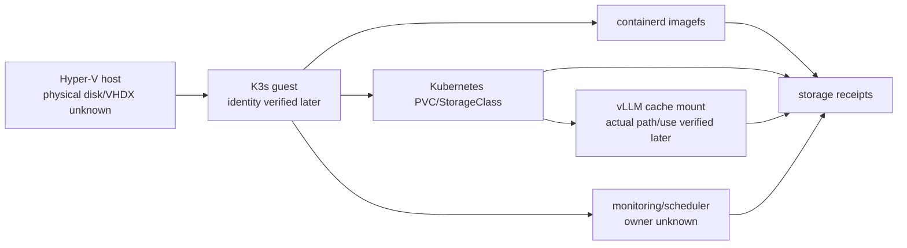
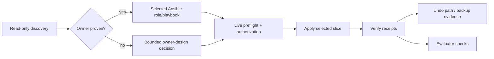
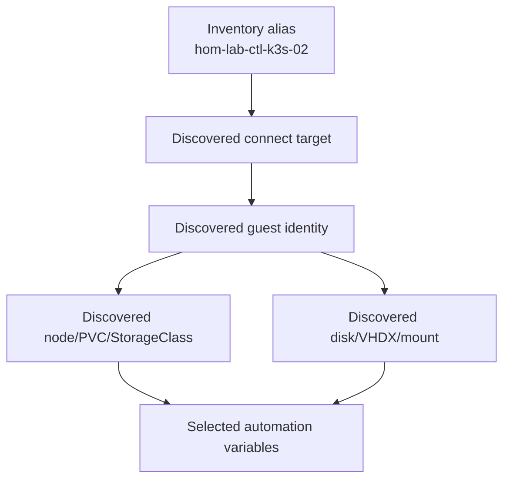

# Current-phase implementation plan

## Outcome and scope

Prepare a future, separately authorized Ansible implementation that turns the HRL's storage and infrastructure research into safe, evidence-backed storage/cache/cleanup/monitoring changes. This plan does not apply a change, select a physical target, commit research, or approve downstream execution.

The required result is a unified implementation plan with baseline diagrams, owner mapping or explicit discovery, Apply/Verify/Undo instructions, and receipts for the mature Implementer and Evaluator. The source plan's full obligation inventory is retained below; planned work is not represented as verified completion.

## Evidence basis and conclusions

| Matter | Status | Evidence / conclusion |
| --- | --- | --- |
| Consolidation themes | verified source-plan statement | Source README and index require containerd cleanup, HF cache management, storage/cache offload, artifact retention, disk monitoring, and Ansible integration. |
| Containerd approach | supported library evidence; live state unknown | The HRL decision supports normal GC and `crictl rmi --prune`; it rejects invented cadence and reserves `ctr content prune references` for repair. Effective K3s/template behavior must precede any config or cleanup design. |
| HF/vLLM approach | supported library/repo evidence; live state unknown | HRL supports cache inspection/cleanup and native environment variables. Research reports the vLLM role mounts `vllm-primary-hf-cache` at `/root/.cache/huggingface`; actual image, cache, PVC, and usage require a receipt. |
| PVC/imagefs approach | supported library evidence; live state unknown | DiskPressure/image-GC mechanics are supported, but a PVC request does not prove physical capacity. K3s flags, local-path behavior, and mount/logging configuration require discovery. |
| VHDX/mount offload | research exists; target/owner unknown | HRL has Windows/K3s offload material and project Hyper-V relocation surfaces, but neither selects a second model-cache VHDX or a physical device/mount. |
| Retention/monitoring | research exists; policy/owner unknown | HRL supports find/age/state patterns and has Prometheus retention material, but no approved policy, scheduler, metrics, or owner was proven. |
| Ansible readiness | discovery is sufficient; final design is gated | The five reported gaps do not block read-only discovery. They do block final role/playbook design where contracts, tag behavior, validation, collection/module choice, or execution scale matter. |

### Options

- Recommended: a discovery-first, slice-by-slice design, using existing owner surfaces only where corroborated; make each mutation conditional on target identity, baseline, rollback, and explicit authorization.
- Rejected: blanket scheduled pruning, stale-snapshot repair, HF deletion, retention cleanup, K3s template replacement, capacity/threshold selection, or physical offload selection from historical reports alone.
- Assumption: the listed paths are current repository evidence, not proof of presently running hosts or workloads. Future discovery must correct or replace this assumption.

## Ordered work slices

| Slice and owner | Intended edit or bounded discovery | Apply | Verify | Undo | Change class |
| --- | --- | --- | --- | --- | --- |
| 1. Evidence and Ansible-owner discovery — `playbooks/report_storage.yaml`; candidate roles `k3s_vllm_runtime`, `k3s_comfyui_runtime`, `hyperv_ubuntu_vm` | Read-only inventory-alias-to-target, K3s/containerd/kubelet, imagefs, PVC/StorageClass/events, guest mount/free-space, vLLM cache/image, Hyper-V attachment, scheduler/monitoring, and existing Ansible contract/tag/CI/collection receipts. Capture the target guest's relevant `k3s`/container-runtime unit and drop-ins, configured data/config paths, and mount ordering/dependencies; decide whether systemd affects containerd, mount/offload, or retention. Record an intent-to-module matrix after official/runtime module confirmation. | No mutation; no unit change is authorized until this receipt establishes necessity and owner. | Receipt identifies target, baseline, owner candidates, relevant unit/dependency disposition, module matrix, and unresolved decisions. | N/A; preserve receipt. | Read-only discovery. |
| 2. Containerd/image reclamation — owner unknown pending slice 1; evidence surface `playbooks/recover_ai_inference_lane.yaml` | Choose only a normal-GC or `crictl rmi --prune` action supported by the effective runtime configuration; do not write a generated K3s template until merge/replace behavior is known. | Separately authorized, target-scoped cleanup/config change only after baseline and backup/rollback design. | Before/after `imagefsinfo`, image/snapshot use, workload readiness, no new DiskPressure events, and Ansible targeted/idempotence receipt. | Restore captured configuration; do not claim deletion reversibility without retained source/backup. | Planned infrastructure change. |
| 3. HF/vLLM cache and PVC capacity — `roles/k3s_vllm_runtime/{defaults,tasks/present}.yml`, `playbooks/deploy_vllm_runtime.yaml`, `inventory/host_vars/hom-lab-ctl-k3s-02.yaml`; PVC ownership also `k3s_comfyui_runtime/tasks/storage.yml` | Select cache cleanup, relocation, mount/PVC declaration, or no change only after cache command/image, usage, StorageClass, binding, actual mount, capacity, and backup data are captured. | Separately authorized selected change. | Before/after cache/PVC/mount figures, pod readiness, vLLM `/health` and `/v1/models`, no new DiskPressure, and targeted validation/check-mode where applicable. | Restore captured deployment/mount/PVC values; restore deleted content only from named retained source/backup. | Planned infrastructure change. |
| 4. VHDX/mount offload — candidate `roles/hyperv_ubuntu_vm/`, `playbooks/hyperv_move_vm_storage.yaml`; owner unknown | Identify exact Hyper-V VM/disk attachment, guest block device, mount, fstab, data path, capacity, and rollback source. Decide whether a new cache VHDX belongs to these surfaces or a new bounded role/playbook. | Separately authorized attachment/mount/data-migration only after target and backup are accepted. | Disk identity/attachment, guest mount, data integrity, expected cache use, workload readiness, and before/after capacity receipt. | Reverse only the newly identified attachment/mount after data-safety confirmation; restore data from named backup. | Planned infrastructure change. |
| 5. Retention and monitoring — owner unknown; `report_storage.yaml` is evidence only | Discover Prometheus/alerting topology, metric names, scheduler/AWX ownership, current retention jobs, and approved retention policy. | Separately authorized policy-specific scheduling/alerting/cleanup only after ownership and retention window are decided. | Scheduled-job/alert receipt, target-specific before/after data, and no adverse workload/DiskPressure result. | Disable/revert the selected job/rule and restore only from defined backup. | Planned infrastructure change. |

## Dependencies and preflight gate

Before any destructive or live Apply: establish exact inventory target; Hyper-V VM/disk attachment; guest block devices, mounts, and free space; relevant `k3s`/container-runtime unit/drop-ins, configured data/config paths, and mount ordering/dependencies; K3s/Kubelet/containerd effective configuration; node/PVC/StorageClass/events; vLLM image plus `hf cache --help`; cache contents; monitoring/scheduler owner; and backup/rollback location. Confirm the selected role interface, tags, collections/modules, validation conventions, and execution-scale constraints through repository, installed-runtime, and official evidence.

No slice may select a host, USB device, VHDX path, mount point, model, capacity, cadence, retention threshold, or cleanup target until this preflight closes that decision. Live Apply remains separately authorized.

## Acceptance criteria and later evidence

1. The Implementer has an approved owner surface or a recorded discovery result explaining a new bounded surface; no guessed target appears in executable files.
2. Every selected change has target identity, baseline, Apply, Verify, Undo, backup/reversibility statement, and change class.
3. The module intent matrix and relevant role contracts/tags/collections/quality gates are evidenced before new automation or shell fallback.
4. Containerd/cache/PVC/mount work records before/after storage and imagefs figures, expected binding/mount state, workload readiness, vLLM `/health` and `/v1/models` where vLLM is affected, and DiskPressure-event comparison.
5. Evaluator evidence includes targeted syntax/list-task/list-tag or project-equivalent validation, idempotence/check-mode when applicable, exact execution receipt, rollback result or safe rollback procedure, and a scope check showing no unrelated host/role mutation.
6. The final source-owned consolidated plan contains the required diagrams and labels historical/reported facts separately from fresh discovery.

## Architecture/Structure Diagram

## Capability Routing Diagram

## Naming/Modeling Diagram

Inventory aliases are identifiers in project configuration, not proof of a current host/device identity. Preserve existing names until discovery maps them to observed runtime objects; no naming change is proposed.

## Diagram Inventory

| Diagram | Medium | Status |
| --- | --- | --- |
| Architecture/Structure Diagram | Mermaid | Included; physical placement explicitly unknown. |
| Capability Routing Diagram | Mermaid | Included; shows discovery-to-Evaluator control path. |
| Naming/Modeling Diagram | Mermaid | Included; preserves alias-to-observed-object distinction. |

## Complete obligation inventory and open questions

The source requires consolidation of scattered HRL/Context7 research; completion/review of incomplete Ansible material and uninspected K3s, systemd, Prometheus, and Windows entries; extraction of selected approaches and confidence; grouping by storage/cache/cleanup/monitoring; a unified plan with architecture diagrams, Apply/Verify/Undo, Ansible integration, and verification receipts; future containerd cleanup, HF cache management, offload, monitoring/alerting, and role/playbook work; and eventual HRL research review/commit. This plan covers the decision/implementation handoff only. It does not claim research commit, host validation, plan execution, monitoring deployment, or source-plan completion.

Open questions requiring discovery or operator decision:

1. Which current host/device/guest/PVC/cache objects correspond to source-reported history?
2. Does effective K3s configuration permit a safe containerd change, and is cleanup needed after measuring active use?
3. Is cache relocation warranted, and which physical/storage target and rollback source are acceptable?
4. Which role/playbook/scheduler/monitoring owner and quality-gate contract should own each approved future change?
5. What retention and alerting policy has operator approval after topology/metric discovery?

## Review revision dispositions

| Finding | Disposition |
| --- | --- |
| F-01 — systemd obligation lacks a plan mapping | Resolved in slice 1 and the preflight gate: collect the relevant guest unit/drop-ins, configured paths, and mount ordering/dependencies as a read-only receipt; use the result to decide whether systemd is relevant to a selected slice. No unit change is authorized without that necessity/owner evidence. |

## Review request

Event: `plan_review_requested`.

Artifact: `/Users/joshc/develop/oneoffs/hrl-research-consolidation-preparation-20260911-r2/handoff/current-phase-implementation-plan.md`.

Next actor: `Researcher` for independent coverage and hash review.
