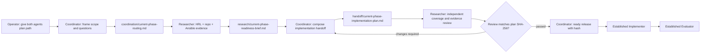

# Current-phase preparation plan — draft

## Current implementation slice

The resumed task now includes an executable, tested middle-stage controller,
not authoring alone. Its required outputs are the two role skills/prompts,
pipeline-compatible handoff envelope, actual preparation run against this
source plan, and identity-checked runtime teardown. See
[runtime/README.md](runtime/README.md) and [capability.yml](capability.yml).
See [the fresh validation receipt](validation-2026-09-11.md) for current proof.

Apply: run the controller with explicit roots and unique run identity. Verify:
role artifacts, independent review/hash release, targeted tests and final process
inventory. Undo: stop exact manifest-owned processes; preserve sources/evidence.
Change class: controller-local workflow/bootstrap; no infrastructure apply.

Future whole-pipeline coordination is an integration boundary, not this slice's
execution scope. The framework registry owns the reusable pattern; stable
Implementer/Evaluator behavior remains unchanged. No new role gets permission
to silently activate or approve those later stages.

## Readiness status

| Item | Current state |
| --- | --- |
| Two-agent workflow and prompts | Implemented, validated and exercised; draft names retained as requested |
| Coordinator passes | Route, compose, narrow revision and release completed against the real source plan |
| Researcher readiness brief | Produced with source-backed recommendations and explicit live-state gaps |
| Reviewed implementation plan | Produced; independent Researcher review passed after one correction, release matches current SHA-256 |
| Evaluator review or approval | Not performed; no implementation was activated or approved |
| Runtime validation | Real two-role content run passed; 39 targeted tests passed; restart collision rejected; completed resume verified without relaunch; owned processes stopped |

This packet is the reusable preparation contract and controller. Its successful
run produced a reviewed implementation handoff in an isolated output directory,
linked from [START-HERE.md](START-HERE.md). It is not execution of the storage
plan. The first downstream work is bounded read-only discovery; later mutations
still require established target identity and authorization. Two manual chats
use the supplied followups; the controller automates those wakeups.

## Purpose

Prepare the current HRL research-consolidation and storage work for the
established Implementer/Evaluator loop. This is a bounded preparation phase:
it turns existing project and HRL evidence into a decision-ready handoff; it
does not change managed hosts, write Ansible roles, or approve implementation.

## Scope

The Coordinator and Researcher must focus on the active plan family at:

`/Users/joshc/develop/dotfile-vnext/docs/plans/2026-09-10--hrl-research-consolidation/`

They should determine what current evidence supports, what remains unknown,
which Ansible surfaces are likely to own future work, and what an Implementer
and Evaluator need before they begin. A future phase is required for live
preflight, implementation, execution, and evaluation.

## Required source map

Use these current sources before broad retrieval:

- project workflow contract:
  `docs/codex_framework/multi-agent/agent-workflow-registry/patterns/evaluator-implementer-loop.md`;
- project Ansible knowledge entry point: `.cursor/skills/ansible-knowledge-gate/SKILL.md`;
- reusable multiagents lifecycle/observation entry point:
  `/Users/joshc/develop/global-skills/skills/implementation/multiagents-runtime-operator/SKILL.md`;
- HRL current librarian advisory:
  `/Users/joshc/develop/homelab-reference-library/agents/domain-librarian-advisory/AGENT.md`;
- HRL Ansible domain map:
  `/Users/joshc/develop/homelab-reference-library/agents/domain-librarian-advisory/domains/ansible.md`;
- HRL multiagents material:
  `/Users/joshc/develop/homelab-reference-library/implementation-guides/multiagents/README.md`
  and `vendor/multiagents/README.md`.

Treat these as evidence sources, not implementation authority. Any live claim
still needs a current probe in the later implementation phase.

## Assigned draft skills and prompts

| Agent | Draft skill | Prompt | Primary output |
| --- | --- | --- | --- |
| Onsite Expert / Coordinator | [`phase-scoped-onsite-expert-coordinator-draft`](multi-agent-onsite-expert/skill-drafts/phase-scoped-onsite-expert-coordinator-draft/SKILL.md) | [`onsite-expert-coordinator-draft-prompt.md`](agent-prompts/onsite-expert-coordinator-draft-prompt.md) | `coordination/current-phase-routing.md` and `handoff/current-phase-implementation-plan.md` |
| Researcher | [`phase-scoped-researcher-draft`](researchers/skill-drafts/phase-scoped-researcher-draft/SKILL.md) | [`researcher-draft-prompt.md`](agent-prompts/researcher-draft-prompt.md) | `research/current-phase-readiness-brief.md` |

## Ownership and order

1. Coordinator reads this plan and creates `coordination/current-phase-routing.md`.
2. Researcher reads the routing artifact, existing HRL sources, and the
   project’s Ansible knowledge gate as applicable; it writes the readiness
   brief.
3. Coordinator composes `handoff/current-phase-implementation-plan.md` with
   status `awaiting_plan_review`.
4. Researcher independently checks obligation coverage, evidence, feasibility,
   acceptance and undo, writing `research/current-phase-plan-review.md` with
   `reviewed_plan_path`, actual `reviewed_plan_sha256`, and review findings.
5. Coordinator revises when necessary; Researcher re-reviews changed bytes.
   On a matching `plan_review_passed`, Coordinator writes the separate
   `handoff/current-phase-release.md` with `ready_for_implementation` and the
   reviewed hash. Only then is the preparation handoff ready for the mature
   Implementer/Evaluator. This is not Evaluator approval of implementation.

The [shared execution contract](agent-prompts/execution-contract.md) is the
authoritative input/artifact/wakeup contract. `source_plan_root` identifies
read-only source evidence; `preparation_output_root` owns generated artifacts.
Each artifact carries matching `run_id` and resolved absolute roots. The
external orchestrator owns wakeups in orchestrated mode; in two manual chats,
use the supplied followup prompts. Neither metadata nor two open chats provides
automatic scheduling. Existing task authorization survives interruption.

The Coordinator owns `coordination/` and `handoff/`; the Researcher owns
`research/`. Neither agent writes `review_ready_for_evaluator_*`,
`feedback_*`, `waiting_*`, or `ready_*` artifacts.

## Required handoff-plan contents

`handoff/current-phase-implementation-plan.md` must contain:

- current-state facts with source paths and a verified/unverified label;
- the specific desired outcome and in-scope boundaries;
- proposed owning Ansible role/playbook/inventory surfaces, or a named
  discovery task when ownership is not yet known;
- ordered work slices with Apply, Verify, Undo, and change class;
- the Researcher’s recommended/rejected patterns and open gaps;
- acceptance criteria for the Implementer and evidence checks for the
  Evaluator;
- explicit `awaiting_plan_review`, `needs_research`, or
  `operator_decision_required` status; final readiness belongs in the separate
  hash-bound release, without modifying already-reviewed plan bytes.

## Runtime handoff

The installed `multiagents-peer` MCP server is the agent-side communication
surface. The controller in `runtime/run-preparation.ts` owns the named team,
slot routing, finite wakeups and termination; neither role schedules its peer.
A team is required for orchestrated mode, not for manual prompts. Follow the
shared contract rather than treating provider metadata as a scheduler.

In orchestrated mode each role reads the parent's `runtime_observation_path`
receipt and reports its dashboard URL/status; sandboxed agents do not run host
process probes or start services. In manual mode use the reusable runtime
operator's read-only observation. Runtime stopping requires the exact run ID
and manifest containing PID/start-time/command identities. Parent PID 1 or a
matching process name is never sufficient ownership proof. The independent
watchdog handles loss of the controller; the restart path reconciles its
manifest and separate broker record. The shared broker and IDE are protected.

## Dashboard and runtime layers

The dashboard URL for a live local `multiagents` run is
`http://127.0.0.1:7900` (equivalently, `http://localhost:7900`). The Coordinator
must report this URL and whether it was reachable in its first status update.
Live status is recorded in the validation receipt, not assumed from this plan.
After completion, Coordinator presents one cleanup option naming remaining
owned sessions/processes/disposable paths; retain skills, plans and evidence.

| Layer | Meaning | Needed now? | Needed during a live run? |
| --- | --- | --- | --- |
| Agent-side peer MCP | Lets an agent use peer status/message tools when a session exists. | Checked | Yes |
| Broker (`127.0.0.1:7899`) | Holds sessions, slots, messages, and durable team state. | No | Yes |
| Orchestrator session/team | Creates the named Coordinator and Researcher slots and wakes later passes. | No | Yes |
| Dashboard (`127.0.0.1:7900`) | Observes broker-backed team/session activity. | No | Recommended |

No active team/session is normal for authoring this packet. It becomes a setup
problem only when an operator intends to run the two agents and the broker or
orchestrator session still cannot be started.

## Developer flow diagram

The editable Mermaid source is [coordination-flow.mmd](coordination-flow.mmd).

## Diagram inventory

| Diagram | Medium | Status |
| --- | --- | --- |
| Coordination and handoff flow | Mermaid fence + `.mmd` source | Included |
| Architecture/structure | N/A | This packet designs agent handoffs; it does not select or change infrastructure. |
| Capability routing | Mermaid fence + `.mmd` source | Included in the coordination flow. |
| Naming/modeling | N/A | No names, aliases, or source-of-truth objects are changed. |
