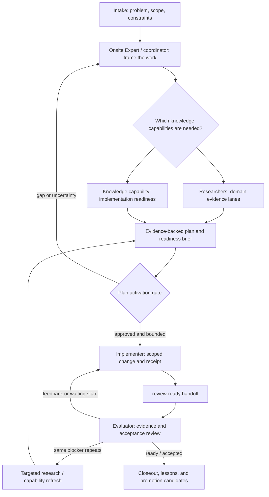

# Suggested Overall Workflow

## Status and intent

This is a proposed operating model for the storage work and related infrastructure work. It explains how the existing mature Implementer and Evaluator roles can work with the Researcher, Onsite Expert, and bounded knowledge capabilities already proposed in this design folder.

It is not an active orchestration contract, an authorization to execute changes, or a replacement for the established Implementer/Evaluator workflow. The next implementation plan must select the actual orchestrator, artifact locations, and activation conditions before any role runs.

## Proposed flow

The arrows are artifact handoffs, not an instruction for one agent to directly control another. A coordinator or external runtime should wake a role only when its expected input artifact exists and the role's stop condition is satisfied.

## Phases, responsibilities, and outputs

| Phase | Primary owner | Output | Gate to proceed |
| --- | --- | --- | --- |
| 0. Frame | Onsite Expert or coordinator | Problem record, scope, constraints, research requests | The change is bounded enough to investigate. |
| 1. Research | Researchers | Source-backed findings, unresolved questions, evidence references | Research answers the decision questions or explicitly records gaps. |
| 2. Readiness | Invoked knowledge capability | Task-specific readiness brief and authority map | Applicable practices and live tool/resource status are known. |
| 3. Activate plan | Planner/coordinator with human approval where required | Accepted execution plan, exact scope, acceptance criteria, rollback boundary | The required evidence, ownership, and approvals are present. |
| 4. Implement | Existing Implementer | Scoped change, implementation receipt, review-ready artifact | The requested work is complete enough for independent review. |
| 5. Evaluate | Existing Evaluator | Feedback, waiting state, or ready/accepted state | Evidence supports each acceptance criterion. |
| 6. Close and learn | Evaluator/coordinator | Closeout record and promotion candidates | Any reusable pattern has enough repeated evidence to be considered separately. |

## How the work should compose

Research and knowledge capabilities are inputs to planning and execution, rather than permanent replacement roles. A task can invoke one or more capabilities when its risk or uncertainty warrants them:

- A storage change may invoke storage architecture research, a Hyper-V or guest-OS capability, and the [Ansible implementation knowledge capability](knowledge-capabilities/ansible-implementation-knowledge.md).
- An Ansible capability should use the existing `ansible-knowledge-gate` as its entry point, then draw on repository evidence, supported documentation, and the Red Hat Ansible MCP server when its resources or tools are actually callable.
- The Implementer consumes the approved readiness brief as a constraint and evidence source; it still owns the implementation and its receipt.
- The Evaluator checks whether relevant readiness constraints were followed, but does not become the implementation authority or rewrite the Implementer's work.

This allows a future Terraform, networking, or storage capability to be added using the same small contract without redefining the established roles.

## Parallel and sequential work

| Work | Coordination rule |
| --- | --- |
| Independent domain research | May run in parallel when questions and source boundaries are explicit. |
| Knowledge-capability readiness checks | May run alongside research; reconcile both before plan activation. |
| Plan composition | Starts after the necessary research/readiness inputs exist. |
| Edits to the same source file | Serialize ownership; one writer at a time. |
| Evaluation | Starts only after the Implementer's review-ready handoff. |
| Implementer/evaluator repair loop | Sequential and artifact-driven: feedback or waiting state precedes the next implementation pass. |
| Research during a waiting state | May proceed in parallel when it is targeted at the recorded blocker and does not mutate implementation-owned files. |

## Artifact ownership

| Owner | Owns | Does not own |
| --- | --- | --- |
| Onsite Expert/coordinator | Intake, task framing, routing, activation state | Implementation approval or evaluator sign-off by implication |
| Researcher | Research findings, source status, unresolved questions | Implementation changes or acceptance decisions |
| Knowledge capability | Readiness brief, authority map, applicable constraints | A duplicate permanent expert role or a change authorization |
| Implementer | Scoped implementation, receipts, review-ready handoff | Evaluator feedback/ready-state artifacts |
| Evaluator | Feedback, waiting, and ready/accepted artifacts | Editing implementation-owned sources to resolve findings |

This preserves the existing evidence discipline: configuration or an installed tool is not proof of a callable capability, and a completed implementation is not sign-off until the Evaluator's owned state says so.

## Readiness and capability selection

Before an implementation-relevant knowledge capability is invoked, the coordinator should record:

1. The decision or uncertainty it must resolve.
2. Its consumers: planner, Implementer, Evaluator, or a combination.
3. Its authority map: repository truth, upstream references, MCP resources/tools, and any local live checks.
4. Whether each integration is configured, listed, and callable. These are separate facts.
5. Its expected output and the stop condition for the capability.

Not every MCP tool needs to be called. The brief should identify only the tool/resource evidence that is material to the proposed change. If an MCP integration is unavailable, the brief records that status and uses an appropriate authoritative fallback rather than silently assuming coverage.

## Diagnostic and escalation paths

| Signal | Route | Expected response |
| --- | --- | --- |
| Scope, owner, or safety boundary is unclear | Onsite Expert/coordinator | Refine the problem record before activation. |
| Required evidence source is inaccessible | Researcher or capability | Record configured/listed/callable status and use an authoritative fallback where available. |
| No authoritative owner or current-state evidence exists | Planner/coordinator | Add a discovery step; do not infer permission to implement. |
| Evaluator reports the same blocker repeatedly | Targeted research/capability refresh | Produce evidence addressing that blocker before another broad implementation attempt. |
| Proposed action is destructive or crosses an operator boundary | Human operator | Obtain an explicit decision and add it to the execution plan. |

## Storage-work instantiation

For the current storage effort, the suggested order is: frame the storage outcome and boundaries; run the relevant domain research lanes; produce an Ansible readiness brief if Ansible is selected as an execution mechanism; integrate those inputs into an approved plan; then activate the mature Implementer/Evaluator loop. This document deliberately does not select devices, hosts, commands, or rollout steps.

## Evolution rule

Promote a capability into a project skill only after it has supported the storage effort and at least two independent later efforts with stable triggers, outputs, and evidence needs. At that point, extend the existing role contracts by reference rather than copying their rules into a new specialist role. Consider a global skill only when the workflow is portable across projects and has a stable, repository-independent contract.

## Related design material

- [Immediate recommendations before activation](IMMEDIATE-RECOMMENDATIONS-BEFORE-ACTIVATION.md)
- [Knowledge capabilities](knowledge-capabilities/README.md)
- [Ansible implementation knowledge capability](knowledge-capabilities/ansible-implementation-knowledge.md)
- [Implementer enhancement: knowledge-capability consumption](implementer/enhancements/knowledge-capability-consumption.md)
- [Evaluator enhancement: knowledge-capability review](evaluator/enhancements/knowledge-capability-review.md)
- [Researcher enhancement: Ansible implementation readiness](researchers/enhancements/ansible-implementation-readiness.md)
