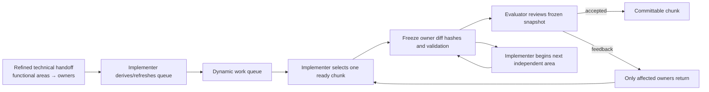

# Chunked Light implementation pipeline

The **refined technical handoff** is the first input. The work queue is
Implementer-owned: derived from the handoff’s functional areas, not a static
script. Implementer selects the earliest ready non-overlapping chunk, edits
those Ansible owners, validates, and freezes a snapshot. Evaluator reviews that
snapshot while Implementer may begin only the named next independent area.

This is safe only when owner roots, generated artifacts, and shared playbooks
do not overlap. Feedback that changes a later chunk's design pauses that chunk.
Live Apply, target identity, and final multi-owner synthesis remain serial,
Full-lane work.
