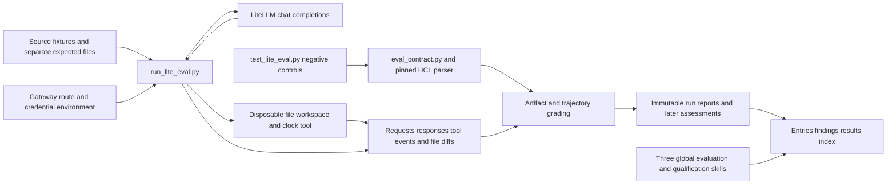
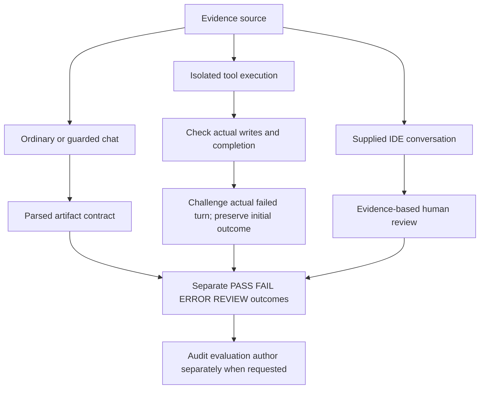
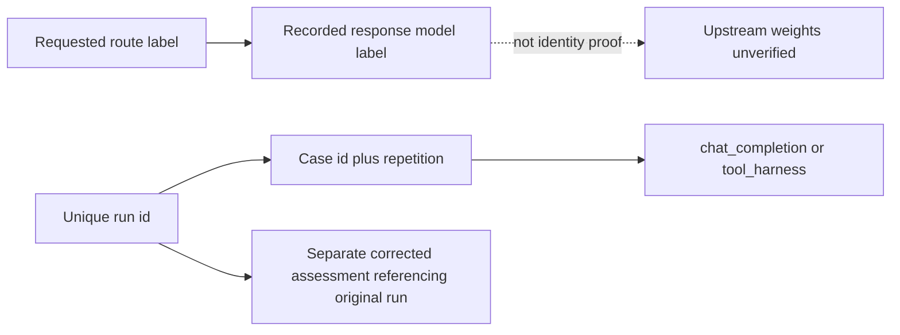

# Validations — agent lane fitness

This packet separates direct chat checks, isolated tool execution, supplied IDE
conversation evidence and evaluation-author accountability. None is averaged
into a single model-fitness score. The original 10-case runner had demonstrated
false-positive graders; its positive findings have been superseded.

## Current repair slice

The user requested fixes to the suite and related skills. Version 2 provides
parsed HCL artifact contracts, matched ordinary/guarded prompts, two source-value
fixtures, missing-source and date cases, actual isolated file tools, bounded
challenge/recovery, immutable raw evidence and regression tests for the graders.
The related global skills distinguish those evidence surfaces and require
measurement validity before acceptance promotion.

| Artifact | Purpose |
| --- | --- |
| [Runner and usage](lite-eval-qwen25-coder-32b-continue/README.md) | 13 scenarios and execution limits |
| [Latest assessment](lite-eval-qwen25-coder-32b-continue/report.md) | Corrected scoped results; no Agent clearance |
| [Repair receipt](repair-notes.md) | Changes, tests, limitations, assessment corrections |
| [Results index](results/INDEX.md) | Immutable historical/live/assessment links |
| [Findings](findings/2026-09-10--qwen25-coder-32b-continue.md) | Incident evidence and withdrawn claims |
| [Gateway entry](entries/2026-09-10--lite-eval-qwen25-coder-32b-continue.md) | Legacy and replacement campaign context |
| [Conversation entry](entries/2026-09-10--conversation-kms-hardcode-continue-agent.md) | Supplied incident evidence |

## Evidence rules

- Requested route, client label, response model label and verified weights are
  separate facts. This campaign does not verify upstream weights.
- Ordinary and guarded comparisons use matching fixtures/settings, but the real
  Continue incident remains observational, not a controlled matched experiment.
- A correct final file cannot erase an incorrect intermediate write. Preserve
  initial behavior, acknowledgement, repair and completion separately.
- Full assistant text was already saved by the legacy runner. The replacement
  additionally records requests, tool schemas/actions/results, errors, retries,
  finish reasons, before/after snapshots, intermediate writes and source hashes.
- REVIEW/NOT_EXERCISED are not PASS. ERROR is execution failure, not an inferred
  defect in model weights. Single-run case counts are not reliability estimates.

## Capability Packet Boundary

| Field | Value |
| --- | --- |
| Capability identifier | validations_agent_lane_fitness |
| Owner manifest | This README and the slice README |
| Owned files | This packet's runner, fixtures, tests, results, entries and findings |
| Integration files | global-skills conversation-attachment-model-eval, homelab-litellm-model-lane-pytest, homelab-model-lane-atdd-coordinator; catalog/eval routing metadata |
| Update | Run the suite into a unique evidence directory; append assessments/index rows; validate and sync affected skills |
| Removal/undo | Restore individually from repair-archives/20260910T081110Z after reviewing newer edits; revert only this task's skill changes; preserve evidence |

## Apply / Verify / Undo / Change class

Apply: local evaluation code, documents and skill updates; live gateway requests
execute tools only in disposable fixture directories. No Ansible, Terraform apply
or real application file modification is involved.

Verify: offline grader/execution tests, live scenarios, raw-artifact review,
recorded-trajectory regrading where a grader defect was found, skill metadata,
catalog and runtime symlink checks. Evidence: [repair receipt](repair-notes.md).

Undo: use the per-file archive and scoped diffs; do not delete the whole packet
or overwrite later user edits. Change class: reversible validation tooling and
local documentation. Dependency installation is explicit in the slice README.

## Plan verification receipt

Current scope is the suite/skills repair, not completing the broader research
backlog. The full obligation inventory, command outputs, changed-skill checks,
pre-existing library errors and dated live assessment are in
[repair-notes.md](repair-notes.md). The packet remains incomplete-wip because the
previously declared wider evaluation tracks remain open.

## Backlog outside this repair slice

- Actual Continue UI scenarios and client/tool-stall diagnosis.
- Larger benchmark harness installations and independent model comparisons.
- Repeated samples and broader tasks for reliability estimates.
- Runtime routing/weights verification before attributing model-level causes.

These were already broader campaign work; this repair does not claim them done.
Historical design references remain in the preserved packet and in
homelab-reference-library's `notes/investigations/2026-09-10--llm-agent-pass-fail-evaluation-patterns.md`.

## Architecture/Structure Diagram

## Capability Routing Diagram

## Naming/Modeling Diagram

## Diagram gate receipt

Existing Mermaid medium retained. Architecture covers local code, environment,
external gateway, disposable targets, evidence and skills. Routing shows separate
surfaces and recovery. Modeling separates model labels and evidence identities.
No NetBox or infrastructure naming/state changes are in scope.

## Diagram Inventory

| Diagram | Medium | Purpose |
| --- | --- | --- |
| Architecture/Structure | Mermaid fence | Files, gateway, workspace, evidence, skills |
| Capability Routing | Mermaid fence | Prompt/tool/conversation branches and recovery |
| Naming/Modeling | Mermaid fence | Route labels, runs, cases and assessment revisions |
| Optional sequence diagram | Not generated | Detailed API/tool exchange if later needed |
