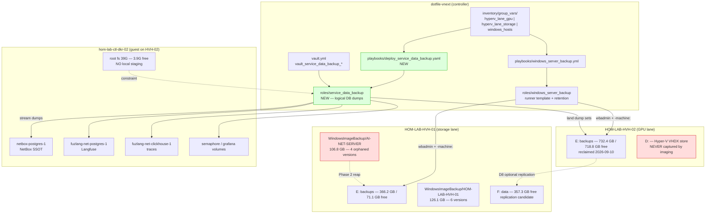
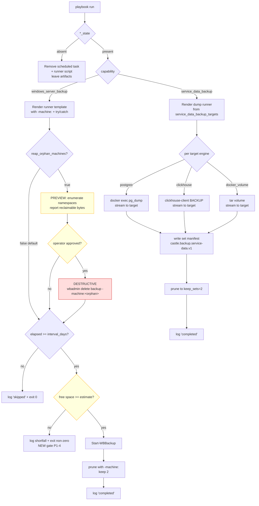
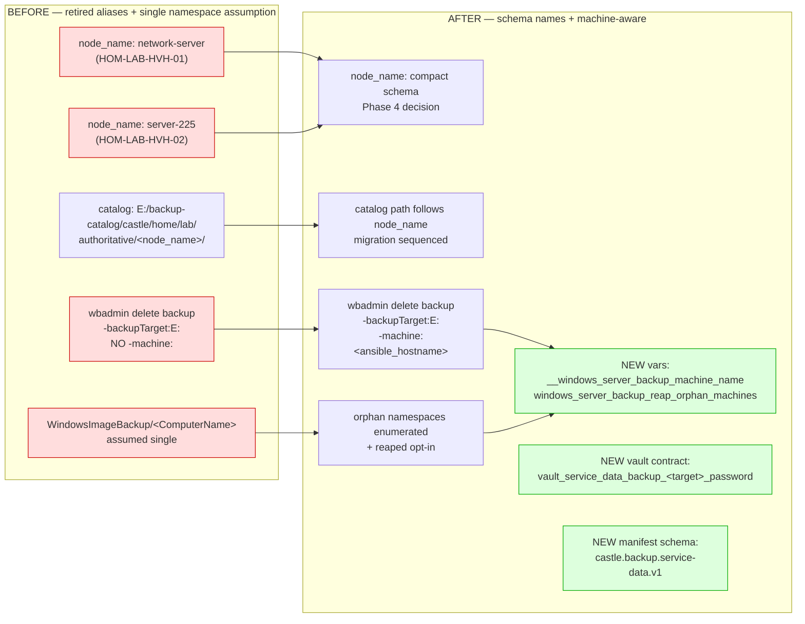

# Windows Host Backup — Retention Repair and Service-Data Dump Strategy

## Summary

The `windows_server_backup` role silently stops pruning old backup versions
after a Windows host is renamed. Both Hyper-V hosts hit this. On
**HOM-LAB-HVH-01** it caused version accumulation (10 versions retained against
a policy of 2). On **HOM-LAB-HVH-02** the same accumulation filled `E:` until a
post-rename fresh full backup no longer fit, and backups failed nightly for 112
days without alerting.

This packet does two things:

1. **Repair** the retention bug so it cannot recur on any Windows host.
2. **Replace** whole-volume bare-metal imaging with **logical database dumps**
   as the primary protected asset, because the imaged volumes are dominated by
   re-downloadable games and Ansible-managed OS state, while the genuinely
   irreplaceable data (NetBox, Langfuse) is never captured at all.

Strategy is **tentative** and intentionally written to generalize across all
Windows hosts carrying `windows_server_backup_state: present`.

---

## Root cause (proven 2026-09-10)

`roles/windows_server_backup/templates/automatic_native_host_recovery.ps1.j2`
prunes with an **unqualified** target:

```powershell
& wbadmin.exe delete backup "-version:$($oldManifest.VersionId)" "-backupTarget:$targetPath" -quiet
if ($LASTEXITCODE -ne 0) {
  throw "wbadmin delete backup failed for version $($oldManifest.VersionId) with exit code $LASTEXITCODE."
}
```

After a host rename, `E:\WindowsImageBackup\` contains **two machine
namespaces** (old name + new name). `wbadmin` then refuses any unqualified
operation:

```text
exitcode = -2
Backups of more than one computer were found in this location. Specify
which computer's backups you want to use ... use -machine:BackupMachineName
```

The non-zero exit hits the `throw`. Because `$ErrorActionPreference = 'Stop'`
is set at the top of the runner and there is **no try/catch**, the script dies
with exit `0x1` and writes no reason to its log. Retention stops permanently
and silently.

### Failure chain

| Stage | HOM-LAB-HVH-01 | HOM-LAB-HVH-02 |
| --- | --- | --- |
| Old machine name | `AI-NET-SERVER` | `DESKTOP-VLLM` |
| Current machine name | `HOM-LAB-HVH-01` | `HOM-LAB-HVH-02` |
| Prune breaks | yes | yes |
| Versions accumulated | 10 (policy: 2) | 4 (policy: 2) |
| Drive filled | 80% (71.1 GB free of 366.2 GB) | 100% effective |
| Backup still succeeding | yes — last 2026-09-09 | **no — last 2026-05-21** |
| Silent duration | ~4 months of failed pruning | 112 days of failed backups |

HVH-01 is on the same trajectory as HVH-02; it has simply not run out of room
yet.

---

## Evidence collected 2026-09-10

### HOM-LAB-HVH-02 (pre-remediation)

| Surface | Value |
| --- | --- |
| `E:` capacity | 732.4 GB total, 517.8 GB used, 214.6 GB free |
| `WindowsImageBackup` | 331.3 GB |
| VSS shadow storage | 173 GB used / 184 GB allocated / 220 GB cap |
| Versions | 4 — 01/31, 04/26, 05/13, 05/21 (all under `DESKTOP-VLLM`) |
| Scheduled task | `\castle\backup\WindowsServerBackupNativeHostRecoveryAutomatic`, daily 00:15, `LastResult 0x1` |
| Runner log | 109 bytes, single line `Starting automatic backup ...` |
| Backup event log | no start event after 2026-05-21 |

**Image contents** — `wbadmin get items` for version `05/21/2026-05:15`:

```text
b0a65a57-...vhdx   330.55 GB   C: (476.04 GB volume)
e075b8ff-...vhdx     0.70 GB   recovery partition
Esp.vhdx             0.09 GB   EFI system partition
```

`D:` is **not** in the backup. The Hyper-V VHDXs
(`hom-lab-ctl-k3s-02` 80.0 GB, `hom-lab-ctl-dkr-02` 33.8 GB) live on `D:` and
were never captured, despite `wbadmin get items` listing Hyper-V writer
components. Arithmetic confirms it: the image totals 331.34 GB and `C:` alone
accounts for 330.55 GB.

**What `C:` actually holds:**

| Path | Size | Recreatable |
| --- | --- | --- |
| `Program Files (x86)` | 135.5 GB | yes — reinstall |
| `ProgramData` | 89.0 GB | mostly |
| `SteamLibrary` | 74.1 GB | yes — re-download |
| `Windows` | 44.0 GB | yes — Ansible-managed |
| `Users` | 34.0 GB | partial |
| `Program Files` | 14.1 GB | yes |
| `XboxGames` | 2.3 GB | yes |

### HOM-LAB-HVH-01 (current, unremediated)

| Surface | Value |
| --- | --- |
| `E:` capacity | 366.2 GB total, **71.1 GB free** |
| `WindowsImageBackup\AI-NET-SERVER` | 106.8 GB — 4 versions (04/25 ×2, 05/19, 05/27) |
| `WindowsImageBackup\HOM-LAB-HVH-01` | 126.1 GB — 6 versions (07/31 → 09/09) |
| VSS shadow storage | 54.2 GB used / 59.7 GB allocated / 110 GB cap |
| Automatic manifests | 8 (policy allows 2) |
| Last successful backup | 2026-09-09 00:57 |
| Prune evidence | log ends immediately after `Deleting old automatic backup version 08/24/2026-05:15` |

### hom-lab-ctl-dkr-02 (database host)

| Container | Image | Protect? |
| --- | --- | --- |
| `netbox-postgres-1` | `postgres:16-alpine` | **yes — NetBox is repo source of truth** |
| `fuzlang-net-postgres-1` | `postgres:16` | yes — Langfuse platform |
| `fuzlang-net-clickhouse-1` | `clickhouse-server:24` | yes — Langfuse traces |
| `semaphore_semaphore-data` | volume | yes — Ansible UI state |
| `grafana_data` | volume | yes — hand-built dashboards |
| `open-webui` | `open-webui:v0.6.18` | decision pending — chat history |
| `fuzlang-net-minio-1` | `minio` | decision pending — **reporting unhealthy** |
| `netbox-redis-1`, `netbox-redis-cache-1`, `fuzlang-net-redis-1` | Redis/Valkey | no — ephemeral cache |
| `loki` | `loki:3.6.7` | no — 30-day retention by design |

**Constraint:** dkr-02 root filesystem is `39G` with `33G` used and **3.9 GB
free (90%)**. Dumps cannot be staged locally; they must stream to the target.

---

## Remediation already applied (2026-09-10)

Executed against HOM-LAB-HVH-02 with user approval as a scoped cleanup
exception (AGENTS.md Working Contract §10).

| Action | Command | Result |
| --- | --- | --- |
| Prune old versions | `wbadmin delete backup -backupTarget:E: -keepVersions:1 -quiet` | 3 versions deleted, exit 0 |
| Outcome | — | `E:` free 214.6 GB → **718.8 GB** (504 GB reclaimed) |
| Clear stale local catalog | `wbadmin delete catalog -quiet` | `Get-WBSummary` → `NumberOfVersions: 0` |
| Remove empty target shell | `Remove-Item E:\WindowsImageBackup -Recurse` (0.04 MB precheck) | `wbadmin get versions` → `No backup was found` |

**Deviation from plan — recorded honestly.** The staged intent was to retain the
2026-05-21 image until a replacement proved out. `-keepVersions:1` reported
deleting 3 of 4 versions, but the surviving version's backing VHDX was removed
along with the shadow-copy set, leaving a catalog entry with no data behind it.
**HOM-LAB-HVH-02 currently has zero restore points.** Accepted risk: the lost
image was 112 days stale, covered only `C:` (games plus Ansible-managed OS), and
provably excluded both VMs.

**HOM-LAB-HVH-01 has had no remediation applied and still holds all 10
versions.** Do not prune it with an unqualified `wbadmin delete backup` — that
is the exact call that fails with exit `-2` on a dual-namespace target.

---

## Capability Packet Boundary

| Field | Value |
| --- | --- |
| Capability identifier | `windows_host_backup_v2` |
| Owner manifest | `docs/plans/2026-09-10--windows-backup-retention-and-db-dump-strategy-incomplete/README.md` |
| Owned files | `roles/windows_server_backup/templates/automatic_native_host_recovery.ps1.j2`, `roles/windows_server_backup/defaults/main.yml`, `roles/windows_server_backup/vars/main.yml`, `roles/windows_server_backup/tasks/*.yml`, `roles/windows_server_backup/README.md`, new `roles/service_data_backup/**`, new `playbooks/deploy_service_data_backup.yaml` |
| Integration anchors | `inventory/group_vars/hyperv_lane_gpu/main.yml`, `inventory/group_vars/hyperv_lane_storage/main.yml`, `inventory/group_vars/windows_hosts.yaml`, `inventory/host_vars/hom-lab-ctl-dkr-02.yaml`, `vault.yml` (DB credentials) |
| Update behavior | Re-run `playbooks/windows_server_backup.yml` and `playbooks/deploy_service_data_backup.yaml`; both idempotent, converge to inventory desired state |
| Removal behavior | Set `windows_server_backup_state: absent` and `service_data_backup_state: absent`, re-run both playbooks (removes scheduled tasks, runner scripts, and cron/timer units); delete role directories and the anchors listed above. Does **not** delete captured dump artifacts — those are operator-owned data. |

---

## Decisions

| ID | Decision | Status |
| --- | --- | --- |
| D1 | Pass `-machine:` to every `wbadmin` retention call so renames cannot break pruning | decided |
| D2 | Wrap the runner body in try/catch so failures log a reason instead of dying at `0x1` | decided |
| D3 | Reap orphaned pre-rename machine namespaces (`AI-NET-SERVER`, and any future equivalents) | decided |
| D4 | Add logical **database dumps** as the primary protected asset | decided |
| D5 | Retention `keep 2 sets`, cadence `weekly` — existing config, made to actually work | decided |
| D6 | Retire bare-metal imaging on **HOM-LAB-HVH-02** (`C:` is games plus Ansible-managed OS) | decided |
| D7 | Bare-metal imaging on **HOM-LAB-HVH-01** — keep, shrink, or retire | **open — needs user decision** |
| D8 | Dump landing zone: host-local `E:` first, optional replication to HVH-01 `F: data` | provisional |
| D9 | `open-webui` chat history and MinIO object data in or out of scope | **open** |
| D10 | Whole-VM VHDX capture stays **out of scope** unless a database cannot be dumped cleanly | decided (per user) |
| D11 | `D:\develop` excluded — playbooks and docs already live in git | decided (per user) |

### Naming debt discovered

`windows_server_backup_node_name` still carries retired aliases:

| Host | Current `node_name` | Catalog path | Problem |
| --- | --- | --- | --- |
| HOM-LAB-HVH-01 | `network-server` | `E:\backup-catalog\castle\home\lab\authoritative\network-server\` | Retired alias — AGENTS.md Repo Truths §15 forbids new active references |
| HOM-LAB-HVH-02 | `server-225` | `E:\backup-catalog\castle\home\lab\authoritative\server-225\` | Legacy alias, not the compact schema name |

Renaming these changes on-disk catalog paths, so it must be sequenced
deliberately — see Phase 4.

---

## Phases and Checklist

### Phase 1 — Stop the bleeding (role bug fix)

- [ ] **P1-1** Add `-machine:` to the prune call in `automatic_native_host_recovery.ps1.j2`, sourced from a new `__windows_server_backup_machine_name` derived from `ansible_hostname`
- [ ] **P1-2** Wrap the runner body in try/catch; log the exception message and re-throw so the task result still reflects failure
- [ ] **P1-3** Emit a terminal log line on every path (`skipped`, `completed`, `failed`) so a 109-byte log is never ambiguous again
- [ ] **P1-4** Add a preflight free-space assertion: refuse to start and log the shortfall when free space on the target is below the estimated requirement
- [ ] **P1-5** `ansible-lint` clean; `--check` run against both hosts

### Phase 2 — Reap orphaned namespaces

- [ ] **P2-1** Add `windows_server_backup_reap_orphan_machines: false` (opt-in, default off)
- [ ] **P2-2** When enabled, enumerate machine namespaces under `E:\WindowsImageBackup\` and delete versions belonging to names that are not the current host, using `-machine:`
- [ ] **P2-3** Read-only preview first: report namespaces, version counts, and reclaimable bytes with no deletion
- [ ] **P2-4** Apply to HOM-LAB-HVH-01 `AI-NET-SERVER` (4 versions, 106.8 GB) after preview review
- [ ] **P2-5** Re-run and confirm HVH-01 converges to 2 retained versions

### Phase 3 — Service-data dumps (new capability)

- [ ] **P3-1** Create `roles/service_data_backup` with `service_data_backup_state: present|absent`
- [ ] **P3-2** Declare targets as inventory data, not hardcoded task logic:

  ```yaml
  service_data_backup_targets:
    - name: netbox
      engine: postgres
      container: netbox-postgres-1
      database: netbox
      credential_var: vault_service_data_backup_netbox_password
    - name: langfuse
      engine: postgres
      container: fuzlang-net-postgres-1
      database: langfuse
      credential_var: vault_service_data_backup_langfuse_password
    - name: langfuse_traces
      engine: clickhouse
      container: fuzlang-net-clickhouse-1
      database: default
      credential_var: vault_service_data_backup_clickhouse_password
    - name: semaphore
      engine: docker_volume
      volume: semaphore_semaphore-data
    - name: grafana
      engine: docker_volume
      volume: grafana_data
  ```

- [ ] **P3-3** Stream dumps to the target — **no local staging** (dkr-02 has 3.9 GB free)
- [ ] **P3-4** Vault entries per `vault_service_data_backup_<target>_password` naming contract
- [ ] **P3-5** Retention: keep `service_data_backup_keep_sets: 2`, cadence `service_data_backup_interval_days: 7`
- [ ] **P3-6** Write a per-set manifest (schema `castle.backup.service-data.v1`) mirroring the existing native-host-recovery manifest shape
- [ ] **P3-7** Restore rehearsal — prove a NetBox dump restores into a throwaway Postgres container **before** this counts as complete
- [ ] **P3-8** Record real dump sizes and update D8 sizing

### Phase 4 — Naming reconciliation

- [ ] **P4-1** Decide target `node_name` values matching the compact schema
- [ ] **P4-2** Migration path for existing catalog paths (move vs. leave-and-restart)
- [ ] **P4-3** Update `inventory/group_vars/hyperv_lane_*/main.yml`
- [ ] **P4-4** Confirm no active reference to `network-server` or `server-225` remains

### Phase 5 — Imaging posture

- [ ] **P5-1** HOM-LAB-HVH-02: set `windows_server_backup_state: absent` per D6, or repoint to a reduced volume set
- [ ] **P5-2** HOM-LAB-HVH-01: resolve D7
- [ ] **P5-3** Document the recovery story that replaces bare-metal restore (Ansible rebuild path)

---

## Apply / Verify / Undo / Change class

| Field | Value |
| --- | --- |
| **Apply** | `ansible-playbook playbooks/windows_server_backup.yml --limit HOM-LAB-HVH-01,HOM-LAB-HVH-02` then `ansible-playbook playbooks/deploy_service_data_backup.yaml --limit hom-lab-ctl-dkr-02` |
| **Verify** | `wbadmin get versions -backupTarget:E: -machine:<current>` shows exactly 2 versions per host; runner log contains a terminal line for every run; `Get-ScheduledTaskInfo` reports `LastTaskResult 0x0`; a NetBox dump restores into a scratch Postgres container (P3-7) |
| **Undo** | `-e windows_server_backup_state=absent` and `-e service_data_backup_state=absent`, re-run both playbooks. Removes scheduled tasks and runner scripts; leaves captured artifacts in place. |
| **Change class** | Phase 1, 3, 4, 5 — idempotent config. **Phase 2 — destructive** (deletes backup versions); requires read-only preview and explicit approval per run. |

---

## Architecture/Structure Diagram

Medium: `mermaid-fence`.



## Capability Routing Diagram

Medium: `mermaid-fence`. Routing matters — lifecycle state, per-host branching,
preview vs apply, and a destructive path that must gate on approval.



## Naming/Modeling Diagram

Medium: `mermaid-fence`. Required — the packet changes node naming, catalog
paths, machine-namespace handling, and introduces new variable and vault names.



---

## Mandatory NetBox slice

`netbox_scope: false` — **N/A with reason.**

This packet **protects** the NetBox database but declares no NetBox object,
naming, service, registry, DNS, or ingress changes. No device, VM, IP, service,
or custom-field records are created, renamed, or removed.

| Contract | Status |
| --- | --- |
| Declared | N/A — no NetBox-managed objects in scope |
| Applied | N/A — no seed/apply path invoked |
| Verified | N/A — `validate_netbox_repo_consistency.sh` not required for this packet |

If Phase 4 naming reconciliation ends up changing NetBox-registered host names,
this determination must be revisited and a full Declared/Applied/Verified slice
added before that phase executes.

---

## Assumptions and defaults

1. Windows Server Backup remains the imaging mechanism where imaging is kept;
   this packet does not evaluate third-party backup products.
2. `E:` labelled `backups` stays the on-host landing volume for both hosts.
3. Logical dumps are preferred over whole-VM images for anything expressible as
   a database dump (user direction, 2026-09-10).
4. `D:\develop` is excluded — it holds playbooks and docs already tracked in git.
5. Redis/Valkey caches and Loki logs are treated as ephemeral and excluded.
6. dkr-02 cannot stage dumps locally; streaming is a hard requirement, not a
   preference.
7. Retention of 2 sets on a 7-day cadence gives roughly a two-week recovery
   window. Accepted.
8. Losing bare-metal restore means host rebuild goes through Ansible. Accepted
   for HVH-02 under D6; unresolved for HVH-01 under D7.

## Open research

| ID | Question | Blocks |
| --- | --- | --- |
| RQ-1 | Correct ClickHouse dump method for `clickhouse-server:24` — native `BACKUP` vs `clickhouse-client` export vs `clickhouse-backup` | P3-2 |
| RQ-2 | Does Semaphore store state in its Docker volume alone, or an external DB? | P3-2 |
| RQ-3 | Is `fuzlang-net-minio-1` holding Langfuse media that matters, and why is it unhealthy? | D9 |
| RQ-4 | Real compressed dump sizes for sizing D8 | P3-8 |
| RQ-5 | Does renaming `node_name` require migrating existing catalog paths, or can it restart cleanly? | P4-2 |
| RQ-6 | Does HVH-01 warrant continued bare-metal imaging given its storage-lane role? | D7 |

Per HRL `AGENTS.md`, RQ-1 and RQ-2 should route through Context7
(`resolve-library-id` + topic query) before implementation.

---

## On Deck — user decisions to integrate

| ID | User decision / direction | Target integration | Status |
| --- | --- | --- | --- |
| OD-1 | "Once a week backup, keep only two" | D5, P3-5 | integrated |
| OD-2 | "Don't include whole-VM images unless they are databases" | D10 | integrated |
| OD-3 | "Not the playbooks and docs" — exclude `D:\develop` | D11 | integrated |
| OD-4 | "Database dumps" as primary scope | D4, Phase 3 | integrated |
| OD-5 | "Tentative strategy to apply across Windows servers including HVH-01" | Phases 1, 2, 4, 5 target both hosts | integrated |
| OD-6 | Staged reclaim, keep newest until replacement proves out | Attempted; deviated — see Remediation section | **needs user acknowledgement** |
| OD-7 | HVH-01 imaging posture | D7 | **awaiting decision** |
| OD-8 | `open-webui` and MinIO scope | D9 | **awaiting decision** |

---

## Diagram gate receipt

| Requirement | Status | Medium |
| --- | --- | --- |
| Architecture/Structure Diagram | present — repo files, roles, playbooks, inventory anchors, both Windows hosts, guest DB host, volumes, data flow | `mermaid-fence` |
| Capability Routing Diagram | present — required; lifecycle `present\|absent`, per-capability branching, interval gate, new free-space gate, preview/approve/destructive path | `mermaid-fence` |
| Naming/Modeling Diagram | present — required; retired aliases, catalog paths, machine-namespace model, new variable and vault contracts | `mermaid-fence` |
| Diagram Inventory | present — final section | — |
| Gate result | **pass** | — |

Mermaid chosen per `docs/plans/README.md` ("Include Mermaid diagrams") and
`docs/codex_framework/architecture-diagram-routing.md`, which permits fenced
Mermaid where Mermaid is the established medium for stored plans.

## Diagram Inventory

| Diagram | Included | Medium |
| --- | --- | --- |
| Architecture/Structure | yes | `mermaid-fence` |
| Capability Routing | yes | `mermaid-fence` |
| Naming/Modeling | yes | `mermaid-fence` |
| Sequence (dump → stream → manifest → prune) | no | candidate — add at P3-1 if the streaming contract proves subtle |
| State machine (backup version lifecycle) | no | candidate — folded into Capability Routing |
| Entity/data model (manifest schema) | no | candidate — add when `castle.backup.service-data.v1` is specified |
| Network/topology (guest → host landing path) | no | candidate — add if D8 cross-host replication is approved |
| Restore/recovery runbook flow | no | **recommended** — add at P3-7 alongside the restore rehearsal |
