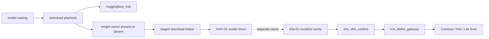
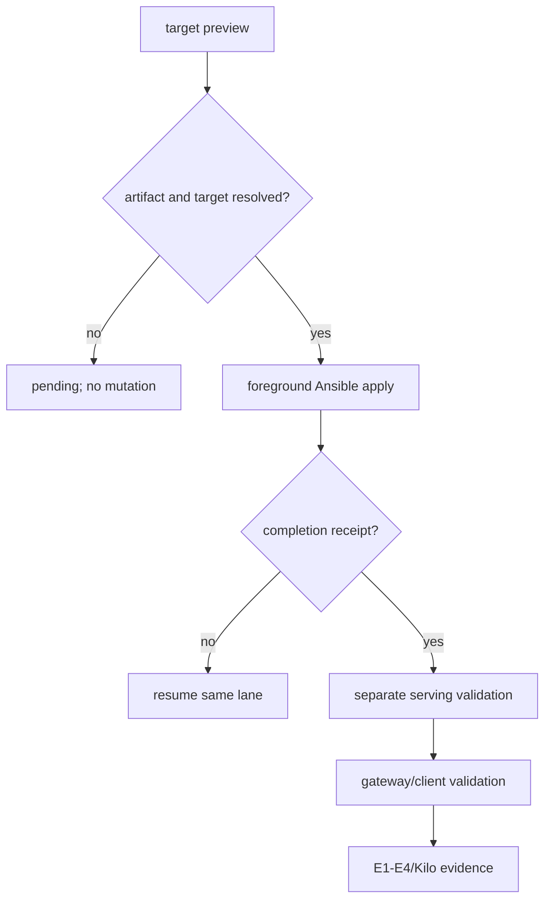

# 5090 model iteration infrastructure

This packet owns the implementation needed to download and later validate the
selected 5090 model candidates. A catalog row, Ready pod, or LiteLLM alias is
not evidence that the corresponding weight tree, serving identity, and live
inference path are all proven.

## Current implementation boundary

The model-share surface is `HOM-LAB-HVH-01` at
`F:\shares\public\models\huggingface`. The 5090 runtime surface is the K3s
guest `hom-lab-ctl-k3s-02`, with its HF cache on `/mnt/k3s-cache/hf/hub`.
These are separate hosts and storage contracts.

The first implementation slice adds `roles/huggingface_model_weights/`, which
owns explicit weight directories with `present|absent`, completion receipts,
and resumable foreground downloads. `roles/huggingface_hub/` owns the client
prerequisite. `scripts/download_hf_model.py` is role-staged implementation
glue, not an operator entrypoint.

`gpt-oss:20b` remains an Ollama catalog lane and is intentionally excluded from
this HF playbook.

## Candidate disposition

| Candidate | Artifact | Runtime | Current disposition | Promotion gate |
| --- | --- | --- | --- | --- |
| Qwen3-Coder-30B-A3B | `cyankiwi/Qwen3-Coder-30B-A3B-Instruct-AWQ-4bit` | vLLM 5090 | selected; runtime reference exists, weight receipt pending | live inference, tools, VRAM, gateway, E1-E4 |
| Qwen3.6-35B-A3B | `nvidia/Qwen3.6-35B-A3B-NVFP4` | sequential vLLM evaluation | selected; not concurrent on the 5090 | exact files, load, VRAM, E1-E4 |
| Devstral Small 2 | bartowski Q4_K_M GGUF | llama.cpp-compatible evaluation | selected for weight evaluation; not vLLM-pinned | runtime and E1-E4 evidence |
| GLM-4.6 | Unsloth Q4_K_M GGUF | llama.cpp-compatible evaluation | selected for experimental evaluation | runtime, license and E1-E4 evidence |
| gpt-oss-20b | `gpt-oss:20b` | Ollama | catalog/client lane only; excluded from HF download | Ollama and gateway evidence |

The four HF candidates are sequential/evaluation-only on one 32 GiB 5090
unless a later plan proves a separate compatible lane. No new client alias is
published for an unserved weight tree.

## Capability Packet Boundary

| Field | Value |
| --- | --- |
| Capability identifier | `model_iteration_infra` |
| Owner manifest | `inventory/group_vars/model_catalog/manifest.yml` plus this packet |
| Owned files | `roles/huggingface_model_weights/`, `scripts/download_hf_model.py`, `playbooks/download_5090_models.yaml`, packet evidence |
| Integration anchors | `roles/huggingface_hub/`, `roles/k3s_vllm_runtime/`, `roles/k3s_litellm_gateway/`, Lite Eval packet |
| Update behavior | Change the catalog/list, preview the exact host, apply foreground Ansible, then promote runtime/routes only with evidence |
| Removal behavior | `state=absent` with an explicit lane list; never remove the share root or unrelated trees |

## Ansible knowledge receipt

Repo surfaces checked: `roles/huggingface_hub`, `roles/k3s_vllm_runtime`,
`roles/k3s_litellm_gateway`, model catalog, both HVH host vars, downloader,
vLLM deploy playbook, and the agent-lane validation packet.

Authority checked: repo `AGENTS.md`, `hf-model-weight-lifecycle`,
`ansible-knowledge-gate`, and the existing Hub role. Context7/registered
Ansible MCP was unavailable in this session; local collection metadata and
existing repo module patterns were used. Upstream checks confirmed the NVIDIA
Qwen3.6 NVFP4 tree contains config/tokenizer/safetensors files and the
Devstral repository documents its Q4_K_M GGUF artifact.

| Surface | Module/tool | Fit | Design consequence |
| --- | --- | --- | --- |
| Hub client | `ansible.windows.win_command` via `huggingface_hub` | yes | existing role owns package |
| Directory lifecycle | `ansible.windows.win_file` | yes | one bounded directory per lane |
| Helper staging | `ansible.windows.win_copy` | yes | no unowned host script |
| Resumable snapshot | staged `snapshot_download` helper | partial | completion receipt makes result observable |
| Receipt check | `win_stat` + `assert` | yes | catalog cannot claim downloaded alone |

Open gaps: live reachability, share contents, Hub version, receipts, current
vLLM identity, and E1-E4/Kilo results remain unverified until the bounded
apply/probe runs.

## Apply / Verify / Undo / Change class

Apply: preview the explicit `HOM-LAB-HVH-01` target, then run
`playbooks/download_5090_models.yaml` in the foreground. Runtime swaps remain
separate through `deploy_vllm_runtime.yaml`.

Verify: task output, per-lane receipts, catalog path alignment, vLLM readiness
and inference, GPU/VRAM, cache mount, gateway routes, Lite Eval, and Kilo where
applicable.

Undo: run the weight role with `huggingface_model_weights_state=absent` and an
explicit lane list; use the vLLM retained-deployment rollback path for swaps.

Change class: large resumable network/storage mutation; deletion is destructive;
runtime swap is Recreate/rolling and separately gated.

## Checklist

- [x] Replace fire-and-forget download with an Ansible-owned lifecycle role.
- [x] Correct Qwen3 primary artifact to the AWQ repo used by vLLM.
- [x] Keep model-share and 5090 runtime hosts separate.
- [ ] Run read-only target verification and capture inclusion/exclusion evidence.
- [ ] Apply weights and capture each completion receipt.
- [ ] Reconcile catalog status and `unc_path` from Ansible evidence.
- [ ] Validate Qwen3 vLLM inference and tool calling.
- [ ] Evaluate Qwen3.6, Devstral, and GLM sequentially.
- [ ] Run Lite Eval E1-E4 and applicable Kilo probes.
- [ ] Run changed playbooks twice and record second-run `changed=0`.
- [ ] Add final plan verification receipt after evidence collection.

## Plan verification receipt

Status: partial implementation. No live download or model swap was executed in
this slice. The checked rows are repository changes; live obligations remain
pending and are not represented as passed.

| Obligation | Evidence | Status |
| --- | --- | --- |
| Weight owner | `roles/huggingface_model_weights/` | implemented; syntax verified |
| Artifact identity | Qwen3 AWQ in playbook/catalog/runtime | implemented; live pending |
| Target safety | canonical host from inventory/catalog | implemented; target list verified |
| Download completion | per-lane receipt | pending live apply |
| Serving/gateway | vLLM, LiteLLM, Continue | pending fresh probes |
| Candidate evaluation | E1-E4/Kilo | pending |
| Idempotence | first/second runs | pending |

## On Deck — user decisions to integrate

| ID | User direction | Target integration | Status |
| --- | --- | --- | --- |
| D-01 | Start model iteration infrastructure | this packet and weight owner | integrated |
| D-02 | Update needed playbooks/roles | downloader, Hub prerequisite, owner role | integrated |
| D-03 | Add extra plan files as needed | receipts and validation artifacts | ongoing |

## Architecture/Structure Diagram



## Capability Routing Diagram



## Naming/Modeling Diagram

```mermaid
flowchart LR
  lane[catalog lane] --> artifact[quantized repo]
  artifact --> directory[org--repo directory]
  directory --> receipt[completion receipt]
  artifact --> runtime[served model identity]
  runtime --> alias[model@host~friendly alias]
  receipt -. does not prove .-> runtime
  alias -. does not prove .-> receipt
```

## Diagram Inventory

| Diagram | Medium | Purpose |
| --- | --- | --- |
| Architecture/Structure | mermaid-fence | repo/share/runtime/gateway boundaries |
| Capability Routing | mermaid-fence | preview/apply/resume/serve/validate gates |
| Naming/Modeling | mermaid-fence | lane/artifact/receipt/runtime separation |
| Optional sequence | not generated | add after live request evidence |

## Sources checked

- `AGENTS.md`, `.codex/config.toml`, and `docs/codex_framework/*`
- `.cursor/skills/hf-model-weight-lifecycle/SKILL.md`
- `.cursor/skills/ansible-knowledge-gate/SKILL.md`
- model catalog and HVH/K3s inventory files
- Hugging Face repositories for Qwen3 AWQ, Qwen3.6 NVFP4, Devstral GGUF, and GLM-4.6 GGUF
