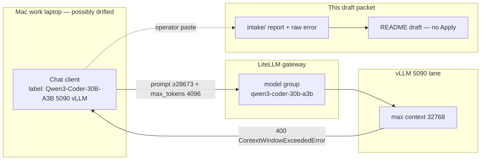
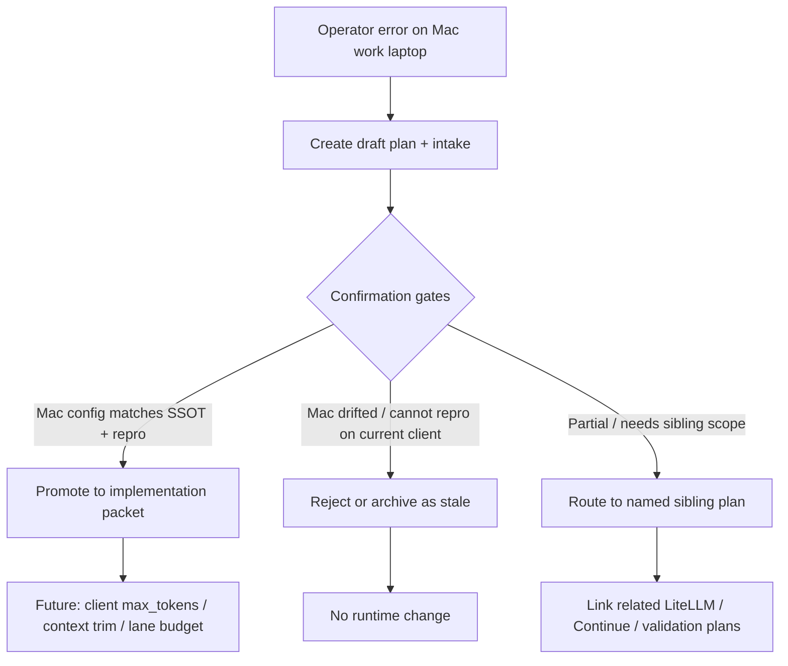

# Mac work laptop — Qwen3-Coder-30B context window exceeded (draft)

**Status:** draft intake only. Not confirmed. Do not treat as a build/execute
slice until Mac client drift is ruled in or out and the failure is reproduced
on a known-current surface.

**Why `-draft`:** Operator reported the error from the Mac work laptop; that
machine’s Continue/IDE LiteLLM wiring may be deprecated or out of sync with
repo SSOT. This packet preserves the conversation + raw report without
assuming the failure is still true of the managed stack.

## Summary

On the Mac work laptop, a chat against **Chat Qwen3-Coder-30B-A3B (5090 vLLM)**
failed with LiteLLM `ContextWindowExceededError`: model max context **32768**,
prompt **≥28673** input tokens + requested **4096** output tokens ⇒ total
**≥32769**. Model group reported: `qwen3-coder-30b-a3b`. No fallbacks available.

Token arithmetic from the error (not independently verified this turn):

| Component | Tokens (from error) |
| --- | ---: |
| Model max context | 32768 |
| Input (prompt) | ≥28673 |
| Requested output (`max_tokens`) | 4096 |
| Sum | ≥32769 (exceeds by ≥1) |

## Intake artifacts

| Artifact | Purpose |
| --- | --- |
| [intake/README.md](intake/README.md) | Intake index and confirmation gates |
| [intake/2026-09-16--conversation-and-operator-report.md](intake/2026-09-16--conversation-and-operator-report.md) | Conversation framing + operator narrative |
| [intake/raw-error.txt](intake/raw-error.txt) | Verbatim client/gateway error text |

## Apply / Verify / Undo / Change class

| | |
| --- | --- |
| **Apply** | **None in this draft.** Capture intake only. No Ansible, client config, LiteLLM, or vLLM changes. |
| **Verify** | Later (promotion gate): reproduce against current managed client + `http://litellm.hom.lab/v1`; compare Mac work-laptop config to inventory SSOT (`continue_ide_hosts`, LiteLLM model list, vLLM `max_model_len`). |
| **Undo** | N/A for intake. Packet may be archived or renamed when promoted/rejected. |
| **Change class** | Documentation / intake only (non-mutating). |

## Working hypotheses (unconfirmed)

These are **candidate causes only** — do not implement against them yet:

1. **Client `max_tokens` too high for remaining budget** — 4096 completion tokens leaves only ~28672 for prompt on a 32k window; a large chat/rules/tool payload tips over the edge.
2. **Mac work-laptop client drift** — local Continue/Cursor/other chat profile may still request 4096 (or inject oversized always-on context) while managed inventory expects different limits.
3. **Gateway/model group truthful** — LiteLLM correctly rejected; backend max is 32768 (`max_model_len` class already noted for this lane in inventory research notes).
4. **Not a weight/runtime OOM** — this is a context-length BadRequest, not a VRAM failure.

Repo-adjacent context (background only, not confirmation):

- Inventory research matrix pins Continue chat `client_id: qwen3-coder-30b-a3b` with vLLM `max_model_len` / 32k budget notes in `inventory/group_vars/continue_ide_hosts/main.yml`.
- Framework always-on context budget guidance (`framework-context-budget.mdc`) documents that Cursor tool schemas + always-on rules can exceed a 32k local window.

## Explicit non-goals (this draft)

- Do not change LiteLLM `model_list`, router settings, or vLLM `--max-model-len`.
- Do not retune Mac work-laptop Continue/Cursor profiles.
- Do not claim root cause or mark related LiteLLM/client plans blocked.
- Do not promote to `incomplete-wip` / implementation until confirmation gates in `intake/README.md` pass or the issue is rejected as stale drift.

## Capability Packet Boundary

Not applicable until this draft is promoted to an implementation packet. Intake
owns only files under this plan folder.

| Field | Value |
| --- | --- |
| Capability identifier | TBD on promotion |
| Owner manifest | This README (draft) |
| Owned files | This plan folder + `intake/` |
| Integration anchors | TBD (LiteLLM gateway / Continue IDE client / context budget) |
| Update behavior | Append intake evidence; do not mutate runtime |
| Removal behavior | Delete or archive this draft plan folder |

## Checklist (intake only)

- [x] Create draft plan folder with `-draft` suffix
- [x] Store conversation + raw error under `intake/`
- [ ] Confirm whether Mac work-laptop client config matches current Ansible SSOT
- [ ] Reproduce (or fail to reproduce) on a known-current managed client
- [ ] Decide: promote to implementation packet, reject as stale drift, or route to a named sibling plan

## On Deck — user decisions to integrate

| ID | User decision / direction | Target integration | Status |
| --- | --- | --- | --- |
| OD-1 | Do not fix in this turn; treat as unconfirmed due to possible Mac drift | Kept as draft lifecycle + intake-only Apply | integrated |
| OD-2 | Name folder for observed symptom; suffix `-draft` | Folder name on this packet | integrated |

## Architecture/Structure Diagram

## Capability Routing Diagram

## Naming/Modeling Diagram

N/A — this draft does not change names, aliases, NetBox objects, or naming standards.

## Diagram gate receipt

- [x] Architecture/Structure: client → LiteLLM model group → vLLM 32k → intake packet
- [x] Capability Routing: included (intake → confirm → promote/reject/route)
- [x] Naming/Modeling: N/A — no naming/alias/NetBox changes in this draft
- [x] Diagram Inventory lists every required section above

## Diagram Inventory

| Diagram | Included | Medium |
| --- | --- | --- |
| Architecture/Structure | yes | mermaid-fence |
| Capability Routing | yes | mermaid-fence |
| Naming/Modeling | N/A | — |
| Sequence / error path detail | not drawn | optional later |
| Pack SVG via create-diagrams | not used | mermaid preferred for draft intake |

## Assumptions / defaults

1. The pasted error text is the primary evidence; no live Mac probe was run in this conversation.
2. Folder suffix `-draft` means unconfirmed / possible client drift, not “approved incomplete-wip.”
3. Related LiteLLM and Continue plans remain authoritative for managed intent; this packet does not override them.
4. Promotion requires fresh confirmation evidence, not this intake alone.
