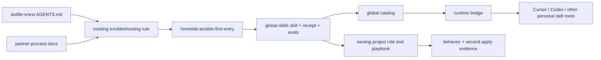
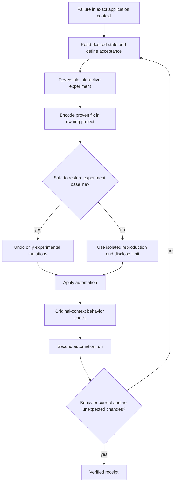
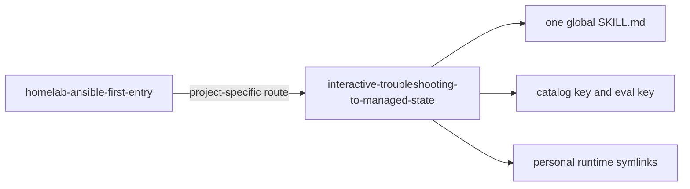
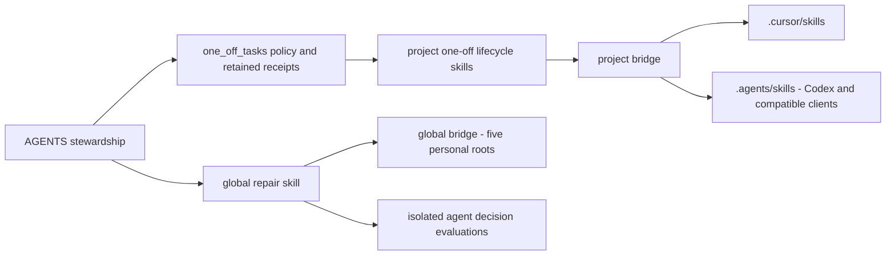

# Interactive troubleshooting to managed state

Implement the [approved outline](approved-outline.md): one portable global skill
and thin dotfile-vnext routing, with reversible interactive diagnosis followed
by project-owned repair, behavioral verification, and a second automation run.

## Capability Packet Boundary

Owner manifest: [capability.yml](capability.yml). Global-skills owns the portable
procedure, receipt template, catalog and evaluations. Dotfile-vnext owns its
Ansible entry route and framework integration. No inventory, service, NetBox,
package-installation, or original Cursor PATH changes belong to this slice.
The existing project skill store is usable; no second skill store is introduced.

## Apply / Verify / Undo / Change class

- Apply: update the global pack and project routing; run the existing global
  runtime bridge. Project files are already consumed from this checkout.
- Verify: metadata/catalog validation, source conflict review, three scenario
  walkthroughs plus executable isolated Ansible behavior fixtures, and runtime
  link resolution in Cursor and Codex (also the bridge's other targets).
- Undo: remove this skill's catalog/eval entries and managed runtime symlinks,
  then reverse only this packet's integration edits. Preserve unrelated work.
- Change class: reversible agent configuration and documentation. Isolated
  fixture Ansible runs demonstrate convergence; no production host repair is
  necessary to apply these instruction changes.

## Assumptions and defaults

- Read the desired state and define the original-context acceptance probe first.
- Allow bounded reversible experiments within existing authorization, including
  before the failing Ansible task is known. Capture baseline and undo steps.
- Compact saved command evidence is enough for ordinary diagnosis; collectors
  are justified by recurrence, complexity, volume, or an existing useful collector.
- Restore only experiment-owned mutations. Use isolation when restoring a
  production failure would be unsafe, and disclose the evidence boundary.
- A zero-change run never substitutes for application behavior. No new mandatory
  research, planning, collector, or permission layer is introduced.

## Execution sequence

1. Scaffold the portable skill and manifest-backed integration.
2. Reconcile AGENTS, troubleshooting rule, entry skill and companion routing,
   partner-process docs, and any active contradictory debugging exception.
3. Exercise all three approved scenarios and inspect actual command results.
4. Validate metadata and project routing; preview and apply runtime bridge.
5. Record the full obligation inventory and verification evidence.

## Architecture/Structure Diagram

## Capability Routing Diagram

## Naming/Modeling Diagram

## Plan verification receipt

[implementation-accounting.md](implementation-accounting.md) inventories all
approved obligations, including the ten-step workflow, safety, thin integration,
scenario behavior, metadata, runtime apply, and diagram/ownership requirements.
No plan-family dependencies or unresolved on-deck decisions exist.

## Diagram gate receipt

Architecture, routing and naming views are present above as Mermaid fences.
They map canonical source ownership, runtime consumers, diagnosis/rollback/apply
branches and catalog/runtime names to the implemented files. Mermaid was chosen
for these small instruction diagrams; no NetBox or infrastructure name is added.

## Approved extension — stewardship, exceptions and client synchronization

The user approved this additional slice on 2026-09-22:
- Project stewardship remains the objective even for authorized manual actions.
- Every explicit one-off request gets a lightweight durable entry under
  docs/one_off_tasks; request, authority, action/result, remaining state and
  user-owned disposition survive cleanup and promotion.
- Five fresh agent decision scenarios exercise ordinary repair, manual-only,
  experimental rollback, zero-change-but-broken, and unsafe/concurrent changes.
- Reconcile overlapping rules and one-off skills; no extra framework layer.
- Inspect global and project bridges, fix client coverage gaps, synchronize twice
  and verify canonical links/content. Distinguish synchronized from client-loaded.

Owner split: AGENTS holds the objective; global skill owns portable repair;
one_off_tasks README owns exception records; entry skills route; existing bridges
own runtime discovery. Project .agents/skills adds Codex discovery alongside
.cursor/skills; global bridge continues its five personal roots.

Apply: scoped source edits and existing bridge entrypoints. Verify: validators,
agent fixture artifacts, bridge preservation checks and repeat synchronization.
Undo: reverse extension-only source changes and remove only newly managed links;
preserve existing records and unrelated work. Class: reversible configuration.

Extension obligations E01–E06 passed; results are in [extension-receipt.md](extension-receipt.md). The earlier
13-row receipt remains the historical first-slice record.

## Diagram Inventory

- Architecture/Structure: Mermaid fence; file ownership and runtime consumers.
- Capability Routing: Mermaid fence; diagnosis, rollback, apply and verification.
- Naming/Modeling: Mermaid fence; one canonical skill and integration names.
- Other available types: sequence diagram; unnecessary for this linear workflow.
- Diagram gate: all three required views included; Mermaid intentionally chosen
  for small instruction-routing diagrams. No infrastructure naming changes.
