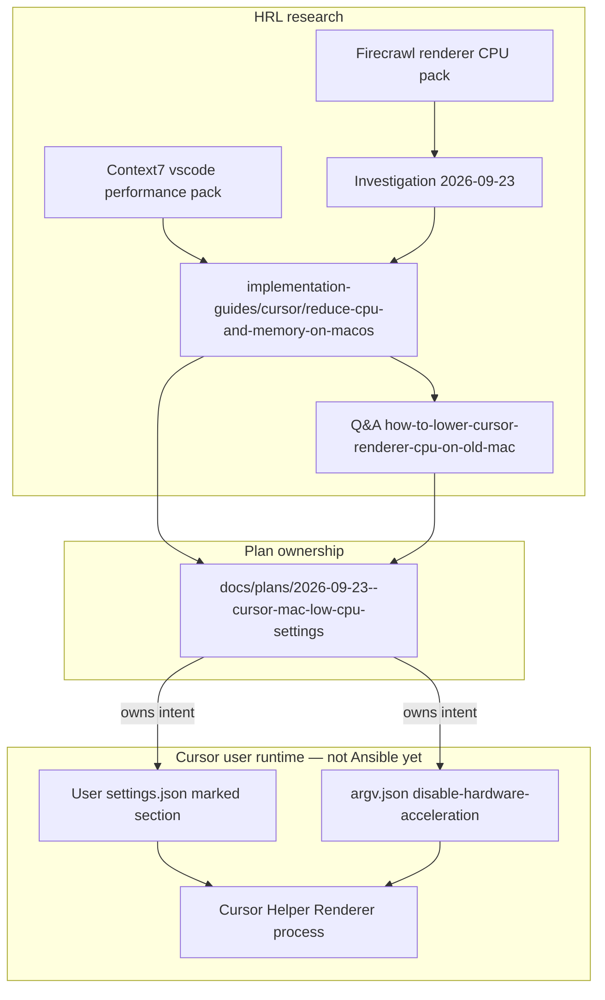
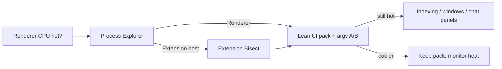
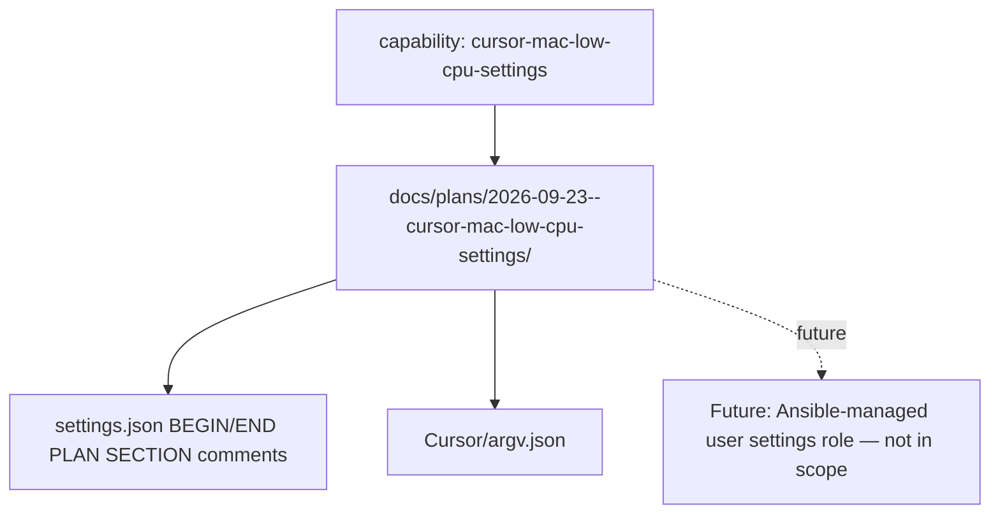

# Cursor Mac low-CPU settings (old Intel workstation)

## Brief summary

Lower Cursor **Helper (Renderer)** CPU and heat on the work laptop
(Intel i7-4770HQ, macOS 12.7.6) by sacrificing looks for efficiency, so agent
work has more headroom. Research lands in HRL; applied knobs live in the
Cursor **user** settings surface with a plan-owned marked section (no Ansible
settings role yet).

## Capability Packet Boundary

| Field | Value |
|-------|-------|
| Capability identifier | `cursor-mac-low-cpu-settings` |
| Owner manifest | This plan folder (`docs/plans/2026-09-23--cursor-mac-low-cpu-settings/`) |
| Owned files | Marked section in `~/Library/Application Support/Cursor/User/settings.json`; `~/Library/Application Support/Cursor/argv.json` |
| Integration anchors | Comment banner in settings.json referencing this plan path; HRL guide + Q&A |
| Update behavior | Edit the marked settings section and/or argv.json; update this plan + HRL when guidance changes |
| Removal behavior | Delete the marked settings section keys (or restore prior values); delete or flip `argv.json`; leave HRL research in place |

## Why settings live outside Ansible (design)

There is **no clear project path** today for managing Cursor/VS Code **user**
`settings.json` / `argv.json` via Ansible inventory roles. Those files are
per-machine IDE state under `~/Library/Application Support/Cursor/`.

**Design decision for this plan:**

1. This plan folder is the **design and ownership** record for the lean pack.
2. Applied values go into a **marked section** of the user `settings.json`
   (and `argv.json` for hardware acceleration).
3. The marked section **references this plan path** for traceability.
4. A future Ansible/user-dotfile role may absorb the pack; until then, do not
   invent a half-managed role — keep the plan as SSOT for intent.

## Host evidence

| Fact | Value |
| --- | --- |
| CPU | Intel Core i7-4770HQ @ 2.20GHz |
| Arch | x86_64 |
| macOS | 12.7.6 (21H1320) |
| Symptom | Cursor Helper (Renderer) often ~20%+ CPU |
| Baseline note | `git.blame.editorDecoration.enabled: true` before apply |

## Research (HRL)

| Artifact | Path |
| --- | --- |
| Investigation | `homelab-reference-library/notes/investigations/2026-09-23--cursor-renderer-cpu-old-intel-mac.md` |
| Implementation guide (updated) | `homelab-reference-library/implementation-guides/cursor/reduce-cpu-and-memory-on-macos.md` |
| Q&A | `homelab-reference-library/q-and-a/cursor/how-to-lower-cursor-renderer-cpu-on-old-mac.md` |
| Context7 pack | `homelab-reference-library/generated/context7/vscode/performance-reduce-cpu-settings/` |
| Firecrawl pack | `homelab-reference-library/generated/firecrawl/cursor/renderer-cpu-intel-mac-2026-09-23/` |
| Prior investigation | `homelab-reference-library/notes/investigations/2026-07-29--cursor-vscode-editor-efficiency-macos.md` |

## Proposed changes (applied)

### A. Marked section in user `settings.json`

Banner comments + lean pack keys. Flip-test comments sit above settings where
A/B is the suggested validation approach.

### B. Create `argv.json`

`"disable-hardware-acceleration": true` with flip-test comment (Haswell GPU
path often costs CPU). Requires full Cursor quit/reopen.

### C. Related non-section edits inside the pack ownership

- Set `git.blame.editorDecoration.enabled` to `false` (was true; paint cost)
- Expand `files.watcherExclude` / add `search.exclude` for large trees

## Architecture/Structure Diagram

## Capability Routing Diagram

## Naming/Modeling Diagram

## Apply / Verify / Undo / Change class

| | |
| --- | --- |
| **Apply** | Write marked section into user `settings.json`; create `argv.json`; update HRL artifacts |
| **Verify** | JSONC parses; section banner present; Process Explorer after full restart — renderer idle lower; optional flip tests documented in comments |
| **Undo** | Remove marked section / restore prior values; delete or set `disable-hardware-acceleration: false`; HRL docs may remain |
| **Change class** | Workstation IDE config (manual user files); documentation; **not** Ansible host mutation |

## Implementation status (this execute)

| Step | Status | Evidence |
| --- | --- | --- |
| Persist research to HRL | done | investigation, guide update, Q&A, Context7 + Firecrawl packs, catalog entry |
| Create this plan packet | done | this README |
| Apply settings marked section | done | user `settings.json` |
| Create `argv.json` | done | `~/Library/Application Support/Cursor/argv.json` |
| Operator full quit/reopen | pending | required for argv GPU flag; operator action |
| Extension bisect | deferred | only if renderer still hot after lean pack |

## Flip-to-test settings (operator)

These are called out in-file with `FLIP TEST` comments:

| Key | Applied lean | Alternate to try if worse / to compare |
| --- | --- | --- |
| `disable-hardware-acceleration` (`argv.json`) | `true` | `false` |
| `terminal.integrated.gpuAcceleration` | `"off"` | `"auto"` or `"on"` |
| `workbench.reduceMotion` | `"on"` | `"off"` / `"auto"` |
| `editor.cursorBlinking` | `"solid"` | `"blink"` |
| `editor.minimap.enabled` | `false` | `true` |
| `workbench.iconTheme` | `null` | previous theme id |
| `git.blame.editorDecoration.enabled` | `false` | `true` |

## Checklist

- [x] HRL research persisted and linked
- [x] Plan documents settings ownership design (no Ansible path yet)
- [x] Marked settings section references this plan folder
- [x] Flip-test comments on A/B knobs
- [x] Sources checked recorded below
- [x] Settings + argv applied
- [ ] Operator fully quits/reopens Cursor and confirms cooler renderer

## Sources checked

| Source | Label |
| --- | --- |
| Context7 `/microsoft/vscode-docs` | GPU off, watcherExclude, lean UI examples |
| Context7 `/websites/cursor` | Little local IDE perf (cloud agent docs) |
| https://forum.cursor.com/t/cursor-helper-renderer-high-cpu-usage-ui-lags/163901 | Helper Renderer symptom on Mac |
| https://zencoder.ai/blog/how-to-make-vs-code-faster | watcherExclude, codeLens, tab limits, themes |
| https://medium.com/@krtirtho/make-visual-studio-code-less-ram-consuming-faster-90db8c76a187 | Watchers / extensions on low-end machines |
| https://stackoverflow.com/questions/74851227/code-helper-process-by-vs-code-eating-my-cpu | Extension bisect diagnostic |
| HRL guide `implementation-guides/cursor/reduce-cpu-and-memory-on-macos.md` | Existing + refreshed operator procedure |
| HRL investigation `2026-07-29--cursor-vscode-editor-efficiency-macos` | Prior renderer / WindowServer findings |
| Live host: `uname -m`, `sysctl machdep.cpu.brand_string`, `sw_vers` | Haswell Intel Mac evidence |
| User `settings.json` read | Baseline before apply |

## Diagram Inventory

| Diagram | Medium | Included |
| --- | --- | --- |
| Architecture/Structure | mermaid-fence | yes |
| Capability Routing | mermaid-fence | yes |
| Naming/Modeling | mermaid-fence | yes |
| Pack SVG via create-diagrams | N/A | skipped — Mermaid preferred for this doc-only IDE plan |

## Assumptions / defaults

- User accepts uglier UI for lower heat.
- Hardware acceleration **off** is the first Haswell trial; flip if UI regresses.
- Multi-root large workspaces remain a separate indexing pressure; this pack
  focuses on renderer paint + watchers + argv.
- Future Ansible management of Cursor user settings is out of scope until a
  deliberate role/plan exists.

## On Deck — user decisions to integrate

_(empty — execute requested in same turn)_
