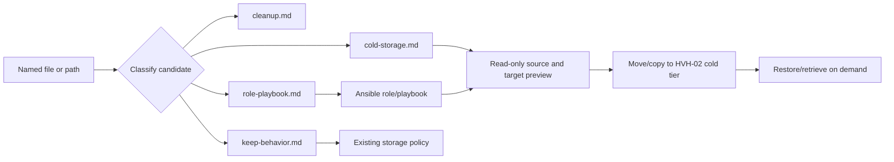
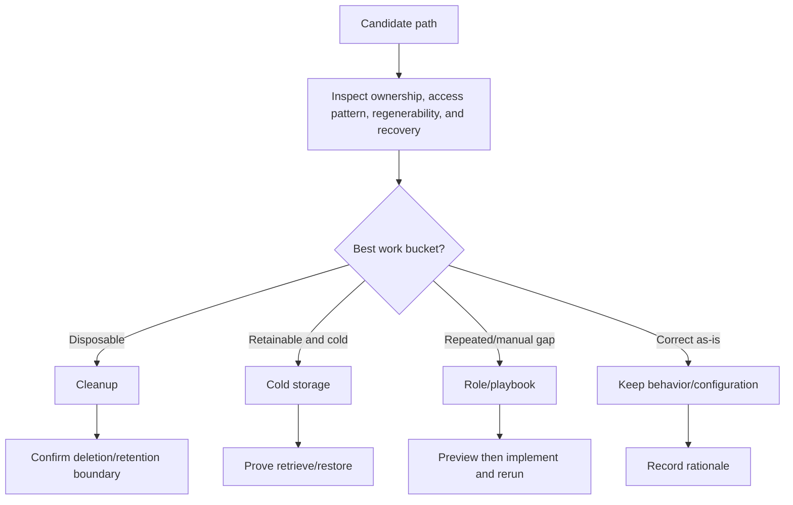

# HVH-02 Cold-Storage Next Pass

Build the next bounded pass of moving suitable HVH-02 data to cold storage while
preserving the established retrieve/restore path. Each candidate path is routed
into one work bucket before implementation.

## Packet boundary

This packet is a triage and implementation queue. It does not authorize deletion,
migration, or live host changes. Candidates remain pending until their owner,
recovery path, and evidence are recorded.

## Routing rule

For every file/path the user names, record one row in the matching bucket file:

1. **Cleanup** — obsolete, duplicate, generated, or safely disposable content.
2. **Cold storage** — retainable, infrequently accessed content suitable for
   `/mnt/k3s-cold` or the HVH-02 `COLD-DATA-HOST` tier.
3. **Role/playbook** — repeated behavior or missing restore/retrieve automation
   that belongs in project-owned Ansible.
4. **Keep behavior/configuration** — current placement or behavior is correct;
   document the reason and leave it unchanged.

Use the smallest bucket that fully addresses the candidate. A path may produce
linked rows in more than one bucket when implementation and cleanup are separate.

## Existing pattern to preserve

| Surface | Contract |
|---|---|
| Host cold tier | HVH-02 `H:` / `COLD-DATA-HOST` |
| Guest cold path | `/mnt/k3s-cold` |
| Retrieval | Restore/promote only when workload demand requires it |
| Hot tier | Active data and caches remain on the hot tier |
| Backup boundary | A second folder/partition is not a separate failure domain |

## Apply / Verify / Undo / Change class

| Contract | Plan direction |
|---|---|
| Apply | Candidate-specific cleanup, migration, or Ansible changes after review and preview |
| Verify | Source/destination inventory, checksums or authoritative metadata, retrieval test, and repeat-run behavior |
| Undo | Restore from the cold copy or reverse the managed path; cleanup is reversible only when an independent copy exists |
| Change class | Candidate-dependent: cleanup may be destructive; migration is semi-manual until automated; role changes are idempotent config |

## Architecture/Structure Diagram

## Capability Routing Diagram

## Candidate packet files

- [cleanup.md](cleanup.md) — candidates for removal, pruning, or retention cleanup.
- [cold-storage.md](cold-storage.md) — candidates to move while retaining on-demand retrieval.
- [role-playbook.md](role-playbook.md) — automation, restore, or policy gaps.
- [keep-behavior.md](keep-behavior.md) — candidates that should remain unchanged.

## Checklist

- [ ] Classify each user-named candidate and record evidence.
- [ ] Confirm source ownership and whether the data is regenerable.
- [ ] Preserve or add a tested retrieve/restore path for cold candidates.
- [ ] Preview target scope before any mutating run.
- [ ] Implement only the accepted bucket work.
- [ ] Verify source, destination, retrieval, and idempotent repeat behavior.

## On Deck — user decisions to integrate

| ID | User decision / direction | Target integration | Status |
|---|---|---|---|
| OD-01 | Review future HVH-02 paths as cleanup, cold storage, role/playbook, or keep behavior/configuration | Candidate packet files and routing rule | captured |
| OD-02 | Evaluate live/running placement strategy separately from prune triage | Sibling WIP [2026-09-23--hvh-02-live-storage-placement-wip](../2026-09-23--hvh-02-live-storage-placement-wip/README.md) | routed |
| OD-03 | Steam live content: not on k3s/HVH cold tier; USB (`I:`) is bulk class now; capacity SSD is future alt to NVMe/USB; cold only for optional archive-demote later | keep-behavior.md + cold-storage.md + Steam plan OD-05 | captured |
| OD-04 | Finish F→I gamerec then delete empty `F:\Gamerecordings` only (D already gone); do not delete `I:` trees | cleanup.md | in_progress |

## Naming/Modeling Diagram

N/A. This packet does not introduce names, aliases, NetBox objects, routes, or
schema changes; it reuses the existing HVH-02 and cold-tier names.

## Diagram gate receipt

- Architecture/Structure: included as a Mermaid fence.
- Capability Routing: included as a Mermaid fence because candidate routing and retrieval branch.
- Naming/Modeling: explicitly N/A; no naming or source-of-truth change is proposed.
- Medium: `mermaid-fence`; pack SVG is not needed for this concise triage packet.

## Diagram Inventory

| Diagram | Medium | Status |
|---|---|---|
| Architecture/Structure | `mermaid-fence` | included |
| Capability Routing | `mermaid-fence` | included |
| Naming/Modeling | N/A | explicitly not applicable |
| Other available diagrams | pack SVG, draw.io, sequence, data-flow | defer until a candidate requires implementation detail |

