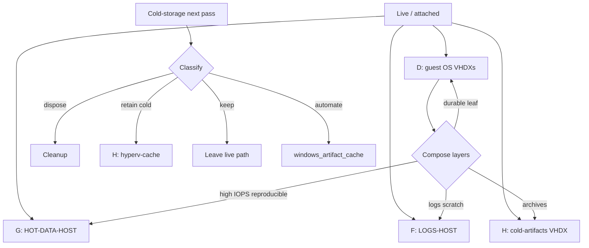
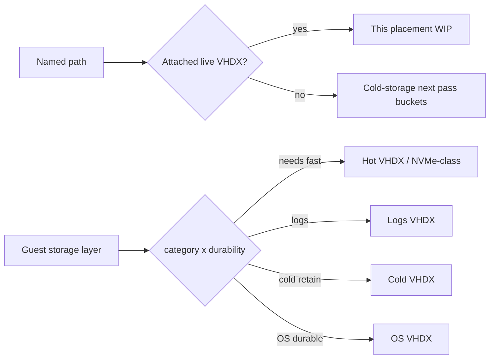

# HVH-02 Live Storage Placement Strategy (WIP)

Draft evaluation of **where running/live locations should live**, vs what the
cold-storage triage pass is currently pruning. Also evaluates **VHDX
composition** — which parts of each guest’s storage makeup still need fast
media vs what can be modularized onto slower tiers via deployment pattern
changes. Does not authorize moves.

## Packet boundary

- Owner questions:
  1. Are current live placements still the right performance / capacity /
     isolation strategy?
  2. Can VHDX makeup be made more modular so non-NVMe-worthy layers stop
     competing on fast disks?
- Sibling prune queue: [2026-09-23--hvh-02-cold-storage-next-pass](../2026-09-23--hvh-02-cold-storage-next-pass/README.md)
- Prior applied layout: [2026-09-10--k3s-02-storage-upgrade](../2026-09-10--k3s-02-storage-upgrade/README.md)
- Taxonomy authority: HRL [storage-offload-taxonomy](../../../homelab-reference-library/implementation-guides/storage/storage-offload-taxonomy.md)
  (category × durability × mechanism)

## Current strategy in use (inventory + applied)

| Class | Host surface | What belongs there |
|---|---|---|
| Guest OS VHDX (live) | `D:\ProgramData\Ansible\hyperv_ubuntu_vm\…` | Bulky Hyper-V OS disks; keep off `C:` and off `F:` share disk |
| High-IOPS regenerable | `G:\HOT-DATA-HOST` | k3s cache VHDX; working data |
| Logs / scratch | `F:\LOGS-HOST` | Event logs + guest log VHDXs (Samsung 840 EVO) |
| Cold retainable | `H:\COLD-DATA-HOST` | Cold-artifact VHDX + `hyperv-cache` rebuild bases |
| Prune / reclaim | Mixed `*\ProgramData\Ansible\` hot copies | Via `windows_artifact_cache`; not live `.vhdx` / `.VMRS` |

Rule of thumb: **live = attached workload path**; **cold = restore-on-demand**;
**cleanup = disposable**. Do not cold-migrate or delete a path until classified.

## What this WIP must evaluate

1. Confirm each live VHDX still matches its class (hot vs logs vs cold vs OS).
2. Record physical media for `D:` (not yet in `physical_disks` inventory block).
3. Flag contention (two OS VHDXs on `D:`; shares + logs on `F:`).
4. Decide whether prune triage ever touches an attached disk (default: **no**).
5. Map **composition inside each VHDX** (guest paths / roles) to category ×
   durability × preferred host media — see below.
6. Identify **modular deployment refactors** (native config keys, bind mounts,
   extra VHDXs) so layers that do not need NVMe leave the fast path.

## VHDX composition and modularity (evaluation target)

### Already modular (applied pattern — keep / refine)

| Guest / host VHDX | Guest role (approx) | Media class | Notes |
|---|---|---|---|
| `hom-lab-ctl-k3s-02.vhdx` on `D:` | OS + K3s control-plane leaf state | Capacity / OS | Should stay “small OS + durable leaf”; not the model cache |
| `G:\…\k3s-02-cache.vhdx` → `/mnt/k3s-cache` | HF cache, containerd imagefs, local-path | Hot / high-IOPS | Already the NVMe-worthy lane |
| `F:\…\k3s-02-logs-scratch.vhdx` → `/mnt/k3s-logs` | Pod logs / scratch | Logs SSD | Already off OS disk |
| `H:\…\k3s-02-cold-artifacts.vhdx` | Cold archives / experimental | Cold | Retainable; not hot path |
| `hom-lab-ctl-dkr-02.vhdx` on `D:` | Docker guest OS | Capacity / OS | Logging VHDX already split to `F:` |
| `F:\…\hom-lab-ctl-dkr-02-logging.vhdx` | Docker guest logs | Logs SSD | Already modular |

### Composition still mixed on OS VHDXs (candidates to break out)

Use HRL mechanism order: **native path key → mount at path → bind leaf → never symlink**.

| Layer (inside OS or still co-located) | Durability | Needs fast media? | Modular option |
|---|---|---|---|
| OS + boot + packages | durable | Moderate | Stay on OS VHDX (`D:`) |
| K3s server SQLite / TLS / `--data-dir` core | durable | Moderate | Keep on OS VHDX; do **not** wholesale move `--data-dir` |
| containerd image store | reproducible_expensive | **Yes** | Already bind → cache VHDX; verify still imagefs≠nodefs |
| HF / vLLM weights + compile cache | reproducible_expensive | **Yes** (load) | Already `HF_HUB_CACHE` / cache mount; cold copies → `H:` |
| local-path PVCs | durable | Workload-dependent | Already under cache mount — revisit if PVC is durable-only |
| Pod / journal logs | reproducible | No | Already logs VHDX |
| Docker `data-root` / image layers (dkr-02) | reproducible_expensive | Often yes | **Gap:** may still sit on OS VHDX — evaluate `data-root` on a dedicated VHDX (hot or capacity SSD) |
| Build / apt / tmp scratch | reproducible | No | Candidate: logs/scratch or small capacity disk |
| Hyper-V `\vm\…\*.VMRS` (~16G observed) | runtime | Host RAM spill to disk | Keep with config tree; not a guest-refactor target |

### Deployment-pattern refactors to evaluate (not yet authorized)

1. **Inventory matrix per guest:** rows = storage layers; columns = VHDX /
   mount / native key / host volume class. One source of truth for “what must
   be on NVMe.”
2. **dkr-02 parity with k3s-02:** attach a hot or capacity data VHDX and point
   Docker `data-root` (native key) off the OS disk if layers dominate `D:`.
3. **Shrink OS VHDX target size** after offloads prove stable — OS disks become
   replaceable modules; data VHDXs keep lifespan independent.
4. **Do not put durable-only state on RAID0 / single cold SSD** without an
   explicit durability accept (taxonomy rule).
5. **Prune packet boundary:** reclaim rebuild bases and hot *copies*; never
   “modularize” by deleting attached VHDXs or `\vm\` config/VMRS.

### Success test for modularity

A storage layer is modular when: (a) it has a named VHDX or mount, (b) Ansible
owns attach + fstab/native key, (c) the guest can be rebuilt and reattach data
disks without copying the whole OS VHDX, (d) media class matches category ×
durability — **not** “everything on the fastest disk available.”

## HRL research that can assist

| Artifact | Use |
|---|---|
| HRL Q&A [hyperv-cloud-image-hot-cold-cache-ladder](../../../homelab-reference-library/q-and-a/ansible/hyperv-cloud-image-hot-cold-cache-ladder.md) | Hot → cold/shared → download ladder for rebuild bases |
| HRL guide [storage-offload-taxonomy](../../../homelab-reference-library/implementation-guides/storage/storage-offload-taxonomy.md) | Offload classes vs live retention |
| Repo handoff [performance-layout-adoption](../2026-09-10--hrl-research-consolidation/multi-agent-design/orchestration/examples/storage-layout-research-transforms/performance-layout-adoption.md) | Guest mount class exclusions (cache vs OS vs logs) |
| Repo expert note [storage-performance-research-application](../2026-09-10--hrl-research-consolidation/multi-agent-design/multi-agent-onsite-expert/examples/storage-performance-research-application.md) | Performance pass that drove HOT/LOGS/COLD split |
| HRL indexes | `indexes/technologies.md` / `indexes/tasks.md` — thin on Hyper-V live-placement today; hydrate if this WIP goes to build |

## Apply / Verify / Undo / Change class

| Contract | Direction |
|---|---|
| Apply | Docs/inventory labeling first; live moves only after explicit accept |
| Verify | Attached VHDX paths match inventory; class labels match media purpose |
| Undo | Repoint disks / reverse move playbooks already used for Hyper-V storage |
| Change class | Evaluation = doc-only until a move slice is accepted |

## Architecture/Structure Diagram

## Capability Routing Diagram

## Checklist

- [ ] Inventory `physical_disks`: add/confirm `D:` model/type
- [ ] Live probe: attached disks for k3s-02 / dkr-02 vs inventory paths
- [ ] Review contention on `D:` and `F:`
- [ ] Keep prune packet from touching live VHDXs (default gate)
- [ ] Build per-guest layer matrix (paths → mechanism → media class)
- [ ] Probe dkr-02: is Docker `data-root` still on OS VHDX?
- [ ] Re-verify k3s-02 imagefs≠nodefs and HF path on cache mount
- [ ] List layers that do **not** need NVMe and propose host volume class
- [ ] HRL hydrate if vendor Hyper-V / Docker / K3s path keys need refresh

## On Deck — user decisions to integrate

| ID | Decision | Status |
|---|---|---|
| OD-01 | Evaluate live placement strategy while cold-storage pass prunes non-live candidates | captured — this packet |
| OD-02 | Accept or revise Keep on `C:\ProgramData\Ansible` root + reclaim link | pending in cold-storage packet |
| OD-03 | Evaluate VHDX composition / modular breakout so non-NVMe layers leave fast media | captured — composition section |

## Naming/Modeling Diagram

N/A until a move renames volumes or NetBox storage objects.

## Diagram gate receipt

- Architecture/Structure: Mermaid fence included.
- Capability Routing: Mermaid fence included.
- Naming/Modeling: N/A.
- Medium: `mermaid-fence`.

## Diagram Inventory

| Diagram | Medium | Status |
|---|---|---|
| Architecture/Structure | mermaid-fence | included |
| Capability Routing | mermaid-fence | included |
| Naming/Modeling | N/A | explicit |
