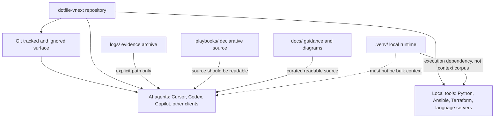
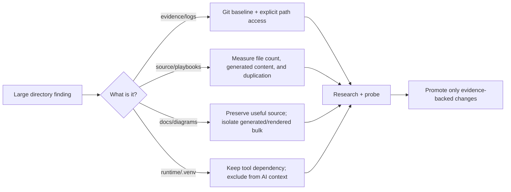

# Home-Lab AI Usability and Context Hygiene Evaluation

This packet evaluates whether repository structure, Git visibility, generated
artifacts, local development environments, active agent loops, MCP servers, and
instruction surfaces are making reliable home-lab AI work difficult. The
large-directory findings are treated as possible symptoms of a wider workspace
architecture problem, not as isolated Cursor tuning items.

The durable goals are in [plan.md](plan.md). The active implementation and
verification direction is [current-way-forward.md](current-way-forward.md).
Superseded pre-Context7 material is retained in
[archive/2026-09-23--superseded-pre-context7-strategy/](archive/2026-09-23--superseded-pre-context7-strategy/).

The Context7-backed findings are persisted in the homelab reference library at
`/Users/joshc/develop/homelab-reference-library/generated/context7/cursor/ai-workspace-context-boundaries/`.

## Capability Packet Boundary

This is an evaluation packet, not a grouped implementation capability. No
roles, playbooks, inventory, or runtime ownership surfaces are changed by this
packet. Any later implementation should use a separate capability packet or an
explicit promotion slice after this evaluation establishes the target.

## Apply / Verify / Undo / Change class

| Contract | Current packet |
|---|---|
| Apply | Follow [current-way-forward.md](current-way-forward.md); no runtime mutation is authorized by this packet yet |
| Verify | Use the controlled full-workspace versus source-focused-workspace test and the five-stage context evidence model |
| Undo | Revert the documented `.gitignore`, `.cursorignore`, IDE settings, or layout changes individually; archive contents preserve prior reasoning |
| Change class | Documentation/research strategy; implementation slices remain pending explicit execution |

## Architecture/Structure Diagram

## Capability Routing Diagram

## Naming/Modeling Diagram

N/A for this evaluation packet. No NetBox objects, hostnames, routes, aliases,
or naming schemas are being changed.

## Required review areas

Each finding from the original workspace-size observation is a separate review
area. None may be collapsed into a generic "large directories" check.

### `.venv/` — approximately 635 MB

Review runtime dependencies, duplicate interpreters, package caches, downloaded
artifacts, model data, and whether the environment is shared across unrelated
projects. Preserve the ability of repo wrappers and local tools to use the
environment while preventing it from becoming an AI context corpus.

### `logs/` — approximately 327 MB

Review tracked versus untracked logs, retention, generated reports, stale
captures, and whether a Git-visible keep-file is needed. The target behavior is
default exclusion from normal agent exploration, with explicit user-named paths
remaining inspectable.

### `playbooks/` — approximately 130 MB

Review file types, embedded binaries, generated output, captured artifacts,
duplicate playbooks, and misplaced runtime data. Playbook source must remain
readable to agents; this area must not be blanket-excluded merely because its
total size is unexpectedly large.

### `docs/` — approximately 25 MB

Review diagrams, rendered exports, attachments, duplicated historical material,
and generated documentation. Preserve useful documentation and desired
diagrams as agent-readable Git source while separating or governing bulk
rendered artifacts.

## Evaluation questions

The evaluation must verify or rectify four possible failure classes:

1. **Retrieval pollution** — logs, caches, generated artifacts, stale plans, or
   runtime files are retrieved instead of authoritative source.
2. **Instruction pollution** — overlapping rules, plans, skills, and client
   settings obscure project authority or consume context.
3. **Runtime pressure** — Cursor renderers, GPU helpers, extension hosts, MCP
   servers, language servers, and active Composer loops consume CPU or memory.
4. **Model/gateway faults** — context limits, routing, tool-call capability,
   LiteLLM/vLLM behavior, or model limitations independently fail basic tasks.

The first three must be tested as possible contributors to the fourth; they
must not be assumed to be the sole cause.

1. Can Git ignore rules provide a durable cross-agent baseline without making
   explicitly requested paths inaccessible?
2. What does the 327 MB `logs/` directory contain, and which portions are
   tracked, generated, stale, or safe to retain outside normal agent context?
3. Why is the 130 MB `playbooks/` directory much larger than its apparent text
   content, and what source/artifact boundary is appropriate?
4. Why is the 25 MB `docs/` directory larger than expected, and which diagrams
   or documentation artifacts should remain readable?
5. Which `.venv/` contents are required by repo-local tools, and which
   development/runtime anti-patterns make the environment unnecessarily large
   or visible to agents?
6. Which controls are universal Git/repository controls versus client-specific
   context controls, and where should the boundary remain explicit?

## Checklist

- [ ] Capture a size and file-type inventory for `logs/`, `playbooks/`, `docs/`, and `.venv/`.
- [ ] Complete the dedicated `.venv/` review.
- [ ] Complete the dedicated `logs/` review.
- [ ] Complete the dedicated `playbooks/` review.
- [ ] Complete the dedicated `docs/` review.
- [ ] Compare tracked, ignored, and untracked content in each area.
- [ ] Test Git behavior for a tracked keep-file plus ignored descendants in `logs/`.
- [ ] Identify generated or misplaced content in `playbooks/` and `docs/`.
- [ ] Identify `.venv/` dependencies used by repo wrappers and extension tooling.
- [ ] Produce a Good / Better / Best recommendation with explicit agent-context limits.
- [ ] Decide whether implementation belongs in Git policy, repository layout, tooling wrappers, or a combination.
- [ ] Compare the current full workspace with a minimal source-focused workspace using the same basic home-lab agent tasks.
- [ ] Measure retrieved files, context size, irrelevant results, tool-call correctness, and task failure rate in both workspace shapes.
- [ ] Inspect active Composer loops and wakelocks that disable background throttling.
- [ ] Inspect Cursor renderer and GPU-helper CPU/memory behavior as a current-pass performance lane.
- [ ] Attribute extension-host and MCP-server resource usage, including whether multiple agent surfaces are simultaneously active.
- [ ] Separate workspace/context causes from model, gateway, routing, and tool-capability causes.

## On Deck — user decisions to integrate

| ID | User decision / direction | Target integration | Status |
|---|---|---|---|
| OD-01 | `logs/` should be ignored for normal AI context and only included when the user explicitly names a path | Evaluation of Git baseline, keep-file behavior, and explicit-agent-access boundary | captured |
| OD-02 | `logs/` should retain a Git-visible keep-file without tracking its contents | Git policy and tracked keep-file design | captured |
| OD-03 | `playbooks/` should remain readable source and its unexpected size must be investigated | File-type, generated-content, and duplication inventory | captured |
| OD-04 | `docs/` should remain readable, including desired diagrams, while bulk/generated material should be separated | Documentation layout and artifact-boundary evaluation | captured |
| OD-05 | `.venv/` must remain usable by local tools but should not become an AI context corpus | Tool dependency and agent-context boundary evaluation | captured |
| OD-06 | The solution must scale across AI agent types without custom per-client logic | Git/repository-first options comparison | captured |
| OD-07 | For this Mac controller, manually configured or redirectable logs should use macOS-native `~/Library/Logs/<owner>/`; this does not centralize every lab service log | Controller-side logging convention and external log-root configuration | captured |
| OD-08 | Define an inventory-owned `managed_application_log_root` selected by host class; use it only for configurable application/tool logs, never existing Windows system/shared infrastructure logs | Inventory contract, class defaults, host overrides, and role opt-in path construction | captured |
| OD-09 | Deprecate repository `logs/` as an active runtime-evidence location, retain it temporarily as a transition marker, and move current contents to the external Mac log root | External log migration, Ansible controller log path, and deprecated README contract | captured |
| OD-10 | First AI-context pass should add targeted entries to `.cursorignore` for generated/cache/evidence descendants while keeping Git/GitHub content and source `playbooks/` and `docs/` available; defer `.venv/` to the next pass | Cursor-only context/indexing boundary and draft evaluator scope | captured |

## Diagram Inventory

| Diagram | Medium | Status |
|---|---|---|
| Architecture/Structure | `mermaid-fence` | included |
| Capability Routing | `mermaid-fence` | included |
| Naming/Modeling | N/A | explicitly not applicable |
| Other available diagrams | Pack SVG, draw.io, sequence, data-flow | not needed until implementation boundaries are selected |
