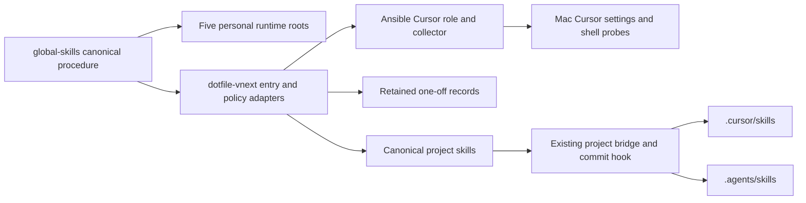
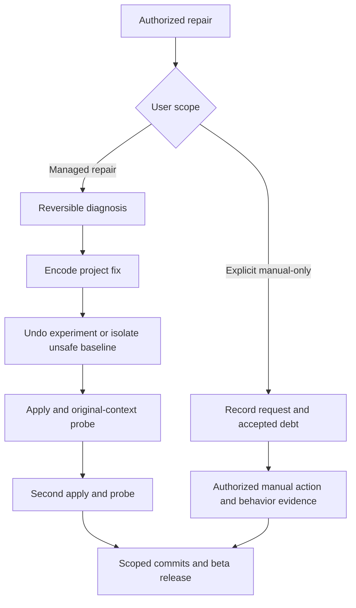

# Managed troubleshooting and project stewardship

Retrospective completion packet requested by the user. This records the complete
conversation delivery: the Cursor ripgrep repair, portable troubleshooting workflow,
project stewardship, retained one-off decisions, client synchronization, and minor
beta releases. The original user-designated [working plan](../2026-09-22--interactive-troubleshoting-to-managed-state/plan.md)
keeps its exact path and spelling. This packet is the release closeout authority.

## Completed work

- Cursor's Ansible role now supplies managed CLI directories through its terminal
  PATH setting. A targeted collector reproduces the shell context and verifies rg.
- A global skill owns reversible diagnosis, experiment rollback, project repair,
  original-context verification, and repeat apply. Project entry points route to it.
- AGENTS.md makes project stewardship the standing objective. Explicit manual-only
  requests retain the user's debt decision and require a small one-off record.
  Cleanup and promotion preserve that record. Overlapping policy adapters were
  reconciled, including the remaining discard wording in the plan index.
- The existing project bridge now publishes canonical skills to both .cursor/skills
  and .agents/skills. Its pre-commit hook maintains registration. The global bridge
  documents mixed-project synchronization and covers five personal client roots.
- Executable Ansible fixtures and five real Codex decision scenarios exercise the
  workflow. Existing evidence distinguishes synchronized files from client loading.
- Conversation-owned changes are grouped into commits and released as global-skills
  0.13.0-beta and dotfile-vnext 10.7.0-beta. Unrelated working changes are excluded.

## Capability Packet Boundary

| Field | Authority |
| --- | --- |
| Identifier | interactive-troubleshooting-to-managed-state |
| Owner manifest | [Original capability manifest](../2026-09-22--interactive-troubleshoting-to-managed-state/capability.yml) |
| Owned files | Original manifest plus this packet, release VERSION mirrors, Cursor PATH role/collector/diagnostic files listed in delivery.json |
| Integration anchors | AGENTS.md; Cursor rules; one-off lifecycle; both existing runtime bridges; project pre-commit hook; docs/plans/README.md |
| Update behavior | Edit canonical global/project source, sync the respective bridge, verify behavior and repeatability |
| Removal behavior | Selectively revert implementation commits and affected anchors; remove only owned links; retain decision records and evidence |

## Change contract

Apply: use the existing development playbook with limit mac-dev and tags
cursor_terminal_path,ripgrep_cli. Use existing global/project bridges for skills.
Verify: exact shell probe, two targeted Ansible runs, validators, fixture outcomes,
runtime source resolution, staged secret/diff guards, and remote branch/tag hashes.
Targeted lint passed for 24 processed files; full playbook syntax passed. The broad
commit lint hook found existing errors in unrelated aider, kilo_ide, multiagents,
ollama_mac, opencode_cli and python roles. After correcting our own Cursor line
length, that broad hook alone was skipped for the implementation commit; the
project sync hook passed. The broader repository lint gate is not claimed green.
See evidence/scoped-lint.log, playbook-syntax.log and full-playbook-lint.log.
Undo: selectively revert owned source and reapply the owner; do not roll back
concurrent work. No persistent manual settings experiments preceded the original
Ansible repair. Release rollback uses a new revert release, never moved public tags.
Class: managed local configuration, framework instructions, runtime registration,
and release bookkeeping. No new infrastructure names or resources.

## Plan verification receipt

Historical implementation evidence was re-read on 2026-09-23; fresh release checks
are saved under evidence/. Saved text logs have trailing whitespace normalized. Historical fresh-agent scenarios are not presented as
new runs. The full original [13-obligation inventory](../2026-09-22--interactive-troubleshoting-to-managed-state/implementation-accounting.md)
and [six extension obligations](../2026-09-22--interactive-troubleshoting-to-managed-state/extension-receipt.md)
remain part of this packet by reference.

| ID | Source / obligation | Status | Evidence |
| --- | --- | --- | --- |
| O01 | Original Cursor request: managed fix, behavior, two applies | pass | evidence/ansible-first.log and ansible-second.log: ok=59 changed=0 failed=0; evidence/cursor-probe.log: both shells exit 0; original diagnostic records first repair changed=1 then 0 |
| O02 | Approved original workflow: all 13 implementation obligations | pass | Original implementation-accounting.md; fresh evidence/scenarios.json S1–S3 pass; metadata/catalog logs |
| O03 | Approved extension: stewardship, record retention, policy reconciliation | pass | Extension E01–E03; committed source; plan index contradiction corrected |
| O04 | Approved agent evaluations | pass | Original evidence/agent-decisions-full/summary.json and five transcripts: all passed; independently checked summaries during closeout |
| O05 | Client synchronization and repeatability | pass | Original E05 bridge repeat JSON; fresh project-runtime.log; global commit hook; evidence/runtime-resolution.json |
| O06 | Metadata and integration validation | pass | evidence/validation.json: nine commands exit 0; optional skills-ref skipped when absent; advisory warnings are nonblocking |
| O07 | New completed folder, comprehensive accounting and diagrams | pass | This README, original inventories, delivery.json; all decisions integrated |
| O08 | Scoped commits, minor beta versions, branch and tag push | pass | delivery.json and evidence/remote-release-refs.json: both branches and annotated tags match local hashes |

Out-of-scope evidence boundaries: original Cursor GUI invocation and reload/implicit
skill selection remain untested. Agent fixtures explicitly loaded the skill, and
single-sample decisions are not a universal guarantee. Existing unrelated changes,
remote laptop application, and new infrastructure deployments are outside this release.

## Completion gate

- [x] O01–O06 cover implementation, dependencies, Apply/Verify/Undo and all approved extensions.
- [x] No unresolved user decision; no missing resource or new resource-selection obligation.
- [x] Existing executable Ansible and bridge entrypoints express apply order.
- [x] Full accounting and diagrams recorded; historical/live evidence distinguished.
- [x] O08 remote branch and annotated beta tag hashes verified.

Completed work is tracked in [GitHub issue #18](https://github.com/doesitscript/dotfile-vnext/issues/18).
This retrospective packet is committed after the release tags; its final push is
verified separately at closeout. Implementation and original plan are in the beta releases.

## Architecture/Structure Diagram

## Capability Routing Diagram

## Diagram gate receipt

Architecture and routing are covered above using fenced Mermaid, consistent with
the original packet. Naming/modeling is not applicable: no naming standard or
infrastructure identity change. Release labels follow existing SemVer conventions.

## Diagram Inventory

| Diagram | Medium | Decision |
| --- | --- | --- |
| Architecture/Structure | Mermaid | Included |
| Capability Routing | Mermaid | Included |
| Naming/Modeling | None | No names or schema change |
| Sequence/deployment | None | Existing routing and source ownership diagrams sufficient |
