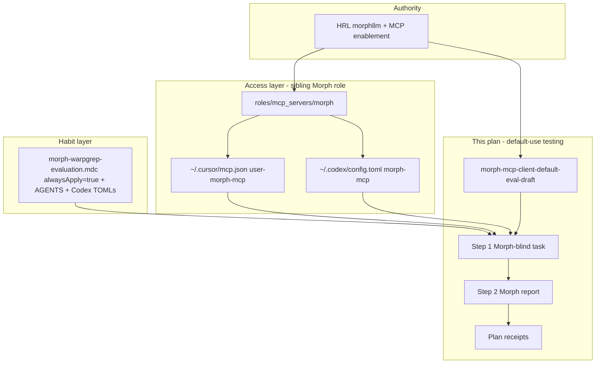
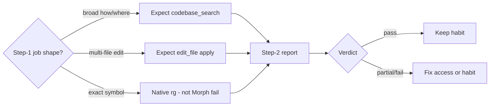

# Morph MCP client default-use testing

## Summary

Repeatable **blind two-step** evaluation of whether Cursor Agent and Codex
**default to Morph** when Morph fits — WarpGrep (`codebase_search`) and Fast
Apply (`edit_file`) — without coaching Morph in step 1.

**Plan ownership split (keep both plans linked):**

| Concern | Owning plan |
| --- | --- |
| Morph MCP **install / commission / Ansible access** (Layer 1) | Sibling [`2026-09-02--morph-warpgrep-evaluation`](../2026-09-02--morph-warpgrep-evaluation/README.md) + HRL morphllm guides |
| **Default-use testing**, rubrics, blind probes, receipts | **This plan** |
| Habit-gap closeout that this plan’s probes expose (Layer 2 steering load path, Cursor↔Codex parity) | **This plan** executes and records status in [`evaluated-implementation-status.md`](./evaluated-implementation-status.md); durable Morph role/templates remain under the sibling install plan |

This plan owns the **test design, rubrics, re-runs, and habit-gap closeout**
(including the 2026-09-23 Cursor `alwaysApply` / shared AGENTS+Codex TOML
refresh). Sibling install plan remains the home for Morph binary/role
commissioning; both plans should stay cross-referenced when either changes.

**Evaluation receipts so far (2026-09-23):**

| Scenario | Cursor | Codex |
| --- | --- | --- |
| `warpgrep-default` | not recorded in this thread | **pass** (`codebase_search` ×1) |
| `fast-apply-habit` | **pass** (real `edit_file` ×3) | **partial** (`edit_file` ×3, `dryRun: true` only) |

**Layer 2 / proper IDE implementation (same day, config work):**

Vendor Morph expects **access + steering that actually loads**. Research +
apply closed the Cursor habit defect (`alwaysApply: false` → lean
`alwaysApply: true`) and refreshed shared AGENTS / Codex agent TOML prose for
parity with Cursor, using global skill `ai-client-instruction-surface-matrix`.
Did **not** change `DISABLED_TOOLS` or the project `mcp_tool_enabled` server
toggle feature.

Item-by-item status (separate from this README):

[`evaluated-implementation-status.md`](./evaluated-implementation-status.md)

## Problem

Access (MCP wired) ≠ habit (agent prefers Morph). We need portable probes that:

1. Do not name Morph in the first message (authentic default behavior)
2. Ask for a Morph-named report only in step 2
3. Grade against the HRL tool-split (WarpGrep ≠ replace all `rg`; dry-run ≠ apply)

## Capability Packet Boundary

| Field | Value |
| --- | --- |
| Capability identifier | `morph-mcp-client-default-eval` |
| Owner manifest | global-skills `skills/catalog.yaml` → `morph-mcp-client-default-eval-draft`; this plan packet |
| Owned files | `global-skills/skills/validation/morph-mcp-client-default-eval-draft/**`; this folder under `docs/plans/` |
| Integration anchors | HRL morphllm + MCP enablement guides; project Morph habit rules / AGENTS / Codex agent TOMLs (habit fixes only — install stays in Morph role) |
| Update behavior | Extend `references/scenarios.md` via scenario protocol; re-run Cursor+Codex; update receipts in this plan |
| Removal behavior | Archive this plan; demote or delete draft skill when replaced by a reviewed skill; do not remove Morph MCP install |

## Apply / Verify / Undo / Change class

| | |
| --- | --- |
| **Apply** | Keep draft eval skill + scenarios current; fix Codex Fast Apply habit (dryRun→apply); re-run blind probes; record receipts here |
| **Verify** | Step-2 reports per client × scenario; rubrics in skill; Morph tools callable (`user-morph-mcp` / `morph-mcp`) |
| **Undo** | Revert habit-rule edits; leave MCP install alone unless sibling Morph plan says otherwise; archive this packet |
| **Change class** | Evaluation / habit documentation (+ small steering rule edits); not NetBox; not Morph binary install |

## Test design already done

Portable SSOT (draft global skill):

`/Users/joshc/develop/global-skills/skills/validation/morph-mcp-client-default-eval-draft/`

| Artifact | Role |
| --- | --- |
| `SKILL.md` | Workflow, tool-split contract, when to use |
| `references/scenarios.md` | Copy-paste step 1 / step 2 for `warpgrep-default` and `fast-apply-habit` |
| `references/scenario-protocol.md` | How to mint more scenarios without coaching Morph in step 1 |
| `references/sources-and-precedence.md` | HRL over live project drift for expected posture |

### Scenario matrix

| ID | Proves | Step-1 shape | Not a fail |
| --- | --- | --- | --- |
| `warpgrep-default` | `codebase_search` first on broad how/where | MCP enablement explore (Morph-blind) | Later native `rg`; `edit_file: 0`; `reflex_*: 0` |
| `fast-apply-habit` | `edit_file` on multi-file update | Disposable fixture under workspace root (pin path; clean slate) | Native apply only after Morph fail |

**Operator lesson already captured:** pin workspace root (e.g. `dotfile-vnext`);
do not use host `/tmp`; wipe `tmp/morph-fast-apply-eval/` between Cursor/Codex
runs so pre-filled fixtures cannot fake a skip.

## Implemented / started surfaces (status)

Brief inventory across project + library + draft skill. Status codes:
`done` · `draft` · `partial` · `pending` · `n/a`

### Access / commission (install)

| Surface | Path / note | Status |
| --- | --- | --- |
| Morph Ansible role | `roles/mcp_servers/morph` | done |
| Playbook tag | `playbooks/mac/mcp_servers.yaml --tags morph` | done |
| Cursor user MCP (eval default) | `~/.cursor/mcp.json` → `user-morph-mcp` | done |
| Codex user + project MCP | `~/.codex/config.toml` + project `.codex/config.toml` | done |
| Vault / morph.env | `vault_shared_morph_api_key` → `mcp/env.d/morph.env` | done |
| Client enablement findings | `docs/reports/mcp_server_validations/morph/` + HRL MCP matrix | done |
| Sibling install eval plan | `docs/plans/2026-09-02--morph-warpgrep-evaluation/` | incomplete-wip |

### Habit / routing

| Surface | Path / note | Status |
| --- | --- | --- |
| Cursor Morph rule | `.cursor/rules/morph-warpgrep-evaluation.mdc` (`alwaysApply: true`, lean) | **done** (Layer 2 fix 2026-09-23) |
| Context-budget / `.cursorrules` allowlist | Morph listed as thin always-on | **done** (2026-09-23) |
| Continue Morph rule | `.continue/rules/morph-warpgrep-evaluation.md` | done (refreshed) |
| Morph routing templates | `roles/mcp_servers/morph/templates/routing_morph-mcp*.j2` | done (lean + alwaysApply) |
| AGENTS / Copilot Morph blocks | `AGENTS.md`, `.github/copilot-instructions.md` | done (refreshed) |
| Codex agent TOMLs | `.codex/agents/*.toml` | done (refreshed) |
| Cursor↔Codex parity method | skill `ai-client-instruction-surface-matrix` | done (used for this fix) |
| Morph `DISABLED_TOOLS` / force-enable `edit_file` | not used for this eval | settled-no-change |
| Codex Fast Apply: real apply not dryRun-only | habit text + re-probe | **partial** (gap) |
| Prefer Morph create+edit (optional) | not required for pass | pending / optional |
| New Cursor chat after Layer 2 rule change | operator | pending-operator |

### Blind eval protocol

| Surface | Path / note | Status |
| --- | --- | --- |
| Draft global skill | `global-skills/.../morph-mcp-client-default-eval-draft` | **draft** |
| Scenario `warpgrep-default` prompts | `references/scenarios.md` | done (designed) |
| Scenario `fast-apply-habit` prompts | same (+ workspace pin lesson) | done (designed); prompt hygiene **partial** (clean-slate language to harden) |
| Scenario mint protocol | `references/scenario-protocol.md` | done (draft) |
| Runtime bridge for draft skill | `~/.cursor/skills/morph-mcp-client-default-eval-draft` symlink | done |
| Skill status `reviewed` / drop `-draft` | catalog promotion | pending |
| `github_codebase_search` scenario | not minted | pending |
| Reflex scenario | not minted (and usually N/A for explore) | n/a for now |

### Receipts / evidence

| Surface | Path / note | Status |
| --- | --- | --- |
| WarpGrep Codex step-2 | operator report 2026-09-23 | **pass** |
| WarpGrep Cursor step-2 | this thread | pending |
| Fast Apply Cursor step-2 | operator report 2026-09-23 | **pass** |
| Fast Apply Codex step-2 | dryRun-only | **partial** |
| Self-eval evidence packet | `docs/plans/2026-09-23--morph-mcp-usage-self-evaluation/` | draft / evidence |
| HRL morphllm + enablement | implementation-guides + Context7 pack | done (authority) |
| This testing plan packet | this folder | **started** (incomplete-wip) |

## Checklist

- [x] Design blind two-step protocol (step 1 Morph-blind, step 2 Morph report)
- [x] Author `warpgrep-default` and `fast-apply-habit` prompts + rubrics
- [x] Scaffold draft global skill + catalog entry + runtime bridge
- [x] Run WarpGrep probe on Codex (pass)
- [x] Run Fast Apply probe on Cursor (pass) and Codex (partial)
- [x] Research Morph proper IDE Layer 1+2 (Context7 + vendor MCP docs)
- [x] Fix Cursor Layer 2 load path (`alwaysApply: true` lean Morph rule) + Codex shared prose parity
- [x] Apply `roles/mcp_servers/morph` + re-run `mcp_enablement`; record item status file
- [ ] Harden Fast Apply step 1: workspace pin + clean-slate fixture (skill SSOT)
- [ ] Fix Codex Fast Apply habit (dryRun:false / apply after preview)
- [ ] Re-run Fast Apply on Codex with clean fixture → expect pass
- [ ] Record Cursor WarpGrep step-2 (or mark deferred) — preferably in a **new** chat after Layer 2 rule inject
- [ ] Attach concise receipts under this plan folder
- [ ] Decide: promote skill from `-draft` or keep draft until N clean dual-client passes

## On Deck — user decisions to integrate

| ID | User decision / direction | Target integration | Status |
| --- | --- | --- | --- |
| OD-1 | Blind prompts + Fast Apply next scenario | Skill scenarios + this plan | integrated |
| OD-2 | Workspace-pin Fast Apply step 1 (no host `/tmp`) | `scenarios.md` harden | pending writeback |
| OD-3 | Implementor brief: Codex dryRun gap | Habit rules / AGENTS / Codex TOMLs | pending |
| OD-4 | Proper Morph IDE Layer 2 for Cursor + Codex (parity; no DISABLED_TOOLS churn) | Morph role templates + this plan status file | **integrated** (2026-09-23) |

## Architecture/Structure Diagram

## Capability Routing Diagram

## Naming/Modeling Diagram

N/A — no NetBox / naming-schema / inventory object renames in this plan.
Tool names remain vendor Morph MCP names (`codebase_search`, `edit_file`).

## Diagram Inventory

| Diagram | Included | Medium |
| --- | --- | --- |
| Architecture/Structure | yes | mermaid-fence |
| Capability Routing | yes | mermaid-fence |
| Naming/Modeling | N/A | — |
| Sequence (operator runbook) | optional later | — |

## Diagram gate receipt

- Architecture/Structure: present (mermaid)
- Capability Routing: present (mermaid)
- Naming/Modeling: N/A with reason
- Diagram Inventory: present
