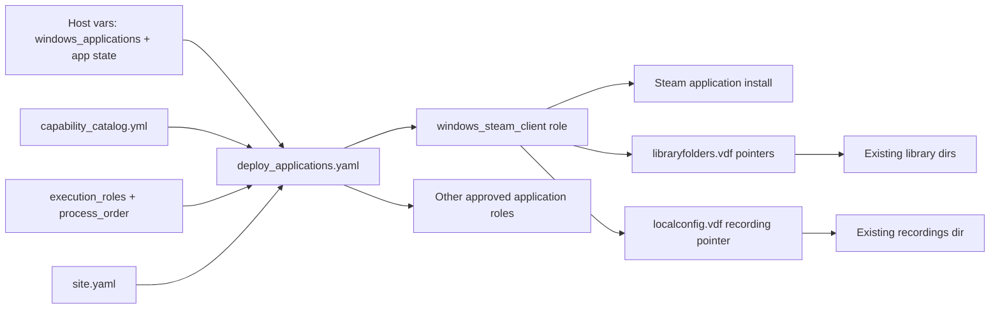
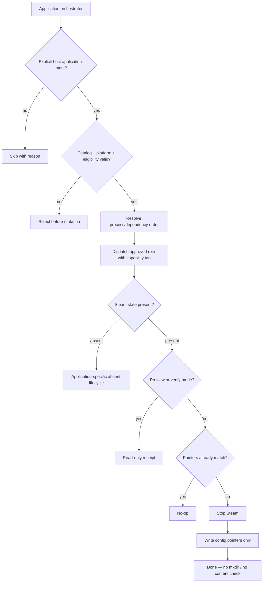

# Windows Steam Client — Config Pointers Only (WIP)

Target clarified 2026-09-23: **configuration-forward only.** Declare where Steam
should look for (1) existing library folders and (2) the Game Recording folder.
Do **not** create those directories, do **not** populate games/clips, do **not**
care whether content is present. When live pointers already match inventory,
apply is a **no-op**.

## Packet boundary

**In scope (v1):**

1. Install Steam **application** (so recovery can re-install the client).
2. Deploy **library folder pointers** to inventory-declared paths (user has two
   library locations today) via `libraryfolders.vdf` (Steam closed).
3. Deploy **Game Recording save-folder pointer** to the inventory-declared path
   (wherever recordings are configured now, e.g. `I:\Gamerecordings`) once the
   machine-writable setting surface is confirmed (UI today; registry/VDF probe
   required for Ansible write).
4. Idempotent: if pointers already match, change nothing.

**Explicit non-goals:**

- Creating library or recording directories
- Checking whether games or recordings exist at those paths
- Copying / backing up / recreating library or recording content
- Steam Cloud, login, per-title installs

## Is this possible?

| Capability | Possible? | Confidence |
|---|---|---|
| Install client (Choco / winget) | Yes | High |
| Point Steam at existing library folders | Yes — `config\libraryfolders.vdf` | High (live evidence on HVH-02) |
| Point Game Recording at existing folder | Yes — **not registry**; `userdata\<steamid>\config\localconfig.vdf` → `GameRecording.BackgroundRecordPath` | High (live evidence on HVH-02) |
| Config-only / no-op when already correct | Yes | High |
| Ignore empty vs populated targets | Yes — pointers only | High |

### Method / surfaces we would manage (evidence-backed)

Live probe **HOM-LAB-HVH-02** (2026-09-23):

| Concern | Surface managed | Observed value | How we configure |
|---|---|---|---|
| Client install | Package | `C:\Program Files (x86)\Steam` (`HKLM\...\Valve\Steam\InstallPath`) | `win_chocolatey` `steam` (+ winget `Valve.Steam` fallback) |
| Library folders | `<Steam>\config\libraryfolders.vdf` | `"1"` → `D:\SteamLibrary`, `"2"` → `I:\SteamLibrary` (+ default `"0"` under Program Files) | With Steam **stopped**: ensure declared `path` entries exist; **merge** only — do not wipe existing `apps` / `contentid` blocks |
| Game Recording folder | `<Steam>\userdata\<steamid>\config\localconfig.vdf` key `BackgroundRecordPath` under `"GameRecording"` | `I:\Gamerecordings` | With Steam **stopped**: set/replace that key for the active user(s); do **not** mkdir |
| Registry `HKCU\Software\Valve\Steam` | **Not** the recording path surface on this host | No `SaveFolder` / GameRecording path keys present | Do **not** use registry for recording path unless a later probe shows otherwise |

**Not managed in v1:** game content under libraries, clip files under recordings, Steam Cloud, login tokens, `apps{}` membership inside `libraryfolders.vdf` (Steam owns that after it sees the path).

**Approach in one sentence:** inventory declares paths → role installs client if needed → stops Steam → merges library VDF paths + sets `BackgroundRecordPath` → starts nothing / leaves content alone → second apply is no-op when already matching.

## Capability Packet Boundary

| Field | Value |
|---|---|
| Capability identifier | `windows_steam_client` within the reusable Windows application deployment capability |
| Owner manifest | `policy/capability_catalog.yml` plus this plan packet |
| Owned files | `roles/windows_steam_client/**`, focused Steam entrypoint, Steam host application intent, and related policy/catalog references |
| Integration anchors | `playbooks/deploy_applications.yaml` (new generic orchestrator), `playbooks/site.yaml` Windows application phase, `policy/capability_catalog.yml`, `policy/process_order.yml`, host `windows_applications` intent |
| Update behavior | Add future applications as catalog-approved capability roles and host intent entries; do not duplicate host selection/orchestration logic in each application playbook |
| Removal behavior | Remove the application from host intent and run its role's `absent` lifecycle; remove catalog/orchestrator references only when the capability is retired; preserve unrelated application roles and data |

## Scalable application deployment direction

Steam is one application on a multi-application Windows host. The primary
deployment path must therefore be a reusable application orchestrator, not a
growing set of independently authored app playbooks with duplicated target
classification.

| Surface | Responsibility |
|---|---|
| `inventory/host_vars/<host>.yaml` | Explicit host intent, for example `windows_applications: [windows_steam_client]`, plus each role's namespaced variables and lifecycle state |
| `policy/capability_catalog.yml` | Approved capability vocabulary, platform support, implementation owner, commissioned status, placement requirements, and execution tags; not a host list |
| `policy/execution_roles.yml` | Host eligibility and allowed workloads |
| `playbooks/deploy_applications.yaml` | Shared classification, capability resolution, validation, dependency order, selected/skipped/rejected receipt, and dynamic role dispatch |
| `roles/<application_capability>/` | Application-specific install, configuration, verify, and absent behavior |
| focused app playbook | Optional narrow wrapper/filter into the same orchestrator for recovery or debugging; not a second orchestration implementation |
| `playbooks/site.yaml` | Ordered inclusion of the Windows application phase in full host convergence |

The orchestrator must resolve only explicitly commissioned host intent. It must
not scan the filesystem and execute every role that appears application-like.
It should validate each requested capability against the catalog, platform,
execution-role eligibility, lifecycle state, and `policy/process_order.yml`
before dispatching its role.

Dynamic role dispatch is acceptable for this registry-driven orchestrator, but
must use `include_role` with `apply.tags` so capability tags reach role tasks.
The orchestrator must compensate for dynamic-dispatch visibility limits by
printing a deterministic resolution receipt and validating requested capability
IDs before any role mutates the host.

The Steam-only entrypoint may remain as a convenience wrapper, but it must call
the same resolution path with an application filter such as
`windows_steam_client`; it must not retain a second copy of generic target
classification or application discovery.

## Research findings and evaluator obligations

The HRL and official Ansible documentation establish the following evaluator
baseline:

1. Roles are reusable capability units; playbooks compose workflows and
   landscape phases.
2. Independent capabilities should be composed in a playbook rather than
   merged into a generic application role.
3. Inventory owns desired host intent; policy owns eligibility; the capability
   catalog owns approved metadata and implementation references.
4. Static `roles:`/`import_role` reuse gives stronger tag/task visibility.
   Dynamic `include_role` is appropriate for registry-driven dispatch only when
   `apply.tags` is used and the orchestrator emits its own resolution receipt.
5. Application roles must expose `present|absent`, support meaningful verify
   behavior, report idempotent changes, and document check-mode limitations.
6. Windows application evaluation must distinguish package installation,
   configuration, user/profile readiness, operator login, and existing data.
7. Provider fallback must be tested as an actual failure path; suppressing a
   provider failure while testing `result is failed` is not valid fallback
   control flow.

For this Steam slice, the evaluator must specifically check generic
application-orchestrator integration, catalog validation, shared classification,
dependency ordering, focused filtering, truly read-only preview/verify tags,
provider fallback, no content mutation, Steam profile readiness, and live
idempotence/check-mode behavior when execution is authorized.

## Desired inventory shape (HOM-LAB-HVH-02 — declared from live 2026-09-23)

```yaml
# inventory/host_vars/hom-lab-hvh-02.yaml
windows_applications:
  - windows_steam_client
windows_steam_client_state: present
windows_steam_client_library_roots:
  - 'D:\SteamLibrary'
  - 'I:\SteamLibrary'
windows_steam_client_recording_root: 'I:\Gamerecordings'
windows_steam_client_ensure_paths: false
```

Surfaces: `roles/windows_applications`, `playbooks/deploy_applications.yaml`,
`roles/windows_steam_client`, thin filter `playbooks/deploy_windows_steam_client.yaml`,
`playbooks/site.yaml` phase `site_windows_applications`.
**Apply not run** in this orchestrator pass (user-authorized rebuild-first deferral).

**Mature targeting (not bare hostname):**

| Layer | Value |
|---|---|
| Host intent | `windows_applications: [windows_steam_client]` |
| Orchestrator | `deploy_applications.yaml` (catalog + classify + receipt + include_role) |
| Execution role | `windows-steam-gaming` |
| Capability catalog | `windows_steam_client` + `application_orchestrator.enabled` |
| GPU label | `gpu: rtx-5090` |
| Labels | `homelab.workload/steam-client`, `homelab.role=windows-gaming` |
| State | `windows_steam_client_state: present` |

## Recovery story

```text
Reinstall OS / wipe client
  → Ansible: install Steam app
  → Ansible: write library + recording pointers to existing paths
  → Operator: login if needed
  → Steam uses those locations (content optional)
```

## Apply / Verify / Undo / Change class

| Contract | Direction |
|---|---|
| Apply | Install client if absent; with Steam stopped, set library (+ recording) pointers to declared paths; skip mkdir |
| Verify | Client present; VDF/registry pointers match inventory; **do not** assert game/clip content |
| Undo | `absent` removes client package; does **not** delete library/recording trees |
| Change class | Idempotent config + package; recording key may be provisional until probed |

## Architecture/Structure Diagram



## Capability Routing Diagram



## Checklist

- [x] Capture current two library roots + recording root from live host into inventory (declare-as-is)
- [x] Confirm library surface: `config\libraryfolders.vdf` (HVH-02 probe)
- [x] Confirm recording surface: `localconfig.vdf` → `BackgroundRecordPath` (HVH-02 probe; **not** registry)
- [x] VDF merge strategy (preserve `apps`/`contentid`; Steam closed) — `files/Merge-SteamLibraryFolders.ps1`
- [x] Role: `ensure_paths: false` default; install + pointers only
- [x] Define host application intent contract (`windows_applications`) without deriving roles by filesystem scanning
- [ ] Add reusable `deploy_applications.yaml` orchestrator with catalog validation, shared classification, **policy-backed dependency order**, dynamic dispatch receipt, and focused capability filtering
- [x] Integrate the Windows application phase into `playbooks/site.yaml` without removing the focused Steam recovery entrypoint
- [x] Refactor Steam-only targeting so it delegates to the shared application resolution path
- [x] Fix provider fallback control flow so Chocolatey failure is observable before winget fallback is selected (`ignore_errors` + debug/set_fact + assert)
- [x] Make `preview` and `verify` provably non-mutating; role-level verify tags must not inherit install/config/uninstall tasks
- [ ] Idempotence proof: second apply = zero meaningful change (**pending** — no live apply this pass)
- [x] First commission host choice (OD-03) — HOM-LAB-HVH-02
- [ ] Scaffold + orchestrator validation: syntax-check, lint, list-tags/list-tasks, preview (no apply); dependency-order implementation still requires correction

## Validation receipt (2026-09-23 orchestrator pass; apply deferred)

| Check | Result |
|---|---|
| Live probe libraries | `D:\SteamLibrary`, `I:\SteamLibrary` (+ default Program Files) — prior probe |
| Live probe recording | `BackgroundRecordPath` = `I:\Gamerecordings` — prior probe |
| Host intent contract | `windows_applications: [windows_steam_client]` on HVH-02; default `[]` in group_vars |
| Catalog | `application_orchestrator.enabled: true`; metadata only (not a host list) |
| Preview receipt HVH-02 | selected `windows_steam_client`; rejected `[]` |
| Preview receipt HVH-01 | skipped (no intent) |
| Steam filter wrapper | `deploy_windows_steam_client.yaml` → `import_playbook` + filter only |
| `site.yaml` | phase `site_windows_applications` imports `deploy_applications.yaml` |
| `ansible-playbook --syntax-check` (applications, steam filter, site) | pass |
| `--list-tasks --tags verify` (orchestrator) | no install/stop/VDF/uninstall task names; mutate play empty under verify; dynamic role internals remain invisible to list-tasks |
| Steam role task tags (static) | `present.yml`/`absent.yml` → `windows_steam_client` only; `verify.yml` → `verify,never` only |
| `--tags preview` | pass — receipts only; mutate/verify plays skipped |
| `ansible-lint` (orchestrator + steam roles/playbooks) | pass |
| `scripts/validate_capability_catalog.py` | pass |
| `policy/process_order.yml` usage | **fail/pending correction** — resolver loads the file but assigns `process_order_index` from host intent loop order; receipt showed Steam index `0`, not the policy phase index |
| Live `--tags verify` pointer compare | **pending** — not re-run as authorized live verify in this pass |
| Full apply / runtime idempotence | **pending** — not authorized / not run |

## On Deck — user decisions to integrate

| ID | Decision | Status |
|---|---|---|
| OD-01 | Config-forward: point Steam at existing libraries + recordings; no content recreate | captured |
| OD-02 | Never mkdir library/recording paths in v1; never require content present | captured |
| OD-03 | First commission host(s) | captured — HOM-LAB-HVH-02 (rebuild-first; apply deferred) |
| OD-04 | Include Game Recording path in same role as libraries | captured — yes (`BackgroundRecordPath`) |
| OD-05 | Future media classes for Steam (mature labels; no path flip yet) | captured — see matrix below |
| OD-06 | Make application deployment catch-all and inventory-driven so each host deploys its explicitly commissioned applications through a reusable orchestrator | captured — implemented `windows_applications` + `deploy_applications.yaml` + site phase; Steam remains one capability + filter wrapper |

## Handoff prompt for the implementing agent

```text
Use the plan packet
docs/plans/2026-09-23--windows-steam-client-library-recovery/README.md
as the governing scope. Implement the reusable, inventory-driven Windows
application deployment orchestrator described there. Steam is one application
capability, not the architecture.

First inspect the current HRL guidance and repo surfaces named by the plan.
Create an explicit host application-intent contract (for example
windows_applications), keep policy/capability_catalog.yml as approved metadata
rather than a host list, and keep host eligibility in execution_roles plus
classification. Resolve only explicitly commissioned applications; do not scan
roles/ and execute arbitrary application-like roles.

Add a generic deploy_applications.yaml path that validates capability IDs,
platform/status/eligibility, applies process_order dependencies, emits a
selected/skipped/rejected receipt, and dynamically dispatches approved roles
with include_role apply.tags. Integrate it into site.yaml as the Windows
application phase. Keep a Steam-only entrypoint only as a narrow filter into
the same resolution path.

Within the Steam capability, fix the Chocolatey/winget fallback so provider
failure remains observable, and separate preview/verify from mutation. A
--tags verify task listing and execution must not include package installation,
process stopping, VDF writes, or uninstall tasks.

Preserve the Steam scope: install the app, point it at existing libraries and
recordings, do not create directories, do not recreate content, and do not
delete library or recording trees on absent.

Before handoff, run the required syntax, lint, list-tags/list-tasks, targeted
preview, and static validation commands. Do not claim live apply or runtime
idempotence unless it was actually authorized and run. Update the plan packet
with implementation evidence and leave unresolved live checks explicitly
pending.
```

## Future media-class placement (OD-05)

Live Steam must stay on **attached** host volumes. Current HVH-02 **cold**
(`H:\COLD-DATA-HOST`, guest `/mnt/k3s-cold`) is the k3s/Hyper-V archive lane —
**not** a Steam live target.

| Intent | Media class label | Example surface today | Use for Steam? |
|---|---|---|---|
| Live bulk / recordings | `usb_bulk` | `I:\Gamerecordings`, `I:\SteamLibrary` | **Yes — preferred bulk now** |
| Live primary library | `capacity_or_hot` (D: media TBD in inventory) | `D:\SteamLibrary` | **Yes — keep until D: classed** |
| Live alt if USB hurts | `capacity_ssd` | dedicated SSD (not `F:\LOGS-HOST` without purpose change) | **Future consider** — SSD as NVMe/USB alternative |
| Restore-on-demand archive | `cold_host` | `H:\COLD-DATA-HOST\steam-archive\…` | **Future only** — demote rarely played titles; never BackgroundRecordPath / primary library |
| Guest k3s cold | `cold_guest` | `/mnt/k3s-cold` | **No** — wrong workload domain |

Inventory already carries path pointers; media-class annotations live under
`windows_steam_client_path_media` on the commissioned host (metadata only in v1).

## Naming/Modeling Diagram

N/A until role/var names locked.

## Diagram gate receipt

- Architecture/Structure: Mermaid fence included.
- Capability Routing: Mermaid fence included.
- Naming/Modeling: N/A.
- Medium: `mermaid-fence`.

## Diagram Inventory

| Diagram | Medium | Status |
|---|---|---|
| Architecture/Structure | mermaid-fence | included |
| Capability Routing | mermaid-fence | included |
| Naming/Modeling | N/A | explicit |
