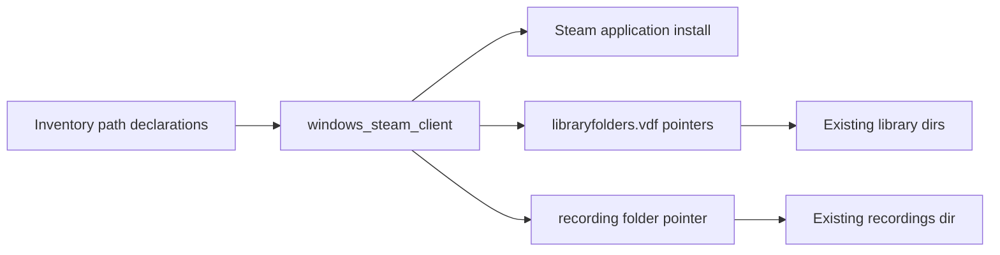
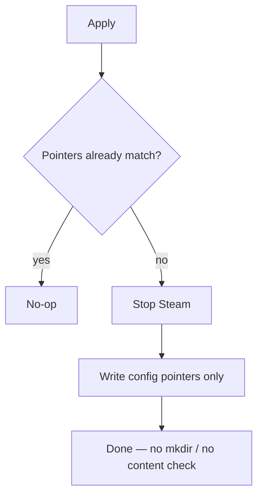

# Windows Steam Client — Config Pointers Only (WIP)

Target clarified 2026-09-23: **configuration-forward only.** Declare where Steam
should look for (1) existing library folders and (2) the Game Recording folder.
Do **not** create those directories, do **not** populate games/clips, do **not**
care whether content is present. When live pointers already match inventory,
apply is a **no-op**.

## Packet boundary

**In scope (v1):**

1. Install Steam **application** (so recovery can re-install the client).
2. Deploy **library folder pointers** to inventory-declared paths (user has two
   library locations today) via `libraryfolders.vdf` (Steam closed).
3. Deploy **Game Recording save-folder pointer** to the inventory-declared path
   (wherever recordings are configured now, e.g. `I:\Gamerecordings`) once the
   machine-writable setting surface is confirmed (UI today; registry/VDF probe
   required for Ansible write).
4. Idempotent: if pointers already match, change nothing.

**Explicit non-goals:**

- Creating library or recording directories
- Checking whether games or recordings exist at those paths
- Copying / backing up / recreating library or recording content
- Steam Cloud, login, per-title installs

## Is this possible?

| Capability | Possible? | Confidence |
|---|---|---|
| Install client (Choco / winget) | Yes | High |
| Point Steam at existing library folders | Yes — `config\libraryfolders.vdf` | High (live evidence on HVH-02) |
| Point Game Recording at existing folder | Yes — **not registry**; `userdata\<steamid>\config\localconfig.vdf` → `GameRecording.BackgroundRecordPath` | High (live evidence on HVH-02) |
| Config-only / no-op when already correct | Yes | High |
| Ignore empty vs populated targets | Yes — pointers only | High |

### Method / surfaces we would manage (evidence-backed)

Live probe **HOM-LAB-HVH-02** (2026-09-23):

| Concern | Surface managed | Observed value | How we configure |
|---|---|---|---|
| Client install | Package | `C:\Program Files (x86)\Steam` (`HKLM\...\Valve\Steam\InstallPath`) | `win_chocolatey` `steam` (+ winget `Valve.Steam` fallback) |
| Library folders | `<Steam>\config\libraryfolders.vdf` | `"1"` → `D:\SteamLibrary`, `"2"` → `I:\SteamLibrary` (+ default `"0"` under Program Files) | With Steam **stopped**: ensure declared `path` entries exist; **merge** only — do not wipe existing `apps` / `contentid` blocks |
| Game Recording folder | `<Steam>\userdata\<steamid>\config\localconfig.vdf` key `BackgroundRecordPath` under `"GameRecording"` | `I:\Gamerecordings` | With Steam **stopped**: set/replace that key for the active user(s); do **not** mkdir |
| Registry `HKCU\Software\Valve\Steam` | **Not** the recording path surface on this host | No `SaveFolder` / GameRecording path keys present | Do **not** use registry for recording path unless a later probe shows otherwise |

**Not managed in v1:** game content under libraries, clip files under recordings, Steam Cloud, login tokens, `apps{}` membership inside `libraryfolders.vdf` (Steam owns that after it sees the path).

**Approach in one sentence:** inventory declares paths → role installs client if needed → stops Steam → merges library VDF paths + sets `BackgroundRecordPath` → starts nothing / leaves content alone → second apply is no-op when already matching.

## Desired inventory shape (HOM-LAB-HVH-02 — declared from live 2026-09-23)

```yaml
# inventory/host_vars/hom-lab-hvh-02.yaml
windows_steam_client_state: present
windows_steam_client_library_roots:
  - 'D:\SteamLibrary'
  - 'I:\SteamLibrary'
windows_steam_client_recording_root: 'I:\Gamerecordings'
windows_steam_client_ensure_paths: false
```

Surfaces: `roles/windows_steam_client`, `playbooks/deploy_windows_steam_client.yaml`.
**Apply not run** in the scaffold pass (user-authorized rebuild-first deferral).

**Mature targeting (not bare hostname):**

| Layer | Value |
|---|---|
| Inventory | `windows_server_2025:&windows_nvidia_gpu_hosts` |
| Execution role | `windows-steam-gaming` |
| Capability catalog | `windows_steam_client` |
| GPU label | `gpu: rtx-5090` |
| Labels | `homelab.workload/steam-client`, `homelab.role=windows-gaming` |
| State | `windows_steam_client_state: present` |

## Recovery story

```text
Reinstall OS / wipe client
  → Ansible: install Steam app
  → Ansible: write library + recording pointers to existing paths
  → Operator: login if needed
  → Steam uses those locations (content optional)
```

## Apply / Verify / Undo / Change class

| Contract | Direction |
|---|---|
| Apply | Install client if absent; with Steam stopped, set library (+ recording) pointers to declared paths; skip mkdir |
| Verify | Client present; VDF/registry pointers match inventory; **do not** assert game/clip content |
| Undo | `absent` removes client package; does **not** delete library/recording trees |
| Change class | Idempotent config + package; recording key may be provisional until probed |

## Architecture/Structure Diagram



## Capability Routing Diagram



## Checklist

- [x] Capture current two library roots + recording root from live host into inventory (declare-as-is)
- [x] Confirm library surface: `config\libraryfolders.vdf` (HVH-02 probe)
- [x] Confirm recording surface: `localconfig.vdf` → `BackgroundRecordPath` (HVH-02 probe; **not** registry)
- [x] VDF merge strategy (preserve `apps`/`contentid`; Steam closed) — `files/Merge-SteamLibraryFolders.ps1`
- [x] Role: `ensure_paths: false` default; install + pointers only
- [ ] Idempotence proof: second apply = zero meaningful change (deferred — no live apply this pass)
- [x] First commission host choice (OD-03) — HOM-LAB-HVH-02
- [x] Scaffold validation: syntax-check + `--tags preview` + `--tags verify` (no apply)

## Validation receipt (2026-09-23 scaffold; apply deferred)

| Check | Result |
|---|---|
| Live probe libraries | `D:\SteamLibrary`, `I:\SteamLibrary` (+ default Program Files) |
| Live probe recording | `BackgroundRecordPath` = `I:\Gamerecordings` (steamid `1079654653`) |
| Inventory vs project | host_vars declared; role/playbook + execution role + catalog |
| Class targeting | `windows_server_2025:&windows_nvidia_gpu_hosts` + `windows-steam-gaming` + `gpu: rtx-5090` |
| Preview selection | HVH-02 selected; HVH-01 excluded (no role / gtx-1060) |
| `ansible-playbook --syntax-check` | pass |
| `--tags preview` | pass — state present, roots match |
| `--tags verify` | pass — pointers match inventory (read-only) |
| `ansible-lint` (role + playbook) | pass (0 failures) |
| Full apply | **not run** (user-authorized rebuild-first deferral) |

## On Deck — user decisions to integrate

| ID | Decision | Status |
|---|---|---|
| OD-01 | Config-forward: point Steam at existing libraries + recordings; no content recreate | captured |
| OD-02 | Never mkdir library/recording paths in v1; never require content present | captured |
| OD-03 | First commission host(s) | captured — HOM-LAB-HVH-02 (rebuild-first; apply deferred) |
| OD-04 | Include Game Recording path in same role as libraries | captured — yes (`BackgroundRecordPath`) |

## Naming/Modeling Diagram

N/A until role/var names locked.

## Diagram gate receipt

- Architecture/Structure: Mermaid fence included.
- Capability Routing: Mermaid fence included.
- Naming/Modeling: N/A.
- Medium: `mermaid-fence`.

## Diagram Inventory

| Diagram | Medium | Status |
|---|---|---|
| Architecture/Structure | mermaid-fence | included |
| Capability Routing | mermaid-fence | included |
| Naming/Modeling | N/A | explicit |
