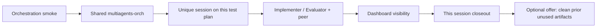

# Calculator Receipt Smoke Test

## Purpose (read first)

This packet is a **development / test surface** for iterating on the Cursor
(and other client) path:

```text
parent multiagents-orch → Implementer/Evaluator → peer MCP → broker/dashboard
```

It is **not** a real plan whose lasting goal is to “solve” the calculator
problem. The arithmetic task is a harmless payload so paired agents have
something tiny to implement, message about, and approve.

### Reuse rules

- Finding previous receipts, review notes, `.multiagents/` slots, wait-state
  files, or old dashboard sessions under this folder **must not block** a new
  orchestration test. Treat them as leftovers from prior iterations on this
  surface.
- Start a new run with a **unique** `session_name` on the shared orch substrate.
  Other sessions or prior artifacts here are other tenants / prior runs, not
  blockers.
- After you finish using this test plan for a run, **offer** (do not force)
  cleanup of unused previous work that may have accumulated because this folder
  is a development surface — for example stale handoff files, old
  `.multiagents/` slot JSON, disposable receipts from earlier iterations, or
  named disposable broker sessions the operator no longer wants. Keep anything
  the operator wants as evidence unless they accept the cleanup offer.

### Suggested invocation

```text
Use $paired-plan-multiagents-orchestrator with
docs/plans/2026-09-24--calculator-receipt-smoke-test/ for an orchestration
smoke (test surface only; prior artifacts are non-blocking). After the run,
offer cleanup of unused prior work in this plan folder.
```

## Summary (payload only)

Produce and independently check a tiny calculation receipt. The expected
calculation is `(17 × 23) + 19`, and the expected result is `410`. Success of
the **orchestration path** matters more than treating this math as unfinished
project work.

## Scope

- Exercise Implementer/Evaluator + peer messaging + dashboard visibility.
- Optionally perform/record the trivial calculation as the agent payload.
- Do **not** treat incomplete checklist rows or prior receipts as a reason to
  refuse a new orchestration smoke.
- Accept the **orchestration** smoke when agents connected, exchanged live peer
  messages, and reached an approval/closeout for **this** session (payload may
  already exist from a prior iteration).

## Apply / Verify / Undo / Change class

| | |
|---|---|
| **Apply** | Run a uniquely named paired session against this folder (or a copy under `oneoffs/`). Payload may rewrite or leave existing receipts. |
| **Verify** | Live orch tools, peer messages both ways, dashboard visibility for this session; optional recompute of `410` if the payload is exercised. |
| **Undo** | Optional: delete or archive unused prior iteration artifacts in this folder / named disposable sessions after operator accepts a cleanup offer. Shared orch/broker/dashboard stay up. |
| **Change class** | Reversible, doc-only development-test surface. |

## Checklist (payload; non-blocking for reuse)

These rows describe the toy payload. They are **not** a gate against starting
another orchestration iteration on this surface.

- [ ] Calculate `(17 × 23) + 19`.
- [ ] Record the result as `410`.
- [ ] Independently verify the result.
- [ ] Accept only when both results match (for a payload pass of that iteration).

## After-run cleanup offer (optional)

When a smoke finishes, ask something like:

```text
Offer cleanup of unused prior work under this test plan folder (old receipts,
review/ready files, .multiagents slot leftovers) and any named disposable
sessions from earlier iterations? Shared orch/broker/dashboard will stay up.
```

Only clean what the operator accepts. Do not treat leftover files as proof the
test plan is “already solved” and therefore unusable.

## Architecture/Structure Diagram



## Capability Routing Diagram

N/A — one test path; no host/runtime branching.

## Naming/Modeling Diagram

N/A — creates no infrastructure names. Session names must stay unique per run.

## Diagram Inventory

- Architecture/Structure: included as a Mermaid fence (`mermaid-fence`).
- Capability Routing: considered; not applicable.
- Naming/Modeling: considered; not applicable.
- Other available diagrams: sequence/state could be added later; not required
  for this development-test surface.
