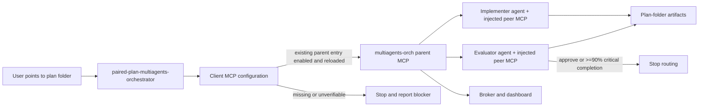
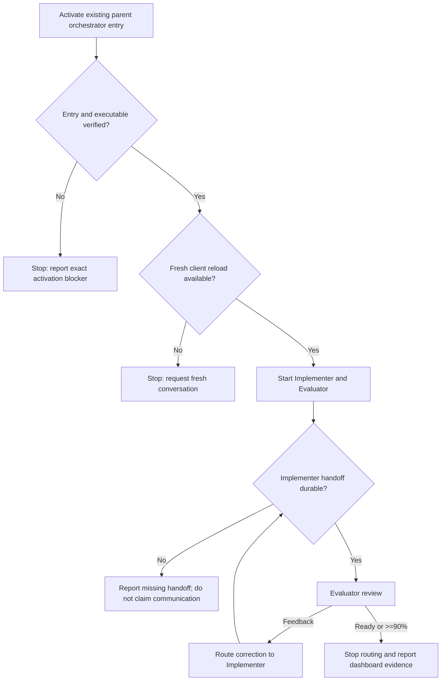

# Paired Plan Multiagents Orchestrator — Activation-Gated Workflow

## Summary

This plan records the current effort to make a reusable skill start a
plan-folder Implementer/Evaluator workflow through the parent
`multiagents-orch` MCP server. The parent injects `multiagents-peer` only into
the spawned agents; peer MCP is not a general Cursor, Codex, or Continue
integration. The skill must activate an existing parent entry first, stop when
that entry or executable cannot be verified, and only then begin paired work
and dashboard observation. The plan is intentionally **in progress**: the
source skill and project documentation are updated, but a fresh client-session
MCP activation plus a real dashboard-backed handoff remains to be proven.

## Capability Packet Boundary

| Field | Value |
|---|---|
| Capability identifier | `paired-plan-multiagents-orchestrator` |
| Owner manifest | `/Users/joshc/develop/global-skills/skills/catalog.yaml` and this plan packet |
| Owned files | Global skill directory, catalog entry, client MCP configuration changes, and this plan packet |
| Integration anchors | Parent `multiagents-orch` MCP, child-scoped `multiagents-peer` injection, Codex `.codex/config.toml`, global skill runtime bridges, paired implementer/evaluator skills, dashboard at `127.0.0.1:7900` when supported |
| Update behavior | Keep activation gating, role handoff, dashboard evidence, and failure boundaries synchronized across the skill and runtime contract |
| Removal behavior | Remove the new skill/catalog entry and restore only the prior client MCP enabled state; retain unrelated multiagent runtime and paired-agent skills |

## Current status

| Area | Status | Evidence or remaining work |
|---|---|---|
| Global orchestrator skill | implemented in source, not campaign-complete | `skills/implementation/paired-plan-multiagents-orchestrator/SKILL.md` exists |
| Catalog registration | verified | Global catalog validator returned `skills catalog validation ok` |
| Codex parent MCP activation | configured but disabled | Project entry uses `command = "/Users/joshc/.bun/bin/multiagents-orch"` and `enabled = false`; the skill may enable it when explicitly invoked |
| Child peer MCP scope | documented | `multiagents-peer` is injected by the parent into spawned agents only |
| Executable | verified | `/Users/joshc/.bun/bin/multiagents --version` returned `0.5.0` |
| Runtime bridge | synchronized | Global skill symlink was refreshed into Codex/Cursor/Agents roots |
| Fresh MCP reload | pending | Requires a new client conversation or equivalent reload after configuration change |
| Real paired workflow | pending | Must use the `multiagents` MCP server, not built-in subagent APIs |
| Dashboard communication proof | pending | Must capture reachable URL and Implementer → Evaluator handoff evidence |

## Scope

### In scope

- Maintain one reusable entry skill for plan-folder paired orchestration.
- Activate only an existing client-specific parent `multiagents-orch` MCP
  configuration entry, using the client’s native syntax.
- Keep `multiagents-peer` out of normal client MCP catalogs; the parent injects
  it into the spawned Implementer and Evaluator only.
- Stop with an explicit blocker when configuration, executable, or activation
  cannot be verified.
- Pass a plan folder to one Implementer and one Evaluator with disjoint file
  ownership.
- Preserve the existing plan-folder artifact contract as durable evidence.
- Verify dashboard visibility and stop routing when the Evaluator approves or
  explicitly reaches the defined 90% threshold.
- Validate the workflow with a harmless calculation plan before using a real
  implementation plan. The calculator packet
  (`docs/plans/2026-09-24--calculator-receipt-smoke-test/`) is a
  **development test surface**: prior artifacts there must not block reuse;
  after a run, offer optional cleanup of unused prior work on that surface.

### Out of scope

- Running `multiagents setup` automatically.
- Installing or reinstalling `multiagents`.
- Resetting an unknown broker, session, or dashboard.
- Replacing evaluator quality judgment with orchestration state.
- Expanding this first workflow to Claude, Gemini, Cursor, or other clients
  beyond documenting client-specific activation boundaries.
- Treating a configured MCP entry as proof of a live client-loaded server.

## Acceptance contract

The work is ready for evaluator review when all of the following are proven in
a fresh client session:

1. The active client and MCP configuration path are identified.
2. The existing parent `multiagents-orch` entry is found and enabled without setup or
   reinstall work.
3. The configured executable is present and executable.
4. Exactly one Implementer and one Evaluator are started through the
   `multiagents` MCP server.
5. The Implementer produces a durable review-ready handoff.
6. The Evaluator receives and evaluates that handoff through the orchestrated
   workflow.
7. The dashboard URL is reachable and shows the active session or equivalent
   runtime evidence.
8. Routing stops after evaluator approval or an explicit evaluator decision
   that critical work is at least 90% complete.

## Apply / Verify / Undo / Change class

| | |
|---|---|
| **Apply** | Enable the existing client parent `multiagents-orch` MCP entry, refresh the client if required, and run the bounded paired workflow against the calculation plan. The parent injects peer MCP only into child agents. |
| **Verify** | Re-read the parent entry, verify the executable, inspect the multiagents session/dashboard, and compare Implementer/Evaluator artifacts. |
| **Undo** | Restore only the prior MCP `enabled` value and stop only explicitly identified run-owned agents/session processes. |
| **Change class** | Reversible client configuration plus reusable orchestration skill and documentation. |

## Work items

- [x] Create the global `paired-plan-multiagents-orchestrator` skill.
- [x] Add the skill’s activation gate, failure boundary, role routing, and
  90% stop rule.
- [x] Register the skill in `global-skills/skills/catalog.yaml`.
- [x] Enable the project Codex `mcp_servers.multiagents` entry.
- [x] Verify the multiagents executable and version.
- [x] Refresh global runtime skill bridges.
- [x] Create a harmless calculation plan for validation.
- [ ] Start a fresh client session with the enabled MCP configuration loaded.
- [ ] Run the Implementer/Evaluator pair through `multiagents` MCP.
- [ ] Capture dashboard URL, reachability, session identity, and handoff proof.
- [ ] Have an independent evaluator review the skill behavior and identify
  improvements.
- [ ] Update the skill from evaluator findings, if needed.
- [x] Narrow the activation gate so a missing active-client MCP entry is
  terminal and does not trigger broader MCP troubleshooting.
- [x] Define the one-sentence plan-folder invocation and final verified
  dashboard handoff.
- [x] Treat `multiagents-peer` as child-only runtime injection rather than a
  parent activation alias; accept user versus project scope for the parent.
- [x] Distinguish the agent-side peer MCP from the parent orchestrator MCP;
  peer-only configuration is not sufficient for this workflow.
- [x] Remove persistent peer entries from the project’s normal Codex, Cursor,
  and Continue configuration surfaces; retain only the parent orchestrator
  entry.
- [x] Standardize the parent command on the installed `multiagents-orch`
  binary and document the child-scoped peer injection contract.
- [ ] Add a plan verification receipt covering all obligations before changing
  this plan to a completed lifecycle.

## Architecture/Structure Diagram

## Capability Routing Diagram

## Naming/Modeling Diagram

N/A — this plan does not create infrastructure objects, aliases, NetBox
objects, or new host naming schemes. The stable skill identifier is
`paired-plan-multiagents-orchestrator`; the runtime server identifier is
`multiagents`.

## Plan verification receipt

This receipt is intentionally pending because the fresh-session MCP workflow
has not yet been proven.

| Obligation | Status | Evidence |
|---|---|---|
| Source skill and catalog entry | pass | Source files exist; catalog validation returned exit 0 |
| Codex MCP entry enabled | pass | `.codex/config.toml` shows `enabled = true` |
| Executable available | pass | `multiagents --version` returned `0.5.0` |
| Fresh client reload | pending | New session required |
| MCP-backed paired run | pending | No fresh `multiagents` MCP session evidence yet |
| Dashboard communication | pending | URL/reachability and handoff evidence not yet captured |
| Independent skill evaluation | pending | Evaluator prompt/run not yet completed |

## On Deck — user decisions to integrate

| ID | User decision / direction | Target integration | Status |
|---|---|---|---|
| OD-01 | The reusable skill must activate the existing client-specific `multiagents` MCP entry first and stop if it cannot | Activation gate and failure boundaries | Integrated |
| OD-02 | The workflow should accept a normal plan folder without embedding multi-agent instructions in that plan | Skill input contract and calculation-plan fixture | Integrated |
| OD-03 | The Implementer/Evaluator workflow should stop after evaluator approval or approximately 90% critical completion | Routing and stop rule | Integrated |
| OD-04 | If the active client lacks its own `multiagents` MCP entry, stop immediately; do not inspect or troubleshoot other MCP settings | Activation gate and failure response | Integrated |
| OD-05 | The user should point the skill at a normal plan folder in one sentence; after verified setup, the parent should return the dashboard watch details and stop | Invocation and final handoff contract | Integrated |
| OD-06 | Cursor may expose the parent service under a client-native key; accept user versus project scope for the parent, but do not treat `multiagents-peer` as the parent | Client activation contract | Integrated |
| OD-07 | The skill must require the parent orchestrator MCP, not only the peer MCP | Server-role activation gate | Integrated |

## Diagram Inventory

- Architecture/Structure: included as a Mermaid fence (`mermaid-fence`).
- Capability Routing: included as a Mermaid fence (`mermaid-fence`).
- Naming/Modeling: included as an explicit N/A section.
- Other available diagrams: sequence and state diagrams could be added during
  evaluator feedback if the runtime handoff needs more detail.
