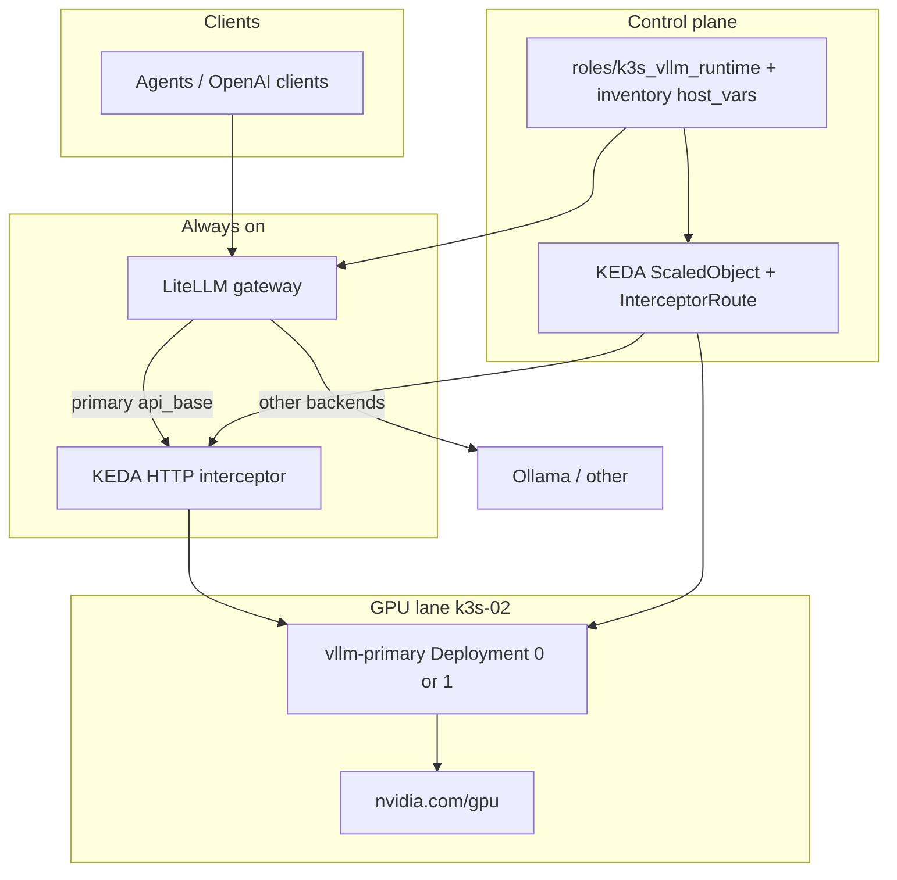
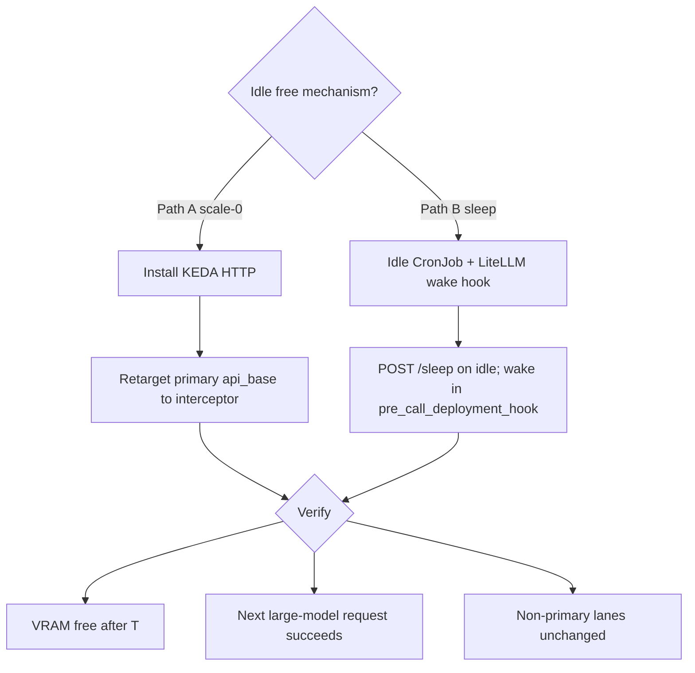
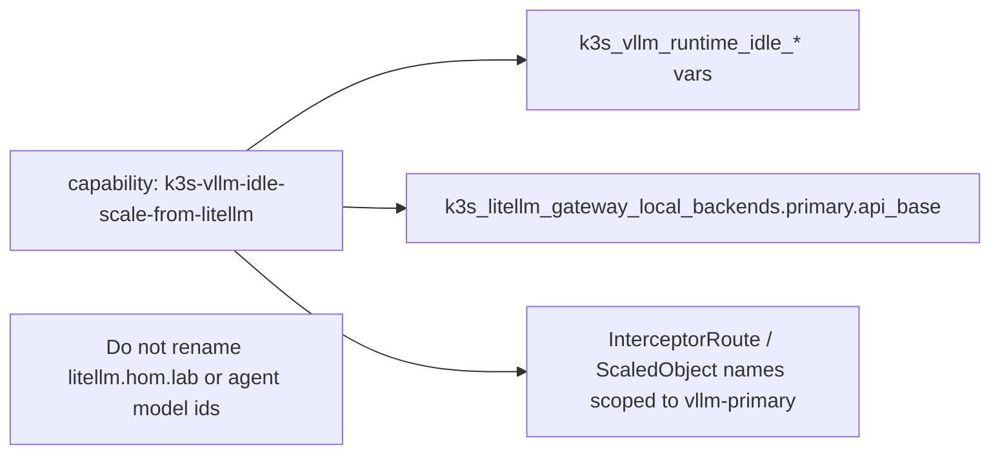

# Scale vLLM from LiteLLM traffic

## Summary

Free the lab GPU when the primary vLLM model is idle, then bring it back
transparently on the next LiteLLM request — without teaching agents about
sleep/wake.

**Use case (from [ai_draft_plan.md](ai_draft_plan.md)):**

1. LiteLLM stays always-on.
2. Watch traffic for the **large** model lane only (not every backend).
3. After idle period T, free GPU (`replicas: 0` or sleep).
4. On next request: notice before the upstream call fails, wake/scale, wait
   until Ready, forward the original request.
5. Prefer an existing Kubernetes component over a custom controller when it
   covers wake + buffer + idle scale-down.

**Research verdict (Context7 + vendor docs, 2026-09-25):** for true
`replicas: 0` with request buffering, the lightest *existing* fit is the
**KEDA HTTP Add-on** (interceptor + ScaledObject). vLLM sleep mode is lighter
still when “scale to 0” can be relaxed to “free VRAM, keep the pod.” Knative
Serving also buffers via Activator but replaces Services and adds platform
weight — out of scope for v1.

## Capability Packet Boundary

| Field | Value |
|-------|-------|
| Capability identifier | `k3s-vllm-idle-scale-from-litellm` |
| Owner manifest | This plan packet + role defaults under `roles/k3s_vllm_runtime/` and (if KEDA path) a new or extended KEDA/HTTP role |
| Owned files | Idle policy vars/tasks; optional KEDA `InterceptorRoute`/`ScaledObject` manifests; LiteLLM `api_base` retarget for primary only; operator docs |
| Integration anchors | `inventory/host_vars/hom-lab-ctl-k3s-02.yaml` (`k3s_vllm_runtime_*`, `k3s_litellm_gateway_local_backends.primary`); LiteLLM gateway route for `qwen3-coder-30b-a3b` |
| Update behavior | Inventory toggle + Ansible re-apply; idle T / cooldown as role vars |
| Removal behavior | Disable idle policy; restore `replicas: 1` (or wake); remove KEDA HTTP objects if installed; point `api_base` back at `vllm-primary` Service |

**In scope**

- Primary lane only: LiteLLM → `vllm-primary` on `hom-lab-ctl-k3s-02`.
- Idle timer + scale-down + wake-on-request path that agents do not see.
- Document cold-start / first-request latency and client timeout floors.
- Ansible-managed lab-side control (not Mac-driven day-2 sleep/wake scripts
  as the steady-state path).

**Out of scope**

- Scaling Ollama desktop/HVH backends.
- Full Knative Serving platform install for v1.
- ComfyUI / Phase B timeshare automation changes (must not fight idle free).
- Making vLLM itself grow an Ollama-style `keep_alive`.

## Apply / Verify / Undo / Change class

| | Contract |
| --- | --- |
| **Apply** | Enable inventory idle policy; install chosen wake path (KEDA HTTP **or** sleep+hook); retarget LiteLLM primary `api_base` only if interceptor is used; set idle/cooldown T (default candidate: 30m, operator may prefer 5–10m) |
| **Verify** | After idle T: GPU VRAM drops (`nvidia-smi` / node evidence). Next chat on large model: request eventually succeeds (no agent change). Small-model routes unchanged. Re-apply Ansible → no unexpected drift |
| **Undo** | Disable policy; delete interceptor/ScaledObject if present; `replicas: 1` or `POST /wake_up`; restore direct `api_base` to `http://vllm-primary.vllm-runtime.svc.cluster.local:8000/v1` |
| **Change class** | Idempotent config + optional new K3s components (KEDA HTTP). Not bootstrap of the cluster itself |

## Assumptions and defaults

- All agent traffic for the large model already goes through LiteLLM
  (`litellm.hom.lab`).
- Primary backend today:
  `http://vllm-primary.vllm-runtime.svc.cluster.local:8000/v1`
  (`k3s_litellm_gateway_local_backends.primary`).
- Host already has `k3s_vllm_runtime_sleep_mode_enabled: true` and Mac helpers
  under `scripts/vllm-runtime/` — sleep capability exists; **idle automation
  and wake-before-forward do not**.
- Operator accepts first-request latency after idle (minutes possible for
  scale-from-zero on 30B AWQ; shorter for sleep level 1).
- Health scrapes must not reset the idle clock.
- Exactly one GPU consumer at a time on k3s-02 (Phase B timeshare rule).

## Decision: mechanism choice

```text
Need true replicas=0 + hold the HTTP request until Ready?
  YES → Path A: KEDA HTTP Add-on (recommended for draft use case)
  NO  → Need only free VRAM, keep pod?
          YES → Path B: vLLM sleep + idle watcher + LiteLLM wake hook
          Prefer custom scale CronJob without wake buffer?
            → Reject for this use case (fails “forward original request”)
```

| Path | Existing component? | Idle → free GPU | Wake + forward original request | Extra K3s pieces | Notes |
|------|---------------------|-----------------|----------------------------------|------------------|-------|
| **A — KEDA HTTP** | Yes (HTTP Add-on interceptor) | `minReplicas: 0` + cooldown | Interceptor queues, scales 0→1, forwards | KEDA + HTTP add-on operator/scaler/interceptor | Matches all six draft research bullets |
| **B — Sleep + LiteLLM hook** | Partial (vLLM sleep already enabled) | `POST /sleep` | `async_pre_call_deployment_hook` wakes + waits | CronJob/watcher + small LiteLLM callback | Faster wake; keeps DEV_MODE admin surface; not true scale-0 |
| Custom idle controller only | No | Scale 0 | **Missing** unless something else wakes | Homegrown | Draft correctly rejects “watch vLLM traffic” after scale-0 |
| Knative Serving | Yes (Activator) | `minScale: 0` | Activator buffers | Knative control + data plane | Heavier; Service model change — defer |

**Plan default for this packet:** Path **A** (KEDA HTTP) as the target that
satisfies the draft’s scale-0 + forward requirement. Path **B** remains an
explicit on-deck alternate if the operator prefers lower platform cost and
accepts sleep instead of replicas=0.

## Target architecture (Path A)

```text
Agents / clients
       │
       ▼
   LiteLLM (always on)
       │  primary model only
       ▼
 KEDA HTTP interceptor  ←── always running; buffers when replicas=0
       │
       ▼
 vllm-primary Deployment  (0 or 1)
       │
       ▼
      GPU
```

Idle scale-down is driven by interceptor metrics → KEDA ScaledObject
`cooldownPeriod` (vendor default 300s; set to operator T, e.g. 1800s).

Wake path does **not** observe dead vLLM pods; it observes HTTP at the
interceptor, which LiteLLM already hits for the primary `api_base`.

## Target architecture (Path B alternate)

```text
LiteLLM CustomLogger
  async_pre_call_deployment_hook (primary only)
    → if sleeping: POST /wake_up, poll /is_sleeping or readiness
    → then forward

Idle CronJob / watcher
  → last success from LiteLLM/Prometheus (exclude health)
  → if idle > T: POST /sleep?level=1
```

## Implementation sequence

### Phase 0 — evidence and timeouts (read-only)

1. Measure cold-start wall time for `vllm-primary` scale 0→1 Ready on
   `hom-lab-ctl-k3s-02` (model
   `cyankiwi/Qwen3-Coder-30B-A3B-Instruct-AWQ-4bit`).
2. Measure sleep level-1 wake time with existing sleep helpers.
3. Set LiteLLM router/client timeouts **above** worst-case wake (research:
   LLM demos use 120–180s interceptor waits; 30B AWQ may need more — record
   live number before locking defaults).

### Phase 1 — Path A scaffolding (Ansible-first)

1. Research/install gate: KEDA core + `keda-add-ons-http` on the k3s cluster
   (new role or extend an existing K3s add-on role; lifecycle
   `present|absent`).
2. Front `vllm-primary` Service with InterceptorRoute + ScaledObject:
   - `minReplicas: 0`, `maxReplicas: 1`
   - `cooldownPeriod` = idle T
   - interceptor wait / response-header timeouts ≥ measured cold start
3. Retarget only
   `k3s_litellm_gateway_local_backends.primary.api_base` to the interceptor
   Service URL (small models stay on current bases).
4. Exclude health probes from idle activity (use interceptor metrics, not
   naive pod-alive checks).

### Phase 2 — verify behavior

1. Drive traffic on large model → replicas 1, request succeeds.
2. Quiesce for T → replicas 0, VRAM free.
3. New completion request → buffered wake → success (capture latency).
4. Confirm non-primary LiteLLM routes unaffected.
5. Confirm Phase B ComfyUI present/absent still coherent (document conflict
   rule: idle policy must not scale up while ComfyUI owns the GPU).

### Phase 3 — Path B optional (only if Path A deferred)

1. Keep `k3s_vllm_runtime_sleep_mode_enabled: true`.
2. Ansible-managed idle CronJob calling in-cluster sleep against the Service.
3. LiteLLM proxy callback package:
   - Context7: `CustomLogger.async_pre_call_deployment_hook` runs **after**
     deployment selection and **before** upstream send — correct hook for
     primary-only wake.
4. Document DEV_MODE exposure boundary (admin HTTP must stay cluster-internal).

## Checklist

- [ ] Phase 0 cold-start and sleep-wake timings recorded on target host
- [ ] Mechanism decision locked (Path A default / Path B alternate) in inventory
- [ ] Ansible entrypoints for install + verify + undo
- [ ] LiteLLM primary `api_base` wiring for chosen path
- [ ] Idle T / cooldown / timeouts as role vars with defaults
- [ ] Verification receipt: idle free + wake success + other lanes OK
- [ ] Operator doc: first-request latency, undo, ComfyUI timeshare interaction
- [ ] On-deck items integrated or rejected before build/execute

## AI runtime host evidence (required class)

| Item | Current truth |
|------|----------------|
| Inventory host | `hom-lab-ctl-k3s-02` |
| Runtime path | K3s guest Deployment `vllm-primary` |
| GPU | Single `nvidia.com/gpu` on HVH-02 GPU-P path (Phase B timeshare) |
| Serving runtime | vLLM (`k3s_vllm_runtime`) |
| Shared infra | LiteLLM gateway on same host; Langfuse/clients unchanged |
| Sleep flags today | `k3s_vllm_runtime_sleep_mode_enabled: true` |
| Live probe before execute | Re-confirm `nvidia-smi` / Deployment Ready / LiteLLM primary health in execute receipt |

## Research receipt (Context7 + vendor)

Queried 2026-09-25 via `ctx7` (Docker) with
`CONTEXT7_API_KEY` from `~/.config/dotfile-vnext/mcp/env.d/context7.env`.

| Topic | Library ID | Finding |
|-------|------------|---------|
| LiteLLM pre-call / deployment hooks | `/websites/litellm_ai`, `/BerriAI/litellm` | `async_pre_call_hook` and `async_pre_call_deployment_hook` can run before upstream; deployment hook is after model selection — fit for primary-only wake. Retries/timeouts are router settings, not scale-to-zero. |
| vLLM sleep | `/vllm-project/vllm`, `/websites/vllm_ai_en_stable` | `--enable-sleep-mode` + `VLLM_SERVER_DEV_MODE=1`; `POST /sleep?level=1\|2`, `POST /wake_up`, `GET /is_sleeping`. Level 1 offloads weights to CPU; level 2 discards weights+KV. **No idle timer** — external policy required. |
| KEDA scale-to-zero | `/websites/keda_sh`, `/kedacore/keda` | ScaledObject `cooldownPeriod` (default 300s) after last trigger inactivity. Prometheus-only scalers do **not** buffer HTTP from zero. |
| KEDA HTTP Add-on | keda.sh/http-add-on (vendor docs) | Interceptor + scaler + operator; InterceptorRoute (v1beta1) replaces deprecated HTTPScaledObject; queues requests while scaling 0→1. LLM demos set wait timeouts ~120–180s. |
| Knative | `/knative/docs` | Activator queues during cold start; scale-to-zero retention annotations exist. Heavier than KEDA HTTP for this lab. |

**Implication:** the draft’s instinct (“don’t watch dead vLLM; watch the
gateway path”) is correct. For replicas=0, that path must be an **always-on
interceptor** (KEDA HTTP) or an **always-on LiteLLM hook that wakes sleep**.
A CronJob alone cannot satisfy “forward the original request.”

## Architecture/Structure Diagram



## Capability Routing Diagram



## Naming/Modeling Diagram



N/A for NetBox object renames in v1 (`netbox_scope: false`). Naming stays in
Ansible/K8s resource identifiers only.

## On Deck — user decisions to integrate

| ID | User decision / direction | Target integration | Status |
|----|---------------------------|--------------------|--------|
| OD-1 | Confirm Path A (KEDA HTTP / scale-0) vs Path B (sleep + LiteLLM hook) | Mechanism section + inventory toggle | open — plan defaults to A |
| OD-2 | Idle period T (draft example 30m; earlier operator sketch 5–10m) | `cooldownPeriod` / CronJob schedule | open |
| OD-3 | Accept cold-start ceiling after live Phase 0 probe | Interceptor + LiteLLM timeouts | open until measured |

## Diagram Inventory

| Diagram | Medium | Included |
|---------|--------|----------|
| Architecture/Structure | mermaid-fence | Yes |
| Capability Routing | mermaid-fence | Yes |
| Naming/Modeling | mermaid-fence | Yes (Ansible/K8s ids; NetBox N/A) |
| Sequence idle→wake | — | Optional later |
| Pack SVG via create-diagrams | — | Not required while Mermaid is intentional |

## Diagram gate receipt

- Architecture/Structure: present (mermaid-fence)
- Capability Routing: present (branching Path A/B)
- Naming/Modeling: present (var/resource ownership; NetBox N/A)
- Diagram Inventory: present
- Medium preference: mermaid-fence (plan routing sketches)

## Sources checked

| Source | Role |
|--------|------|
| [ai_draft_plan.md](ai_draft_plan.md) | Use-case authority for this packet |
| `docs/brainstorming_designs/2026-09-23--vllm-idle-desktop-usability-patterns/` | Prior sleep vs scale-0 brainstorm |
| `inventory/host_vars/hom-lab-ctl-k3s-02.yaml` | Sleep enabled; primary `api_base` |
| `scripts/vllm-runtime/README.md` | Existing manual sleep/wake helpers |
| Context7 `/websites/litellm_ai`, `/BerriAI/litellm` | Callbacks / deployment hook |
| Context7 `/vllm-project/vllm`, `/websites/vllm_ai_en_stable` | Sleep mode API |
| Context7 `/websites/keda_sh`, `/kedacore/keda` | cooldown / scale-to-zero concepts |
| https://keda.sh/http-add-on/ | Interceptor architecture; InterceptorRoute |
| Google GKE / RH AIS demos (KEDA HTTP + LLM) | Cold-start timeout practice 120–180s |
| Knative Serving docs (Context7 `/knative/docs`) | Activator buffer — deferred alternative |
