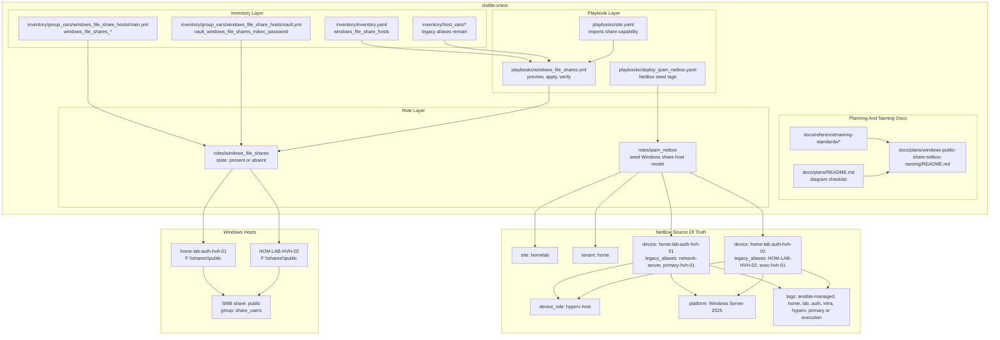
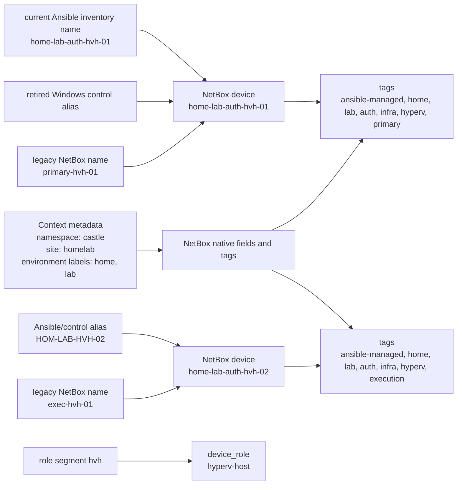

# Windows Public Share Capability Plan With NetBox Naming And Required Diagrams

## Summary

- Add a reusable Windows public-share capability for `HOM-LAB-HVH-02` and `home-lab-auth-hvh-01`.
- Replace the weak NetBox-facing `primary-hvh-01` and `exec-hvh-01` names with the current context baseline names `home-lab-auth-hvh-01` and `home-lab-auth-hvh-02`.
- Keep historical/control names as aliases and push rich context into NetBox native fields, tags, and context metadata.
- Fix the planning gap by adding a plan-authoring checklist under `docs/plans/`.

## Architecture/Structure Diagram



## Capability Routing Diagram


## Naming/Modeling Diagram



## Key Changes Implemented

- Active inventory now uses `home-lab-auth-hvh-01` for the former network-server Windows control host.
- NetBox device names are `home-lab-auth-hvh-01` and `home-lab-auth-hvh-02`.
- NetBox-facing changes follow repo seed/config first, repo consistency gate second, NetBox apply third.
- Legacy names `network-server`, `primary-hvh-01`, and `exec-hvh-01` remain migration aliases only; the retired Windows control alias is migration context only.
- `castle` remains namespace/context, not tenant.
- `home` is modeled as the NetBox tenant.
- `homelab` remains NetBox site for now; `lab` is carried as a context tag until the site naming model is intentionally revised.
- `auth` is carried as a context/stage tag.
- `windows_file_shares` owns the Windows SMB capability with `windows_file_shares_state: present|absent`.
- The managed Windows share is `F:\shares\public` exposed as `public`.
- Access is credentialed: local group `share_users`, user `mikec`, NTFS `Modify`, SMB `Change`.
- Anonymous access and `Everyone` share grants are intentionally omitted.
- `docs/plans/README.md` now requires stored plans to include required diagram sections or explicit `N/A` reasons.

## Apply / Verify / Undo

Apply:

```bash
ansible-playbook playbooks/deploy_ipam_netbox.yaml -i inventory/inventory.yaml --tags ipam_netbox_repo_consistency
ansible-playbook playbooks/windows_file_shares.yml -i inventory/inventory.yaml
ansible-playbook playbooks/deploy_ipam_netbox.yaml -i inventory/inventory.yaml --tags ipam_netbox_seed_windows_share_hosts_model
```

Verify:

```bash
ansible-playbook playbooks/windows_file_shares.yml -i inventory/inventory.yaml --tags windows_file_shares_verify
ansible-playbook playbooks/deploy_ipam_netbox.yaml -i inventory/inventory.yaml --tags ipam_netbox_seed_windows_share_hosts_model_preview
```

Undo:

```bash
ansible-playbook playbooks/windows_file_shares.yml -i inventory/inventory.yaml -e windows_file_shares_state=absent
```

NetBox cleanup remains explicit/manual unless an `absent` source-of-truth seed path is added later.

Change class: idempotent Windows configuration plus NetBox source-of-truth modeling.

## Validation Plan

- `ansible-playbook playbooks/windows_file_shares.yml -i inventory/inventory.yaml --syntax-check`
- `ansible-lint playbooks/windows_file_shares.yml`
- `ansible-playbook playbooks/deploy_ipam_netbox.yaml -i inventory/inventory.yaml --syntax-check`
- Preview `windows_file_share_hosts` before applying share mutations.
- Preview NetBox naming model before applying NetBox mutations.
- Apply and verify that:
  - `Get-Volume -DriveLetter F` returns label `data`
  - `F:\shares\public` exists
  - `mikec` exists and belongs to `share_users`
  - SMB share `public` exists with `share_users` Change access
  - `\\localhost\public` works with the vaulted credential
  - second apply is idempotent
  - NetBox contains `home-lab-auth-hvh-01` for the former network-server Windows control host
  - NetBox contains `home-lab-auth-hvh-02` for `HOM-LAB-HVH-02`
